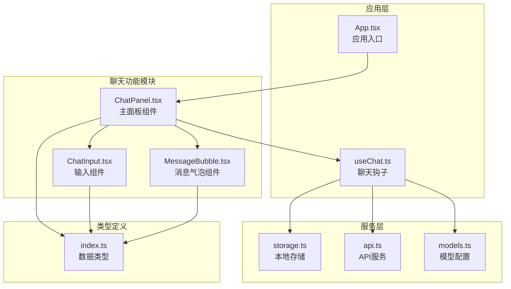
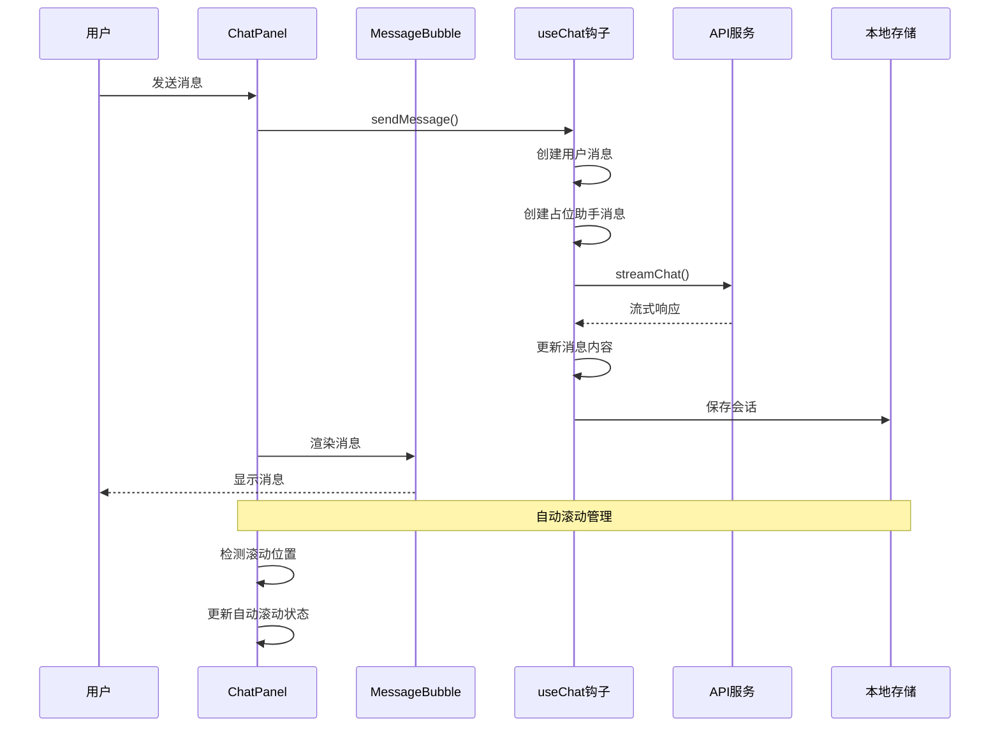
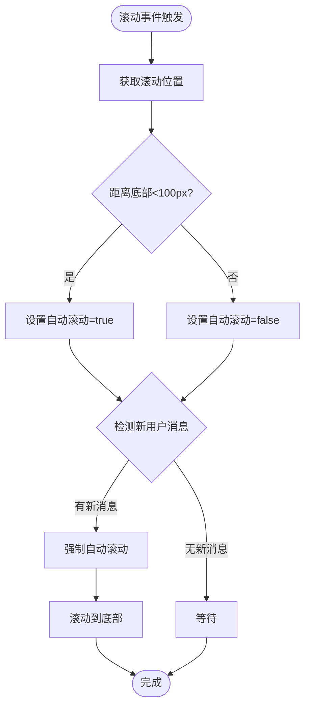
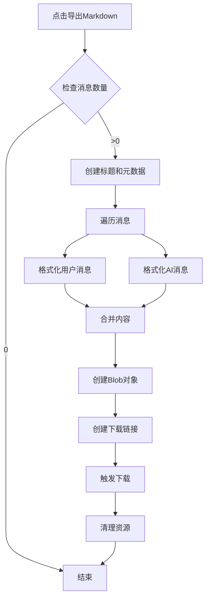
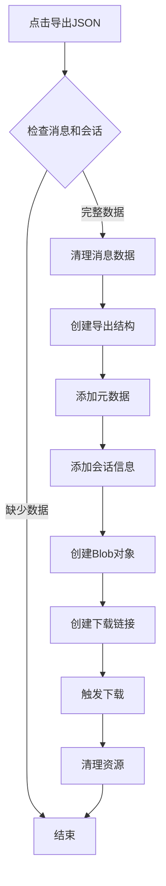
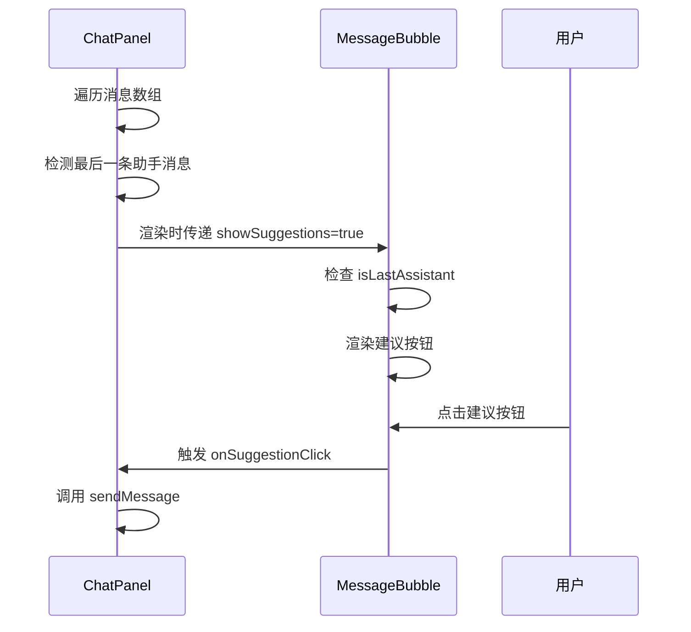
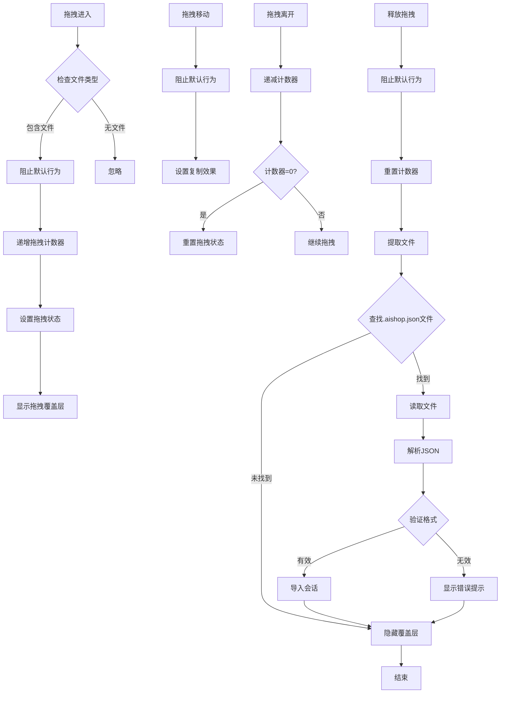
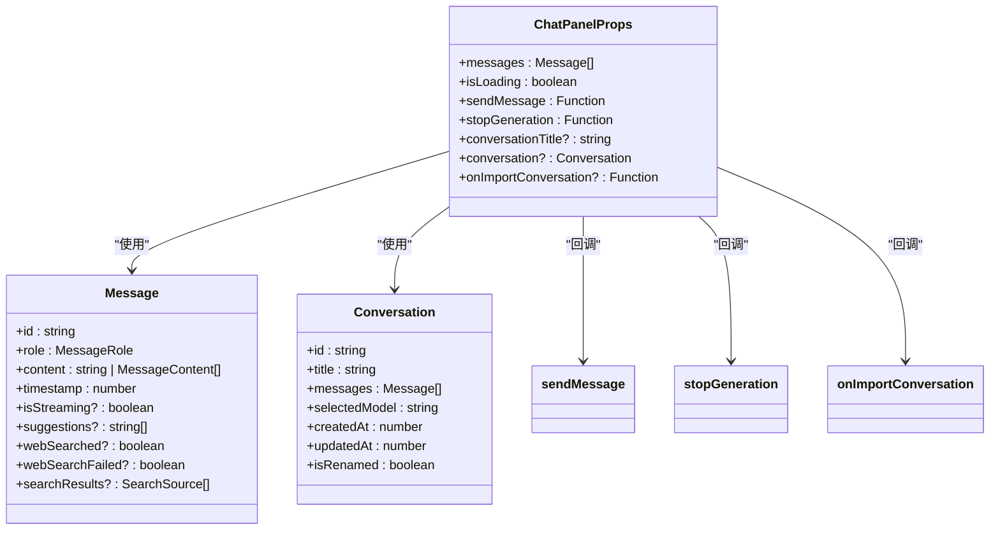
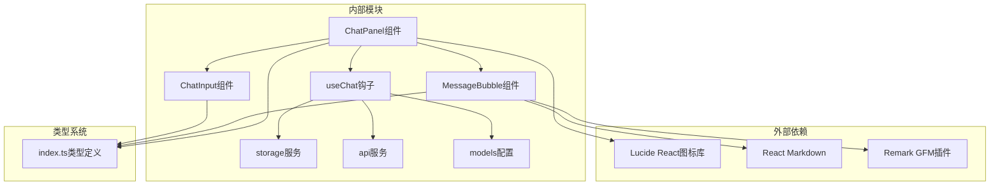

# 聊天面板组件

<cite>
**本文档引用的文件**
- [ChatPanel.tsx](file://src/components/chat/ChatPanel.tsx)
- [MessageBubble.tsx](file://src/components/chat/MessageBubble.tsx)
- [ChatInput.tsx](file://src/components/chat/ChatInput.tsx)
- [useChat.ts](file://src/hooks/useChat.ts)
- [types/index.ts](file://src/types/index.ts)
- [App.tsx](file://src/App.tsx)
- [storage.ts](file://src/services/storage.ts)
- [models.ts](file://src/config/models.ts)
- [api.ts](file://src/services/api.ts)
</cite>

## 目录
1. [简介](#简介)
2. [项目结构](#项目结构)
3. [核心组件](#核心组件)
4. [架构概览](#架构概览)
5. [详细组件分析](#详细组件分析)
6. [依赖关系分析](#依赖关系分析)
7. [性能考虑](#性能考虑)
8. [故障排除指南](#故障排除指南)
9. [结论](#结论)
10. [附录](#附录)

## 简介

ChatPanel 是 AIShop 应用中的核心聊天界面组件，负责展示对话历史、处理用户交互、管理消息流式渲染以及提供会话导出功能。该组件实现了现代化的聊天体验，包括智能滚动管理、拖拽导入、多格式导出等高级功能。

## 项目结构

ChatPanel 组件位于聊天功能模块中，与相关组件形成清晰的层次结构：



**图表来源**
- [ChatPanel.tsx:1-354](file://src/components/chat/ChatPanel.tsx#L1-L354)
- [useChat.ts:1-370](file://src/hooks/useChat.ts#L1-L370)
- [App.tsx:1-67](file://src/App.tsx#L1-L67)

**章节来源**
- [ChatPanel.tsx:1-354](file://src/components/chat/ChatPanel.tsx#L1-L354)
- [App.tsx:1-67](file://src/App.tsx#L1-L67)

## 核心组件

### ChatPanel 主组件

ChatPanel 是聊天界面的核心容器，负责：
- 消息显示区域的滚动管理
- 自动滚动机制的实现
- 导出功能（Markdown 和 JSON）
- 拖拽导入功能
- 消息气泡渲染

### MessageBubble 消息气泡组件

专门负责单个消息的渲染，支持：
- 文本消息的 Markdown 渲染
- 多媒体内容（文本+图片）混合显示
- 流式生成状态指示
- 搜索结果和建议按钮

### ChatInput 输入组件

提供用户输入功能：
- 文本输入和自动高度调整
- 图片粘贴和文件上传
- 发送和停止控制
- 移动端适配

**章节来源**
- [ChatPanel.tsx:13-35](file://src/components/chat/ChatPanel.tsx#L13-L35)
- [MessageBubble.tsx:6-10](file://src/components/chat/MessageBubble.tsx#L6-L10)
- [ChatInput.tsx:5-9](file://src/components/chat/ChatInput.tsx#L5-L9)

## 架构概览



**图表来源**
- [ChatPanel.tsx:135-250](file://src/components/chat/ChatPanel.tsx#L135-L250)
- [useChat.ts:135-250](file://src/hooks/useChat.ts#L135-L250)
- [api.ts:13-83](file://src/services/api.ts#L13-L83)

## 详细组件分析

### 滚动管理系统

ChatPanel 实现了智能的滚动管理机制，确保用户体验流畅：



**图表来源**
- [ChatPanel.tsx:45-67](file://src/components/chat/ChatPanel.tsx#L45-L67)
- [ChatPanel.tsx:54-61](file://src/components/chat/ChatPanel.tsx#L54-L61)

#### 关键特性

1. **智能滚动检测**：通过计算滚动条距离底部的距离来判断是否应该自动滚动
2. **用户交互感知**：当用户手动滚动查看历史消息时，暂停自动滚动
3. **新消息优先**：检测到新用户消息时强制恢复自动滚动
4. **性能优化**：使用 `shouldAutoScrollRef` 避免不必要的重新渲染

**章节来源**
- [ChatPanel.tsx:36-52](file://src/components/chat/ChatPanel.tsx#L36-L52)
- [ChatPanel.tsx:54-67](file://src/components/chat/ChatPanel.tsx#L54-L67)

### 导出功能实现

ChatPanel 提供两种导出格式：Markdown 和 JSON，每种格式都有特定的用途和格式规范。

#### Markdown 导出

Markdown 导出主要用于个人备份和分享：



**图表来源**
- [ChatPanel.tsx:81-114](file://src/components/chat/ChatPanel.tsx#L81-L114)

#### JSON 导出

JSON 导出用于跨平台数据交换和备份：



**图表来源**
- [ChatPanel.tsx:116-154](file://src/components/chat/ChatPanel.tsx#L116-L154)

#### 导出数据结构

导出的 JSON 数据包含以下关键字段：

| 字段名 | 类型 | 描述 | 示例 |
|--------|------|------|------|
| version | number | 导出版本号 | 1 |
| app | string | 应用名称 | "AIShop" |
| exportedAt | number | 导出时间戳 | 1704067200000 |
| conversation.id | string | 会话唯一标识符 | "1704067200000-abc123" |
| conversation.title | string | 会话标题 | "对话记录" |
| conversation.messages | Message[] | 消息数组 | [{}] |
| conversation.selectedModel | string | 选择的模型ID | "gpt-5.5" |
| conversation.createdAt | number | 创建时间戳 | 1704067200000 |
| conversation.updatedAt | number | 更新时间戳 | 1704067200000 |
| conversation.isRenamed | boolean | 是否已重命名 | true |

**章节来源**
- [ChatPanel.tsx:81-154](file://src/components/chat/ChatPanel.tsx#L81-L154)
- [types/index.ts:58-66](file://src/types/index.ts#L58-L66)

### 消息气泡渲染机制

MessageBubble 组件负责单个消息的视觉呈现，支持多种内容类型的渲染：

```mermaid
classDiagram
class MessageBubble {
+message : Message
+onSuggestionClick : Function
+showSuggestions : boolean
+renderContent() JSX.Element
+renderUserContent() JSX.Element
+renderAssistantContent() JSX.Element
+renderMultiPartContent() JSX.Element
}
class Message {
+id : string
+role : MessageRole
+content : string | MessageContent[]
+timestamp : number
+isStreaming? : boolean
+suggestions? : string[]
+webSearched? : boolean
+webSearchFailed? : boolean
+searchResults? : SearchSource[]
}
class MessageContent {
+type : 'text' | 'image_url'
+text? : string
+image_url? : { url : string }
}
MessageBubble --> Message : "接收"
Message --> MessageContent : "包含"
```

**图表来源**
- [MessageBubble.tsx:12-54](file://src/components/chat/MessageBubble.tsx#L12-L54)
- [types/index.ts:9-23](file://src/types/index.ts#L9-L23)

#### 不同类型消息的显示策略

1. **用户消息**：
   - 右对齐布局
   - 蓝色主题样式
   - 支持纯文本和富文本

2. **AI助手消息**：
   - 左对齐布局
   - 灰色主题样式
   - 支持 Markdown 渲染
   - 流式生成指示器

3. **多媒体消息**：
   - 文本和图片混合显示
   - 图片缩略图预览
   - 响应式布局

#### 最后一条消息的特殊处理

ChatPanel 对最后一条助手消息进行特殊处理，添加建议按钮：



**图表来源**
- [ChatPanel.tsx:321-332](file://src/components/chat/ChatPanel.tsx#L321-L332)
- [MessageBubble.tsx:104-119](file://src/components/chat/MessageBubble.tsx#L104-L119)

**章节来源**
- [MessageBubble.tsx:12-124](file://src/components/chat/MessageBubble.tsx#L12-L124)
- [ChatPanel.tsx:321-332](file://src/components/chat/ChatPanel.tsx#L321-L332)

### 拖拽导入功能

拖拽导入功能允许用户通过拖拽 `.aishop.json` 文件来导入会话：



**图表来源**
- [ChatPanel.tsx:156-206](file://src/components/chat/ChatPanel.tsx#L156-L206)

#### 拖拽状态管理

组件使用多个状态变量来管理拖拽过程：

| 状态变量 | 类型 | 作用 | 生命周期 |
|----------|------|------|----------|
| isDragOver | boolean | 拖拽覆盖状态 | 拖拽期间持续更新 |
| dragCounterRef | number | 拖拽计数器 | 确保正确退出拖拽状态 |
| exportMenuRef | HTMLDivElement | 导出菜单DOM引用 | 用于点击外部关闭 |

#### 文件验证机制

导入文件需要满足以下验证条件：

1. **文件扩展名验证**：必须以 `.aishop.json` 结尾
2. **JSON 格式验证**：文件内容必须是有效的 JSON
3. **应用兼容性验证**：`app` 字段必须为 `"AIShop"`
4. **版本兼容性验证**：`version` 字段必须为 `1`
5. **数据完整性验证**：必须包含 `conversation` 对象

**章节来源**
- [ChatPanel.tsx:156-206](file://src/components/chat/ChatPanel.tsx#L156-L206)

### 组件 Props 接口说明

ChatPanel 组件的 Props 接口定义了所有可用的属性和回调函数：



**图表来源**
- [ChatPanel.tsx:13-25](file://src/components/chat/ChatPanel.tsx#L13-L25)
- [types/index.ts:9-23](file://src/types/index.ts#L9-L23)
- [types/index.ts:58-66](file://src/types/index.ts#L58-L66)

#### 详细参数说明

| 参数名 | 类型 | 必需 | 默认值 | 描述 |
|--------|------|------|--------|------|
| messages | Message[] | 是 | - | 聊天消息数组 |
| isLoading | boolean | 是 | - | 加载状态，控制发送/停止按钮 |
| sendMessage | Function | 是 | - | 发送消息的回调函数 |
| stopGeneration | Function | 是 | - | 停止生成的回调函数 |
| conversationTitle | string | 否 | undefined | 会话标题，用于导出文件名 |
| conversation | Conversation | 否 | undefined | 当前会话对象，用于 JSON 导出 |
| onImportConversation | Function | 否 | undefined | 导入会话的回调函数 |

**章节来源**
- [ChatPanel.tsx:13-35](file://src/components/chat/ChatPanel.tsx#L13-L35)

## 依赖关系分析



**图表来源**
- [ChatPanel.tsx:1-12](file://src/components/chat/ChatPanel.tsx#L1-L12)
- [MessageBubble.tsx:1-3](file://src/components/chat/MessageBubble.tsx#L1-L3)
- [useChat.ts:1-16](file://src/hooks/useChat.ts#L1-L16)

### 组件耦合度分析

ChatPanel 组件采用松耦合设计：

1. **低耦合**：通过 Props 传递数据和回调，减少直接依赖
2. **单一职责**：专注于 UI 展示和用户交互
3. **可测试性**：清晰的接口定义便于单元测试
4. **可维护性**：模块化设计便于功能扩展

**章节来源**
- [ChatPanel.tsx:1-354](file://src/components/chat/ChatPanel.tsx#L1-L354)
- [useChat.ts:1-370](file://src/hooks/useChat.ts#L1-L370)

## 性能考虑

### 滚动性能优化

1. **防抖处理**：滚动事件使用防抖机制，避免频繁重新计算
2. **引用优化**：使用 `useRef` 存储 DOM 引用，避免重复查询
3. **条件渲染**：仅在必要时触发自动滚动

### 渲染性能优化

1. **消息复用**：使用 `key` 属性确保消息正确复用
2. **懒加载**：图片内容按需加载
3. **虚拟滚动**：对于大量消息场景可考虑实现虚拟滚动

### 内存管理

1. **URL 对象清理**：导出完成后及时清理 Blob URL
2. **事件监听器清理**：组件卸载时移除事件监听器
3. **拖拽状态清理**：拖拽结束后重置所有状态

## 故障排除指南

### 常见问题及解决方案

#### 消息无法自动滚动

**问题症状**：新消息发送后页面不会自动滚动到底部

**可能原因**：
1. 用户手动滚动到中间位置
2. 滚动容器高度计算异常
3. 自动滚动状态被意外修改

**解决方法**：
1. 检查滚动容器的 `scrollTop`、`scrollHeight`、`clientHeight` 值
2. 确认 `shouldAutoScrollRef` 状态正确
3. 验证 `messages` 数组的长度变化

#### 导出功能异常

**问题症状**：点击导出按钮无响应或导出失败

**可能原因**：
1. 消息数组为空
2. JSON 导出时缺少 `conversation` 对象
3. 文件下载触发失败

**解决方法**：
1. 检查 `messages.length` 条件判断
2. 验证 `conversation` 对象的完整性
3. 确认 Blob URL 创建和下载触发流程

#### 拖拽导入失败

**问题症状**：拖拽文件到聊天区域无反应

**可能原因**：
1. 文件类型不是 `.aishop.json`
2. JSON 格式不正确
3. 应用版本不兼容

**解决方法**：
1. 检查文件扩展名验证逻辑
2. 使用浏览器开发者工具查看 JSON 解析错误
3. 确认导出文件的版本号和应用标识

**章节来源**
- [ChatPanel.tsx:69-79](file://src/components/chat/ChatPanel.tsx#L69-L79)
- [ChatPanel.tsx:81-154](file://src/components/chat/ChatPanel.tsx#L81-L154)
- [ChatPanel.tsx:156-206](file://src/components/chat/ChatPanel.tsx#L156-L206)

## 结论

ChatPanel 组件是一个功能完整、设计良好的聊天界面组件，具有以下特点：

1. **用户体验优秀**：智能滚动管理、流畅的动画效果
2. **功能丰富**：支持多种消息类型、导出格式和导入功能
3. **代码质量高**：模块化设计、清晰的接口定义
4. **性能优化到位**：合理的状态管理和内存清理

该组件为 AIShop 应用提供了强大的聊天功能基础，为后续的功能扩展奠定了良好的技术基础。

## 附录

### 使用示例

#### 基本使用

```typescript
// 在应用中使用 ChatPanel
function App() {
  const chat = useChat();
  
  return (
    <ChatPanel
      messages={chat.messages}
      isLoading={chat.isLoading}
      sendMessage={chat.sendMessage}
      stopGeneration={chat.stopGeneration}
      conversationTitle={activeConversation?.title}
      conversation={activeConversation}
      onImportConversation={chat.importConversation}
    />
  );
}
```

#### 最佳实践建议

1. **状态管理**：使用 `useChat` 钩子统一管理聊天状态
2. **错误处理**：为导出和导入功能提供适当的错误提示
3. **性能监控**：定期检查滚动性能和内存使用情况
4. **兼容性测试**：确保在不同设备和浏览器上的兼容性
5. **安全考虑**：验证导入文件的来源和完整性

### 相关文件路径

- 组件实现：`src/components/chat/ChatPanel.tsx`
- 消息渲染：`src/components/chat/MessageBubble.tsx`
- 输入处理：`src/components/chat/ChatInput.tsx`
- 状态管理：`src/hooks/useChat.ts`
- 类型定义：`src/types/index.ts`
- 应用入口：`src/App.tsx`
- 本地存储：`src/services/storage.ts`
- 模型配置：`src/config/models.ts`
- API 服务：`src/services/api.ts`