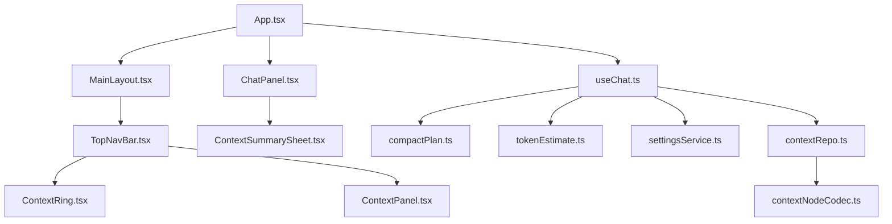
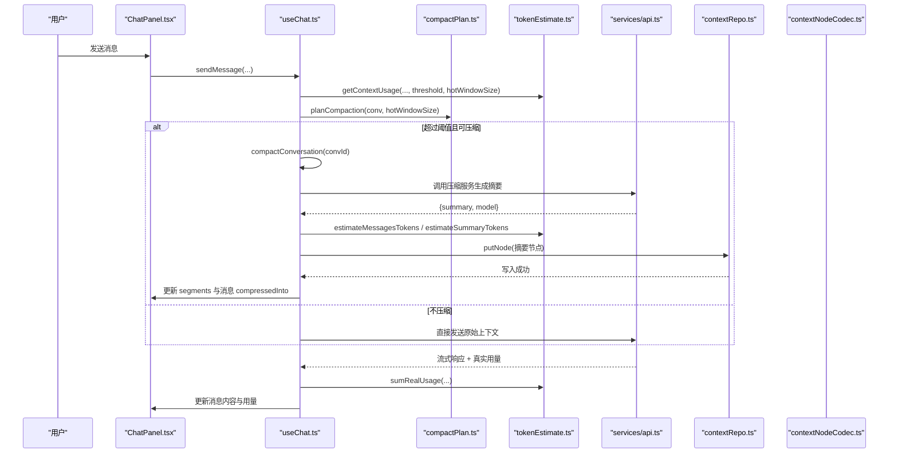
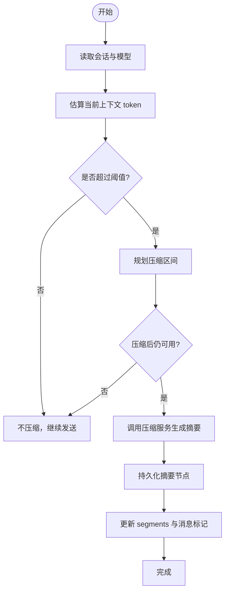
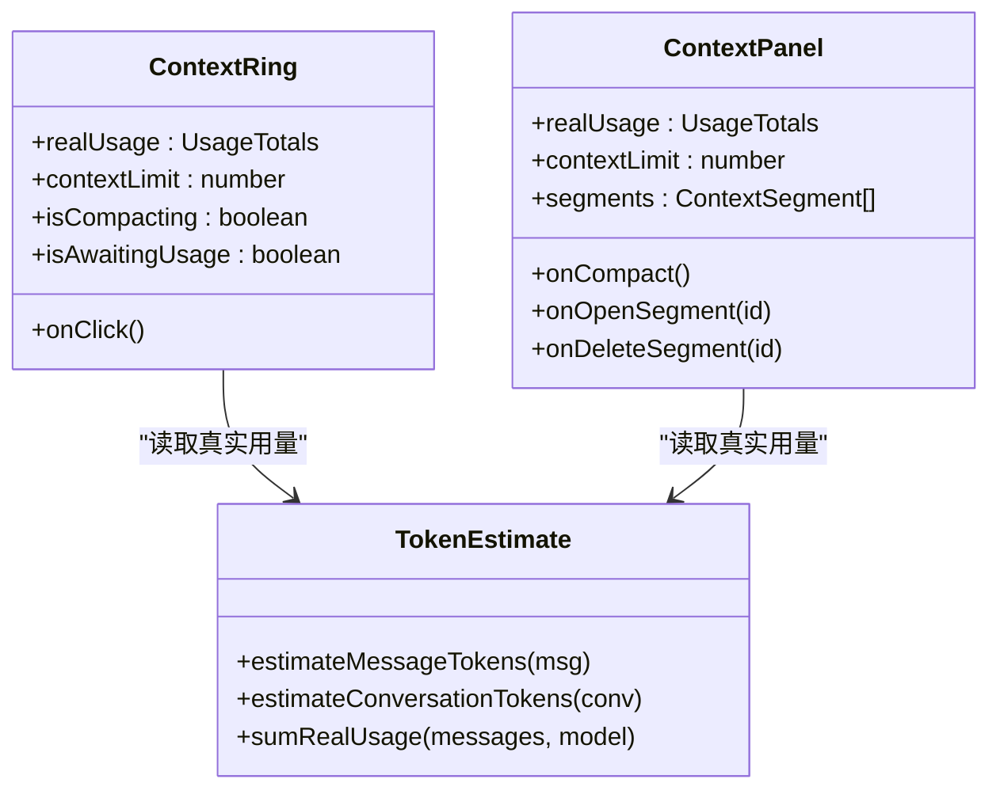
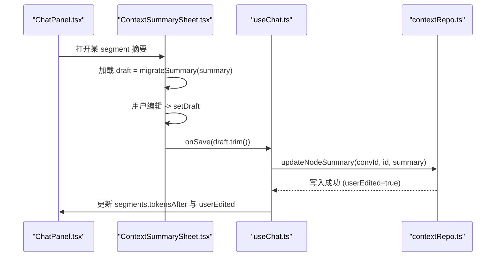
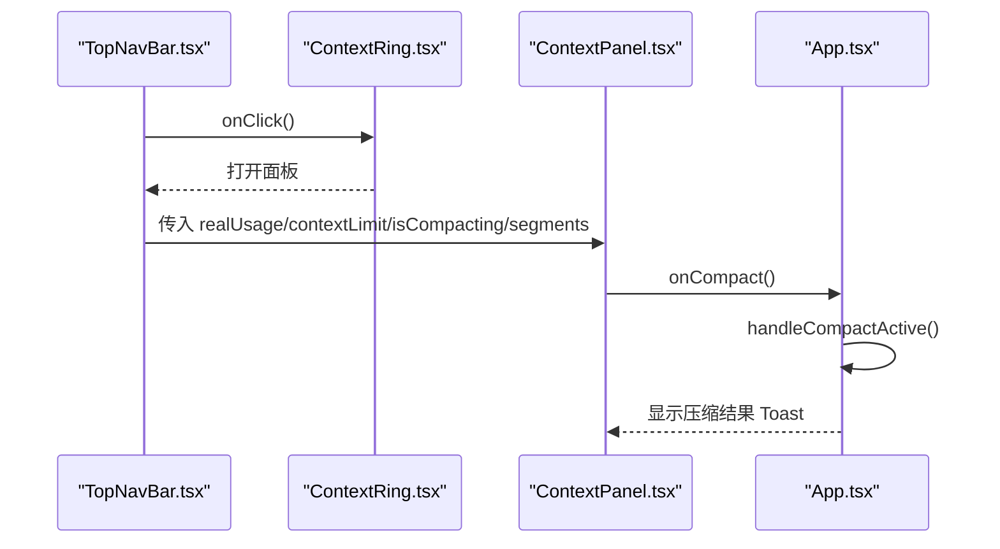
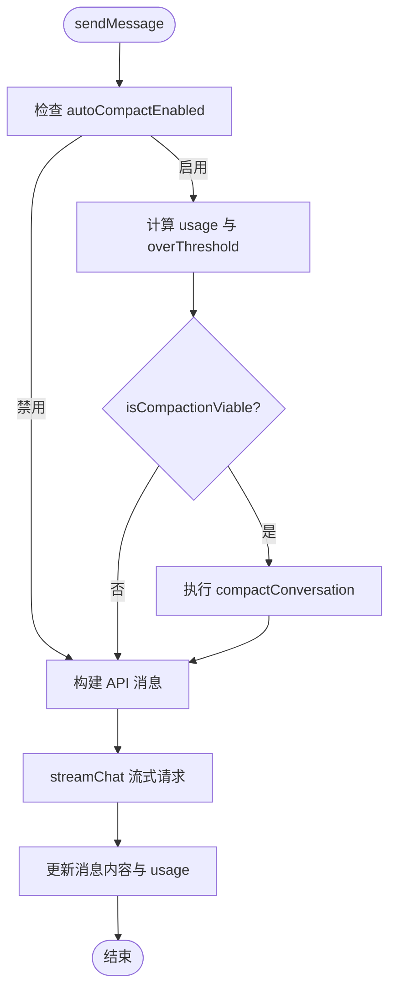
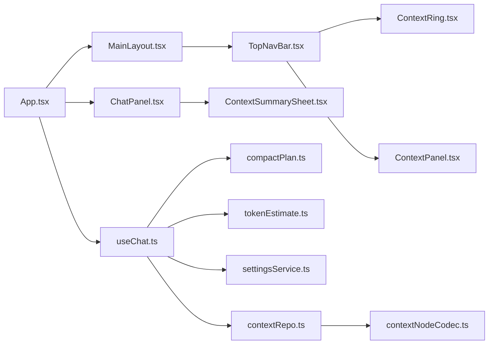

# 上下文管理

<cite>
**本文引用的文件**
- [App.tsx](file://src/App.tsx)
- [main.tsx](file://src/main.tsx)
- [useChat.ts](file://src/hooks/useChat.ts)
- [ChatPanel.tsx](file://src/components/chat/ChatPanel.tsx)
- [ContextPanel.tsx](file://src/components/chat/ContextPanel.tsx)
- [ContextRing.tsx](file://src/components/chat/ContextRing.tsx)
- [ContextSummarySheet.tsx](file://src/components/chat/ContextSummarySheet.tsx)
- [TopNavBar.tsx](file://src/components/layout/TopNavBar.tsx)
- [MainLayout.tsx](file://src/components/layout/MainLayout.tsx)
- [compactPlan.ts](file://src/utils/compactPlan.ts)
- [tokenEstimate.ts](file://src/utils/tokenEstimate.ts)
- [contextSummary.ts](file://src/utils/contextSummary.ts)
- [settingsService.ts](file://src/services/settingsService.ts)
- [index.ts](file://src/types/index.ts)
- [contextNodeCodec.ts](file://src/db/contextNodeCodec.ts)
- [contextRepo.ts](file://src/db/contextRepo.ts)
</cite>

## 目录
1. [简介](#简介)
2. [项目结构](#项目结构)
3. [核心组件](#核心组件)
4. [架构总览](#架构总览)
5. [详细组件分析](#详细组件分析)
6. [依赖关系分析](#依赖关系分析)
7. [性能考量](#性能考量)
8. [故障排除指南](#故障排除指南)
9. [结论](#结论)
10. [附录：配置与扩展](#附录：配置与扩展)

## 简介
本文件为聊天上下文管理系统的技术文档，聚焦以下目标：
- 解释上下文压缩算法、内存占用监控、上下文窗口管理等核心技术。
- 深入说明 ContextPanel（上下文面板）、ContextRing（环形指示器）、ContextSummarySheet（摘要编辑面板）的实现与交互。
- 文档化上下文摘要的自动生成、手动编辑、版本管理与撤销机制。
- 评估上下文压缩对对话质量的影响，提供性能优化策略与用户体验设计建议。
- 给出配置选项、扩展开发与故障排除的完整指南。

## 项目结构
围绕“上下文管理”的关键路径如下：
- 入口与布局：应用启动后渲染 App，通过 MainLayout 组织 TopNavBar、侧边栏与主内容区；TopNavBar 承载 ContextRing 与 ContextPanel 弹出层。
- 状态与流程：useChat 维护会话、消息、压缩计划与发送流程；在发送前进行水位检测与自动压缩。
- 压缩与估算：compactPlan 决定哪些消息区间可压缩；tokenEstimate 提供本地 token 估算与真实用量汇总。
- 持久化与版本：db/contextRepo 与 contextNodeCodec 将摘要节点持久化到 IndexedDB，支持用户编辑与重建。
- UI 展示：ChatPanel 渲染消息与压缩标记；ContextPanel 显示用量、历史压缩记录与操作；ContextRing 可视化当前上下文占用；ContextSummarySheet 用于查看/编辑摘要。

图表来源
- [App.tsx:1-147](file://src/App.tsx#L1-L147)
- [MainLayout.tsx:1-205](file://src/components/layout/MainLayout.tsx#L1-L205)
- [TopNavBar.tsx:115-167](file://src/components/layout/TopNavBar.tsx#L115-L167)
- [ContextRing.tsx:1-57](file://src/components/chat/ContextRing.tsx#L1-L57)
- [ContextPanel.tsx:1-100](file://src/components/chat/ContextPanel.tsx#L1-L100)
- [ChatPanel.tsx:1-623](file://src/components/chat/ChatPanel.tsx#L1-L623)
- [useChat.ts:1-800](file://src/hooks/useChat.ts#L1-L800)
- [compactPlan.ts:1-127](file://src/utils/compactPlan.ts#L1-L127)
- [tokenEstimate.ts:1-156](file://src/utils/tokenEstimate.ts#L1-L156)
- [settingsService.ts:1-101](file://src/services/settingsService.ts#L1-L101)
- [contextRepo.ts:1-98](file://src/db/contextRepo.ts#L1-L98)
- [contextNodeCodec.ts:1-64](file://src/db/contextNodeCodec.ts#L1-L64)

章节来源
- [App.tsx:1-147](file://src/App.tsx#L1-L147)
- [MainLayout.tsx:1-205](file://src/components/layout/MainLayout.tsx#L1-L205)
- [TopNavBar.tsx:115-167](file://src/components/layout/TopNavBar.tsx#L115-L167)

## 核心组件
- useChat：负责会话恢复、消息流式生成、自动压缩触发、摘要更新与撤销、搜索与附件处理等。
- compactPlan：纯函数决策哪些消息区间应被压缩，并判断压缩可行性与阈值。
- tokenEstimate：轻量 token 估算与真实用量汇总，支撑阈值判断与收益展示。
- settingsService：集中管理压缩相关设置（模型、阈值、热窗口大小）。
- ContextRing：顶栏环形指示器，延迟动画展示真实用量占比。
- ContextPanel：上下文详情面板，展示用量、立即压缩按钮与历史压缩记录。
- ChatPanel：消息列表、折叠浏览、压缩标记与摘要面板集成。
- ContextSummarySheet：摘要查看/编辑面板，草稿保存与迁移兼容。
- db/contextRepo + contextNodeCodec：摘要节点的持久化、查询、更新与转换。

章节来源
- [useChat.ts:152-800](file://src/hooks/useChat.ts#L152-L800)
- [compactPlan.ts:1-127](file://src/utils/compactPlan.ts#L1-L127)
- [tokenEstimate.ts:1-156](file://src/utils/tokenEstimate.ts#L1-L156)
- [settingsService.ts:1-101](file://src/services/settingsService.ts#L1-L101)
- [ContextRing.tsx:1-57](file://src/components/chat/ContextRing.tsx#L1-L57)
- [ContextPanel.tsx:1-100](file://src/components/chat/ContextPanel.tsx#L1-L100)
- [ChatPanel.tsx:1-623](file://src/components/chat/ChatPanel.tsx#L1-L623)
- [ContextSummarySheet.tsx:1-38](file://src/components/chat/ContextSummarySheet.tsx#L1-L38)
- [contextRepo.ts:1-98](file://src/db/contextRepo.ts#L1-L98)
- [contextNodeCodec.ts:1-64](file://src/db/contextNodeCodec.ts#L1-L64)

## 架构总览
下图展示了从用户输入到上下文压缩、摘要生成与持久化的端到端流程。

图表来源
- [useChat.ts:494-783](file://src/hooks/useChat.ts#L494-L783)
- [compactPlan.ts:1-127](file://src/utils/compactPlan.ts#L1-L127)
- [tokenEstimate.ts:1-156](file://src/utils/tokenEstimate.ts#L1-L156)
- [contextRepo.ts:25-45](file://src/db/contextRepo.ts#L25-L45)
- [contextNodeCodec.ts:12-32](file://src/db/contextNodeCodec.ts#L12-L32)

## 详细组件分析

### 上下文压缩算法与窗口管理
- 压缩计划：planCompaction 选择待压缩的消息区间，规则包括保留最近 N 条（热窗口）、跳过已压缩或受保护消息（如 artifact），保证区间连续。
- 可行性判断：isCompactionViable 预估压缩后仍要发送的热窗口与旧消息 token 数，加上已有摘要与新摘要估计值，确保不超过 limit × threshold。
- 阈值与窗口：threshold 默认 0.7，hotWindowSize 默认 16，可在设置中调整。
- 估算与真实用量：tokenEstimate 提供本地估算；sumRealUsage 汇总真实 promptTokens 用于更精确的水位判断。

图表来源
- [compactPlan.ts:1-127](file://src/utils/compactPlan.ts#L1-L127)
- [useChat.ts:402-450](file://src/hooks/useChat.ts#L402-L450)
- [tokenEstimate.ts:1-156](file://src/utils/tokenEstimate.ts#L1-L156)

章节来源
- [compactPlan.ts:1-127](file://src/utils/compactPlan.ts#L1-L127)
- [useChat.ts:402-450](file://src/hooks/useChat.ts#L402-L450)
- [tokenEstimate.ts:1-156](file://src/utils/tokenEstimate.ts#L1-L156)
- [settingsService.ts:27-33](file://src/services/settingsService.ts#L27-L33)

### 内存占用监控与上下文窗口
- 环形指示器：ContextRing 使用 API 返回的真实 lastPromptTokens，延迟 800ms 填充以避开滚动收尾，按 ratio 着色提示风险水位（≥0.7 黄色，≥0.9 红色）。
- 上下文详情：ContextPanel 展示实时用量、限制与历史压缩记录，并提供“立即压缩”入口。
- 用量汇总：tokenEstimate.sumRealUsage 聚合每条 assistant 消息的 usage，形成 UsageTotals，供 UI 展示与阈值判断。

图表来源
- [ContextRing.tsx:1-57](file://src/components/chat/ContextRing.tsx#L1-L57)
- [ContextPanel.tsx:1-100](file://src/components/chat/ContextPanel.tsx#L1-L100)
- [tokenEstimate.ts:1-156](file://src/utils/tokenEstimate.ts#L1-L156)

章节来源
- [ContextRing.tsx:1-57](file://src/components/chat/ContextRing.tsx#L1-L57)
- [ContextPanel.tsx:1-100](file://src/components/chat/ContextPanel.tsx#L1-L100)
- [tokenEstimate.ts:1-156](file://src/utils/tokenEstimate.ts#L1-L156)

### 上下文摘要：自动生成、手动编辑与版本管理
- 自动生成：在发送前根据阈值与可行性决定是否压缩，生成摘要并持久化为节点；摘要附带 tokensBefore/tokensAfter 用于收益展示。
- 手动编辑：ContextSummarySheet 打开对应 segment 的摘要，支持草稿与失焦保存；migrateSummary 保障向后兼容。
- 版本管理：db/contextRepo 支持标记节点 stale 以便重建；updateNodeSummary 将 userEdited 置真，避免后续自动重压覆盖用户修改。
- 撤销与回滚：revertSegment 清除 compressedInto 标记并移除 segment，原文始终保留。

图表来源
- [ChatPanel.tsx:611-619](file://src/components/chat/ChatPanel.tsx#L611-L619)
- [ContextSummarySheet.tsx:1-38](file://src/components/chat/ContextSummarySheet.tsx#L1-L38)
- [useChat.ts:452-470](file://src/hooks/useChat.ts#L452-L470)
- [contextRepo.ts:29-45](file://src/db/contextRepo.ts#L29-L45)

章节来源
- [useChat.ts:402-486](file://src/hooks/useChat.ts#L402-L486)
- [ContextSummarySheet.tsx:1-38](file://src/components/chat/ContextSummarySheet.tsx#L1-L38)
- [contextRepo.ts:29-45](file://src/db/contextRepo.ts#L29-L45)
- [contextNodeCodec.ts:12-32](file://src/db/contextNodeCodec.ts#L12-L32)

### 上下文面板与环形指示器的交互
- TopNavBar 在右侧放置 ContextRing，点击展开 ContextPanel；遮罩背景虚焦，仅环与面板清晰。
- ContextPanel 展示用量进度条、立即压缩按钮与历史压缩记录；支持删除某段摘要。
- 压缩完成后通过 Toast 反馈并可跳转到对应摘要面板。

图表来源
- [TopNavBar.tsx:115-167](file://src/components/layout/TopNavBar.tsx#L115-L167)
- [ContextRing.tsx:1-57](file://src/components/chat/ContextRing.tsx#L1-L57)
- [ContextPanel.tsx:1-100](file://src/components/chat/ContextPanel.tsx#L1-L100)
- [App.tsx:40-56](file://src/App.tsx#L40-L56)

章节来源
- [TopNavBar.tsx:115-167](file://src/components/layout/TopNavBar.tsx#L115-L167)
- [App.tsx:40-56](file://src/App.tsx#L40-L56)

### 发送流程中的上下文构建与压缩视图
- 发送前检查水位：若开启自动压缩且超过阈值，则先压缩再发送；压缩失败不阻塞发送。
- 构建 API 消息：buildApiMessages 将 messages 与 segments 组合为压缩视图，已压缩消息以 compressedInto 标记替换为摘要。
- 联网搜索：可选地插入搜索结果上下文，并在消息中标记搜索状态与来源。

图表来源
- [useChat.ts:494-783](file://src/hooks/useChat.ts#L494-L783)
- [compactPlan.ts:79-127](file://src/utils/compactPlan.ts#L79-L127)

章节来源
- [useChat.ts:494-783](file://src/hooks/useChat.ts#L494-L783)
- [compactPlan.ts:79-127](file://src/utils/compactPlan.ts#L79-L127)

## 依赖关系分析
- 组件耦合：
  - App 作为编排层，向 MainLayout 传递上下文用量与操作回调；向 ChatPanel 传递消息、片段与回调。
  - TopNavBar 持有 ContextRing 与 ContextPanel 的显隐与数据绑定。
  - useChat 是核心状态机，依赖 compactPlan、tokenEstimate、settingsService 与 db 层。
- 外部依赖：
  - services/api 提供流式聊天与用量回调。
  - db/contextRepo 与 codec 提供摘要节点持久化与转换。
- 潜在循环：
  - 组件间通过 props 单向传递，useChat 通过 ref 避免频繁重建回调，未见明显循环依赖。

图表来源
- [App.tsx:1-147](file://src/App.tsx#L1-L147)
- [MainLayout.tsx:1-205](file://src/components/layout/MainLayout.tsx#L1-L205)
- [TopNavBar.tsx:115-167](file://src/components/layout/TopNavBar.tsx#L115-L167)
- [useChat.ts:1-800](file://src/hooks/useChat.ts#L1-L800)
- [compactPlan.ts:1-127](file://src/utils/compactPlan.ts#L1-L127)
- [tokenEstimate.ts:1-156](file://src/utils/tokenEstimate.ts#L1-L156)
- [settingsService.ts:1-101](file://src/services/settingsService.ts#L1-L101)
- [contextRepo.ts:1-98](file://src/db/contextRepo.ts#L1-L98)
- [contextNodeCodec.ts:1-64](file://src/db/contextNodeCodec.ts#L1-L64)

章节来源
- [App.tsx:1-147](file://src/App.tsx#L1-L147)
- [useChat.ts:1-800](file://src/hooks/useChat.ts#L1-L800)

## 性能考量
- 延迟动画：ContextRing 延迟 800ms 填充，避免滚动收尾抖动影响视觉体验。
- 估算开销：tokenEstimate 采用轻量估算，避免引入重型 tokenizer，减少包体积与运行时成本。
- 持久化优化：useChat 使用 diff 写回与 flushPendingWrites，降低主线程阻塞概率；可见性变化时主动落盘，防止移动端丢失长回复。
- 压缩时机：发送前压缩失败不阻塞发送，优先保证用户流畅度；阈值保守（0.7）以减少频繁压缩导致的缓存失效。
- 热窗口保护：hotWindowSize 内的消息永远逐字发送，确保最新上下文语义稳定。

[本节为通用性能讨论，不直接分析具体文件]

## 故障排除指南
- 压缩无效果：
  - 检查阈值与热窗口设置是否合理；确认 isCompactionViable 返回 true。
  - 确认存在可压缩区间（非 artifact、非已压缩消息）。
- 摘要未持久化：
  - 检查 contextRepo.putNode/updateNodeSummary 是否成功；确认 IndexedDB 事务完成。
- 用量显示异常：
  - 确认 API 返回 usage 并更新至消息；sumRealUsage 是否正确聚合。
- 自动压缩未触发：
  - 检查 featureSettings.autoCompactEnabled 与 compactSettings.threshold/hotWindowSize。
- 用户编辑丢失：
  - 确认 updateNodeSummary 设置了 userEdited=true；避免后续自动重压覆盖。

章节来源
- [useChat.ts:402-486](file://src/hooks/useChat.ts#L402-L486)
- [contextRepo.ts:29-45](file://src/db/contextRepo.ts#L29-L45)
- [tokenEstimate.ts:128-156](file://src/utils/tokenEstimate.ts#L128-L156)
- [settingsService.ts:27-33](file://src/services/settingsService.ts#L27-L33)

## 结论
本系统通过“估算+真实用量”双轨水位判断、可配置的阈值与热窗口、以及摘要的持久化与版本管理，实现了高效且可控的上下文压缩。UI 层面通过 ContextRing 与 ContextPanel 提供直观的状态反馈与操作入口，ContextSummarySheet 支持用户精细控制摘要质量。整体设计兼顾性能与体验，适合长对话场景下的稳定运行与持续演进。

[本节为总结性内容，不直接分析具体文件]

## 附录：配置与扩展
- 配置项
  - 压缩模型：settingsService.DEFAULT_COMPACT_SETTINGS.model（默认 gpt-5.4-nano）。
  - 触发阈值：threshold 默认 0.7，可通过设置面板滑块调整。
  - 热窗口：hotWindowSize 默认 16，表示最近 N 条消息不被压缩。
- 扩展开发
  - 新增压缩策略：在 compactPlan 中扩展 planCompaction 规则，保持区间连续性与保护消息逻辑。
  - 增强摘要质量：在压缩服务中结合 focusHint（会话级提示）提升摘要相关性。
  - 多级别摘要：利用 contextNodeCodec 的 level 字段与 derivedFrom 实现层级摘要与回溯。
- 最佳实践
  - 保持阈值保守，避免频繁压缩破坏缓存命中。
  - 对用户编辑的摘要设置 userEdited，防止自动重压覆盖。
  - 在移动端注意可见性变化时的落盘，避免数据丢失。

章节来源
- [settingsService.ts:27-33](file://src/services/settingsService.ts#L27-L33)
- [compactPlan.ts:1-127](file://src/utils/compactPlan.ts#L1-L127)
- [contextNodeCodec.ts:12-64](file://src/db/contextNodeCodec.ts#L12-L64)
- [useChat.ts:488-492](file://src/hooks/useChat.ts#L488-L492)