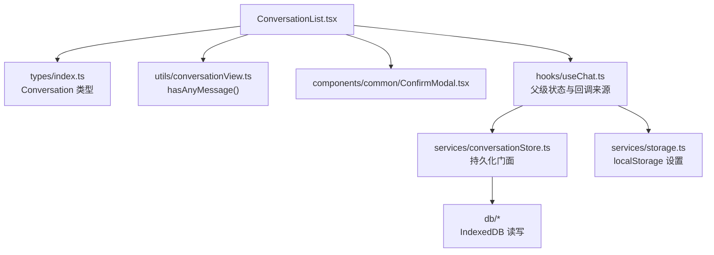
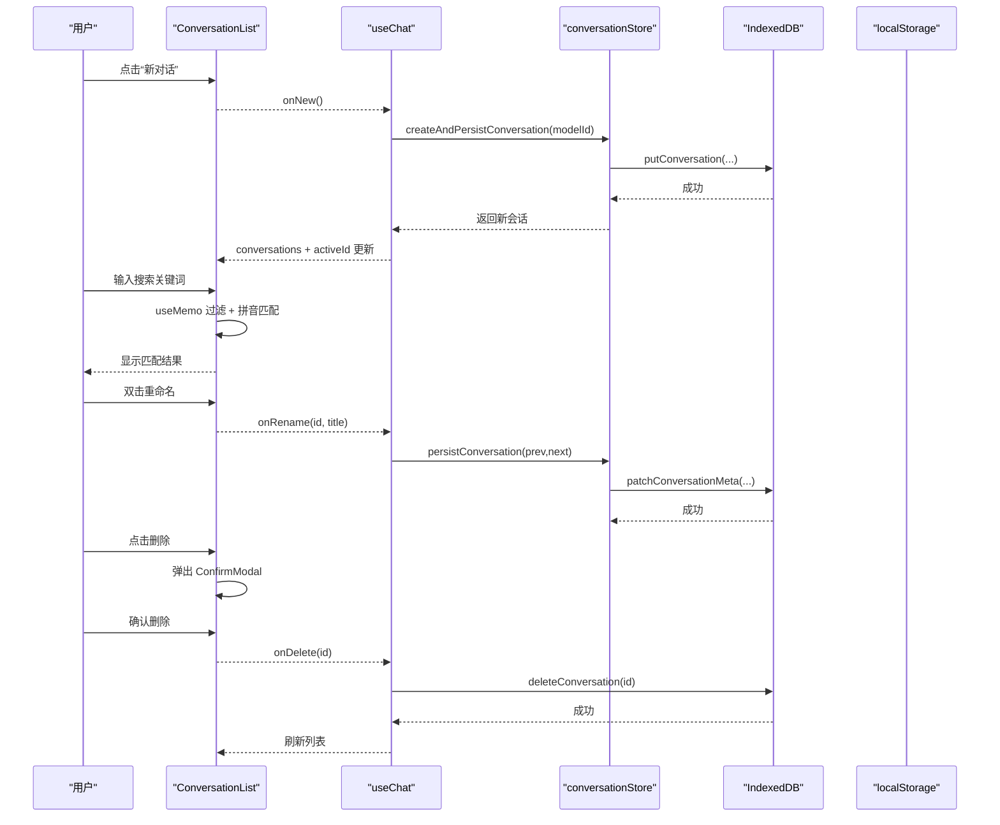
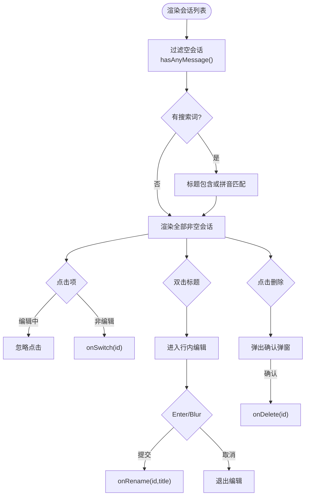
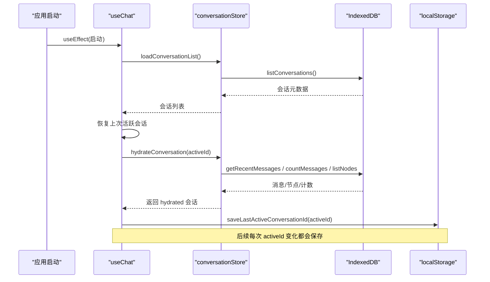
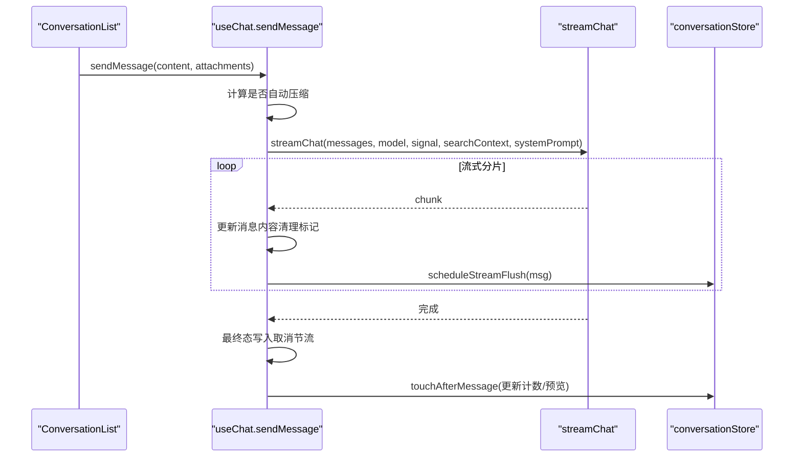
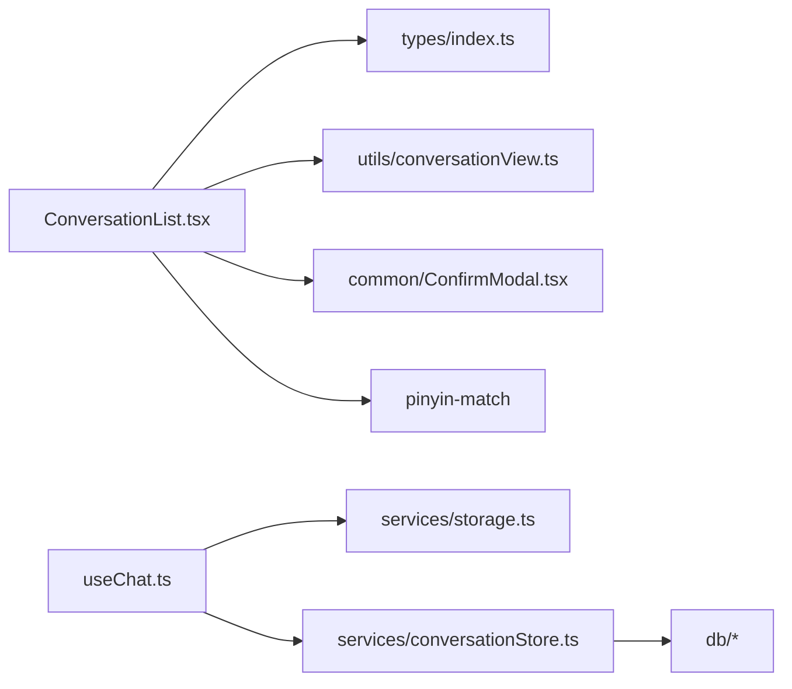

# 会话列表组件

<cite>
**本文引用的文件**
- [ConversationList.tsx](file://src/components/chat/ConversationList.tsx)
- [useChat.ts](file://src/hooks/useChat.ts)
- [conversationStore.ts](file://src/services/conversationStore.ts)
- [storage.ts](file://src/services/storage.ts)
- [index.ts（类型定义）](file://src/types/index.ts)
- [conversationView.ts](file://src/utils/conversationView.ts)
- [Sidebar.tsx](file://src/components/layout/Sidebar.tsx)
</cite>

## 目录
1. [简介](#简介)
2. [项目结构](#项目结构)
3. [核心组件与职责](#核心组件与职责)
4. [架构总览](#架构总览)
5. [详细组件分析](#详细组件分析)
6. [依赖关系分析](#依赖关系分析)
7. [性能考量](#性能考量)
8. [故障排查指南](#故障排查指南)
9. [结论](#结论)
10. [附录：使用示例与最佳实践](#附录使用示例与最佳实践)

## 简介
本文件围绕 ConversationList 会话列表组件，系统化说明其 UI 实现、数据流、状态同步、本地存储集成、与后端 API 的交互方式、错误处理与离线支持，并给出性能优化策略、自定义样式、扩展功能与国际化支持的完整指南。该组件负责会话的新建、删除、切换、重命名、搜索等能力，并与 useChat、持久化层、数据库及设置存储协同工作，确保高可用与一致性。

## 项目结构
ConversationList 位于聊天模块中，作为侧边栏或独立面板渲染会话列表。它通过 props 接收会话集合与回调，内部维护编辑态、搜索词、删除确认等局部状态，并使用工具函数过滤空会话与按标题进行中文拼音匹配搜索。

图表来源
- [ConversationList.tsx:1-175](file://src/components/chat/ConversationList.tsx#L1-L175)
- [useChat.ts:152-337](file://src/hooks/useChat.ts#L152-L337)
- [conversationStore.ts:1-348](file://src/services/conversationStore.ts#L1-L348)
- [storage.ts:1-63](file://src/services/storage.ts#L1-L63)
- [conversationView.ts:1-33](file://src/utils/conversationView.ts#L1-L33)
- [index.ts:143-175](file://src/types/index.ts#L143-L175)

章节来源
- [ConversationList.tsx:1-175](file://src/components/chat/ConversationList.tsx#L1-L175)
- [Sidebar.tsx:219-247](file://src/components/layout/Sidebar.tsx#L219-L247)

## 核心组件与职责
- ConversationList：会话列表 UI，提供新建、搜索、重命名、删除、切换等功能；过滤空会话并按标题进行中文拼音匹配。
- useChat：会话与消息的状态管理、启动恢复、持久化 diff、流式发送、压缩、联网搜索、错误处理等。
- conversationStore：会话与消息的持久化门面，负责增量写入、流式节流落盘、元数据更新、上下文节点同步。
- storage：小体积同步读取的设置项（最近模型、最近活跃会话 ID、联网开关、主题）。
- types：Conversation、Message、ContextSegment 等核心数据结构。
- conversationView：判断会话是否包含消息、获取最后一条预览文本的工具。

章节来源
- [ConversationList.tsx:8-175](file://src/components/chat/ConversationList.tsx#L8-L175)
- [useChat.ts:152-337](file://src/hooks/useChat.ts#L152-L337)
- [conversationStore.ts:64-112](file://src/services/conversationStore.ts#L64-L112)
- [storage.ts:11-52](file://src/services/storage.ts#L11-L52)
- [index.ts:143-175](file://src/types/index.ts#L143-L175)
- [conversationView.ts:17-32](file://src/utils/conversationView.ts#L17-L32)

## 架构总览
ConversationList 是纯展示与交互层，所有业务逻辑由父级 useChat 驱动。会话数据从 IndexedDB 加载为轻量元数据，按需 hydrate 消息；列表渲染时过滤空会话并支持拼音搜索；操作通过回调交由 useChat 处理，再由 conversationStore 持久化到 IndexedDB，必要时写回 localStorage 的设置项。

图表来源
- [ConversationList.tsx:70-175](file://src/components/chat/ConversationList.tsx#L70-L175)
- [useChat.ts:195-313](file://src/hooks/useChat.ts#L195-L313)
- [conversationStore.ts:70-112](file://src/services/conversationStore.ts#L70-L112)
- [conversationStore.ts:190-257](file://src/services/conversationStore.ts#L190-L257)

## 详细组件分析

### ConversationList 组件
- 输入属性
  - conversations：会话数组（仅含元数据或已 hydrate 的消息）
  - activeId：当前激活会话 ID
  - onSwitch：切换会话回调
  - onNew：新建会话回调
  - onDelete：删除会话回调
  - onRename：重命名会话回调
- 内部状态
  - editingId/editText：编辑标题时的行内编辑态
  - searchText：搜索关键词
  - deleteTarget：待删除会话 ID
  - inputRef：用于聚焦编辑输入框
- 关键逻辑
  - 过滤空会话：使用 hasAnyMessage 避免未打开的历史会话被误判为空
  - 搜索：支持标题模糊匹配与中文拼音匹配
  - 行内重命名：双击进入编辑，Enter 提交，Escape 取消
  - 删除：二次确认弹窗，确认后调用 onDelete
  - 切换：非编辑状态下点击触发 onSwitch

图表来源
- [ConversationList.tsx:31-49](file://src/components/chat/ConversationList.tsx#L31-L49)
- [ConversationList.tsx:51-68](file://src/components/chat/ConversationList.tsx#L51-L68)
- [ConversationList.tsx:97-156](file://src/components/chat/ConversationList.tsx#L97-L156)
- [ConversationList.tsx:159-171](file://src/components/chat/ConversationList.tsx#L159-L171)
- [conversationView.ts:17-23](file://src/utils/conversationView.ts#L17-L23)

章节来源
- [ConversationList.tsx:8-175](file://src/components/chat/ConversationList.tsx#L8-L175)
- [conversationView.ts:17-32](file://src/utils/conversationView.ts#L17-L32)

### 会话数据与状态同步
- 启动流程
  - 读取会话列表（仅元数据），尝试恢复上次活跃会话
  - 若上次会话有效则 hydrate 最近消息与上下文节点
  - 否则复用空会话或创建新会话
  - 初始化 persistedRef 快照，避免启动后立即重复落盘
- 持久化策略
  - 基于 diff 的定向写入：仅对变化的消息与元数据进行写库
  - 流式消息节流落盘：每 1 秒合并一次中间态，避免频繁 IO
  - 页面隐藏/关闭前强制 flushPendingWrites，防止长回复丢失
- 设置持久化
  - 最近模型、最近活跃会话 ID、联网开关、主题等通过 storage 同步读写

图表来源
- [useChat.ts:195-313](file://src/hooks/useChat.ts#L195-L313)
- [conversationStore.ts:64-112](file://src/services/conversationStore.ts#L64-L112)
- [storage.ts:25-38](file://src/services/storage.ts#L25-L38)

章节来源
- [useChat.ts:195-313](file://src/hooks/useChat.ts#L195-L313)
- [conversationStore.ts:190-257](file://src/services/conversationStore.ts#L190-L257)
- [storage.ts:11-52](file://src/services/storage.ts#L11-L52)

### 与后端 API 的交互与错误处理
- 发送消息
  - 构建系统提示与上下文（含压缩片段）
  - 可选联网搜索：先判断是否需要搜索，再执行搜索并将结果注入上下文
  - 流式响应：逐块更新消息内容，清理 artifact 标记与 suggestions
  - 错误处理：AbortError 表示用户停止；其他错误在消息中标注失败信息
- 流式落盘
  - 流式期间按 1s 间隔合并写入，页面隐藏时立即 flush
- 用量统计
  - 记录真实 token 用量，便于成本核对与缓存命中率评估

图表来源
- [useChat.ts:494-783](file://src/hooks/useChat.ts#L494-L783)
- [conversationStore.ts:153-182](file://src/services/conversationStore.ts#L153-L182)
- [conversationStore.ts:243-257](file://src/services/conversationStore.ts#L243-L257)

章节来源
- [useChat.ts:494-783](file://src/hooks/useChat.ts#L494-L783)
- [conversationStore.ts:153-182](file://src/services/conversationStore.ts#L153-L182)

### 虚拟滚动与懒加载
- 列表渲染
  - 当前 ConversationList 采用内存渲染，未实现虚拟滚动
  - 通过 hasAnyMessage 过滤空会话，避免历史会话因未加载消息而消失
- 消息懒加载
  - 会话消息采用分页加载：首次加载 INITIAL_MESSAGE_LIMIT，向上滚动追加 PAGE_SIZE
  - 通过 loadOlderMessages 基于消息序列号查询更早消息
- 建议
  - 当会话数量增长到数百条时，可引入虚拟滚动（如 react-window 或自研方案）减少 DOM 节点
  - 列表项高度尽量固定或使用占位高度，提升滚动性能

章节来源
- [conversationStore.ts:39-42](file://src/services/conversationStore.ts#L39-L42)
- [conversationStore.ts:102-112](file://src/services/conversationStore.ts#L102-L112)
- [conversationView.ts:17-23](file://src/utils/conversationView.ts#L17-L23)

### 搜索与国际化
- 搜索
  - 支持标题模糊匹配与中文拼音匹配（pinyin-match）
  - 过滤空会话后再进行搜索，保证结果质量
- 国际化
  - 当前硬编码中文文案（如“新对话”、“搜索对话...”、“无匹配结果”、“删除会话”等）
  - 建议抽取 i18n 键值，替换硬编码字符串，以支持多语言

章节来源
- [ConversationList.tsx:31-42](file://src/components/chat/ConversationList.tsx#L31-L42)
- [ConversationList.tsx:70-96](file://src/components/chat/ConversationList.tsx#L70-L96)
- [ConversationList.tsx:94-96](file://src/components/chat/ConversationList.tsx#L94-L96)
- [ConversationList.tsx:159-171](file://src/components/chat/ConversationList.tsx#L159-L171)

### 自定义样式与扩展
- 样式
  - 使用 Tailwind 类名进行布局与交互反馈（悬停、选中态、禁用态）
  - 可通过覆盖 CSS 变量或组件类名定制主题色、圆角、阴影等
- 扩展
  - 增加批量选择、拖拽排序、标签分组、收藏筛选等能力（参考 Sidebar 的实现思路）
  - 接入更多搜索维度（如按时间、按模型、按附件类型）

章节来源
- [ConversationList.tsx:70-156](file://src/components/chat/ConversationList.tsx#L70-L156)
- [Sidebar.tsx:219-247](file://src/components/layout/Sidebar.tsx#L219-L247)

## 依赖关系分析
- ConversationList 依赖
  - types.Conversation：会话数据结构
  - utils.conversationView.hasAnyMessage：判断会话是否为空
  - components.common.ConfirmModal：删除确认弹窗
  - pinyin-match：中文拼音匹配
- useChat 依赖
  - services.storage：设置持久化
  - services.conversationStore：会话与消息持久化门面
  - db：IndexedDB 操作
  - services.titleGenerator/webSearch/settingsService：辅助功能
- conversationStore 依赖
  - db：会话、消息、上下文节点的增删改查
  - 流式落盘缓冲与定时任务

图表来源
- [ConversationList.tsx:1-6](file://src/components/chat/ConversationList.tsx#L1-L6)
- [useChat.ts:1-42](file://src/hooks/useChat.ts#L1-L42)
- [conversationStore.ts:12-37](file://src/services/conversationStore.ts#L12-L37)

章节来源
- [ConversationList.tsx:1-6](file://src/components/chat/ConversationList.tsx#L1-L6)
- [useChat.ts:1-42](file://src/hooks/useChat.ts#L1-L42)
- [conversationStore.ts:12-37](file://src/services/conversationStore.ts#L12-L37)

## 性能考量
- 渲染优化
  - 使用 useMemo 缓存过滤结果，避免每次渲染重复计算
  - 过滤空会话，避免未加载历史会话干扰搜索结果
- 数据加载
  - 会话列表仅加载元数据，打开会话时才 hydrate 消息，降低首屏开销
  - 分页加载更早消息，控制单次 IO 量
- 持久化
  - diff 后定向写入，避免全量覆盖导致的卡顿
  - 流式消息节流落盘，减少磁盘写入频率
  - 页面隐藏/关闭前强制 flush，保障数据一致性
- 建议
  - 当会话数超过一定阈值，考虑虚拟滚动
  - 对搜索词进行防抖，减少高频输入带来的计算压力
  - 将常用配置（如主题、模型）保持同步读取，避免首屏闪烁

章节来源
- [ConversationList.tsx:31-42](file://src/components/chat/ConversationList.tsx#L31-L42)
- [conversationStore.ts:190-257](file://src/services/conversationStore.ts#L190-L257)
- [conversationStore.ts:153-182](file://src/services/conversationStore.ts#L153-L182)

## 故障排查指南
- 启动加载失败
  - 现象：无法恢复上次会话或加载列表失败
  - 排查：检查 IndexedDB 可用性、会话记录是否存在、hydrate 是否抛出异常
  - 相关代码路径：[useChat.ts:195-288](file://src/hooks/useChat.ts#L195-L288)
- 流式输出中断
  - 现象：移动端切后台后长回复丢失
  - 排查：确认 flushPendingWrites 是否在 visibilitychange/pagehide 触发
  - 相关代码路径：[useChat.ts:321-332](file://src/hooks/useChat.ts#L321-L332), [conversationStore.ts:338-347](file://src/services/conversationStore.ts#L338-L347)
- 搜索无结果
  - 现象：输入关键词后列表为空
  - 排查：确认 hasAnyMessage 过滤逻辑、拼音匹配是否正确、搜索词是否被 trim
  - 相关代码路径：[ConversationList.tsx:31-42](file://src/components/chat/ConversationList.tsx#L31-L42), [conversationView.ts:17-23](file://src/utils/conversationView.ts#L17-L23)
- 删除后列表未刷新
  - 现象：删除会话后仍显示旧条目
  - 排查：确认 onDelete 回调是否调用、useChat 是否更新 conversations 并持久化
  - 相关代码路径：[ConversationList.tsx:159-171](file://src/components/chat/ConversationList.tsx#L159-L171), [useChat.ts:296-313](file://src/hooks/useChat.ts#L296-L313)

章节来源
- [useChat.ts:195-332](file://src/hooks/useChat.ts#L195-L332)
- [conversationStore.ts:338-347](file://src/services/conversationStore.ts#L338-L347)
- [ConversationList.tsx:31-42](file://src/components/chat/ConversationList.tsx#L31-L42)
- [ConversationList.tsx:159-171](file://src/components/chat/ConversationList.tsx#L159-L171)

## 结论
ConversationList 作为会话管理的入口组件，提供了简洁高效的会话操作界面，并通过 useChat 与持久化层紧密协作，实现了高性能的数据加载、流式更新与一致性保障。结合分页加载、diff 写入与流式节流，系统在大量消息场景下仍能保持流畅体验。未来可在列表层面引入虚拟滚动与搜索防抖，进一步提升大规模数据下的性能。

## 附录：使用示例与最佳实践
- 基本用法
  - 在父组件中维护 conversations、activeId，并实现 onSwitch/onNew/onDelete/onRename 回调
  - 将 ConversationList 嵌入侧边栏或独立面板，绑定样式与交互
- 最佳实践
  - 始终使用 hasAnyMessage 判断会话是否为空，避免未加载历史会话被误过滤
  - 对搜索输入进行防抖，减少不必要的计算
  - 在移动端注意长按手势与菜单定位，避免被祖先容器裁剪
  - 国际化：将硬编码文案抽离为 i18n 键值，统一维护多语言资源
  - 性能：当会话数增长时，优先启用虚拟滚动；对列表项高度进行预估，减少重排

章节来源
- [ConversationList.tsx:70-175](file://src/components/chat/ConversationList.tsx#L70-L175)
- [Sidebar.tsx:219-247](file://src/components/layout/Sidebar.tsx#L219-L247)