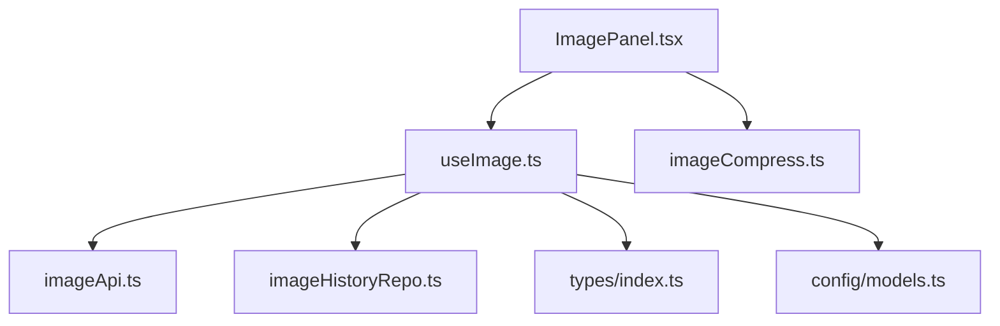
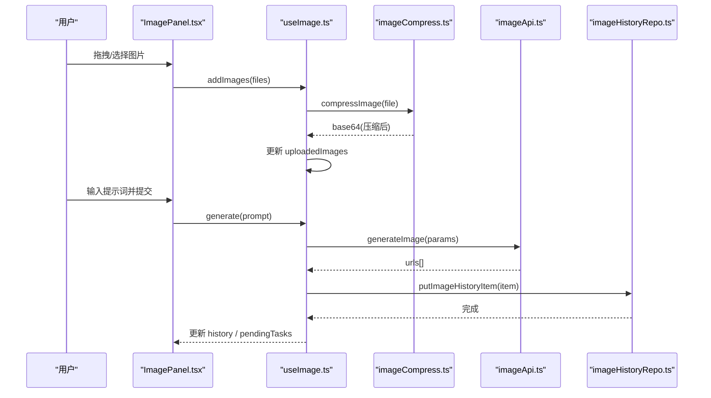
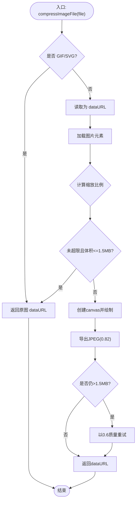
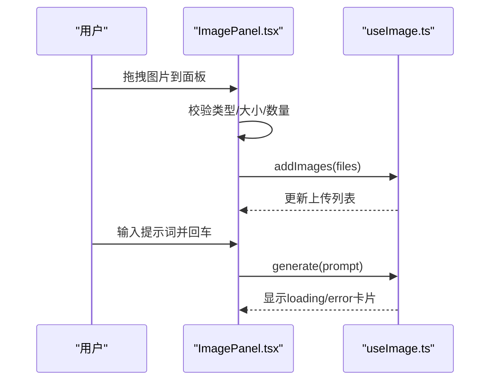
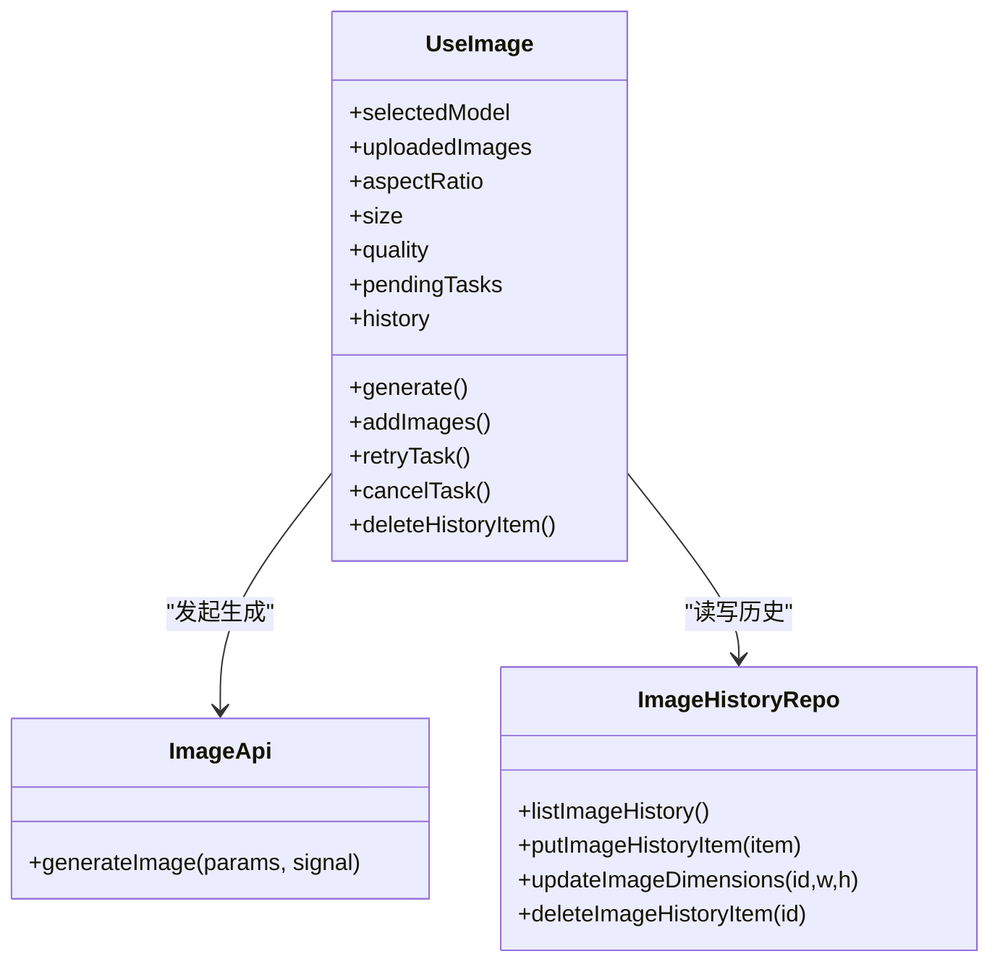
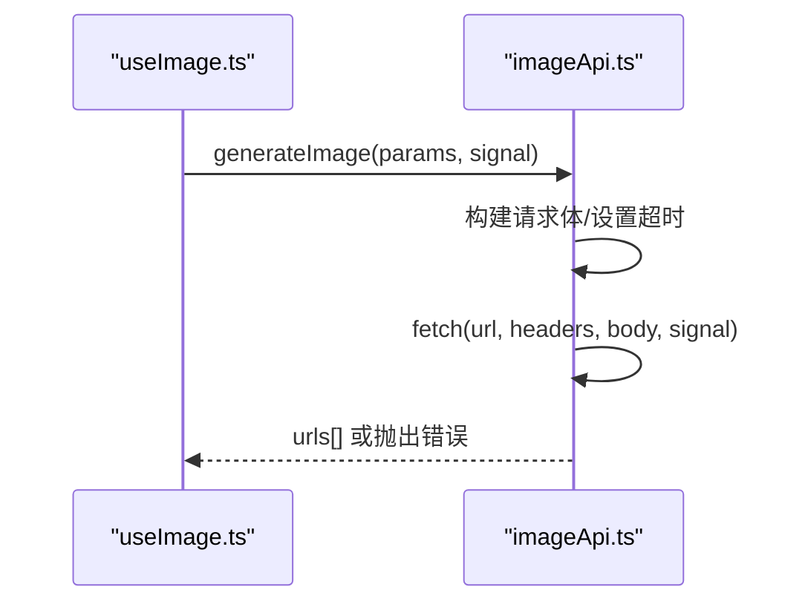
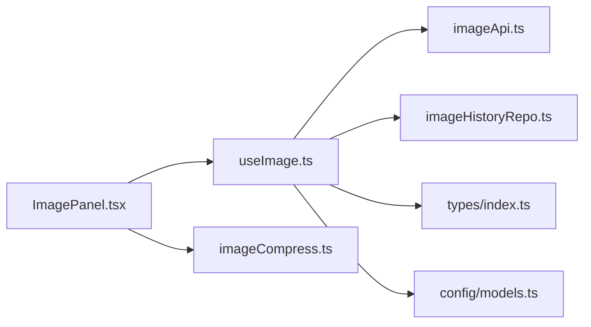

# 图片压缩工具

<cite>
**本文引用的文件**
- [README.md](file://README.md)
- [package.json](file://package.json)
- [src/utils/imageCompress.ts](file://src/utils/imageCompress.ts)
- [src/hooks/useImage.ts](file://src/hooks/useImage.ts)
- [src/components/image/ImagePanel.tsx](file://src/components/image/ImagePanel.tsx)
- [src/services/imageApi.ts](file://src/services/imageApi.ts)
- [src/types/index.ts](file://src/types/index.ts)
- [src/config/models.ts](file://src/config/models.ts)
- [src/db/imageHistoryRepo.ts](file://src/db/imageHistoryRepo.ts)
- [test-image-local.mjs](file://test-image-local.mjs)
</cite>

## 目录
1. [简介](#简介)
2. [项目结构](#项目结构)
3. [核心组件](#核心组件)
4. [架构总览](#架构总览)
5. [详细组件分析](#详细组件分析)
6. [依赖关系分析](#依赖关系分析)
7. [性能考量](#性能考量)
8. [故障排查指南](#故障排查指南)
9. [结论](#结论)
10. [附录](#附录)

## 简介
本项目是一个基于 React + TypeScript + Vite 的图片生成与处理应用，重点包含“发送前图片压缩”能力：在用户上传图片或进行图像编辑时，对大尺寸图片进行降采样与有损压缩，显著降低请求体大小与 IndexedDB 落盘压力，提升弱网上传成功率与整体体验。同时提供多模型（GPT Image 2、Gemini 系列）文生图/图生图能力、瀑布流历史展示、并发任务队列、本地持久化等完整功能。

## 项目结构
- 前端 UI 层：以 ImagePanel 为核心的图片面板，支持拖拽上传、参考图添加、参数选择、瀑布流展示与下载。
- 状态与业务逻辑：useImage Hook 管理模型、参数、上传列表、并发任务、历史读写。
- 图片压缩：utils/imageCompress.ts 提供发送前压缩；hooks/useImage.ts 内嵌轻量压缩用于上传预览。
- API 服务：services/imageApi.ts 封装不同上游模型的请求构建、超时控制、错误解析与 URL 提取。
- 数据持久化：db/imageHistoryRepo.ts 将 base64 转为 Blob 引用存储，http 链接原样保留，避免 localStorage 爆满。
- 类型与配置：types/index.ts 定义请求/历史/任务等类型；config/models.ts 维护可用模型清单。

图表来源
- [src/components/image/ImagePanel.tsx:1-120](file://src/components/image/ImagePanel.tsx#L1-L120)
- [src/hooks/useImage.ts:123-215](file://src/hooks/useImage.ts#L123-L215)
- [src/services/imageApi.ts:149-243](file://src/services/imageApi.ts#L149-L243)
- [src/db/imageHistoryRepo.ts:84-108](file://src/db/imageHistoryRepo.ts#L84-L108)
- [src/utils/imageCompress.ts:37-76](file://src/utils/imageCompress.ts#L37-L76)
- [src/types/index.ts:179-216](file://src/types/index.ts#L179-L216)
- [src/config/models.ts:237-271](file://src/config/models.ts#L237-L271)

章节来源
- [README.md:1-74](file://README.md#L1-L74)
- [package.json:1-47](file://package.json#L1-L47)

## 核心组件
- 图片压缩器（utils/imageCompress.ts）
  - 目标：发送前将大图降采样到最长边 1280px，JPEG 质量 0.82，必要时二次降质至 0.6，确保单图 < 1.5MB。
  - 策略：跳过 GIF/SVG；小图且体积不大则直接返回原图；透明 PNG 先铺白底再转 JPEG；失败回退原图。
- 图片面板（components/image/ImagePanel.tsx）
  - 功能：拖拽上传、参考图添加、提示词输入、模型/比例/尺寸/质量选择、瀑布流展示、下载、删除。
  - 交互：防抖提交、拖放区域高亮、浮动菜单定位、错误横幅提示。
- 图片状态 Hook（hooks/useImage.ts）
  - 职责：模型切换与默认参数、上传列表管理（含压缩）、并发任务队列（AbortController）、历史加载与回填宽高、落库与清理。
  - 内置压缩：上传预览使用 1024px 最长边、JPEG 0.85 的轻量压缩。
- API 服务（services/imageApi.ts）
  - 能力：按模型构建请求体、统一超时（120s）、合并外部取消信号、兼容多种响应结构并抽取 URL 数组。
- 数据仓库（db/imageHistoryRepo.ts）
  - 能力：base64 转 Blob 引用存储、http 链接原样保留、增量更新宽高、删除/清空时释放引用计数。

章节来源
- [src/utils/imageCompress.ts:1-77](file://src/utils/imageCompress.ts#L1-L77)
- [src/components/image/ImagePanel.tsx:21-120](file://src/components/image/ImagePanel.tsx#L21-L120)
- [src/hooks/useImage.ts:66-120](file://src/hooks/useImage.ts#L66-L120)
- [src/services/imageApi.ts:65-143](file://src/services/imageApi.ts#L65-L143)
- [src/db/imageHistoryRepo.ts:37-82](file://src/db/imageHistoryRepo.ts#L37-L82)

## 架构总览

图表来源
- [src/components/image/ImagePanel.tsx:438-571](file://src/components/image/ImagePanel.tsx#L438-L571)
- [src/hooks/useImage.ts:217-238](file://src/hooks/useImage.ts#L217-L238)
- [src/utils/imageCompress.ts:37-76](file://src/utils/imageCompress.ts#L37-L76)
- [src/services/imageApi.ts:149-243](file://src/services/imageApi.ts#L149-L243)
- [src/db/imageHistoryRepo.ts:95-108](file://src/db/imageHistoryRepo.ts#L95-L108)

## 详细组件分析

### 图片压缩器（utils/imageCompress.ts）
- 设计要点
  - 最大边长 1280px，JPEG 质量 0.82，上限 1.5MB；若仍超限则降至 0.6 再次尝试。
  - 跳过 GIF/SVG；小图且体积不超限时直接返回原图；透明 PNG 先铺白底再转 JPEG。
  - 解码/压缩异常时回退原图，保证流程不中断。
- 复杂度
  - 时间复杂度 O(W×H)，受画布像素绘制影响；空间复杂度 O(W×H) 用于中间 canvas。
- 优化点
  - 对小图直接跳过压缩减少开销；质量降级仅在必要时触发。

图表来源
- [src/utils/imageCompress.ts:37-76](file://src/utils/imageCompress.ts#L37-L76)

章节来源
- [src/utils/imageCompress.ts:1-77](file://src/utils/imageCompress.ts#L1-L77)

### 图片面板（components/image/ImagePanel.tsx）
- 关键流程
  - 拖拽上传：过滤非图片、超大文件拦截、达到上限提示；内部 URL 拖入支持 data/blob/http 三种来源。
  - 参考图添加：从照片墙拖拽到输入区，自动转换为 File 并加入上传列表。
  - 提交防抖：Enter/按钮同帧重复提交保护。
  - 下载：识别 aishop-blob 协议，取 Blob 并创建临时 Object URL 触发下载，延迟撤销。
- 交互细节
  - 浮动菜单自适应上下位置与右对齐；九宫格比例选择器；错误横幅可关闭。

图表来源
- [src/components/image/ImagePanel.tsx:438-615](file://src/components/image/ImagePanel.tsx#L438-L615)
- [src/hooks/useImage.ts:359-387](file://src/hooks/useImage.ts#L359-L387)

章节来源
- [src/components/image/ImagePanel.tsx:21-800](file://src/components/image/ImagePanel.tsx#L21-L800)

### 图片状态 Hook（hooks/useImage.ts）
- 模型与参数
  - 根据模型设置默认比例/尺寸/质量；Google 模型支持比例，GPT 模型支持质量等级。
- 上传压缩
  - 上传时使用 1024px 最长边、JPEG 0.85 的轻量压缩，用于预览与传输。
- 并发任务
  - 每个任务独立 AbortController；支持取消、重试、错误卡片；超时由 imageApi 内部控制。
- 历史与维度回填
  - 启动时加载历史；对缺失 width/height 的记录优先从 blob 元信息获取，否则解码首图；写回数据库避免重复计算。

图表来源
- [src/hooks/useImage.ts:123-469](file://src/hooks/useImage.ts#L123-L469)
- [src/services/imageApi.ts:149-243](file://src/services/imageApi.ts#L149-L243)
- [src/db/imageHistoryRepo.ts:84-135](file://src/db/imageHistoryRepo.ts#L84-L135)

章节来源
- [src/hooks/useImage.ts:1-469](file://src/hooks/useImage.ts#L1-L469)

### API 服务（services/imageApi.ts）
- 请求构建
  - GPT Image 2：编辑模式仅支持单张参考图，需带完整 data URI；文生图支持 size/quality/output_format。
  - Gemini 系列：编辑模式区分 image_urls 与 image_base64s；文生图支持 aspect_ratio。
- 超时与取消
  - 120s 超时；合并外部 AbortSignal 支持手动取消。
- 响应解析
  - 兼容 Gemini/GPT 多种返回结构，抽取 URL 数组；错误消息优先 detail/error.message。

图表来源
- [src/services/imageApi.ts:65-243](file://src/services/imageApi.ts#L65-L243)
- [src/hooks/useImage.ts:275-356](file://src/hooks/useImage.ts#L275-L356)

章节来源
- [src/services/imageApi.ts:1-257](file://src/services/imageApi.ts#L1-L257)

### 数据仓库（db/imageHistoryRepo.ts）
- 存储策略
  - base64 转为 Blob 并建立引用计数；http 链接原样保留，不占用本地空间。
  - 读回时将 Blob ID 转换为 aishop-blob:<id> 协议，UI 通过 useBlobUrl 解析。
- 维护操作
  - 覆盖写时释放旧 Blob 引用；删除/清空时批量释放；增量更新宽高字段。

章节来源
- [src/db/imageHistoryRepo.ts:1-150](file://src/db/imageHistoryRepo.ts#L1-L150)

## 依赖关系分析
- 模块耦合
  - ImagePanel 依赖 useImage 暴露的状态与方法；useImage 依赖 imageApi 与 imageHistoryRepo；utils/imageCompress 被 useImage 与面板共同使用。
- 外部依赖
  - 浏览器原生 API：FileReader、Image、Canvas、URL.createObjectURL/revokeObjectURL、IndexedDB。
  - 第三方库：React、Tailwind、Lucide 图标等。
- 潜在循环
  - 当前无循环依赖；Hook 与服务/仓库单向调用。

图表来源
- [src/components/image/ImagePanel.tsx:1-120](file://src/components/image/ImagePanel.tsx#L1-L120)
- [src/hooks/useImage.ts:1-120](file://src/hooks/useImage.ts#L1-L120)
- [src/services/imageApi.ts:1-64](file://src/services/imageApi.ts#L1-L64)
- [src/db/imageHistoryRepo.ts:1-36](file://src/db/imageHistoryRepo.ts#L1-L36)
- [src/utils/imageCompress.ts:1-36](file://src/utils/imageCompress.ts#L1-L36)
- [src/types/index.ts:179-216](file://src/types/index.ts#L179-L216)
- [src/config/models.ts:237-271](file://src/config/models.ts#L237-L271)

章节来源
- [src/components/image/ImagePanel.tsx:1-120](file://src/components/image/ImagePanel.tsx#L1-L120)
- [src/hooks/useImage.ts:1-120](file://src/hooks/useImage.ts#L1-L120)
- [src/services/imageApi.ts:1-64](file://src/services/imageApi.ts#L1-L64)
- [src/db/imageHistoryRepo.ts:1-36](file://src/db/imageHistoryRepo.ts#L1-L36)
- [src/utils/imageCompress.ts:1-36](file://src/utils/imageCompress.ts#L1-L36)
- [src/types/index.ts:179-216](file://src/types/index.ts#L179-L216)
- [src/config/models.ts:237-271](file://src/config/models.ts#L237-L271)

## 性能考量
- 压缩策略
  - 发送前压缩：最长边 1280px、JPEG 0.82，必要时降至 0.6，确保 < 1.5MB，显著降低网络与存储压力。
  - 上传预览压缩：1024px、JPEG 0.85，兼顾速度与质量。
- 渲染优化
  - 瀑布流布局结合宽高占位，避免重排抖动；懒加载与滚动缓冲。
- 存储优化
  - base64 转 Blob 引用，http 链接不落地；删除/覆盖时释放引用计数，避免内存泄漏。
- 网络优化
  - 120s 超时与外部取消合并，避免长时间挂起；错误消息聚合便于快速定位问题。

[本节为通用指导，不直接分析具体文件]

## 故障排查指南
- 常见问题
  - 上传失败：检查文件类型与大小限制；确认已达到最大上传数量时的提示。
  - 压缩失败：GIF/SVG 不会被压缩；透明 PNG 会铺白底；解码异常会回退原图。
  - 生成失败：确认已配置 API Key；检查模型端点与参数；查看错误消息中的 detail 或 error.message。
  - 下载失败：aishop-blob 协议需先取 Blob 再生成临时 URL；注意延迟撤销以避免下载未完成。
- 调试建议
  - 使用 test-image-local.mjs 直连上游接口测试连通性与耗时。
  - 关注控制台日志中来自 useImage 与 imageApi 的错误输出。

章节来源
- [src/components/image/ImagePanel.tsx:438-615](file://src/components/image/ImagePanel.tsx#L438-L615)
- [src/utils/imageCompress.ts:37-76](file://src/utils/imageCompress.ts#L37-L76)
- [src/services/imageApi.ts:149-243](file://src/services/imageApi.ts#L149-L243)
- [test-image-local.mjs:1-101](file://test-image-local.mjs#L1-L101)

## 结论
该图片压缩工具在用户体验与性能之间取得良好平衡：通过发送前智能压缩、合理的上传预览压缩、稳定的并发任务管理与高效的本地存储策略，有效降低了网络与存储压力，提升了弱网环境下的可靠性。同时，多模型支持与灵活的参数配置满足了多样化创作需求。建议在后续迭代中继续优化压缩算法与缓存策略，进一步提升大图处理效率与稳定性。

[本节为总结性内容，不直接分析具体文件]

## 附录
- 模型清单与能力
  - 图片模型：gpt-image-2、gemini-3.1-flash、gemini-3-pro，分别对应不同的参数与端点。
- 类型定义
  - 图片生成参数、历史记录项、待处理任务等类型集中定义，便于前后端一致性与扩展。

章节来源
- [src/config/models.ts:237-271](file://src/config/models.ts#L237-L271)
- [src/types/index.ts:179-216](file://src/types/index.ts#L179-L216)