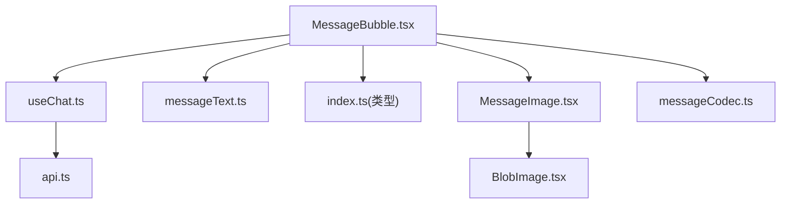
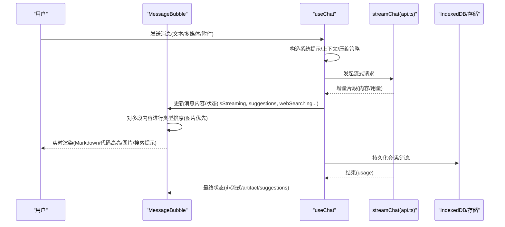
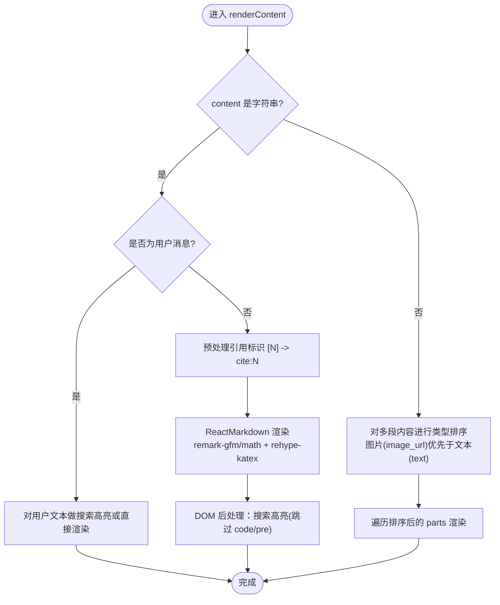
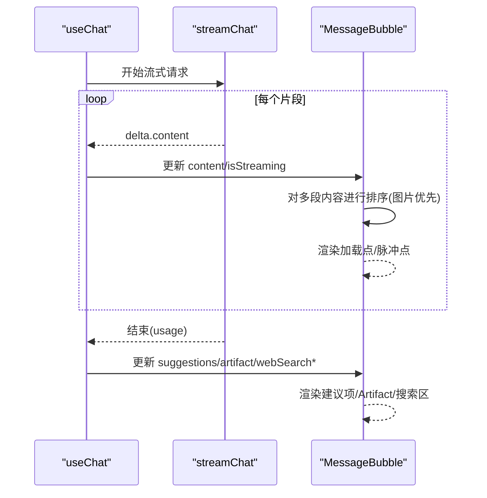
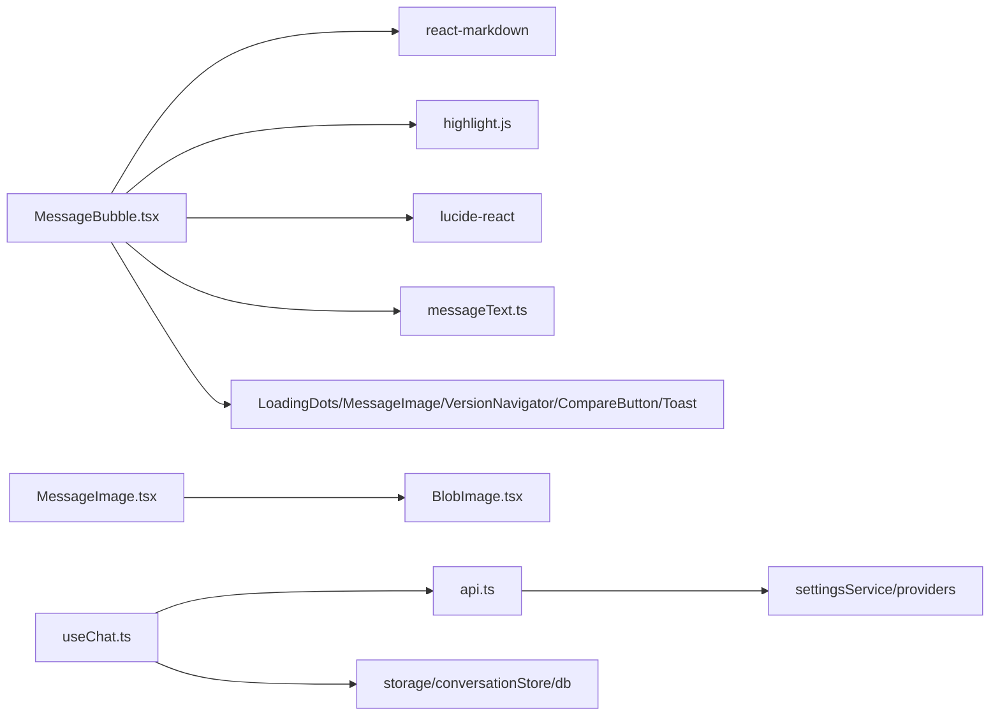

# 消息气泡组件

<cite>
**本文引用的文件**
- [MessageBubble.tsx](file://src/components/chat/MessageBubble.tsx)
- [MessageImage.tsx](file://src/components/chat/MessageImage.tsx)
- [useChat.ts](file://src/hooks/useChat.ts)
- [api.ts](file://src/services/api.ts)
- [index.ts](file://src/types/index.ts)
- [messageText.ts](file://src/utils/messageText.ts)
- [messageCodec.ts](file://src/db/messageCodec.ts)
</cite>

## 更新摘要
**所做更改**
- 更新了多段内容渲染逻辑，实现了按content类型排序机制
- 增强了图片显示顺序，当消息包含文本和图片时，图片现在渲染在文本内容之上
- 添加了微信风格的视觉呈现优化
- 完善了多媒体内容处理的详细说明

## 目录
1. [简介](#简介)
2. [项目结构](#项目结构)
3. [核心组件](#核心组件)
4. [架构总览](#架构总览)
5. [详细组件分析](#详细组件分析)
6. [依赖关系分析](#依赖关系分析)
7. [性能考量](#性能考量)
8. [故障排查指南](#故障排查指南)
9. [结论](#结论)
10. [附录](#附录)

## 简介
本文件为 MessageBubble 消息气泡组件的权威文档，聚焦以下方面：
- 消息渲染逻辑：文本格式化、Markdown 支持、数学公式、代码高亮、图片等多媒体内容处理。
- 用户消息与 AI 消息的差异：展示样式、交互行为、状态管理。
- 消息操作能力：复制、保存 Markdown、重新生成、引用、模型对比、版本切换、折叠浏览、查找高亮。
- 流式输出动画、错误状态与加载指示器。
- 主题定制、样式覆盖与扩展开发指南。

## 项目结构
围绕消息气泡的关键文件与职责：
- src/components/chat/MessageBubble.tsx：消息气泡 UI 与交互实现（渲染、搜索高亮、上下文菜单、多版本导航、联网搜索提示等）。
- src/components/chat/MessageImage.tsx：消息内图片专用组件，负责图片尺寸计算和加载状态。
- src/hooks/useChat.ts：对话状态与流式发送、压缩、联网搜索、建议项解析、停止/取消等流程控制。
- src/services/api.ts：流式聊天接口封装，SSE 解析与用量提取。
- src/types/index.ts：消息、版本、附件、用量等类型定义。
- src/utils/messageText.ts：纯文本提取与首行摘要工具。
- src/db/messageCodec.ts：消息编解码器，处理图片数据的持久化和恢复。

图表来源
- [MessageBubble.tsx:1-20](file://src/components/chat/MessageBubble.tsx#L1-L20)
- [useChat.ts:1-12](file://src/hooks/useChat.ts#L1-L12)
- [api.ts:1-10](file://src/services/api.ts#L1-L10)
- [messageText.ts:1-10](file://src/utils/messageText.ts#L1-L10)
- [MessageImage.tsx:1-15](file://src/components/chat/MessageImage.tsx#L1-L15)
- [messageCodec.ts:1-15](file://src/db/messageCodec.ts#L1-L15)

章节来源
- [MessageBubble.tsx:1-20](file://src/components/chat/MessageBubble.tsx#L1-L20)
- [useChat.ts:1-12](file://src/hooks/useChat.ts#L1-L12)
- [api.ts:1-10](file://src/services/api.ts#L1-L10)
- [messageText.ts:1-10](file://src/utils/messageText.ts#L1-L10)
- [MessageImage.tsx:1-15](file://src/components/chat/MessageImage.tsx#L1-L15)
- [messageCodec.ts:1-15](file://src/db/messageCodec.ts#L1-L15)

## 核心组件
- MessageBubble：负责单条消息的渲染与交互，包括：
  - 文本与 Markdown 渲染、数学公式、代码块高亮与复制。
  - 多段内容（文本+图片）渲染，**新增按类型排序功能**。
  - 联网搜索状态与结果展示、失败提示。
  - 长按上下文菜单（复制、保存 Markdown、重新生成、引用、查找、折叠回复）。
  - 多版本导航与模型对比入口。
  - 折叠浏览模式（仅显示首行摘要）。
  - 流式输出时的加载指示器与末尾脉冲点。
- MessageImage：消息内图片专用组件，负责图片尺寸计算、加载占位和错误处理。
- useChat：负责消息生命周期与状态更新，驱动 MessageBubble 的状态变化。
- api.streamChat：提供流式数据源，供 useChat 增量更新消息内容。

章节来源
- [MessageBubble.tsx:303-325](file://src/components/chat/MessageBubble.tsx#L303-L325)
- [MessageImage.tsx:21-58](file://src/components/chat/MessageImage.tsx#L21-L58)
- [useChat.ts:494-783](file://src/hooks/useChat.ts#L494-L783)
- [api.ts:44-173](file://src/services/api.ts#L44-L173)

## 架构总览
消息从发送到展示的端到端流程如下：

图表来源
- [useChat.ts:494-783](file://src/hooks/useChat.ts#L494-L783)
- [api.ts:44-173](file://src/services/api.ts#L44-L173)
- [MessageBubble.tsx:615-650](file://src/components/chat/MessageBubble.tsx#L615-L650)

## 详细组件分析

### 渲染管线与多媒体处理
- 文本与 Markdown：
  - 使用 ReactMarkdown + remark-gfm + remark-math + rehype-katex 渲染富文本与数学公式。
  - 自定义 code/pre 节点：行内代码使用浅色背景；代码块通过 highlight.js 进行语法高亮并支持语言标签与一键复制。
  - 引用标识 [N] 预处理为 cite:N，渲染为可点击的数字按钮，打开对应搜索结果链接。
- **多段内容渲染（已更新）**：
  - **新增按类型排序机制**：当消息包含文本和图片时，通过 `orderedParts` 数组对内容进行排序，确保图片优先显示在文本之上。
  - 排序算法：使用 `rank` 函数为不同 content 类型分配优先级，`image_url` 类型获得优先级 0，`text` 类型获得优先级 1。
  - 文本段落按普通文本渲染；图片通过 MessageImage 组件按需加载 IndexedDB 中的 blob，避免内存泄漏。
  - 保持原始数据顺序不变，仅在渲染时调整显示顺序，确保 API 发送与落盘格式的一致性。
- 搜索高亮：
  - 用户消息与多段文本分支：在渲染前对字符串插入 mark 标签并应用高亮样式。
  - Markdown 分支：渲染后通过 TreeWalker 遍历 DOM 文本节点包裹 mark，跳过 code/pre 内部以避免破坏高亮结构。
  - 支持"当前命中"的高亮样式切换，便于在多命中间跳转。

图表来源
- [MessageBubble.tsx:615-650](file://src/components/chat/MessageBubble.tsx#L615-L650)
- [MessageBubble.tsx:538-644](file://src/components/chat/MessageBubble.tsx#L538-L644)

章节来源
- [MessageBubble.tsx:615-650](file://src/components/chat/MessageBubble.tsx#L615-L650)
- [MessageBubble.tsx:538-644](file://src/components/chat/MessageBubble.tsx#L538-L644)
- [MessageBubble.tsx:219-300](file://src/components/chat/MessageBubble.tsx#L219-L300)
- [MessageBubble.tsx:139-198](file://src/components/chat/MessageBubble.tsx#L139-L198)

### 用户消息 vs AI 消息
- 用户消息：
  - 右侧气泡样式，支持附件列表展示。
  - 长按弹出上下文菜单（复制），用于快速复制整条消息文本。
- AI 消息：
  - 左侧无背景无边框，宽度撑满，顶部显示模型图标与名称或版本导航。
  - 联网搜索状态与结果区域：搜索中旋转提示、已搜索来源折叠面板、失败提示。
  - 流式输出时：空内容显示 LoadingDots；末尾带脉冲点表示仍在生成。
  - 停止/取消：若被用户停止且无内容，显示"请求已被取消"卡片并提供"立即重新生成"。
  - Artifact 预览：点击打开 HTML 预览。
  - 建议项：流结束后展示可点击的建议按钮。
  - 操作栏：复制、保存 Markdown、重新生成、引用（非流式时可见）。

章节来源
- [MessageBubble.tsx:653-735](file://src/components/chat/MessageBubble.tsx#L653-L735)
- [MessageBubble.tsx:760-1047](file://src/components/chat/MessageBubble.tsx#L760-L1047)
- [MessageBubble.tsx:801-817](file://src/components/chat/MessageBubble.tsx#L801-L817)
- [MessageBubble.tsx:896-923](file://src/components/chat/MessageBubble.tsx#L896-L923)

### 流式输出与状态管理
- 流式数据源：useChat 调用 streamChat，逐片段拼接内容，并通过 getDisplayContent 隐藏中间标记（如 artifact/suggestions），保证用户看到稳定渐进的内容。
- 状态同步：每次片段到达即更新最后一条 assistant 消息 content 与 isStreaming，MessageBubble 据此渲染加载指示器与末尾脉冲点。
- 结束处理：清理 artifact 流态、去除多余反引号、解析 suggestions、写入真实 usage 与搜索相关字段。
- 停止/取消：AbortError 时设置 stoppedByUser，UI 显示相应提示并提供重新生成入口。

图表来源
- [useChat.ts:678-740](file://src/hooks/useChat.ts#L678-L740)
- [api.ts:120-173](file://src/services/api.ts#L120-L173)
- [MessageBubble.tsx:615-650](file://src/components/chat/MessageBubble.tsx#L615-L650)

章节来源
- [useChat.ts:678-740](file://src/hooks/useChat.ts#L678-L740)
- [useChat.ts:741-783](file://src/hooks/useChat.ts#L741-L783)
- [api.ts:120-173](file://src/services/api.ts#L120-L173)
- [MessageBubble.tsx:615-650](file://src/components/chat/MessageBubble.tsx#L615-L650)

### 消息操作功能
- 复制：
  - 用户消息长按菜单与 AI 消息操作栏均支持复制纯文本（getPlainText）。
  - 代码块独立复制，带成功/失败 Toast。
- 保存为 Markdown：
  - 将纯文本以 .md 形式下载。
- 重新生成：
  - 停止/取消后提供"立即重新生成"，或在操作栏/长按菜单触发 onRegenerate。
- 引用：
  - 通过 onQuote(message) 回调将消息作为引用输入到下一轮对话。
- 模型对比：
  - CompareButton 根据当前版本模型与其他可用模型发起对比，禁用条件包含任意版本正在流式。
- 版本切换：
  - VersionNavigator 支持在同一消息下切换不同模型的多个回答版本，切换后刷新 displayContent 等派生状态。
- 折叠浏览：
  - collapsed 模式下仅显示第一行摘要，点击展开完整内容。
- 查找与高亮：
  - searchQuery 与 activeMatchOccurrence 控制当前消息内的搜索命中与高亮位置。

章节来源
- [MessageBubble.tsx:966-1043](file://src/components/chat/MessageBubble.tsx#L966-L1043)
- [MessageBubble.tsx:1048-1135](file://src/components/chat/MessageBubble.tsx#L1048-L1135)
- [MessageBubble.tsx:801-817](file://src/components/chat/MessageBubble.tsx#L801-L817)
- [MessageBubble.tsx:760-780](file://src/components/chat/MessageBubble.tsx#L760-L780)
- [messageText.ts:1-18](file://src/utils/messageText.ts#L1-L18)

### 联网搜索与引用
- 搜索流程：
  - useChat 在发送前判断是否需要联网搜索，若需要则先执行 searchWeb，并将结果格式化为上下文注入系统提示。
  - 搜索进行中显示"正在搜索..."，完成后展示来源列表并可折叠；失败时给出提示。
- 引用标识：
  - 将 [N] 转换为 cite:N，渲染为圆形数字按钮，点击打开对应来源 URL。

章节来源
- [useChat.ts:621-676](file://src/hooks/useChat.ts#L621-L676)
- [MessageBubble.tsx:513-524](file://src/components/chat/MessageBubble.tsx#L513-L524)
- [MessageBubble.tsx:576-603](file://src/components/chat/MessageBubble.tsx#L576-L603)
- [MessageBubble.tsx:820-841](file://src/components/chat/MessageBubble.tsx#L820-L841)

### 错误状态与加载指示器
- 加载指示器：
  - AI 消息为空且正在流式输出时显示 LoadingDots。
  - 流式内容末尾添加脉冲点表示仍在生成。
- 错误与取消：
  - 网络/网关错误：设置 error 并更新消息内容为错误提示。
  - 用户取消：设置 stoppedByUser，UI 显示"请求已被取消"并提供重新生成。
- 搜索失败：
  - 显示黄色警告提示，说明回答未参考网络信息。

章节来源
- [MessageBubble.tsx:508-512](file://src/components/chat/MessageBubble.tsx#L508-L512)
- [MessageBubble.tsx:885-890](file://src/components/chat/MessageBubble.tsx#L885-L890)
- [useChat.ts:741-783](file://src/hooks/useChat.ts#L741-L783)

### 主题定制与样式覆盖
- 主题变量：
  - 大量样式使用 CSS 变量（如 --color-accent、--color-bg-secondary、--color-code-bg 等），可在根节点或主题层覆盖以实现换肤。
- 代码块主题：
  - 使用 highlight.js 的 atom-one-dark 样式，可通过替换样式表或自定义 CodeBlock 组件来调整。
- Markdown 样式：
  - 通过 Tailwind prose 类与自定义类组合控制颜色、间距、链接样式等。
- 扩展点：
  - 自定义 ReactMarkdown components 钩子可替换 a/code/pre 等节点行为。
  - 长按菜单与操作栏可扩展更多动作（如导出 PDF、分享等）。

章节来源
- [MessageBubble.tsx:177-198](file://src/components/chat/MessageBubble.tsx#L177-L198)
- [MessageBubble.tsx:548-612](file://src/components/chat/MessageBubble.tsx#L548-L612)

### 扩展开发指南
- 新增渲染节点：
  - 在 ReactMarkdown components 中添加新节点处理器（如 table、blockquote 等），复用现有样式变量。
- 新增消息操作：
  - 在操作栏与长按菜单中增加按钮，绑定 onXxx 回调，保持禁用条件一致（如流式时禁用）。
- 增强搜索高亮：
  - 如需跨组件高亮，可在 markdownRef 的后处理中扩展 TreeWalker 规则。
- 接入新模型/提供商：
  - 通过 VersionNavigator 与 CompareButton 集成新模型 ID；确保 PROVIDER_ICON_MAP 映射正确。
- **图片显示顺序定制**：
  - 如需调整图片与文本的显示顺序，可修改 `renderContent` 函数中的排序逻辑。
  - 当前实现使用 `rank` 函数为不同类型分配优先级，可根据需求自定义排序规则。

章节来源
- [MessageBubble.tsx:554-603](file://src/components/chat/MessageBubble.tsx#L554-L603)
- [MessageBubble.tsx:966-1043](file://src/components/chat/MessageBubble.tsx#L966-L1043)
- [MessageBubble.tsx:1048-1135](file://src/components/chat/MessageBubble.tsx#L1048-L1135)
- [MessageBubble.tsx:615-650](file://src/components/chat/MessageBubble.tsx#L615-L650)

## 依赖关系分析
- MessageBubble 依赖：
  - react-markdown 生态（remark-gfm、remark-math、rehype-katex）用于 Markdown/数学公式。
  - highlight.js 用于代码高亮。
  - lucide-react 图标库。
  - 本地工具：getPlainText、firstLineOf。
  - 子组件：LoadingDots、MessageImage、VersionNavigator、CompareButton、Toast。
- MessageImage 依赖：
  - BlobImage 组件用于图片加载和管理。
  - 微信风格尺寸限制（最大宽度240px，最大高度360px）。
- useChat 依赖：
  - services/api.streamChat 获取流式内容。
  - storage/conversationStore/db 持久化与恢复。
  - webSearch/titleGenerator/settingsService 等辅助服务。
- api.ts 依赖：
  - settingsService.getProvider/getApiKey 获取配置。
  - db.inlineBlobsForApi 将 IndexedDB 图片转为 data URL。

图表来源
- [MessageBubble.tsx:1-19](file://src/components/chat/MessageBubble.tsx#L1-L19)
- [MessageImage.tsx:8-15](file://src/components/chat/MessageImage.tsx#L8-L15)
- [useChat.ts:1-12](file://src/hooks/useChat.ts#L1-L12)
- [api.ts:1-6](file://src/services/api.ts#L1-L6)

章节来源
- [MessageBubble.tsx:1-19](file://src/components/chat/MessageBubble.tsx#L1-L19)
- [MessageImage.tsx:8-15](file://src/components/chat/MessageImage.tsx#L8-L15)
- [useChat.ts:1-12](file://src/hooks/useChat.ts#L1-L12)
- [api.ts:1-6](file://src/services/api.ts#L1-L6)

## 性能考量
- 流式渲染：
  - 增量更新 content，避免整段重算；getDisplayContent 隐藏中间标记，减少无效渲染。
- 代码高亮：
  - 仅在 pre 节点触发 highlight.js，行内代码不重复计算；语言未知时使用自动检测。
- 图片加载：
  - 通过 MessageImage 按需创建/释放 object URL，避免内存泄漏。
  - **新增排序优化**：对多段内容进行排序时只进行一次排序操作，避免重复计算。
- 搜索高亮：
  - Markdown 分支采用 DOM 后处理，跳过 code/pre，降低误伤与重排成本。
- 持久化：
  - useChat 使用 diff 写入，避免全量序列化导致的卡顿。

## 故障排查指南
- 无法复制：
  - 检查浏览器安全上下文与剪贴板权限；确认 copyToClipboard 降级路径生效。
- 代码高亮异常：
  - 确认 language 识别正确；必要时回退到 highlightAuto。
- Markdown 链接未生效：
  - 检查 urlTransform 与 openUrl 调用；确认 href 非空。
- 搜索高亮不显示：
  - 确认 searchQuery 非空；markdownRef 存在；TreeWalker 未过滤掉目标节点。
- 流式卡住：
  - 检查 AbortController 是否正确释放；确认 streamChat 正常结束并触发 finally。
- 联网搜索失败：
  - 查看 webSearchFailed 标志与提示；确认 judgeSearchNeed 与 searchWeb 返回。
- **图片显示顺序问题**：
  - 检查 `orderedParts` 排序逻辑是否正确执行。
  - 确认 `rank` 函数对不同 content 类型的优先级分配符合预期。
  - 验证排序后的数组是否正确传递给渲染函数。

章节来源
- [MessageBubble.tsx:26-137](file://src/components/chat/MessageBubble.tsx#L26-L137)
- [MessageBubble.tsx:256-300](file://src/components/chat/MessageBubble.tsx#L256-L300)
- [MessageBubble.tsx:576-603](file://src/components/chat/MessageBubble.tsx#L576-L603)
- [useChat.ts:621-676](file://src/hooks/useChat.ts#L621-L676)
- [useChat.ts:741-783](file://src/hooks/useChat.ts#L741-L783)
- [MessageBubble.tsx:615-650](file://src/components/chat/MessageBubble.tsx#L615-L650)

## 结论
MessageBubble 提供了完整的消息渲染与交互能力，涵盖文本、Markdown、数学公式、代码高亮、图片、联网搜索、多版本对比、折叠浏览与查找高亮等特性。**最新增强功能包括按内容类型排序的多段内容渲染，使图片在混合内容中优先显示，提供更符合微信风格的视觉体验。**配合 useChat 与 api.streamChat，实现了流畅的流式体验与健壮的错误处理。通过 CSS 变量与组件扩展点，可便捷地进行主题定制与功能扩展。

## 附录
- 关键类型参考：
  - Message、MessageVersion、MessageContent、TokenUsage、FileAttachment、ContextSegment 等定义位于 types/index.ts。
- 常用工具：
  - getPlainText、firstLineOf 用于纯文本提取与折叠预览。
- **新增功能参考**：
  - 多段内容排序逻辑位于 MessageBubble.tsx 的 renderContent 函数中。
  - MessageImage 组件提供微信风格的图片尺寸限制和加载优化。

章节来源
- [index.ts:53-57](file://src/types/index.ts#L53-L57)
- [index.ts:67-107](file://src/types/index.ts#L67-L107)
- [messageText.ts:1-18](file://src/utils/messageText.ts#L1-L18)
- [MessageBubble.tsx:615-650](file://src/components/chat/MessageBubble.tsx#L615-L650)
- [MessageImage.tsx:17-31](file://src/components/chat/MessageImage.tsx#L17-L31)