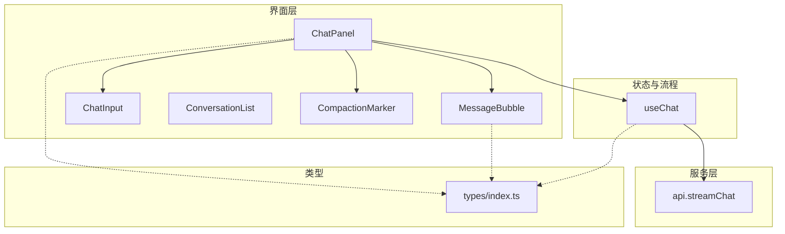
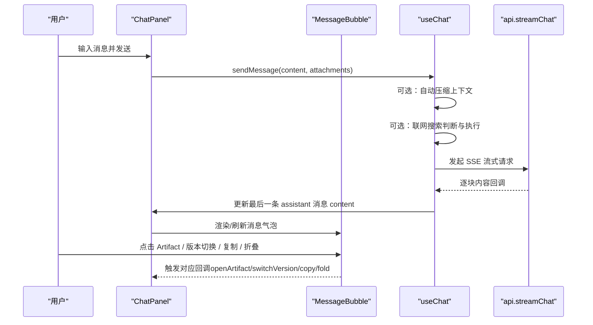
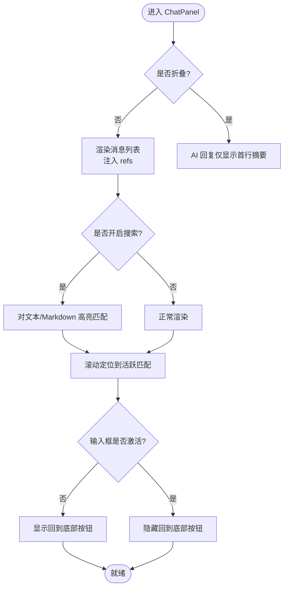
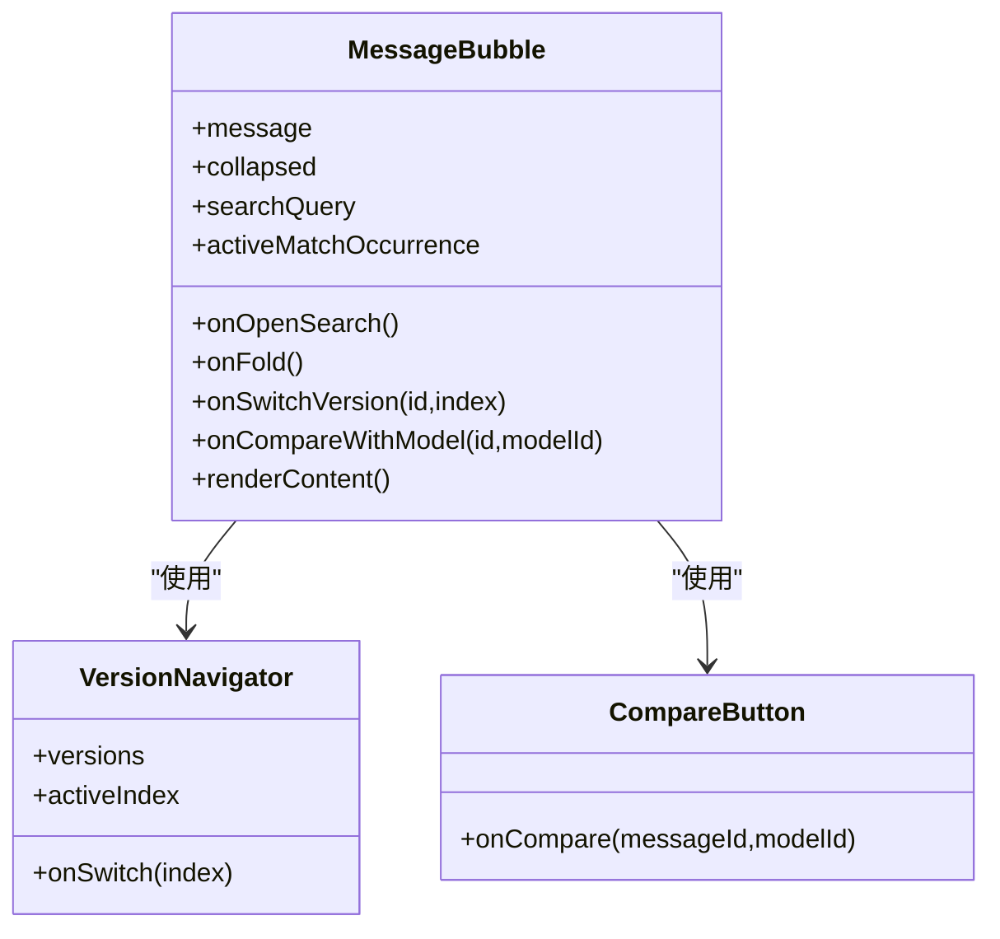
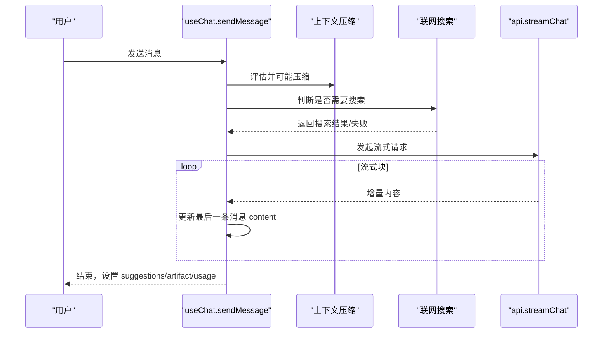
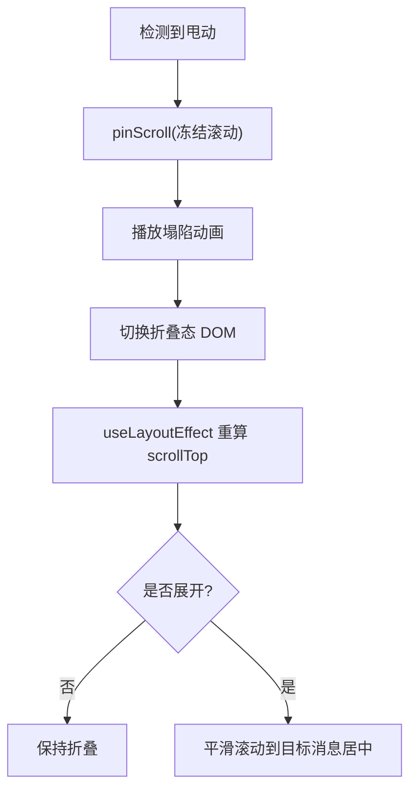
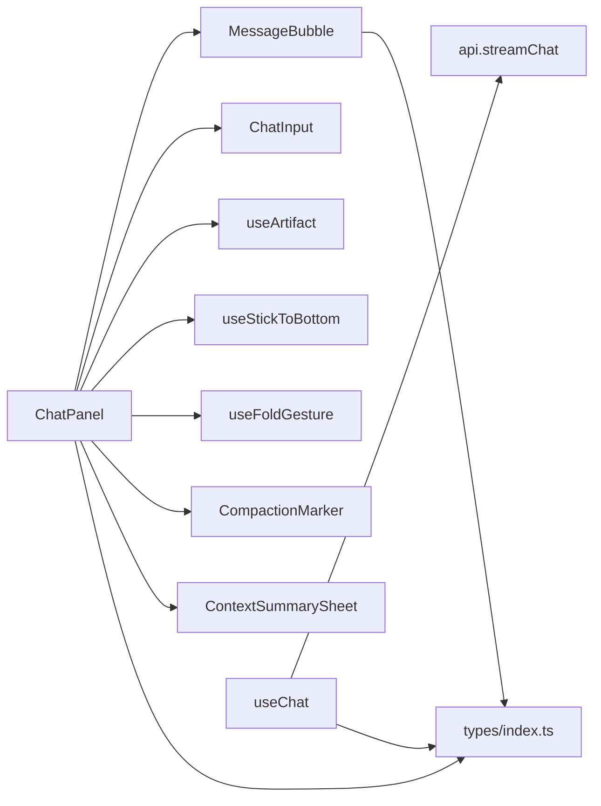

# 聊天主面板

<cite>
**本文引用的文件**
- [ChatPanel.tsx](file://src/components/chat/ChatPanel.tsx)
- [MessageBubble.tsx](file://src/components/chat/MessageBubble.tsx)
- [useChat.ts](file://src/hooks/useChat.ts)
- [api.ts](file://src/services/api.ts)
- [index.ts（类型定义）](file://src/types/index.ts)
- [ConversationList.tsx](file://src/components/chat/ConversationList.tsx)
- [ChatInput.tsx](file://src/components/chat/ChatInput.tsx)
- [CompactionMarker.tsx](file://src/components/chat/CompactionMarker.tsx)
</cite>

## 目录
1. [简介](#简介)
2. [项目结构](#项目结构)
3. [核心组件与职责](#核心组件与职责)
4. [架构总览](#架构总览)
5. [详细组件分析](#详细组件分析)
6. [依赖关系分析](#依赖关系分析)
7. [性能考量](#性能考量)
8. [故障排查指南](#故障排查指南)
9. [结论](#结论)
10. [附录：Props 接口与事件契约](#附录props-接口与事件契约)

## 简介
本文件为 ChatPanel 主面板组件的权威技术文档，聚焦聊天界面的核心能力：消息列表渲染、流式响应处理、折叠浏览模式、对话内搜索、滚动与吸底行为、手势操作（甩动折叠）、Artifact 面板集成、上下文摘要查看与编辑、版本切换等高级功能。文档同时覆盖 Props 接口、事件机制、性能优化策略以及自定义扩展指南和常见问题解决方案。

## 项目结构
围绕聊天主面板的相关代码主要分布在以下位置：
- 组件层：ChatPanel、MessageBubble、ChatInput、ConversationList、CompactionMarker
- 状态与流程：useChat Hook（消息发送、流式更新、压缩、联网搜索、标题生成等）
- 服务层：api.ts（SSE 流式请求、用量解析）
- 类型定义：types/index.ts（Message、MessageVersion、ContextSegment、ArtifactBlock 等）

图表来源
- [ChatPanel.tsx:1-623](file://src/components/chat/ChatPanel.tsx#L1-L623)
- [MessageBubble.tsx:1-800](file://src/components/chat/MessageBubble.tsx#L1-L800)
- [useChat.ts:1-800](file://src/hooks/useChat.ts#L1-L800)
- [api.ts:1-173](file://src/services/api.ts#L1-L173)
- [index.ts（类型定义）:1-252](file://src/types/index.ts#L1-L252)

章节来源
- [ChatPanel.tsx:1-623](file://src/components/chat/ChatPanel.tsx#L1-L623)
- [MessageBubble.tsx:1-800](file://src/components/chat/MessageBubble.tsx#L1-L800)
- [useChat.ts:1-800](file://src/hooks/useChat.ts#L1-L800)
- [api.ts:1-173](file://src/services/api.ts#L1-L173)
- [index.ts（类型定义）:1-252](file://src/types/index.ts#L1-L252)

## 核心组件与职责
- ChatPanel：主面板容器，负责消息列表渲染、折叠浏览模式、对话内搜索、滚动与吸底、手势折叠、Artifact 面板集成、上下文摘要查看、版本切换入口等。
- MessageBubble：单条消息气泡，支持 Markdown/公式/代码高亮、引用链接跳转、复制、长按菜单、折叠态展示、搜索高亮、多版本导航、比较按钮等。
- useChat：会话级状态与流程编排，包括启动恢复、持久化、自动压缩、联网搜索判断与执行、流式响应处理、Artifact 流式预览、停止生成、错误处理等。
- api.ts：SSE 流式请求封装，包含用量解析、失败重试、usage 提取回调。
- 其他：ChatInput（输入与附件）、ConversationList（会话列表）、CompactionMarker（压缩区间标记）。

章节来源
- [ChatPanel.tsx:18-47](file://src/components/chat/ChatPanel.tsx#L18-L47)
- [MessageBubble.tsx:303-325](file://src/components/chat/MessageBubble.tsx#L303-L325)
- [useChat.ts:152-179](file://src/hooks/useChat.ts#L152-L179)
- [api.ts:44-173](file://src/services/api.ts#L44-L173)

## 架构总览
聊天主面板采用“容器 + 子组件 + Hook”的分层设计：
- ChatPanel 作为容器管理 UI 状态（折叠、搜索、滚动锚点、Artifact 面板开关），并协调子组件交互。
- MessageBubble 专注消息渲染与局部交互（复制、菜单、折叠、版本切换）。
- useChat 集中处理业务流（发送、流式更新、压缩、搜索、用量、持久化）。
- api.ts 提供底层流式通信能力。

图表来源
- [useChat.ts:494-783](file://src/hooks/useChat.ts#L494-L783)
- [api.ts:44-173](file://src/services/api.ts#L44-L173)
- [ChatPanel.tsx:497-558](file://src/components/chat/ChatPanel.tsx#L497-L558)
- [MessageBubble.tsx:538-644](file://src/components/chat/MessageBubble.tsx#L538-L644)

## 详细组件分析

### ChatPanel：主面板容器
- 消息列表渲染
  - 遍历 messages，按角色与模型信息渲染 MessageBubble；在 AI 回复末尾追加 CompactionMarker（当存在压缩区间时）。
  - 通过 messageRefs 维护每条消息 DOM 引用，用于定位与滚动。
- 流式响应处理
  - 由 useChat 驱动，ChatPanel 仅消费 state 变化；当 streamingArtifact 出现时，打开 Artifact 面板并持续更新代码；结束时完成流式到静态版本的过渡。
- 折叠浏览模式
  - 使用 useFoldGesture 监听快速甩动，触发 startCollapse；进入折叠态后 AI 回复仅显示首行摘要，点击可展开。
  - 折叠/展开过程通过 pinScroll + useLayoutEffect 精确控制滚动锚点，避免惯性滚动导致的空白或跳变。
- 对话内搜索
  - 顶部搜索栏支持关键词匹配与高亮；命中项计数与跳转；Esc 关闭；Enter 下一个匹配。
  - 高亮逻辑在 MessageBubble 中实现，对纯文本与 Markdown 分别处理。
- 滚动管理与吸底行为
  - 使用 useStickToBottom 管理容器滚动；输入激活时隐藏“回到底部”按钮；新消息到达或切换会话时自动滚到底部。
- Artifact 面板集成
  - 通过 useArtifact Hook 管理全屏 Artifact 面板；支持流式代码更新与完成后自动预览；支持收藏切换。
- 上下文摘要查看
  - 基于 ContextSummarySheet 与 CompactionMarker 打开/编辑压缩区间摘要；支持外部 toast 打开指定 segment。
- 版本切换与比较
  - 将 onSwitchVersion、onCompareWithModel 透传给 MessageBubble，支持同一消息的多版本对比与切换。

图表来源
- [ChatPanel.tsx:113-174](file://src/components/chat/ChatPanel.tsx#L113-L174)
- [ChatPanel.tsx:192-205](file://src/components/chat/ChatPanel.tsx#L192-L205)
- [ChatPanel.tsx:230-353](file://src/components/chat/ChatPanel.tsx#L230-L353)
- [ChatPanel.tsx:434-596](file://src/components/chat/ChatPanel.tsx#L434-L596)

章节来源
- [ChatPanel.tsx:18-47](file://src/components/chat/ChatPanel.tsx#L18-L47)
- [ChatPanel.tsx:71-111](file://src/components/chat/ChatPanel.tsx#L71-L111)
- [ChatPanel.tsx:113-174](file://src/components/chat/ChatPanel.tsx#L113-L174)
- [ChatPanel.tsx:178-205](file://src/components/chat/ChatPanel.tsx#L178-L205)
- [ChatPanel.tsx:207-353](file://src/components/chat/ChatPanel.tsx#L207-L353)
- [ChatPanel.tsx:357-422](file://src/components/chat/ChatPanel.tsx#L357-L422)
- [ChatPanel.tsx:434-622](file://src/components/chat/ChatPanel.tsx#L434-L622)

### MessageBubble：消息气泡
- 渲染分支
  - 用户消息：右侧气泡，支持附件展示、长按复制。
  - AI 消息：左侧无背景样式，支持 Markdown、数学公式、代码高亮、引用链接跳转、流式光标。
- 折叠态
  - collapsed=true 且非流式时，仅显示首行摘要与展开箭头。
- 搜索高亮
  - 纯文本分支直接包裹 mark；Markdown 分支在渲染后用 TreeWalker 遍历文本节点插入 mark，跳过 code/pre。
- 长按菜单
  - 支持复制、查找、折叠回复等；菜单弹出时锁定背景滚动，自适应视口边界与键盘高度。
- 版本导航与比较
  - 多版本消息通过 VersionNavigator 切换；CompareButton 支持同消息不同模型回答对比。
- 附件与图片
  - 用户消息附件以卡片形式展示；图片走 MessageImage 组件，按需加载与释放。

图表来源
- [MessageBubble.tsx:303-325](file://src/components/chat/MessageBubble.tsx#L303-L325)
- [MessageBubble.tsx:493-507](file://src/components/chat/MessageBubble.tsx#L493-L507)
- [MessageBubble.tsx:538-644](file://src/components/chat/MessageBubble.tsx#L538-L644)
- [MessageBubble.tsx:731-751](file://src/components/chat/MessageBubble.tsx#L731-L751)

章节来源
- [MessageBubble.tsx:1-800](file://src/components/chat/MessageBubble.tsx#L1-L800)

### useChat：会话流程编排
- 启动与恢复
  - 读取会话列表，优先恢复上次停留的会话；若无效则复用空会话或新建；补齐缺失标题。
- 自动压缩
  - 发送前评估上下文水位，必要时压缩冷区间，生成 ContextSegment 并标记被压缩的消息。
- 联网搜索
  - 根据问题内容判断是否需要联网；搜索成功后将结果注入上下文；失败时标记 webSearchFailed。
- 流式响应
  - 使用 streamChat 迭代获取增量内容；实时更新最后一条 assistant 消息；检测 artifact 流式片段并推送给 ChatPanel。
- 停止生成
  - 中止请求，更新消息状态为已停止，保留已有内容或清空。
- 用量与持久化
  - 从响应中提取真实用量；diff 持久化会话变更；页面隐藏时强制落盘挂起写入。

图表来源
- [useChat.ts:494-783](file://src/hooks/useChat.ts#L494-L783)
- [api.ts:44-173](file://src/services/api.ts#L44-L173)

章节来源
- [useChat.ts:152-179](file://src/hooks/useChat.ts#L152-L179)
- [useChat.ts:398-492](file://src/hooks/useChat.ts#L398-L492)
- [useChat.ts:494-783](file://src/hooks/useChat.ts#L494-L783)

### 滚动与手势：折叠与吸底
- 折叠手势
  - 连续快速甩动触发 startCollapse；动画期间冻结滚动，随后切换 DOM 并重新计算 scrollTop。
- 滚动锚点
  - 捕获离视口顶部最近的用户消息作为锚点；展开时先原地落位再平滑滚动到目标消息居中。
- 吸底行为
  - 输入激活时隐藏“回到底部”按钮；新消息到达或切换会话时自动滚到底部；距底部超过一屏时显示回到底部按钮。

图表来源
- [ChatPanel.tsx:207-353](file://src/components/chat/ChatPanel.tsx#L207-L353)

章节来源
- [ChatPanel.tsx:207-353](file://src/components/chat/ChatPanel.tsx#L207-L353)

### Artifact 面板集成
- 流式预览
  - streamingArtifact 首次出现时创建临时 Artifact 并打开面板；后续每块更新代码；结束时切换到完整版本并自动预览。
- 收藏与全屏
  - 支持 isFavorite 与 onToggleFavorite；面板固定全屏 z-index，覆盖应用层级。

章节来源
- [ChatPanel.tsx:357-406](file://src/components/chat/ChatPanel.tsx#L357-L406)
- [ChatPanel.tsx:598-609](file://src/components/chat/ChatPanel.tsx#L598-L609)

### 上下文摘要查看与编辑
- 压缩区间标记
  - CompactionMarker 显示压缩条数与节省 tokens；点击打开 ContextSummarySheet。
- 摘要编辑
  - 支持外部 openSegmentIdRequest 打开指定 segment；保存时调用 onUpdateSegment 更新摘要与 token 估算。

章节来源
- [CompactionMarker.tsx:1-40](file://src/components/chat/CompactionMarker.tsx#L1-L40)
- [ChatPanel.tsx:178-189](file://src/components/chat/ChatPanel.tsx#L178-L189)
- [ChatPanel.tsx:611-619](file://src/components/chat/ChatPanel.tsx#L611-L619)

## 依赖关系分析
- ChatPanel 依赖：
  - MessageBubble（消息渲染）
  - ChatInput（输入与附件）
  - useArtifact（Artifact 面板状态）
  - useStickToBottom（滚动与吸底）
  - useFoldGesture（手势折叠）
  - CompactionMarker、ContextSummarySheet（上下文摘要）
- useChat 依赖：
  - api.streamChat（流式请求）
  - 存储与服务（conversationStore、settingsService、webSearch、titleGenerator 等）
- 类型依赖：
  - types/index.ts 中的 Message、MessageVersion、ContextSegment、ArtifactBlock、ChatFeatureSettings 等贯穿各层。

图表来源
- [ChatPanel.tsx:1-17](file://src/components/chat/ChatPanel.tsx#L1-L17)
- [useChat.ts:1-42](file://src/hooks/useChat.ts#L1-L42)
- [api.ts:1-10](file://src/services/api.ts#L1-L10)
- [index.ts（类型定义）:1-107](file://src/types/index.ts#L1-L107)

章节来源
- [ChatPanel.tsx:1-17](file://src/components/chat/ChatPanel.tsx#L1-L17)
- [useChat.ts:1-42](file://src/hooks/useChat.ts#L1-L42)
- [api.ts:1-10](file://src/services/api.ts#L1-L10)
- [index.ts（类型定义）:1-107](file://src/types/index.ts#L1-L107)

## 性能考量
- 流式渲染
  - 增量更新最后一条 assistant 消息，避免全量重渲染；Markdown 渲染后通过 DOM 后处理插入高亮，减少 React 树开销。
- 滚动优化
  - 使用 requestAnimationFrame 钉住滚动位置，抑制惯性滚动干扰；useLayoutEffect 在绘制前落位，避免闪烁。
- 压缩与上下文
  - 发送前评估水位，必要时压缩冷区间，降低提示词长度与成本；真实用量来自网关响应，更准确。
- 图片与附件
  - 图片以 blob URL 按需加载并在卸载时释放；发送前将 IndexedDB 引用转为 data URL，避免提前占用内存。
- 持久化
  - diff 会话变更定向写入；页面隐藏时强制落盘，防止移动端切后台丢失长回复。

[本节为通用性能建议，不直接分析具体文件]

## 故障排查指南
- 流式输出卡顿
  - 检查 useStickToBottom 是否启用；确认 ResizeObserver 与 rAF 未被阻塞；避免在高频回调中进行昂贵计算。
- 折叠后滚动异常
  - 确认 foldAnchorRef 正确捕获锚点；检查 pinScroll 是否在动画期间运行；确保 useLayoutEffect 在切换后立即重算 scrollTop。
- 搜索高亮不生效
  - 确认 searchQuery 非空；Markdown 分支需等待渲染完成后再执行 highlightTextNodes；code/pre 节点会被跳过。
- Artifact 面板未打开
  - 检查 streamingArtifact 是否为 null；确认 useArtifact 的 startStreamingArtifact/updateStreamingArtifact/finishStreamingArtifact 调用顺序。
- 联网搜索失败
  - 关注 webSearchFailed 标志；检查 judgeSearchNeed 的判断逻辑与 searchWeb 返回值；必要时降级为不使用搜索。

章节来源
- [ChatPanel.tsx:207-353](file://src/components/chat/ChatPanel.tsx#L207-L353)
- [MessageBubble.tsx:256-300](file://src/components/chat/MessageBubble.tsx#L256-L300)
- [useChat.ts:621-676](file://src/hooks/useChat.ts#L621-L676)
- [api.ts:102-118](file://src/services/api.ts#L102-L118)

## 结论
ChatPanel 通过清晰的职责划分与稳健的状态管理，实现了流畅的聊天体验：消息列表高效渲染、流式响应实时呈现、折叠浏览提升可读性、对话内搜索增强检索能力、滚动与手势交互自然顺滑、Artifact 面板无缝集成、上下文摘要可编辑可控。配合 useChat 的流程编排与 api.ts 的流式通信，整体架构具备良好的可扩展性与可维护性。

[本节为总结性内容，不直接分析具体文件]

## 附录：Props 接口与事件契约

### ChatPanel Props
- messages: Message[] — 当前会话消息列表
- isLoading: boolean — 是否正在生成
- sendMessage: (content, attachments?) => void — 发送消息
- stopGeneration: () => void — 停止生成
- conversationTitle?: string — 会话标题
- conversation?: Conversation — 当前会话对象
- onNewConversation?: () => void — 新建会话
- streamingArtifact?: { title; code } | null — 流式 Artifact 数据
- regenerateMessage?: (messageId: string) => void — 重新生成某条消息
- featureSettings: ChatFeatureSettings — 功能开关（artifactEnabled、autoCompactEnabled）
- onFeatureSettingsChange: (settings) => void — 功能设置变更回调
- compareWithModel?: (messageId: string, modelId: string) => void — 多模型比较
- switchVersion?: (messageId: string, index: number) => void — 版本切换
- webSearchEnabled?: boolean — 是否允许联网搜索
- onWebSearchEnabledChange?: (enabled: boolean) => void — 联网搜索开关变更
- isFavorite?: boolean — 是否收藏
- onToggleFavorite?: (thumbnail?: string) => void — 收藏切换
- segments?: ContextSegment[] — 压缩区间列表
- onUpdateSegment?: (segmentId: string, summary: ContextSummary) => void — 更新摘要
- openSegmentIdRequest?: string | null — 外部请求打开某段摘要
- onOpenSegmentIdRequestHandled?: () => void — 处理外部打开请求

章节来源
- [ChatPanel.tsx:18-47](file://src/components/chat/ChatPanel.tsx#L18-L47)

### MessageBubble Props
- message: Message — 消息对象
- showSuggestions?: boolean — 是否显示建议
- onSuggestionClick?: (text: string) => void — 建议点击
- modelName?: string — 模型名称
- modelProvider?: string — 模型提供商
- onOpenArtifact?: (artifact: ArtifactBlock) => void — 打开 Artifact
- onRegenerate?: (messageId: string) => void — 重新生成
- onQuote?: (message: Message) => void — 引用消息
- isStreaming?: boolean — 是否流式
- onCompareWithModel?: (messageId: string, modelId: string) => void — 比较模型
- onSwitchVersion?: (messageId: string, index: number) => void — 版本切换
- collapsed?: boolean — 折叠浏览模式
- onOpenSearch?: () => void — 打开搜索
- onFold?: () => void — 折叠回复
- searchQuery?: string — 搜索关键词
- activeMatchOccurrence?: number — 当前高亮命中序号

章节来源
- [MessageBubble.tsx:303-325](file://src/components/chat/MessageBubble.tsx#L303-L325)

### 类型定义要点
- Message：包含 role、content、timestamp、isStreaming、suggestions、webSearching/webSearched/webSearchFailed/searchResults、attachments、artifact、model、versions、activeVersionIndex、stoppedByUser、compressedInto、usage
- MessageVersion：单版本内容、模型、时间戳、流式状态、建议、搜索状态、Artifact、用量等
- ContextSegment：压缩区间元数据（from/to messageId、summary、tokensBefore/After、model、createdAt、userEdited）
- ArtifactBlock：id、type、title、description、code、createdAt
- ChatFeatureSettings：artifactEnabled、autoCompactEnabled

章节来源
- [index.ts（类型定义）:1-107](file://src/types/index.ts#L1-L107)