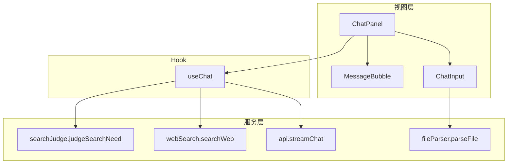
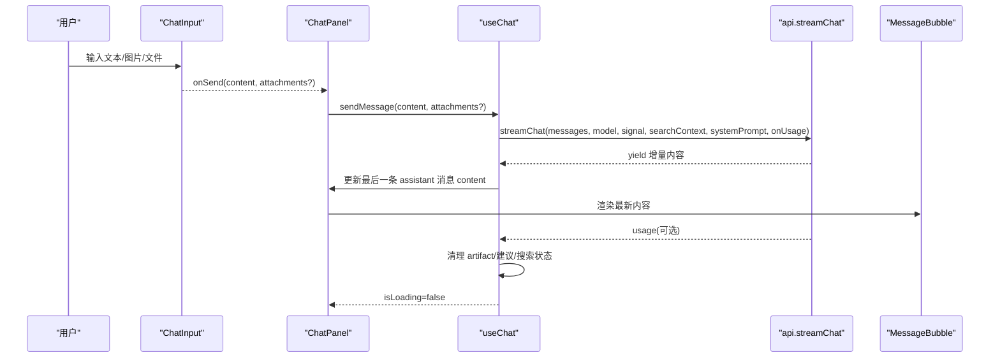
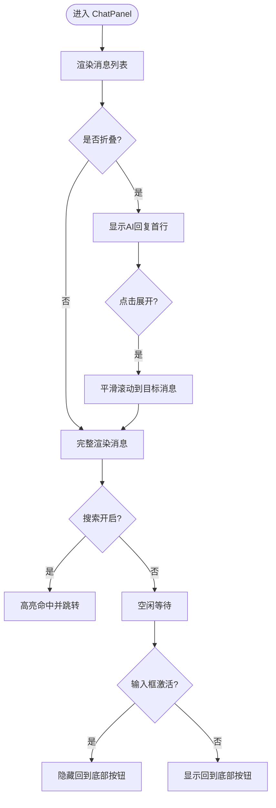
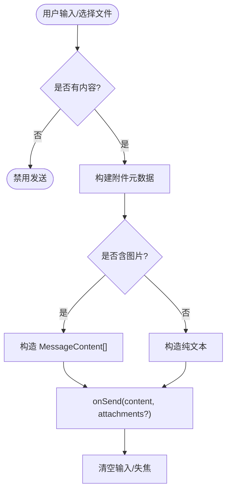
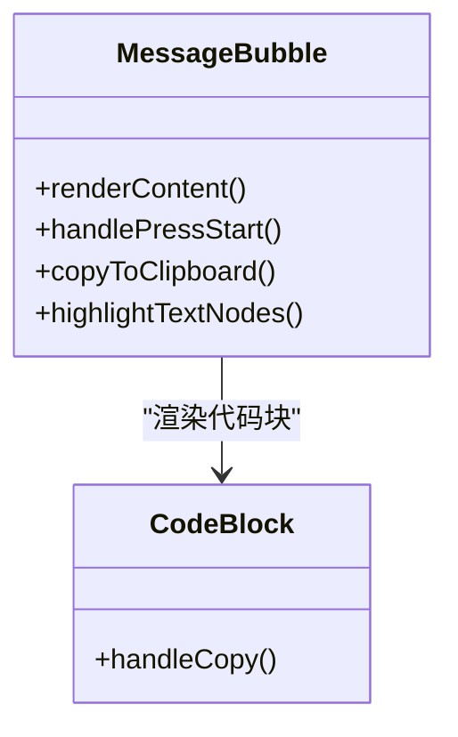
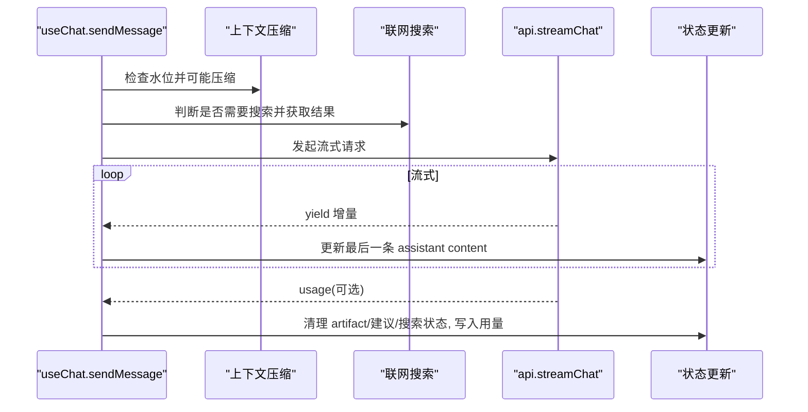
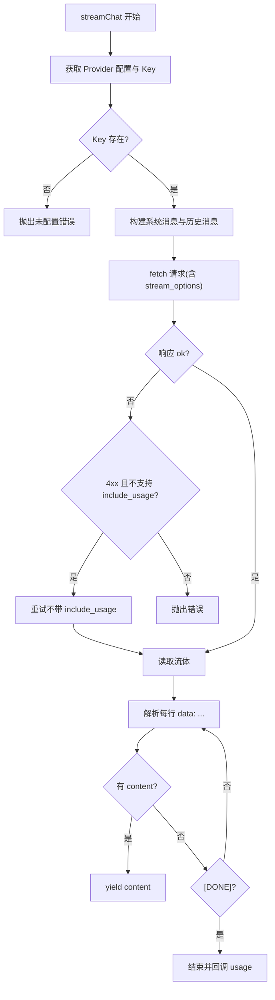
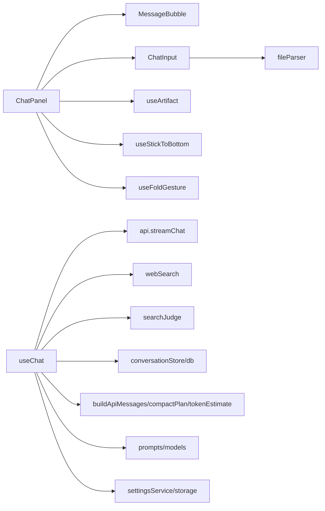

# 聊天模块

<cite>
**本文引用的文件**
- [ChatPanel.tsx](file://src/components/chat/ChatPanel.tsx)
- [ChatInput.tsx](file://src/components/chat/ChatInput.tsx)
- [MessageBubble.tsx](file://src/components/chat/MessageBubble.tsx)
- [useChat.ts](file://src/hooks/useChat.ts)
- [api.ts](file://src/services/api.ts)
- [index.ts（类型定义）](file://src/types/index.ts)
- [models.ts（模型配置）](file://src/config/models.ts)
</cite>

## 目录
1. [简介](#简介)
2. [项目结构](#项目结构)
3. [核心组件](#核心组件)
4. [架构总览](#架构总览)
5. [详细组件分析](#详细组件分析)
6. [依赖关系分析](#依赖关系分析)
7. [性能与体验优化](#性能与体验优化)
8. [故障排查指南](#故障排查指南)
9. [结论](#结论)
10. [附录：使用示例与扩展指南](#附录使用示例与扩展指南)

## 简介
本章节面向 AIShop 的聊天模块，围绕以下目标展开：
- ChatPanel 主面板：消息显示、会话管理、流式响应处理、折叠浏览模式、对话内搜索、上下文压缩标记等。
- ChatInput 输入组件：多模态输入（文本、图片粘贴/拖拽上传、文件解析与附件）、联网搜索开关、引用回复。
- MessageBubble 消息气泡：Markdown/代码高亮、数学公式渲染、链接与引用跳转、复制、长按菜单、折叠预览、版本导航与对比。
- useChat Hook：状态管理（会话、消息、错误、加载、流式片段、功能开关）、网络请求与取消、上下文压缩、联网搜索、Token 用量统计、持久化。
- API 服务层：流式调用、错误重试、用量解析、Blob 图片内联。
- 使用示例与自定义扩展：如何接入新模型、新增能力、替换 UI 行为。

## 项目结构
聊天模块由“视图层 + Hook + 服务层”构成：
- 视图层：ChatPanel、ChatInput、MessageBubble 负责渲染与交互。
- Hook：useChat 集中管理会话、消息、网络请求、压缩、搜索、持久化等。
- 服务层：api.ts 提供流式聊天接口；其他服务支撑文件解析、搜索、设置等。

图表来源
- [ChatPanel.tsx:1-623](file://src/components/chat/ChatPanel.tsx#L1-L623)
- [ChatInput.tsx:1-467](file://src/components/chat/ChatInput.tsx#L1-L467)
- [MessageBubble.tsx:1-800](file://src/components/chat/MessageBubble.tsx#L1-L800)
- [useChat.ts:1-800](file://src/hooks/useChat.ts#L1-L800)
- [api.ts:1-173](file://src/services/api.ts#L1-L173)

章节来源
- [ChatPanel.tsx:1-623](file://src/components/chat/ChatPanel.tsx#L1-L623)
- [ChatInput.tsx:1-467](file://src/components/chat/ChatInput.tsx#L1-L467)
- [MessageBubble.tsx:1-800](file://src/components/chat/MessageBubble.tsx#L1-L800)
- [useChat.ts:1-800](file://src/hooks/useChat.ts#L1-L800)
- [api.ts:1-173](file://src/services/api.ts#L1-L173)

## 核心组件
- ChatPanel：承载消息列表、滚动定位、折叠浏览、对话内搜索、上下文摘要面板、Artifact 流式预览、发送入口。
- ChatInput：文本输入、图片粘贴/拖拽、文件解析、引用消息、联网搜索开关、发送/停止按钮。
- MessageBubble：用户/AI 消息渲染、Markdown/代码高亮、数学公式、链接打开、复制、长按菜单、折叠预览、版本导航与对比。
- useChat：会话初始化、消息追加、流式更新、上下文压缩、联网搜索、错误处理、Token 用量、持久化。
- api.ts：流式 SSE 读取、用量解析、失败重试、图片 Blob 内联。

章节来源
- [ChatPanel.tsx:1-623](file://src/components/chat/ChatPanel.tsx#L1-L623)
- [ChatInput.tsx:1-467](file://src/components/chat/ChatInput.tsx#L1-L467)
- [MessageBubble.tsx:1-800](file://src/components/chat/MessageBubble.tsx#L1-L800)
- [useChat.ts:1-800](file://src/hooks/useChat.ts#L1-L800)
- [api.ts:1-173](file://src/services/api.ts#L1-L173)

## 架构总览
聊天模块采用“组件驱动 + Hook 状态 + 服务解耦”的分层架构：
- 组件只关注 UI 与交互，通过 props 暴露回调（如 sendMessage、stopGeneration）。
- useChat 封装业务逻辑，维护会话与消息状态，协调网络与服务。
- api.ts 统一封装流式请求、错误处理与用量解析，屏蔽底层差异。

图表来源
- [ChatInput.tsx:70-118](file://src/components/chat/ChatInput.tsx#L70-L118)
- [ChatPanel.tsx:483-595](file://src/components/chat/ChatPanel.tsx#L483-L595)
- [useChat.ts:494-783](file://src/hooks/useChat.ts#L494-L783)
- [api.ts:44-173](file://src/services/api.ts#L44-L173)
- [MessageBubble.tsx:538-644](file://src/components/chat/MessageBubble.tsx#L538-L644)

## 详细组件分析

### ChatPanel 主面板
职责与特性
- 消息列表渲染：遍历 messages，计算当前模型信息，渲染 MessageBubble。
- 滚动与吸底：基于 useStickToBottom，自动追底、回到底部按钮、输入激活时隐藏。
- 折叠浏览模式：快速甩动触发折叠，仅显示 AI 回复首行；点击展开并平滑定位到目标消息。
- 对话内搜索：按关键词匹配所有消息，支持高亮与跳转。
- 上下文压缩区间：在压缩区间的末尾插入 CompactionMarker，可打开 ContextSummarySheet 查看/编辑摘要。
- Artifact 流式预览：检测流式 artifact，打开全屏预览并实时更新代码，结束时切换为预览模式。
- 引用回复：支持对某条助手消息进行引用后发送。

关键流程
- 发送消息：关闭搜索，调用 sendMessage。
- 流式更新：useStickToBottom 监听内容变化自动滚动；折叠态下保持锚点位置。
- 折叠/展开：冻结滚动播放塌陷动画，DOM 切换后按锚点落位，必要时平滑滚动到目标。

图表来源
- [ChatPanel.tsx:113-176](file://src/components/chat/ChatPanel.tsx#L113-L176)
- [ChatPanel.tsx:230-353](file://src/components/chat/ChatPanel.tsx#L230-L353)
- [ChatPanel.tsx:478-595](file://src/components/chat/ChatPanel.tsx#L478-L595)

章节来源
- [ChatPanel.tsx:1-623](file://src/components/chat/ChatPanel.tsx#L1-L623)

### ChatInput 输入组件
多模态支持
- 文本输入：自适应高度，支持粘贴图片。
- 图片上传：拖拽或选择文件，支持常见图片格式，限制大小与数量。
- 文件处理：非图片文件通过 parseFile 解析为文本内容，作为附件元数据传递。
- 引用回复：展示被引用消息摘要，发送时自动拼接引用块。
- 联网搜索：开关控制，影响后续发送时的搜索策略。

发送逻辑
- 构建 attachments 元数据（名称、大小、文本内容、是否截断）。
- 若包含图片，则构造 MessageContent[]（text + image_url），否则发送纯文本。
- 发送后立即清空输入并失焦。

图表来源
- [ChatInput.tsx:70-118](file://src/components/chat/ChatInput.tsx#L70-L118)
- [ChatInput.tsx:154-185](file://src/components/chat/ChatInput.tsx#L154-L185)
- [ChatInput.tsx:207-228](file://src/components/chat/ChatInput.tsx#L207-L228)

章节来源
- [ChatInput.tsx:1-467](file://src/components/chat/ChatInput.tsx#L1-L467)

### MessageBubble 消息气泡
渲染逻辑
- 用户消息：右对齐气泡，支持附件展示与长按复制。
- AI 消息：Markdown 渲染（GFM、数学公式）、代码块语法高亮、链接在新窗口打开、引用标识跳转。
- 流式状态：空内容时显示加载指示器；流式结束清除占位。
- 折叠模式：仅显示首行，点击展开。
- 版本导航：同一消息的多模型版本切换与对比。

交互行为
- 复制：多方案兼容剪贴板 API，失败降级。
- 长按菜单：根据手指坐标自适应弹出位置，锁定背景滚动。
- 搜索高亮：对文本分支与 Markdown 分支分别实现高亮与跳转。

图表来源
- [MessageBubble.tsx:139-198](file://src/components/chat/MessageBubble.tsx#L139-L198)
- [MessageBubble.tsx:218-300](file://src/components/chat/MessageBubble.tsx#L218-L300)
- [MessageBubble.tsx:327-800](file://src/components/chat/MessageBubble.tsx#L327-L800)

章节来源
- [MessageBubble.tsx:1-800](file://src/components/chat/MessageBubble.tsx#L1-L800)

### useChat Hook 状态管理
状态与职责
- 会话与消息：启动时恢复上次会话或新建；追加用户与助手消息；流式更新助手内容。
- 功能开关：artifact 启用、自动压缩启用；持久化至 localStorage。
- 上下文压缩：根据阈值与热窗口计划压缩，生成 segment 并标记压缩区间。
- 联网搜索：判断是否需要搜索，获取结果并注入上下文，更新消息状态。
- 流式处理：迭代流式 chunk，实时渲染；检测 artifact 流式片段；结束后清理并解析建议。
- 错误处理：AbortError 处理取消；其他错误提示并标记失败。
- Token 用量：从响应中解析真实用量，存储于消息。

关键流程
- 发送前水位检查：超过阈值且可压缩则执行压缩。
- 构建 API 消息：合并文件上下文、压缩段标记、搜索上下文。
- 流式循环：逐字更新 content，检测 artifact，记录 usage。
- 结束处理：去除 artifact 标记、清理反引号、解析 suggestions、写入搜索状态与用量。

图表来源
- [useChat.ts:494-783](file://src/hooks/useChat.ts#L494-L783)
- [api.ts:44-173](file://src/services/api.ts#L44-L173)

章节来源
- [useChat.ts:1-800](file://src/hooks/useChat.ts#L1-L800)

### API 服务层
能力与策略
- 流式读取：SSE 分块读取，解析 choices.delta.content 增量。
- 用量解析：兼容不同网关字段，提取 prompt/completion/total/cached/cacheWrite tokens。
- 错误重试：当 include_usage 不被支持时，去掉参数重试一次。
- 图片内联：将 IndexedDB 中的 aishop-blob 引用转换为 data URL 再发送。

错误处理
- 非 2xx 响应：抛出带状态码与响应的错误。
- 流体为空：抛出 No response body。
- 解析失败：跳过残缺 JSON 继续消费。

图表来源
- [api.ts:44-173](file://src/services/api.ts#L44-L173)

章节来源
- [api.ts:1-173](file://src/services/api.ts#L1-L173)

## 依赖关系分析
- ChatPanel 依赖：
  - MessageBubble、ChatInput：渲染消息与输入。
  - useArtifact：Artifact 流式预览。
  - useStickToBottom：滚动与吸底。
  - useFoldGesture：折叠手势。
  - 类型与配置：Conversation、Message、CHAT_MODELS。
- ChatInput 依赖：
  - fileParser.parseFile：文件解析。
  - 类型：MessageContent、FileAttachment、ChatFeatureSettings。
- MessageBubble 依赖：
  - react-markdown、remark-gfm、remark-math、rehype-katex：Markdown/数学公式。
  - highlight.js：代码高亮。
  - utils/messageText：提取纯文本用于复制与搜索。
- useChat 依赖：
  - services/api：流式聊天。
  - services/webSearch、services/searchJudge：联网搜索。
  - services/conversationStore、db：会话与消息持久化。
  - utils/buildApiMessages、compactPlan、tokenEstimate：上下文构建与压缩。
  - config/prompts、config/models：系统提示与模型配置。
  - services/settingsService、storage：设置与本地存储。

图表来源
- [ChatPanel.tsx:1-623](file://src/components/chat/ChatPanel.tsx#L1-L623)
- [ChatInput.tsx:1-467](file://src/components/chat/ChatInput.tsx#L1-L467)
- [useChat.ts:1-800](file://src/hooks/useChat.ts#L1-L800)
- [api.ts:1-173](file://src/services/api.ts#L1-L173)

章节来源
- [ChatPanel.tsx:1-623](file://src/components/chat/ChatPanel.tsx#L1-L623)
- [ChatInput.tsx:1-467](file://src/components/chat/ChatInput.tsx#L1-L467)
- [useChat.ts:1-800](file://src/hooks/useChat.ts#L1-L800)
- [api.ts:1-173](file://src/services/api.ts#L1-L173)

## 性能与体验优化
- 滚动与布局：
  - 折叠/展开时使用 requestAnimationFrame 钉住滚动位置，避免惯性滚动导致的空白闪烁。
  - 使用 useLayoutEffect 在绘制前落位，减少视觉抖动。
- 流式渲染：
  - 增量更新最后一条消息 content，避免全量重渲染。
  - 流式 artifact 检测与更新，提升长内容预览体验。
- 搜索与高亮：
  - 对文本分支直接构建节点；对 Markdown 分支使用 TreeWalker 后处理，避免破坏代码高亮。
- 网络与错误：
  - include_usage 不被支持时自动重试，保证可用性。
  - 解析失败跳过残缺 JSON，提高鲁棒性。
- 持久化：
  - diff 变更定向写入，避免全量写盘导致卡顿。
  - 切后台/关页面前 flush 挂起写入，防止数据丢失。

[本节为通用指导，不直接分析具体文件]

## 故障排查指南
常见问题与定位
- 无法发送消息：
  - 检查 ChatInput 的 hasContent 条件（文本/图片/文件/引用是否为空）。
  - 确认 sendMessage 未被 isLoading 阻止。
- 流式无响应：
  - 检查 api.ts 的 fetch 与 reader 是否正常；确认 provider 配置与 API Key。
  - 若返回 4xx 且提示不支持 include_usage，会自动重试；否则抛错。
- 图片不显示：
  - 确保 IndexedDB 中的 aishop-blob 引用已转换为 data URL（api.ts 中 inlineBlobsForApi）。
- 搜索高亮异常：
  - 检查 Markdown 分支的 TreeWalker 是否跳过了 code/pre 内部。
- 折叠模式错位：
  - 确认 useLayoutEffect 中 anchorTop 计算与 pinScroll 是否正确释放。

章节来源
- [ChatInput.tsx:70-118](file://src/components/chat/ChatInput.tsx#L70-L118)
- [api.ts:102-118](file://src/services/api.ts#L102-L118)
- [MessageBubble.tsx:256-300](file://src/components/chat/MessageBubble.tsx#L256-L300)
- [ChatPanel.tsx:230-353](file://src/components/chat/ChatPanel.tsx#L230-L353)

## 结论
AIShop 聊天模块以清晰的层次与职责划分实现了完整的聊天体验：
- ChatPanel 提供强大的消息管理与交互能力（折叠、搜索、上下文压缩、Artifact 预览）。
- ChatInput 支持多模态输入与便捷的文件处理。
- MessageBubble 具备丰富的渲染与交互（Markdown、代码高亮、数学公式、复制、长按菜单、版本导航）。
- useChat 统一管理状态、网络、压缩、搜索与持久化，保障稳定与可扩展。
- api.ts 提供健壮的流式调用与错误处理策略。

该设计便于扩展新模型、新能力与自定义 UI 行为，同时兼顾性能与用户体验。

[本节为总结，不直接分析具体文件]

## 附录：使用示例与扩展指南

### 基本使用示例
- 在父组件中引入 useChat，获取 sendMessage、stopGeneration、messages、isLoading 等状态。
- 将 sendMessage 与 stopGeneration 传入 ChatPanel，用于发送消息与停止生成。
- 将 featureSettings 与 onFeatureSettingsChange 传入 ChatPanel，控制 artifact 与自动压缩。
- 将 webSearchEnabled 与 onWebSearchEnabledChange 传入 ChatInput，控制联网搜索。

参考路径
- [useChat.ts:152-179](file://src/hooks/useChat.ts#L152-L179)
- [ChatPanel.tsx:18-70](file://src/components/chat/ChatPanel.tsx#L18-L70)
- [ChatInput.tsx:6-19](file://src/components/chat/ChatInput.tsx#L6-L19)

### 自定义扩展指南
- 新增模型：
  - 在 models.ts 中添加 Model 配置（id、name、provider、capabilities、price）。
  - 在 CHAT_MODELS 中注册，供界面选择。
  - 参考路径：[models.ts:3-235](file://src/config/models.ts#L3-L235)
- 新增能力（如视频/音频）：
  - 扩展 MessageContent 类型（types/index.ts）。
  - 在 ChatInput 中增加对应上传与解析逻辑。
  - 在 MessageBubble 中增加渲染与交互。
  - 参考路径：[index.ts:53-65](file://src/types/index.ts#L53-L65)、[ChatInput.tsx:154-185](file://src/components/chat/ChatInput.tsx#L154-L185)、[MessageBubble.tsx:615-644](file://src/components/chat/MessageBubble.tsx#L615-L644)
- 替换 UI 行为：
  - 通过 props 回调（如 onSuggestionClick、onCompareWithModel、onSwitchVersion）定制交互。
  - 参考路径：[ChatPanel.tsx:532-549](file://src/components/chat/ChatPanel.tsx#L532-L549)、[MessageBubble.tsx:793-800](file://src/components/chat/MessageBubble.tsx#L793-L800)

章节来源
- [models.ts:3-235](file://src/config/models.ts#L3-L235)
- [index.ts:53-65](file://src/types/index.ts#L53-L65)
- [ChatInput.tsx:154-185](file://src/components/chat/ChatInput.tsx#L154-L185)
- [MessageBubble.tsx:615-644](file://src/components/chat/MessageBubble.tsx#L615-L644)
- [ChatPanel.tsx:532-549](file://src/components/chat/ChatPanel.tsx#L532-L549)
- [MessageBubble.tsx:793-800](file://src/components/chat/MessageBubble.tsx#L793-L800)