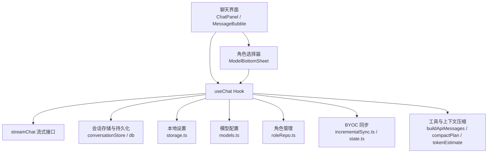
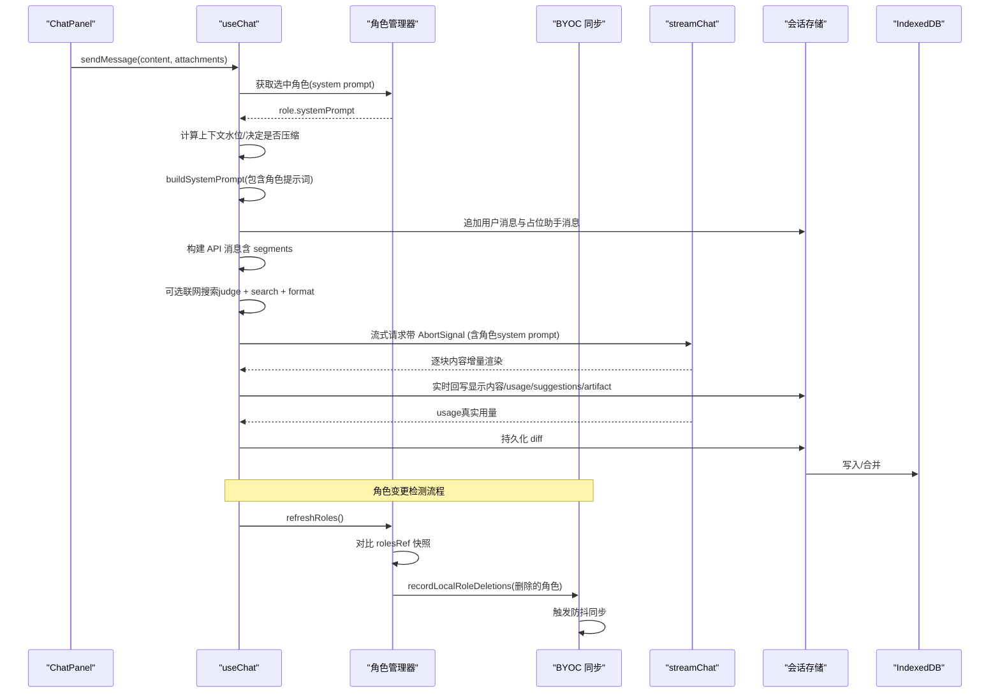
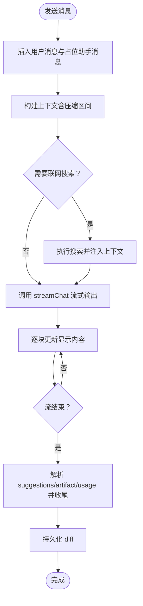
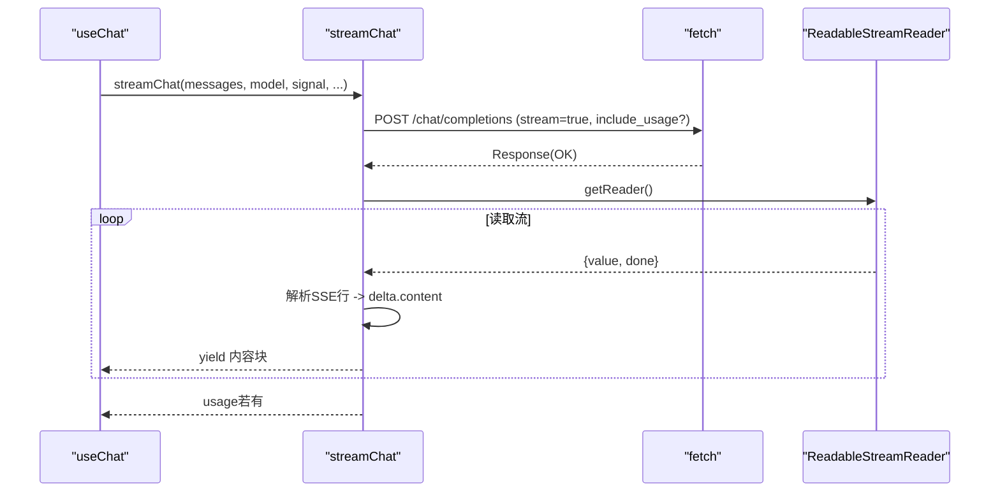
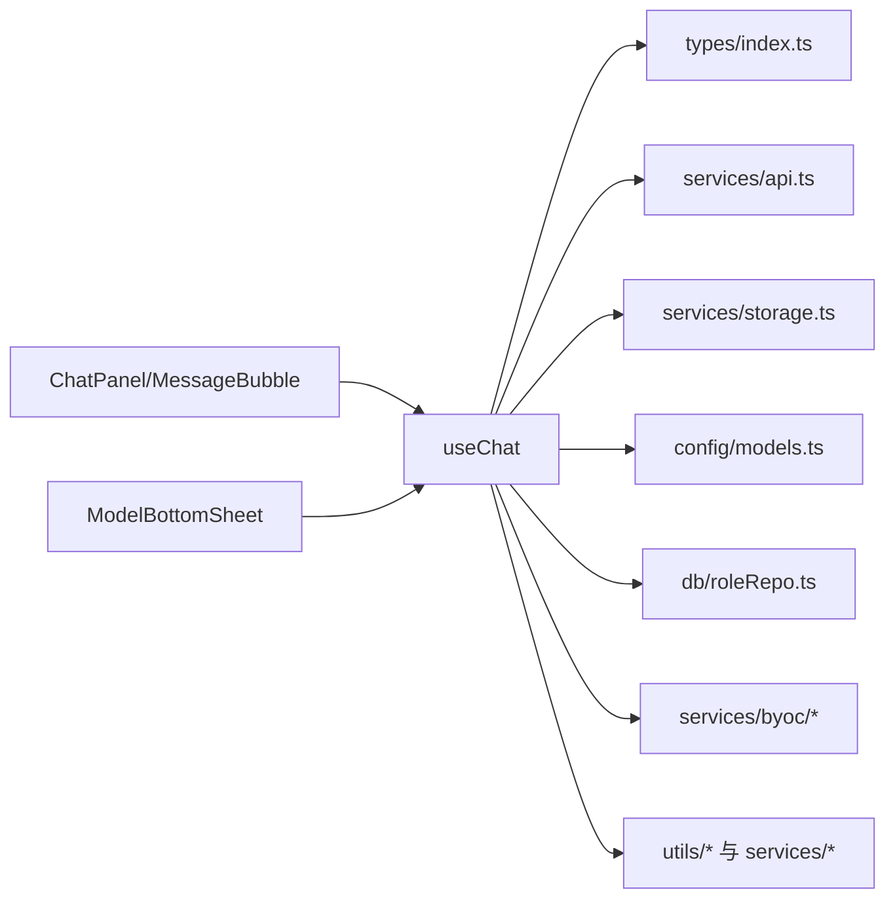

# 聊天状态管理 Hook

<cite>
**本文引用的文件**
- [useChat.ts](file://src/hooks/useChat.ts)
- [index.ts（类型定义）](file://src/types/index.ts)
- [api.ts（流式 API）](file://src/services/api.ts)
- [storage.ts（本地设置持久化）](file://src/services/storage.ts)
- [models.ts（模型配置）](file://src/config/models.ts)
- [roleRepo.ts（角色存储）](file://src/db/roleRepo.ts)
- [ModelBottomSheet.tsx（模型和角色选择组件）](file://src/components/common/ModelBottomSheet.tsx)
- [prompts.ts（提示词配置）](file://src/config/prompts.ts)
- [ChatPanel.tsx（聊天面板组件）](file://src/components/chat/ChatPanel.tsx)
- [MessageBubble.tsx（消息气泡组件）](file://src/components/chat/MessageBubble.tsx)
- [incrementalSync.ts（增量同步）](file://src/services/byoc/incrementalSync.ts)
- [state.ts（BYOC状态管理）](file://src/services/byoc/state.ts)
</cite>

## 更新摘要
**变更内容**
- 新增角色变更检测机制，通过 rolesRef 状态变量维护角色列表快照
- 实现角色元数据变更检测（名称、系统提示词、创建时间）
- 增强角色同步流程，支持自动检测和传播角色变更
- 集成本地墓碑记录机制，确保角色删除的可靠同步

## 目录
1. [简介](#简介)
2. [项目结构](#项目结构)
3. [核心组件](#核心组件)
4. [架构总览](#架构总览)
5. [详细组件分析](#详细组件分析)
6. [依赖关系分析](#依赖关系分析)
7. [性能考量](#性能考量)
8. [故障排查指南](#故障排查指南)
9. [结论](#结论)
10. [附录：API 参考](#附录api-参考)

## 简介
本文件为 useChat Hook 的状态管理文档，聚焦聊天状态设计、消息生命周期、流式 API 调用、网络请求与错误处理、会话管理与数据持久化、上下文压缩与自动保存、历史加载等。同时提供完整的 API 参考、错误处理策略、性能优化建议、调试技巧以及与其他组件和服务的集成方式说明。**最新更新**：集成了角色变更检测机制，通过智能对比角色列表快照，自动检测角色创建、删除和元数据变更，并触发相应的同步流程，确保多设备间角色数据的实时一致性。

## 项目结构
useChat Hook 位于 src/hooks 下，负责整个聊天应用的核心状态与流程编排；类型定义在 src/types；流式 API 封装在 src/services/api.ts；本地小体积设置保存在 src/services/storage.ts；模型列表在 src/config/models.ts；**新增**：角色存储在 src/db/roleRepo.ts；UI 层通过 ChatPanel 和 MessageBubble 消费 Hook 暴露的状态与方法，并通过 ModelBottomSheet 进行角色和模型选择。**新增**：BYOC 同步服务通过 incrementalSync.ts 和 state.ts 提供角色数据的增量同步和本地墓碑记录功能。



**图表来源**
- [useChat.ts:172-1650](file://src/hooks/useChat.ts#L172-L1650)
- [roleRepo.ts:14-71](file://src/db/roleRepo.ts#L14-L71)
- [ModelBottomSheet.tsx:128-671](file://src/components/common/ModelBottomSheet.tsx#L128-L671)
- [incrementalSync.ts:316-335](file://src/services/byoc/incrementalSync.ts#L316-L335)
- [state.ts:50-65](file://src/services/byoc/state.ts#L50-L65)

## 核心组件
- 聊天状态与生命周期
  - 会话列表与当前会话：conversations、activeId、activeConversation
  - 消息列表：messages（来自 activeConversation）
  - 加载与错误：isLoading、error
  - 启动态：isBooting
  - 联网搜索开关：webSearchEnabled
  - **新增**：角色系统：roles、selectedRoleId、setSelectedRole、refreshRoles、rolesRef
  - 流式 Artifact：streamingArtifact
  - 功能设置：featureSettings（artifact 启用、自动压缩）
  - 压缩相关：compactSettings、compactingId、contextUsage、realUsageTotals
- 关键方法
  - sendMessage：发送消息、构建上下文、可选联网搜索、流式输出、解析 suggestions/artifact、更新用量
  - stopGeneration：中止生成并标记停止
  - clearMessages：清空当前会话消息
  - newConversation / switchConversation / deleteConversation(s)：会话管理
  - loadMoreMessages：向上滚动加载更早消息
  - regenerateMessage / compareWithModel / switchVersion：多版本与多模型比较
  - compactConversation / updateSegment / revertSegment / setCompactFocusHint：上下文压缩与摘要编辑
  - setSelectedModel / setWebSearchEnabled / setFeatureSettings / setCompactSettings：设置变更
  - **新增**：角色管理方法：setSelectedRole、refreshRoles、rolesRef 变更检测

**章节来源**
- [useChat.ts:172-1650](file://src/hooks/useChat.ts#L172-L1650)
- [index.ts:84-175](file://src/types/index.ts#L84-L175)

## 架构总览
useChat 作为状态中枢，协调 UI、API、存储与工具模块：
- 启动阶段：加载会话列表，恢复上次活跃会话或创建新会话，补齐标题，解除 isBooting
- **新增**：角色初始化：加载角色列表，恢复上次选中的角色，建立角色列表快照
- 发送消息：检查上下文水位并触发压缩（可配置），构造用户消息与占位助手消息，构建 API 消息（含压缩区间），**根据选中角色构建系统提示词**，可选联网搜索，调用 streamChat 流式输出，实时更新显示内容与 artifact，最终解析 suggestions/artifact 并写入真实用量
- **新增**：角色变更检测：每次刷新角色列表时对比 rolesRef 快照，检测创建、删除和元数据变更
- **新增**：自动同步：检测到角色变更时记录本地墓碑并触发防抖同步，确保跨设备一致性
- 持久化：diff 变化后异步落盘，页面隐藏/离开时 flushPendingWrites
- 历史加载：切换会话按需 hydrate，向上滚动分页加载更早消息
- 多版本：支持对同一消息进行重新生成或多模型对比，维护 versions 与 activeVersionIndex



**图表来源**
- [useChat.ts:623-936](file://src/hooks/useChat.ts#L623-L936)
- [useChat.ts:53-72](file://src/hooks/useChat.ts#L53-L72)
- [useChat.ts:391-411](file://src/hooks/useChat.ts#L391-L411)
- [api.ts:44-172](file://src/services/api.ts#L44-L172)
- [state.ts:86-102](file://src/services/byoc/state.ts#L86-L102)

## 详细组件分析

### 角色系统与个性化AI人格
**新增功能**：角色系统允许用户创建和选择自定义AI人格，每个角色拥有独立的系统提示词，这些提示词会作为对话上下文的一部分发送给AI模型。**最新更新**：增强了角色变更检测机制，通过 rolesRef 状态变量维护角色列表快照，智能检测角色创建、删除和元数据变更。

- 角色数据结构
  - id：唯一标识符
  - name：角色名称（从提示词第一行自动提取）
  - systemPrompt：角色的完整系统提示词
  - createdAt：创建时间戳
- 角色工作流程
  - 启动时加载所有可用角色
  - 恢复上次选中的角色ID
  - **新增**：建立角色列表快照（rolesRef.current）用于后续变更检测
  - 发送消息时根据选中角色构建系统提示词
  - 支持默认角色（PortAI）和自定义角色切换
- **新增**：角色变更检测机制
  - 每次刷新角色列表时对比 rolesRef 快照
  - 检测角色数量变化（创建/删除）
  - 检测角色元数据变更（name、systemPrompt、createdAt）
  - 自动记录删除的角色到本地墓碑
  - 触发防抖同步确保跨设备一致性
- 系统提示词构建逻辑
  - 默认角色：使用内置的BASE_SYSTEM_PROMPT和ARTIFACT_PROMPT
  - 自定义角色：完全使用角色的systemPrompt，按功能开关动态拼接artifact和联网搜索提示词

```mermaid
flowchart TD
Start(["发送消息"]) --> LoadRole["加载选中角色"]
LoadRole --> CheckRole{"是否选中自定义角色？"}
CheckRole -- 否 --> DefaultPrompt["使用默认PortAI提示词"]
CheckRole -- 是 --> CustomPrompt["使用角色systemPrompt"]
DefaultPrompt --> BuildSystem["构建系统提示词"]
CustomPrompt --> BuildSystem
BuildSystem --> AddFeatures{"添加功能特性？"}
AddFeatures -- 是 --> FeaturePrompt["拼接artifact/搜索提示词"]
AddFeatures -- 否 --> Stream["调用流式API"]
FeaturePrompt --> Stream
Stream --> Response["返回个性化AI响应"]
Note after Stream --> RoleDetection["角色变更检测"]
RoleDetection --> CompareSnapshot["对比 rolesRef 快照"]
CompareSnapshot --> DetectChanges{"检测到变更？"}
DetectChanges -- 是 --> RecordDeletions["记录删除到墓碑"]
RecordDeletions --> TriggerSync["触发防抖同步"]
DetectChanges -- 否 --> End["完成"]
TriggerSync --> End
```

**图表来源**
- [useChat.ts:53-72](file://src/hooks/useChat.ts#L53-L72)
- [useChat.ts:391-411](file://src/hooks/useChat.ts#L391-L411)
- [state.ts:86-102](file://src/services/byoc/state.ts#L86-L102)

**章节来源**
- [roleRepo.ts:14-71](file://src/db/roleRepo.ts#L14-L71)
- [useChat.ts:53-72](file://src/hooks/useChat.ts#L53-L72)
- [useChat.ts:181-182](file://src/hooks/useChat.ts#L181-L182)
- [useChat.ts:387-404](file://src/hooks/useChat.ts#L387-L404)
- [useChat.ts:391-411](file://src/hooks/useChat.ts#L391-L411)

### 消息状态与生命周期
- 消息结构
  - role：user / assistant / system
  - content：string 或 MessageContent[]（文本+图片）
  - timestamp、isStreaming、suggestions、artifact、model、versions、activeVersionIndex、usage 等
- 生命周期
  - 发送前：插入 user 消息与占位的 assistant 消息（isStreaming=true）
  - 流式期间：逐块拼接 displayContent，实时更新最后一条 assistant 消息
  - 流式结束：清理 artifact 标记、去除多余反引号、解析 suggestions、记录 usage、关闭 isStreaming
  - 取消/失败：标记 stoppedByUser 或错误提示，保持已生成内容



**图表来源**
- [useChat.ts:623-936](file://src/hooks/useChat.ts#L623-L936)
- [api.ts:44-172](file://src/services/api.ts#L44-L172)

**章节来源**
- [index.ts:84-175](file://src/types/index.ts#L84-L175)
- [useChat.ts:623-936](file://src/hooks/useChat.ts#L623-L936)

### 流式 API 调用与网络请求管理
- 使用 fetch 发起 POST 到 chat/completions，开启 stream 模式
- 支持 include_usage 参数，若网关不支持则自动降级重试
- 使用 ReadableStream 读取 chunk，按行解析 SSE data: JSON，提取 delta.content 并 yield
- 支持 AbortController 中断请求
- 解析 usage 字段兼容多种网关命名



**图表来源**
- [api.ts:44-172](file://src/services/api.ts#L44-L172)

**章节来源**
- [api.ts:44-172](file://src/services/api.ts#L44-L172)
- [useChat.ts:817-824](file://src/hooks/useChat.ts#L817-L824)

### 重试机制与超时控制
- 重试机制
  - 当 include_usage/stream_options 不被网关支持时，自动去掉该参数重试一次
- 超时控制
  - 代码中未实现显式超时；可通过外部 AbortController 或浏览器网络层超时策略控制
  - 建议在更上层封装超时逻辑或使用 AbortSignal.timeout（如环境支持）

**章节来源**
- [api.ts:102-118](file://src/services/api.ts#L102-L118)
- [useChat.ts:894-933](file://src/hooks/useChat.ts#L894-L933)

### 错误处理策略
- 网络错误：捕获响应非 2xx，抛出包含状态码与响应的错误信息
- 网关不支持 include_usage：降级重试
- 用户取消：AbortError，将最后一条 assistant 消息标记为 stoppedByUser，保留已有内容
- 其他异常：设置 error 状态，并在消息中标注失败提示
- **新增**：角色同步错误：记录本地墓碑确保删除操作不会丢失，即使同步失败也能通过轮询兜底

**章节来源**
- [api.ts:102-118](file://src/services/api.ts#L102-L118)
- [useChat.ts:894-933](file://src/hooks/useChat.ts#L894-L933)
- [useChat.ts:1325-1367](file://src/hooks/useChat.ts#L1325-L1367)
- [useChat.ts:1523-1565](file://src/hooks/useChat.ts#L1523-L1565)

### 会话管理与数据持久化
- 启动恢复：加载会话列表，优先恢复上次活跃会话（hydrate 最近消息），否则复用空会话或新建
- 持久化策略：diff 变化后异步写入，避免全量序列化阻塞主线程；页面隐藏/离开时 flushPendingWrites
- 历史加载：切换会话时按需 hydrate；向上滚动加载更多更早消息
- 删除与会话重建：先删库再改 state，防止持久化副作用
- **新增**：角色数据持久化：角色变更通过 BYOC 同步机制持久化，支持跨设备一致性

**章节来源**
- [useChat.ts:219-312](file://src/hooks/useChat.ts#L219-L312)
- [useChat.ts:320-344](file://src/hooks/useChat.ts#L320-L344)
- [useChat.ts:1027-1066](file://src/hooks/useChat.ts#L1027-L1066)
- [useChat.ts:1068-1096](file://src/hooks/useChat.ts#L1068-L1096)

### 上下文压缩与自动保存
- 自动压缩：根据阈值与热窗口大小判断是否压缩，压缩后标记 compressedInto 并追加 segment
- 压缩视图：构建 API 消息时使用压缩后的视图，减少上下文长度
- 摘要编辑：支持用户手动修改摘要，修改后不再被自动重压
- 撤销压缩：移除 compressedInto 标记并清理 segment

**章节来源**
- [useChat.ts:531-579](file://src/hooks/useChat.ts#L531-L579)
- [useChat.ts:582-615](file://src/hooks/useChat.ts#L582-L615)

### 联网搜索集成
- 决策：基于问题内容判断是否需要搜索
- 执行：搜索并格式化结果注入系统上下文
- 状态：webSearching/webSearched/webSearchFailed/searchResults 用于 UI 展示与后续引用

**章节来源**
- [useChat.ts:750-805](file://src/hooks/useChat.ts#L750-L805)

### 多版本与多模型比较
- 重新生成：对指定 assistant 消息重新生成，支持重用被停止的版本或创建新版本
- 多模型比较：用另一模型对同一问题生成回答，维护 versions 列表与 activeVersionIndex
- 版本切换：UI 可切换查看不同版本

**章节来源**
- [useChat.ts:1175-1370](file://src/hooks/useChat.ts#L1175-L1370)
- [useChat.ts:1403-1568](file://src/hooks/useChat.ts#L1403-L1568)
- [useChat.ts:1571-1584](file://src/hooks/useChat.ts#L1571-L1584)

### 与 UI 组件的集成
- ChatPanel 消费 Hook 暴露的消息、加载状态、发送/停止等方法，并处理滚动、折叠、搜索、Artifact 面板等交互
- MessageBubble 渲染单条消息，支持 Markdown、代码高亮、复制、长按菜单、折叠浏览、搜索高亮等
- **新增**：ModelBottomSheet 提供角色选择和模型选择界面，支持角色创建、删除和切换

**章节来源**
- [ChatPanel.tsx:18-70](file://src/components/chat/ChatPanel.tsx#L18-L70)
- [ChatPanel.tsx:434-623](file://src/components/chat/ChatPanel.tsx#L434-L623)
- [MessageBubble.tsx:303-327](file://src/components/chat/MessageBubble.tsx#L303-L327)
- [MessageBubble.tsx:538-644](file://src/components/chat/MessageBubble.tsx#L538-L644)
- [ModelBottomSheet.tsx:128-671](file://src/components/common/ModelBottomSheet.tsx#L128-L671)

## 依赖关系分析
- useChat 依赖
  - 类型：Message、Conversation、TokenUsage、ContextSegment 等
  - 服务：streamChat、settingsService、titleGenerator、webSearch、contextCompactor、buildApiMessages、compactPlan、tokenEstimate、migrateSummary、messageCountOf
  - 存储：localStorage（小设置）、IndexedDB（会话与消息、角色）
  - 配置：CHAT_MODELS、BASE_SYSTEM_PROMPT、ARTIFACT_PROMPT
  - **新增**：角色管理：listRoles、createRole、deleteRole、newRoleId
  - **新增**：BYOC 同步：syncNow、getByocConfig、validateConfig、recordLocalDeletions、recordLocalRoleDeletions
- 耦合与内聚
  - 高内聚：消息生命周期、流式处理、压缩策略集中在 Hook
  - 低耦合：通过 services 与 utils 抽象网络、存储、压缩、估算等能力



**图表来源**
- [useChat.ts:1-48](file://src/hooks/useChat.ts#L1-L48)
- [roleRepo.ts:1-71](file://src/db/roleRepo.ts#L1-L71)
- [ModelBottomSheet.tsx:128-671](file://src/components/common/ModelBottomSheet.tsx#L128-L671)

**章节来源**
- [useChat.ts:1-48](file://src/hooks/useChat.ts#L1-L48)
- [index.ts:1-175](file://src/types/index.ts#L1-L175)

## 性能考量
- 流式渲染：逐块更新，避免整段等待；使用 displayContent 过滤中间标记，提升可读性
- 持久化优化：diff 写入，避免全量序列化；页面隐藏/离开时 flushPendingWrites
- 上下文压缩：接近上限时自动压缩，降低请求成本与延迟
- 图片与附件：仅在发送前转换为 data URL，避免提前占用内存
- 滚动与布局：吸底滚动、折叠动画与锚点定位，减少重排抖动
- 用量统计：真实 usage 与本地估算结合，辅助缓存命中率与成本控制
- **新增**：角色加载优化：角色列表懒加载，避免启动时阻塞
- **新增**：变更检测优化：通过 rolesRef 快照避免不必要的同步触发，只在真正发生变更时记录墓碑并触发同步
- **新增**：防抖同步：角色变更后 3 秒内合并多次变更成一次同步，减少网络开销

## 故障排查指南
- 无法获取 API Key：检查设置中 provider 与 apiKey 配置
- 网关不支持 include_usage：已自动降级重试；若仍失败，检查网关兼容性
- 流式无响应：检查网络、AbortSignal 是否被提前中止；确认 fetch 返回 body 可读
- 消息未持久化：检查页面隐藏事件与 flushPendingWrites 是否触发；确认 IndexedDB 权限
- 压缩无效：检查阈值与热窗口设置；确认 isCompactionViable 条件满足
- 联网搜索失败：检查 judgeSearchNeed 判定与 searchWeb 返回；关注 webSearchFailed 标志
- **新增**：角色相关问题：检查角色列表加载、角色ID持久化、角色提示词格式验证
- **新增**：角色同步问题：检查 BYOC 配置、网络连接、本地墓碑记录是否正确更新
- **新增**：角色变更检测：确认 rolesRef 快照正确维护，变更检测逻辑正常工作

**章节来源**
- [api.ts:57-59](file://src/services/api.ts#L57-L59)
- [api.ts:102-118](file://src/services/api.ts#L102-L118)
- [useChat.ts:750-805](file://src/hooks/useChat.ts#L750-L805)
- [useChat.ts:320-344](file://src/hooks/useChat.ts#L320-L344)
- [roleRepo.ts:48-67](file://src/db/roleRepo.ts#L48-L67)

## 结论
useChat Hook 提供了健壮的聊天状态管理能力，涵盖消息生命周期、流式输出、上下文压缩、会话持久化、联网搜索、多版本与多模型比较等核心功能。**最新更新**：集成了角色变更检测机制，通过 rolesRef 状态变量维护角色列表快照，智能检测角色创建、删除和元数据变更，并自动触发同步流程，确保多设备间角色数据的实时一致性。通过清晰的职责划分与模块化设计，实现了高性能、可扩展且易维护的聊天体验。

## 附录：API 参考

### 状态字段
- messages：Message[]，当前会话消息列表
- isLoading：boolean，是否正在生成
- selectedModel：string，当前选择模型 ID
- error：string | null，错误信息
- conversations：Conversation[]，会话列表
- activeConversationId：string，当前会话 ID
- isBooting：boolean，启动中
- webSearchEnabled：boolean，联网搜索开关
- streamingArtifact：{ title; code } | null，流式 Artifact
- featureSettings：ChatFeatureSettings，功能设置
- contextUsage：对象，上下文水位信息
- realUsageTotals：对象，真实用量汇总
- segments：ContextSegment[]，压缩区间
- compactSettings：对象，压缩设置
- compactingId：string | null，正在压缩的会话 ID
- isCompacting：boolean，是否正在压缩
- **新增**：roles：RoleData[]，可用角色列表
- **新增**：selectedRoleId：string，当前选中的角色ID
- **新增**：refreshRoles：() => Promise<void>，刷新角色列表
- **新增**：rolesRef：useRef<RoleData[] | null>，角色列表快照引用

**章节来源**
- [useChat.ts:1597-1650](file://src/hooks/useChat.ts#L1597-L1650)
- [index.ts:84-175](file://src/types/index.ts#L84-L175)
- [roleRepo.ts:14-19](file://src/db/roleRepo.ts#L14-L19)

### 方法
- sendMessage(content, attachments?)：发送消息，支持字符串或多部分消息（含图片）
- stopGeneration()：停止生成
- clearMessages()：清空当前会话消息
- newConversation()：新建会话
- switchConversation(id)：切换会话（按需加载）
- loadMoreMessages()：加载更早消息
- deleteConversation(id) / deleteConversations(ids)：删除会话
- toggleConversationFavorite(id)：收藏/取消收藏
- renameConversation(id, title)：重命名会话
- importConversation(data)：导入会话
- compareWithModel(messageId, targetModelId)：多模型比较
- switchVersion(messageId, index)：切换版本
- setSelectedModel(modelId)：设置模型
- setWebSearchEnabled(enabled)：设置联网搜索开关
- setFeatureSettings(settings)：设置功能开关
- setCompactSettings(patch)：设置压缩参数
- compactConversation(convId)：手动压缩会话
- updateSegment(convId, segmentId, summary)：编辑摘要
- revertSegment(convId, segmentId)：撤销压缩
- setCompactFocusHint(convId, hint)：设置压缩重点提示
- **新增**：setSelectedRole(roleId)：设置选中的角色
- **新增**：refreshRoles()：刷新角色列表并检测变更

**章节来源**
- [useChat.ts:623-1650](file://src/hooks/useChat.ts#L623-L1650)

### 返回值与副作用
- sendMessage：无返回值；副作用包括更新消息、流式渲染、持久化、错误处理
- 其他方法：多数为副作用操作，更新状态并持久化

**章节来源**
- [useChat.ts:623-1650](file://src/hooks/useChat.ts#L623-L1650)

### 使用示例（概念性）
- 发送消息：调用 sendMessage 传入文本或包含图片的多部分内容
- 停止生成：在加载中调用 stopGeneration
- 切换模型：调用 setSelectedModel 并观察 messages 与 contextUsage 变化
- 联网搜索：启用 webSearchEnabled 后，sendMessage 会按需执行搜索并注入上下文
- 压缩上下文：调整 compactSettings 并启用 autoCompactEnabled，或在必要时手动 compactConversation
- **新增**：角色切换：调用 setSelectedRole 选择自定义角色，或传入空字符串使用默认角色
- **新增**：角色管理：通过 refreshRoles 刷新角色列表，在UI中创建、删除和管理自定义角色
- **新增**：角色同步：角色变更后自动触发防抖同步，确保跨设备一致性