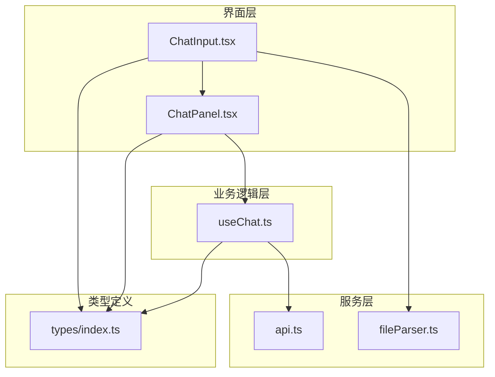
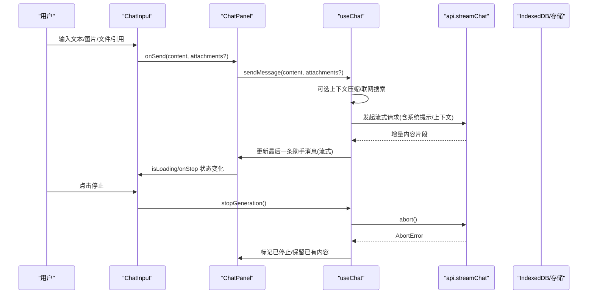
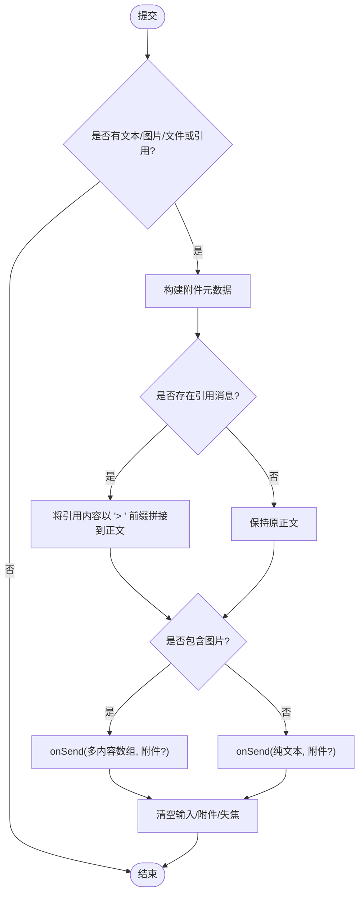
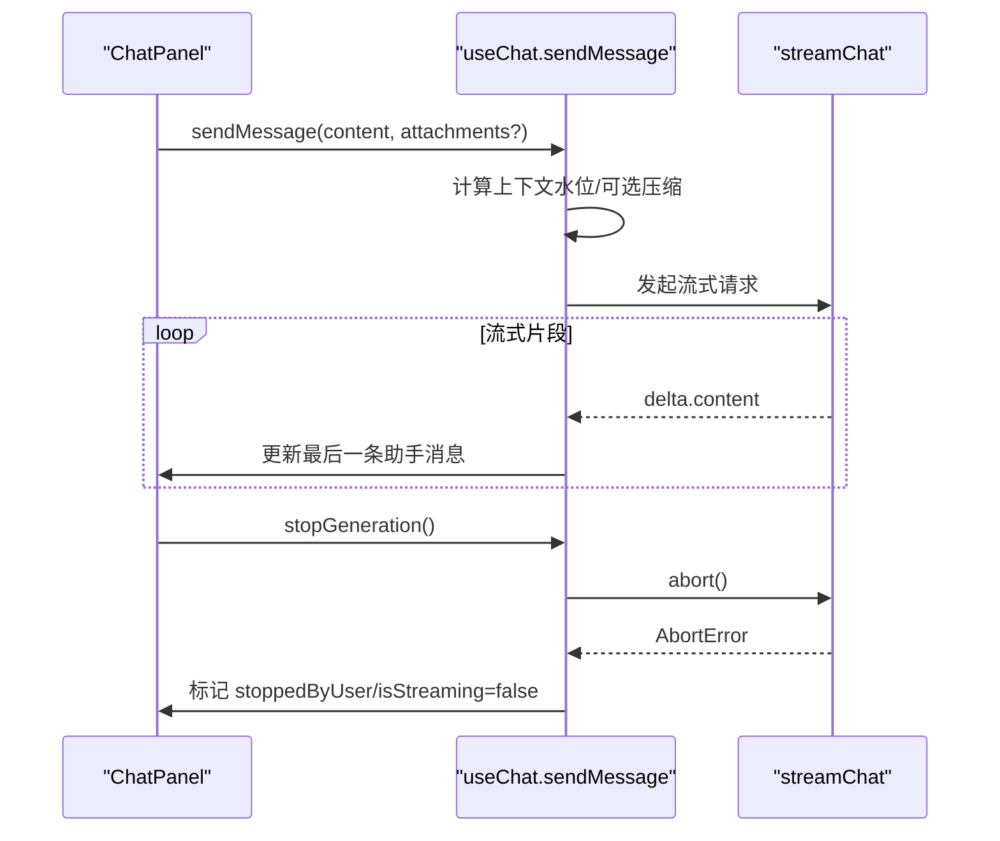
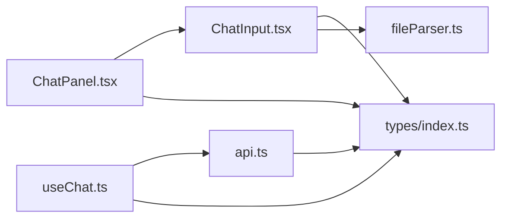

# 聊天输入组件

<cite>
**本文引用的文件**
- [ChatInput.tsx](file://src/components/chat/ChatInput.tsx)
- [useChat.ts](file://src/hooks/useChat.ts)
- [api.ts](file://src/services/api.ts)
- [index.ts（类型定义）](file://src/types/index.ts)
- [ChatPanel.tsx](file://src/components/chat/ChatPanel.tsx)
- [fileParser.ts](file://src/services/fileParser.ts)
</cite>

## 目录
1. [简介](#简介)
2. [项目结构](#项目结构)
3. [核心组件](#核心组件)
4. [架构总览](#架构总览)
5. [详细组件分析](#详细组件分析)
6. [依赖关系分析](#依赖关系分析)
7. [性能考量](#性能考量)
8. [故障排查指南](#故障排查指南)
9. [结论](#结论)
10. [附录：使用示例与最佳实践](#附录使用示例与最佳实践)

## 简介
本组件文档聚焦于聊天输入组件 ChatInput，全面说明其多模态输入能力（文本编辑、图片上传、文件拖拽、引用回复）、状态管理与验证逻辑、快捷键与无障碍访问、以及与外部组件的交互接口（发送消息、停止生成、新会话创建等事件）。同时提供样式定制选项、扩展开发指南和移动端适配说明，并给出完整的使用示例与最佳实践建议。

## 项目结构
ChatInput 位于聊天模块中，负责用户输入、附件预览、引用回复展示以及触发发送/停止等操作；它通过回调与父级 ChatPanel 通信，最终由 useChat 钩子协调消息流式请求与上下文管理。

图表来源
- [ChatInput.tsx:1-467](file://src/components/chat/ChatInput.tsx#L1-L467)
- [ChatPanel.tsx:1-200](file://src/components/chat/ChatPanel.tsx#L1-L200)
- [useChat.ts:494-783](file://src/hooks/useChat.ts#L494-L783)
- [api.ts:44-173](file://src/services/api.ts#L44-L173)
- [fileParser.ts:78-145](file://src/services/fileParser.ts#L78-L145)
- [index.ts:3-107](file://src/types/index.ts#L3-L107)

章节来源
- [ChatInput.tsx:1-467](file://src/components/chat/ChatInput.tsx#L1-L467)
- [ChatPanel.tsx:1-200](file://src/components/chat/ChatPanel.tsx#L1-L200)
- [useChat.ts:494-783](file://src/hooks/useChat.ts#L494-L783)
- [api.ts:44-173](file://src/services/api.ts#L44-L173)
- [fileParser.ts:78-145](file://src/services/fileParser.ts#L78-L145)
- [index.ts:3-107](file://src/types/index.ts#L3-L107)

## 核心组件
- ChatInput：多模态输入容器，支持文本、图片、文件、引用回复、联网搜索开关、发送/停止按钮、自动高度与焦点管理。
- useChat：消息发送、流式响应、上下文压缩、联网搜索、停止生成、错误处理等核心流程。
- api：流式调用后端 chat/completions，解析 usage 与内容增量。
- fileParser：统一解析多种文件格式为文本，供附件上下文注入。
- types：Message、MessageContent、FileAttachment、ChatFeatureSettings 等类型契约。

章节来源
- [ChatInput.tsx:1-467](file://src/components/chat/ChatInput.tsx#L1-L467)
- [useChat.ts:494-783](file://src/hooks/useChat.ts#L494-L783)
- [api.ts:44-173](file://src/services/api.ts#L44-L173)
- [fileParser.ts:78-145](file://src/services/fileParser.ts#L78-L145)
- [index.ts:3-107](file://src/types/index.ts#L3-L107)

## 架构总览
下图展示了从用户输入到消息发送、流式响应、再到 UI 更新的端到端流程。

图表来源
- [ChatInput.tsx:70-118](file://src/components/chat/ChatInput.tsx#L70-L118)
- [ChatPanel.tsx:18-47](file://src/components/chat/ChatPanel.tsx#L18-L47)
- [useChat.ts:494-783](file://src/hooks/useChat.ts#L494-L783)
- [useChat.ts:785-800](file://src/hooks/useChat.ts#L785-L800)
- [api.ts:44-173](file://src/services/api.ts#L44-L173)

## 详细组件分析

### ChatInput 组件分析
- 多模态输入
  - 文本：textarea 支持自动高度、粘贴图片、占位符提示。
  - 图片：本地选择或拖拽/粘贴图片，转为 base64 预览并在发送时作为 image_url 内容项。
  - 文件：支持 txt/md/pdf/csv/json/doc/docx/pptx/ppt/rtf/odt/odp/ods/xlsx/xls 等格式，解析为文本后以附件元数据形式随消息发送。
  - 引用回复：显示被引用消息摘要，发送时将引用内容以“>”前缀拼接至正文。
- 状态管理
  - 文本、图片数组、文件解析结果、拖拽状态、聚焦态、是否激活（展开布局）等。
  - 发送后清空输入与附件，失焦关闭键盘。
- 验证与限制
  - 文件大小上限（20MB），文件总数上限（图片+文档合计最多 5）。
  - 仅允许指定扩展名或图片类型，否则提示不支持。
- 快捷键与无障碍
  - 未实现全局快捷键；按钮具备 title 提示；输入框可聚焦/失焦；拖拽区域有视觉反馈。
  - 建议补充 aria-* 属性以提升屏幕阅读器体验（见“无障碍访问增强”小节）。
- 与外部组件交互
  - onSend：向父组件发送消息（字符串或多内容数组），附带附件元数据。
  - onStop：停止当前生成。
  - onNewConversation：新建会话（由父组件控制）。
  - quotedMessage/onRemoveQuote：引用回复展示与移除。
  - webSearchEnabled/onWebSearchEnabledChange：联网搜索开关。
  - featureSettings/onFeatureSettingsChange：功能开关（如 artifact、自动压缩）。
  - onActiveChange：通知父组件输入框是否处于激活态（用于隐藏“回到底部”等）。

图表来源
- [ChatInput.tsx:70-118](file://src/components/chat/ChatInput.tsx#L70-L118)
- [ChatInput.tsx:154-185](file://src/components/chat/ChatInput.tsx#L154-L185)
- [ChatInput.tsx:194-228](file://src/components/chat/ChatInput.tsx#L194-L228)

章节来源
- [ChatInput.tsx:1-467](file://src/components/chat/ChatInput.tsx#L1-L467)

### useChat 中的发送与停止流程
- 发送消息
  - 在发送前根据配置进行上下文压缩判断与执行。
  - 组装 API 消息：系统提示、可选联网搜索结果、历史消息（含压缩段）、当前用户消息。
  - 流式接收增量内容，实时更新最后一条助手消息。
  - 结束后清理流式标记、解析建议与 artifact、记录用量。
- 停止生成
  - 调用 AbortController 中断请求，更新最后一条助手消息为“已停止”，保留已有内容。

图表来源
- [useChat.ts:494-783](file://src/hooks/useChat.ts#L494-L783)
- [useChat.ts:785-800](file://src/hooks/useChat.ts#L785-L800)
- [api.ts:44-173](file://src/services/api.ts#L44-L173)

章节来源
- [useChat.ts:494-783](file://src/hooks/useChat.ts#L494-L783)
- [useChat.ts:785-800](file://src/hooks/useChat.ts#L785-L800)
- [api.ts:44-173](file://src/services/api.ts#L44-L173)

### 文件解析与附件注入
- 支持多种格式解析为文本，PDF 使用 PDF.js，Office 使用 officeparser，Excel 使用 xlsx。
- 解析失败会抛出明确错误信息；超大文本会被截断并标记 truncated。
- 发送时，若存在附件，会将文件内容以特定格式注入到用户消息文本中，以便模型理解上下文。

章节来源
- [fileParser.ts:78-145](file://src/services/fileParser.ts#L78-L145)
- [useChat.ts:574-593](file://src/hooks/useChat.ts#L574-L593)

### 类型契约与数据模型
- MessageContent：支持 text 与 image_url 两种内容类型。
- FileAttachment：描述上传文件的名称、大小、文本内容与是否截断。
- Message：承载角色、内容、时间戳、流式标记、附件、artifact、用量等信息。
- ChatFeatureSettings：功能开关（如 artifact 启用、自动压缩）。

章节来源
- [index.ts:3-107](file://src/types/index.ts#L3-L107)

## 依赖关系分析
- ChatInput 依赖：
  - 类型定义（MessageContent、FileAttachment、ChatFeatureSettings）。
  - 文件解析器（parseFile）。
  - 图标库（lucide-react）。
- ChatPanel 依赖：
  - ChatInput、useArtifact、useStickToBottom、useFoldGesture 等。
  - 类型定义。
- useChat 依赖：
  - api.streamChat、持久化、对话存储、标题生成、联网搜索、上下文压缩、token 估算等。
- api 依赖：
  - 设置服务（获取 provider 与 apiKey）、提供者配置、数据库内联 blob 工具。

图表来源
- [ChatInput.tsx:1-5](file://src/components/chat/ChatInput.tsx#L1-L5)
- [ChatPanel.tsx:1-16](file://src/components/chat/ChatPanel.tsx#L1-L16)
- [useChat.ts:1-42](file://src/hooks/useChat.ts#L1-L42)
- [api.ts:1-5](file://src/services/api.ts#L1-L5)
- [index.ts:3-107](file://src/types/index.ts#L3-L107)

章节来源
- [ChatInput.tsx:1-5](file://src/components/chat/ChatInput.tsx#L1-L5)
- [ChatPanel.tsx:1-16](file://src/components/chat/ChatPanel.tsx#L1-L16)
- [useChat.ts:1-42](file://src/hooks/useChat.ts#L1-L42)
- [api.ts:1-5](file://src/services/api.ts#L1-L5)
- [index.ts:3-107](file://src/types/index.ts#L3-L107)

## 性能考量
- 输入区自动高度与最大高度限制，避免过大 DOM 重排。
- 文件解析异步进行，错误及时捕获并提示。
- 发送前进行上下文压缩评估，减少长对话带来的 token 压力。
- 流式响应逐字渲染，提升首屏感知速度。
- 附件与图片采用 base64 预览，注意内存占用；大文件需考虑后续优化（如分片上传/URL 模式）。

[本节为通用指导，不直接分析具体文件]

## 故障排查指南
- 无法发送
  - 检查是否处于加载中（isLoading）；确认输入是否为空。
  - 查看 onSend 回调是否正确传递 content 与 attachments。
- 文件解析失败
  - 确认文件格式是否在支持列表内；检查文件大小是否超过限制。
  - 查看 parseFile 抛出的错误信息，定位具体解析步骤。
- 停止生成无效
  - 确认父组件正确调用 onStop，useChat 内部会中止请求并更新状态。
- 联网搜索异常
  - 检查 webSearchEnabled 开关与 judgeSearchNeed 的判断逻辑；关注 searchFailed 标志。

章节来源
- [ChatInput.tsx:70-118](file://src/components/chat/ChatInput.tsx#L70-L118)
- [ChatInput.tsx:154-185](file://src/components/chat/ChatInput.tsx#L154-L185)
- [useChat.ts:621-676](file://src/hooks/useChat.ts#L621-L676)
- [useChat.ts:785-800](file://src/hooks/useChat.ts#L785-L800)
- [fileParser.ts:78-145](file://src/services/fileParser.ts#L78-L145)

## 结论
ChatInput 提供了完善的多模态输入能力与稳健的状态管理，结合 useChat 的流式处理与上下文压缩机制，能够支撑复杂对话场景。通过合理的样式定制与无障碍增强，可在桌面与移动端获得一致且友好的用户体验。建议在后续迭代中补充快捷键、无障碍标签与更丰富的主题变量，进一步提升可访问性与可定制性。

[本节为总结性内容，不直接分析具体文件]

## 附录：使用示例与最佳实践

### 基本用法
- 在父组件中引入 ChatInput，传入必要回调与状态：
  - onSend：处理发送的消息与附件。
  - isLoading：控制加载态。
  - onStop：处理停止生成。
  - onNewConversation：新建会话。
  - quotedMessage/onRemoveQuote：引用回复。
  - webSearchEnabled/onWebSearchEnabledChange：联网搜索开关。
  - featureSettings/onFeatureSettingsChange：功能开关。
  - onActiveChange：输入框激活态通知。

章节来源
- [ChatInput.tsx:6-19](file://src/components/chat/ChatInput.tsx#L6-L19)
- [ChatPanel.tsx:18-47](file://src/components/chat/ChatPanel.tsx#L18-L47)

### 多模态输入最佳实践
- 文本编辑
  - 使用自动高度 textarea，限制最大高度以避免过长输入。
  - 支持粘贴图片，自动转换为 base64 预览。
- 图片上传
  - 限制图片数量与总文件数，避免内存溢出。
  - 发送时以 image_url 内容项组合到消息中。
- 文件拖拽
  - 提供拖拽区域与视觉反馈，校验扩展名与大小。
  - 解析失败时给出明确错误提示。
- 引用回复
  - 显示引用摘要，发送时以“> ”前缀拼接，便于上下文追溯。

章节来源
- [ChatInput.tsx:120-146](file://src/components/chat/ChatInput.tsx#L120-L146)
- [ChatInput.tsx:154-185](file://src/components/chat/ChatInput.tsx#L154-L185)
- [ChatInput.tsx:194-228](file://src/components/chat/ChatInput.tsx#L194-L228)
- [ChatInput.tsx:279-299](file://src/components/chat/ChatInput.tsx#L279-L299)

### 状态管理与验证逻辑
- 状态字段
  - 文本、图片数组、文件解析结果、拖拽状态、聚焦态、激活态。
- 验证规则
  - 文件大小上限、文件总数上限、格式白名单。
- 发送后清理
  - 清空输入与附件，失焦关闭键盘，重置高度。

章节来源
- [ChatInput.tsx:34-45](file://src/components/chat/ChatInput.tsx#L34-L45)
- [ChatInput.tsx:70-118](file://src/components/chat/ChatInput.tsx#L70-L118)
- [ChatInput.tsx:154-185](file://src/components/chat/ChatInput.tsx#L154-L185)

### 快捷键支持与无障碍访问
- 快捷键
  - 当前未实现全局快捷键；可通过父组件监听键盘事件扩展（例如 Enter 发送）。
- 无障碍
  - 建议为关键按钮添加 aria-label（如“发送”、“停止生成”、“上传文件”）。
  - 为拖拽区域添加 role="region" 与 aria-live 提示。
  - 为图片预览添加 alt 描述（至少占位文本）。

章节来源
- [ChatInput.tsx:352-400](file://src/components/chat/ChatInput.tsx#L352-L400)
- [ChatInput.tsx:413-460](file://src/components/chat/ChatInput.tsx#L413-L460)

### 样式定制选项
- 主题变量
  - 使用 CSS 变量（如 --color-accent、--color-bg-primary）控制主色与背景。
- 布局切换
  - 聚焦或存在内容时展开为更大输入区，并提供底部渐隐效果。
- 拖拽反馈
  - 拖拽进入时高亮边框与半透明遮罩。

章节来源
- [ChatInput.tsx:251-274](file://src/components/chat/ChatInput.tsx#L251-L274)
- [ChatInput.tsx:338-411](file://src/components/chat/ChatInput.tsx#L338-L411)

### 移动端适配说明
- 自动聚焦与键盘弹出
  - 展开态自动聚焦 textarea，确保键盘弹出。
- 触觉反馈
  - 开始与结束生成时触发振动（if supported）。
- 输入区自适应
  - 最小/最大高度与自动高度，适配小屏。

章节来源
- [ChatInput.tsx:47-54](file://src/components/chat/ChatInput.tsx#L47-L54)
- [useChat.ts:564-569](file://src/hooks/useChat.ts#L564-L569)
- [useChat.ts:713-718](file://src/hooks/useChat.ts#L713-L718)

### 与外部组件的交互接口
- 发送消息
  - onSend(content: string | MessageContent[], attachments?: FileAttachment[])
- 停止生成
  - onStop(): void
- 新建会话
  - onNewConversation?(): void
- 引用回复
  - quotedMessage?: Message | null
  - onRemoveQuote?(): void
- 联网搜索
  - webSearchEnabled?: boolean
  - onWebSearchEnabledChange?(enabled: boolean): void
- 功能设置
  - featureSettings: ChatFeatureSettings
  - onFeatureSettingsChange(settings: ChatFeatureSettings): void
- 激活态通知
  - onActiveChange?(active: boolean): void

章节来源
- [ChatInput.tsx:6-19](file://src/components/chat/ChatInput.tsx#L6-L19)
- [ChatPanel.tsx:18-47](file://src/components/chat/ChatPanel.tsx#L18-L47)
- [index.ts:3-107](file://src/types/index.ts#L3-L107)