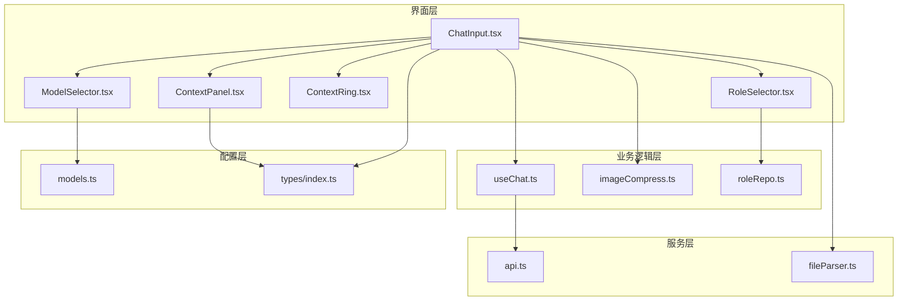
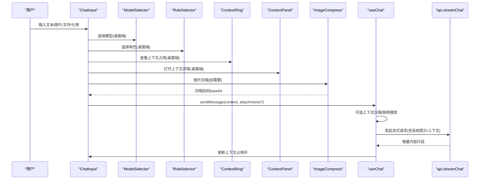
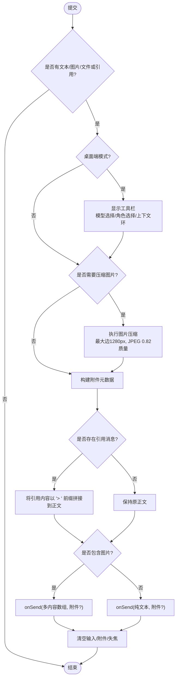
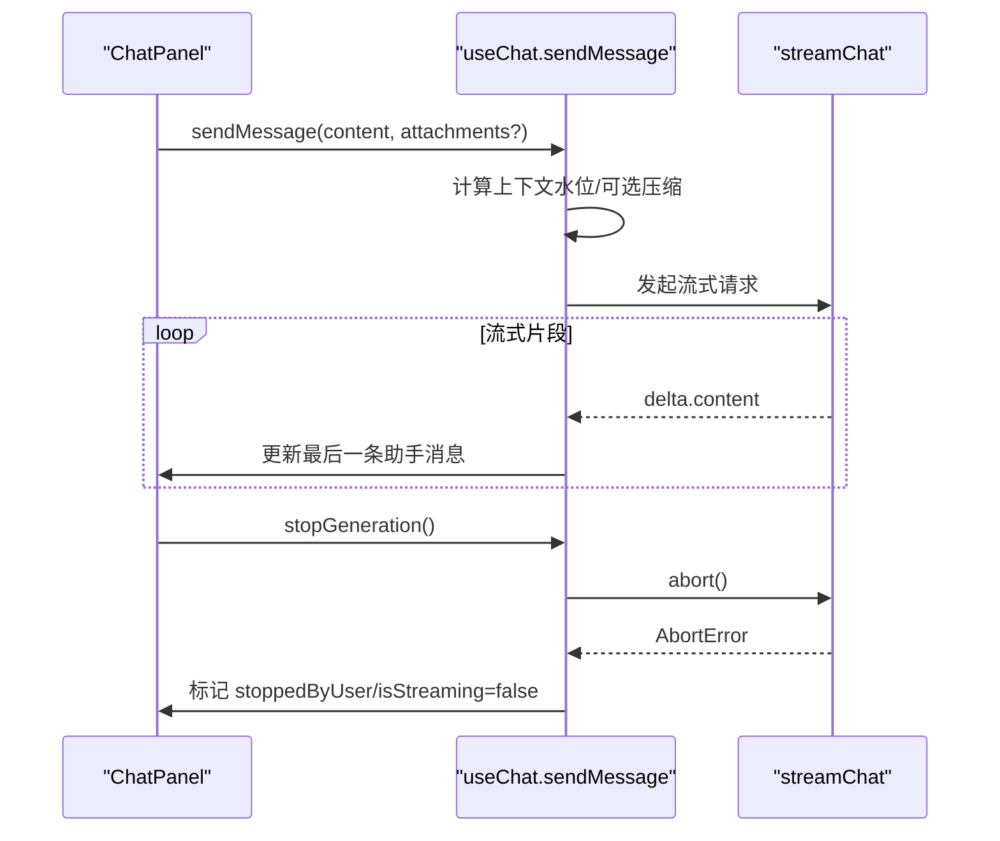
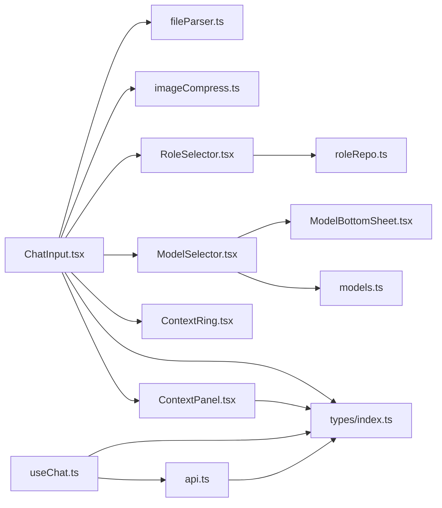

# 聊天输入组件

<cite>
**本文引用的文件**
- [ChatInput.tsx](file://src/components/chat/ChatInput.tsx)
- [ModelSelector.tsx](file://src/components/common/ModelSelector.tsx)
- [RoleSelector.tsx](file://src/components/common/RoleSelector.tsx)
- [ContextRing.tsx](file://src/components/chat/ContextRing.tsx)
- [ContextPanel.tsx](file://src/components/chat/ContextPanel.tsx)
- [imageCompress.ts](file://src/utils/imageCompress.ts)
- [useChat.ts](file://src/hooks/useChat.ts)
- [api.ts](file://src/services/api.ts)
- [index.ts（类型定义）](file://src/types/index.ts)
- [ChatPanel.tsx](file://src/components/chat/ChatPanel.tsx)
- [fileParser.ts](file://src/services/fileParser.ts)
- [models.ts](file://src/config/models.ts)
- [roleRepo.ts](file://src/db/roleRepo.ts)
</cite>

## 更新摘要
**所做更改**
- 新增桌面端两行输入界面章节，详细说明工具栏布局和交互设计
- 增强模型选择器功能章节，说明多模型支持和提供商分组
- 新增角色管理功能章节，详细介绍自定义角色的创建、管理和删除
- 增强上下文使用可视化章节，说明上下文占用率环和详情面板
- 更新聊天控件面板章节，说明Artifact和联网搜索开关
- 完善移动端适配说明，包含原生附件能力集成
- 更新依赖关系分析，包含新增组件的依赖关系

## 目录
1. [简介](#简介)
2. [项目结构](#项目结构)
3. [核心组件](#核心组件)
4. [架构总览](#架构总览)
5. [详细组件分析](#详细组件分析)
6. [依赖关系分析](#依赖关系分析)
7. [性能考量](#性能考量)
8. [故障排查指南](#故障排查指南)
9. [结论](#结论)
10. [附录：使用示例与最佳实践](#附录使用示例与最佳实践)

## 简介
本组件文档聚焦于聊天输入组件 ChatInput，全面说明其多模态输入能力（文本编辑、图片上传、文件拖拽、引用回复）、状态管理与验证逻辑、快捷键与无障碍访问、以及与外部组件的交互接口（发送消息、停止生成、新会话创建等事件）。同时提供样式定制选项、扩展开发指南和移动端适配说明，并给出完整的使用示例与最佳实践建议。

**最新更新**：组件现已支持桌面端两行输入界面，集成了模型选择器、角色管理系统、上下文使用可视化等功能，大幅增强了桌面端用户体验。新增的智能图片压缩功能继续优化大图片处理性能。

## 项目结构
ChatInput 位于聊天模块中，负责用户输入、附件预览、引用回复展示以及触发发送/停止等操作；它通过回调与父级 ChatPanel 通信，最终由 useChat 钩子协调消息流式请求与上下文管理。

**图表来源**
- [ChatInput.tsx:1-951](file://src/components/chat/ChatInput.tsx#L1-L951)
- [ModelSelector.tsx:1-336](file://src/components/common/ModelSelector.tsx#L1-L336)
- [RoleSelector.tsx:1-347](file://src/components/common/RoleSelector.tsx#L1-L347)
- [ContextRing.tsx:1-110](file://src/components/chat/ContextRing.tsx#L1-L110)
- [ContextPanel.tsx:1-166](file://src/components/chat/ContextPanel.tsx#L1-L166)
- [useChat.ts:494-783](file://src/hooks/useChat.ts#L494-L783)
- [imageCompress.ts:1-77](file://src/utils/imageCompress.ts#L1-L77)
- [api.ts:44-173](file://src/services/api.ts#L44-L173)
- [fileParser.ts:78-145](file://src/services/fileParser.ts#L78-L145)
- [models.ts:1-284](file://src/config/models.ts#L1-L284)
- [roleRepo.ts:1-71](file://src/db/roleRepo.ts#L1-L71)
- [index.ts:3-107](file://src/types/index.ts#L3-L107)

**章节来源**
- [ChatInput.tsx:1-951](file://src/components/chat/ChatInput.tsx#L1-L951)
- [ModelSelector.tsx:1-336](file://src/components/common/ModelSelector.tsx#L1-L336)
- [RoleSelector.tsx:1-347](file://src/components/common/RoleSelector.tsx#L1-L347)
- [ContextRing.tsx:1-110](file://src/components/chat/ContextRing.tsx#L1-L110)
- [ContextPanel.tsx:1-166](file://src/components/chat/ContextPanel.tsx#L1-L166)
- [useChat.ts:494-783](file://src/hooks/useChat.ts#L494-L783)
- [imageCompress.ts:1-77](file://src/utils/imageCompress.ts#L1-L77)
- [api.ts:44-173](file://src/services/api.ts#L44-L173)
- [fileParser.ts:78-145](file://src/services/fileParser.ts#L78-L145)
- [models.ts:1-284](file://src/config/models.ts#L1-L284)
- [roleRepo.ts:1-71](file://src/db/roleRepo.ts#L1-L71)
- [index.ts:3-107](file://src/types/index.ts#L3-L107)

## 核心组件
- **ChatInput**：多模态输入容器，支持文本、图片、文件、引用回复、联网搜索开关、发送/停止按钮、自动高度与焦点管理，**新增桌面端两行输入界面**。
- **ModelSelector**：模型选择器组件，支持多模型选择和提供商分组显示。
- **RoleSelector**：角色选择器组件，支持自定义角色的创建、管理和删除。
- **ContextRing**：上下文占用率指示器，以环形进度条形式展示当前上下文使用情况。
- **ContextPanel**：上下文详情面板，提供详细的上下文使用信息和压缩历史。
- imageCompress：图片压缩工具，提供高性能的图片压缩算法，支持多种格式和自适应质量调整。
- useChat：消息发送、流式响应、上下文压缩、联网搜索、停止生成、错误处理等核心流程。
- api：流式调用后端 chat/completions，解析 usage 与内容增量。
- fileParser：统一解析多种文件格式为文本，供附件上下文注入。
- types：Message、MessageContent、FileAttachment、ChatFeatureSettings 等类型契约。

**章节来源**
- [ChatInput.tsx:1-951](file://src/components/chat/ChatInput.tsx#L1-L951)
- [ModelSelector.tsx:1-336](file://src/components/common/ModelSelector.tsx#L1-L336)
- [RoleSelector.tsx:1-347](file://src/components/common/RoleSelector.tsx#L1-L347)
- [ContextRing.tsx:1-110](file://src/components/chat/ContextRing.tsx#L1-L110)
- [ContextPanel.tsx:1-166](file://src/components/chat/ContextPanel.tsx#L1-L166)
- [imageCompress.ts:1-77](file://src/utils/imageCompress.ts#L1-L77)
- [useChat.ts:494-783](file://src/hooks/useChat.ts#L494-L783)
- [api.ts:44-173](file://src/services/api.ts#L44-L173)
- [fileParser.ts:78-145](file://src/services/fileParser.ts#L78-L145)
- [index.ts:3-107](file://src/types/index.ts#L3-L107)

## 架构总览
下图展示了从用户输入到消息发送、流式响应、再到 UI 更新的端到端流程，**新增了桌面端两行输入界面和上下文可视化功能**。

**图表来源**
- [ChatInput.tsx:438-723](file://src/components/chat/ChatInput.tsx#L438-L723)
- [ModelSelector.tsx:78-336](file://src/components/common/ModelSelector.tsx#L78-L336)
- [RoleSelector.tsx:31-347](file://src/components/common/RoleSelector.tsx#L31-L347)
- [ContextRing.tsx:28-110](file://src/components/chat/ContextRing.tsx#L28-L110)
- [ContextPanel.tsx:29-166](file://src/components/chat/ContextPanel.tsx#L29-L166)
- [imageCompress.ts:37-76](file://src/utils/imageCompress.ts#L37-L76)
- [useChat.ts:494-783](file://src/hooks/useChat.ts#L494-L783)
- [api.ts:44-173](file://src/services/api.ts#L44-L173)

## 详细组件分析

### ChatInput 组件分析
- **桌面端两行输入界面** - 新增功能：
  - **第一行工具栏**：包含模型选择器、角色选择器、文件上传按钮、上下文占用环、历史记录按钮、聊天控件面板、新建会话按钮
  - **第二行输入容器**：包含引用消息缩略图、附件预览区、文本输入框、发送/停止按钮
  - **布局特点**：圆角边框设计，聚焦时边框高亮，支持拖拽上传和虚焦遮罩
- 多模态输入
  - 文本：textarea 支持自动高度、粘贴图片、占位符提示。
  - 图片：**智能压缩** - 本地选择或拖拽/粘贴图片时自动压缩，转为 base64 预览并在发送时作为 image_url 内容项。**压缩策略**：最大边长1280px，JPEG质量0.82，小图原样保留，动图和矢量图不压缩。
  - 文件：支持 txt/md/pdf/csv/json/doc/docx/pptx/ppt/rtf/odt/odp/ods/xlsx/xls 等格式，解析为文本后以附件元数据形式随消息发送。
  - 引用回复：显示被引用消息摘要，发送时将引用内容以" >"前缀拼接至正文。
- 状态管理
  - 文本、图片数组、文件解析结果、拖拽状态、聚焦态、是否激活（展开布局）等。
  - 发送后清空输入与附件，失焦关闭键盘。
- 验证与限制
  - 文件大小上限（20MB），文件总数上限（图片+文档合计最多 5）。
  - 仅允许指定扩展名或图片类型，否则提示不支持。
- 快捷键与无障碍
  - 未实现全局快捷键；按钮具备 title 提示；输入框可聚焦/失焦；拖拽区域有视觉反馈。
  - 建议补充 aria-* 属性以提升屏幕阅读器体验（见"无障碍访问增强"小节）。
- 与外部组件交互
  - onSend：向父组件发送消息（字符串或多内容数组），附带附件元数据。
  - onStop：停止当前生成。
  - onNewConversation：新建会话（由父组件控制）。
  - quotedMessage/onRemoveQuote：引用回复展示与移除。
  - webSearchEnabled/onWebSearchEnabledChange：联网搜索开关。
  - featureSettings/onFeatureSettingsChange：功能开关（如 artifact、自动压缩）。
  - onActiveChange：通知父组件输入框是否处于激活态（用于隐藏"回到底部"等）。

**图表来源**
- [ChatInput.tsx:165-213](file://src/components/chat/ChatInput.tsx#L165-L213)
- [ChatInput.tsx:438-723](file://src/components/chat/ChatInput.tsx#L438-L723)
- [ChatInput.tsx:725-951](file://src/components/chat/ChatInput.tsx#L725-L951)
- [imageCompress.ts:37-76](file://src/utils/imageCompress.ts#L37-L76)

**章节来源**
- [ChatInput.tsx:1-951](file://src/components/chat/ChatInput.tsx#L1-L951)
- [imageCompress.ts:1-77](file://src/utils/imageCompress.ts#L1-L77)

### 桌面端两行输入界面详解
**新增功能**：专为桌面端优化的两行布局设计，提供更丰富的操作空间和信息展示。

- **第一行工具栏**
  - **模型选择器**：左侧显示当前选中的模型，支持点击下拉选择不同提供商的模型
  - **角色选择器**：紧邻模型选择器右侧，支持选择默认角色或自定义角色
  - **文件上传按钮**：支持拖拽上传和点击选择文件
  - **上下文占用环**：显示当前对话的上下文使用情况，点击可查看详情
  - **历史记录按钮**：快速访问会话历史
  - **聊天控件面板**：包含Artifact开关和联网搜索开关
  - **新建会话按钮**：快速开始新的对话
- **第二行输入容器**
  - **引用消息展示**：显示被引用消息的摘要，支持一键移除
  - **附件预览区**：图片和文件的缩略图预览，支持删除操作
  - **文本输入框**：支持自动高度调整和Enter键发送
  - **操作按钮**：发送按钮和停止生成按钮的动态切换

**章节来源**
- [ChatInput.tsx:438-723](file://src/components/chat/ChatInput.tsx#L438-L723)

### 模型选择器功能详解
**新增功能**：集成的模型选择器组件，支持多模型管理和提供商分组显示。

- **模型分组显示**
  - 按提供商分组：Anthropic、OpenAI、Google、xAI、国内模型等
  - 每组内按模型性能排序，旗舰模型优先显示
  - 支持圆形背景图标，适配深色和浅色主题
- **交互特性**
  - 紧凑模式和下拉模式两种显示方式
  - 固定定位的下拉菜单，自动计算最佳显示位置
  - 支持ESC键和外部点击关闭
  - 动画过渡效果，提升用户体验
- **配置选项**
  - 支持传入模型列表、当前选中模型、选择回调
  - 可配置是否使用紧凑模式
  - 支持联网搜索和Artifact开关集成

**章节来源**
- [ModelSelector.tsx:1-336](file://src/components/common/ModelSelector.tsx#L1-L336)
- [models.ts:1-284](file://src/config/models.ts#L1-L284)

### 角色管理功能详解
**新增功能**：完整的角色管理系统，支持自定义角色的创建、管理和删除。

- **角色数据结构**
  - RoleData：包含id、name、systemPrompt、createdAt字段
  - 支持默认角色（PortAI）和自定义角色
  - 角色名称自动从提示词首行提取，最长20字符
- **角色操作功能**
  - **创建角色**：输入系统提示词，自动生成角色名称
  - **选择角色**：点击角色项进行切换，支持默认角色选择
  - **删除角色**：两次点击确认机制，防止误删
  - **角色列表**：按创建时间排序，支持滚动查看
- **UI交互设计**
  - 与ModelSelector相同的外壳和交互模式
  - 下拉菜单支持动态定位，避免超出视口
  - 创建视图包含提示词输入和取消/确认按钮
  - 删除确认状态有视觉反馈（红色高亮）

**章节来源**
- [RoleSelector.tsx:1-347](file://src/components/common/RoleSelector.tsx#L1-L347)
- [roleRepo.ts:1-71](file://src/db/roleRepo.ts#L1-L71)

### 上下文使用可视化详解
**新增功能**：直观的上下文占用率可视化和详细信息展示。

- **上下文占用环（ContextRing）**
  - **环形进度条**：实时显示当前上下文占用百分比
  - **颜色预警**：低于70%为绿色，70%-90%为黄色，超过90%为红色
  - **延迟填充**：回答结束后延迟800ms再更新，避免滚动干扰
  - **点击交互**：点击可打开上下文详情面板
- **上下文详情面板（ContextPanel）**
  - **占用率统计**：显示当前token使用量和剩余容量
  - **压缩历史**：列出所有压缩记录，显示节省的token数量
  - **手动压缩**：提供立即压缩按钮，支持主动管理上下文
  - **删除功能**：可删除特定的压缩记录，恢复原文
- **数据同步**
  - 与API返回的真实用量数据同步
  - 支持等待响应时的脉冲动画
  - 会话切换时自动重置，避免数据混淆

**章节来源**
- [ContextRing.tsx:1-110](file://src/components/chat/ContextRing.tsx#L1-L110)
- [ContextPanel.tsx:1-166](file://src/components/chat/ContextPanel.tsx#L1-L166)

### 聊天控件面板详解
**新增功能**：集中管理的聊天功能开关面板。

- **Artifact开关**
  - 启用后可生成HTML、代码等结构化内容
  - 开关状态持久化，跨会话保持
  - 视觉反馈清晰，易于识别
- **联网搜索开关**
  - 启用后可实时搜索互联网获取最新信息
  - 与模型选择器中的开关保持同步
  - 支持移动端和桌面端统一交互
- **面板交互**
  - 点击工具栏按钮弹出，支持外部点击关闭
  - 采用绝对定位，避免遮挡其他内容
  - 动画过渡效果，提升用户体验

**章节来源**
- [ChatInput.tsx:525-579](file://src/components/chat/ChatInput.tsx#L525-L579)

### 图片压缩功能详解
**新增功能**：智能图片压缩器，专门解决大图片导致的性能问题。

- **压缩策略**
  - **尺寸限制**：最大边长1280px，保持宽高比
  - **质量优化**：JPEG质量0.82，平衡画质与文件大小
  - **智能判断**：小图（≤1.5MB）且尺寸合理时跳过压缩
  - **格式兼容**：GIF和SVG格式原样保留，避免丢帧或解码失败
  - **透明背景**：自动填充白色背景，避免PNG转JPEG时的黑底问题
- **压缩流程**
  - 读取原始图片为DataURL
  - 计算缩放比例，确保不超过最大边长
  - 使用Canvas进行重采样和压缩
  - 质量兜底：如果压缩后仍超限，降低质量再次压缩
  - 异常处理：压缩失败时回退到原图，不阻塞用户操作
- **性能收益**
  - 网络传输：从4-13MB减少到通常<500KB
  - 内存占用：显著降低base64字符串的内存消耗
  - 存储效率：IndexedDB存储空间大幅减少
  - 用户体验：弱网环境下上传速度提升明显

**章节来源**
- [imageCompress.ts:1-77](file://src/utils/imageCompress.ts#L1-L77)
- [ChatInput.tsx:231-246](file://src/components/chat/ChatInput.tsx#L231-L246)
- [ChatInput.tsx:269-272](file://src/components/chat/ChatInput.tsx#L269-L272)

### useChat 中的发送与停止流程
- 发送消息
  - 在发送前根据配置进行上下文压缩判断与执行。
  - 组装 API 消息：系统提示、可选联网搜索结果、历史消息（含压缩段）、当前用户消息。
  - 流式接收增量内容，实时更新最后一条助手消息。
  - 结束后清理流式标记、解析建议与 artifact、记录用量。
- 停止生成
  - 调用 AbortController 中断请求，更新最后一条助手消息为"已停止"，保留已有内容。

**图表来源**
- [useChat.ts:494-783](file://src/hooks/useChat.ts#L494-L783)
- [useChat.ts:785-800](file://src/hooks/useChat.ts#L785-L800)
- [api.ts:44-173](file://src/services/api.ts#L44-L173)

**章节来源**
- [useChat.ts:494-783](file://src/hooks/useChat.ts#L494-L783)
- [useChat.ts:785-800](file://src/hooks/useChat.ts#L785-L800)
- [api.ts:44-173](file://src/services/api.ts#L44-L173)

### 文件解析与附件注入
- 支持多种格式解析为文本，PDF 使用 PDF.js，Office 使用 officeparser，Excel 使用 xlsx。
- 解析失败会抛出明确错误信息；超大文本会被截断并标记 truncated。
- 发送时，若存在附件，会将文件内容以特定格式注入到用户消息文本中，以便模型理解上下文。

**章节来源**
- [fileParser.ts:78-145](file://src/services/fileParser.ts#L78-L145)
- [useChat.ts:574-593](file://src/hooks/useChat.ts#L574-L593)

### 类型契约与数据模型
- MessageContent：支持 text 与 image_url 两种内容类型。
- FileAttachment：描述上传文件的名称、大小、文本内容与是否截断。
- Message：承载角色、内容、时间戳、流式标记、附件、artifact、用量等信息。
- ChatFeatureSettings：功能开关（如 artifact 启用、自动压缩）。
- ContextSegment：压缩后的上下文摘要，支持用户编辑和历史追踪。
- Model：模型配置信息，包含提供商、能力、价格等。
- RoleData：自定义角色数据，包含系统提示词和元信息。

**章节来源**
- [index.ts:3-107](file://src/types/index.ts#L3-L107)
- [index.ts:109-177](file://src/types/index.ts#L109-L177)

## 依赖关系分析
- ChatInput 依赖：
  - 类型定义（MessageContent、FileAttachment、ChatFeatureSettings、ContextSegment、Model、RoleData）。
  - 文件解析器（parseFile）。
  - 图片压缩器（compressImageFile）。
  - **模型选择器（ModelSelector）** - 新增依赖。
  - **角色选择器（RoleSelector）** - 新增依赖。
  - **上下文组件（ContextRing、ContextPanel）** - 新增依赖。
  - 图标库（lucide-react）。
- ModelSelector 依赖：
  - 模型配置（models.ts）。
  - 底部弹窗（ModelBottomSheet）。
  - 触觉反馈（haptics）。
- RoleSelector 依赖：
  - 角色数据库操作（roleRepo.ts）。
  - 对话框组件（createPortal）。
- ContextRing/ContextPanel 依赖：
  - 用量类型（UsageTotals）。
  - 上下文段类型（ContextSegment）。
- useChat 依赖：
  - api.streamChat、持久化、对话存储、标题生成、联网搜索、上下文压缩、token 估算等。
- api 依赖：
  - 设置服务（获取 provider 与 apiKey）、提供者配置、数据库内联 blob 工具。

**图表来源**
- [ChatInput.tsx:1-17](file://src/components/chat/ChatInput.tsx#L1-L17)
- [ModelSelector.tsx:1-8](file://src/components/common/ModelSelector.tsx#L1-L8)
- [RoleSelector.tsx:1-5](file://src/components/common/RoleSelector.tsx#L1-L5)
- [ContextRing.tsx:1-4](file://src/components/chat/ContextRing.tsx#L1-L4)
- [ContextPanel.tsx:1-5](file://src/components/chat/ContextPanel.tsx#L1-L5)
- [useChat.ts:1-42](file://src/hooks/useChat.ts#L1-L42)
- [api.ts:1-5](file://src/services/api.ts#L1-L5)
- [models.ts:1-2](file://src/config/models.ts#L1-L2)
- [roleRepo.ts:1-10](file://src/db/roleRepo.ts#L1-L10)
- [index.ts:3-107](file://src/types/index.ts#L3-L107)

**章节来源**
- [ChatInput.tsx:1-17](file://src/components/chat/ChatInput.tsx#L1-L17)
- [ModelSelector.tsx:1-8](file://src/components/common/ModelSelector.tsx#L1-L8)
- [RoleSelector.tsx:1-5](file://src/components/common/RoleSelector.tsx#L1-L5)
- [ContextRing.tsx:1-4](file://src/components/chat/ContextRing.tsx#L1-L4)
- [ContextPanel.tsx:1-5](file://src/components/chat/ContextPanel.tsx#L1-L5)
- [useChat.ts:1-42](file://src/hooks/useChat.ts#L1-L42)
- [api.ts:1-5](file://src/services/api.ts#L1-L5)
- [models.ts:1-2](file://src/config/models.ts#L1-L2)
- [roleRepo.ts:1-10](file://src/db/roleRepo.ts#L1-L10)
- [index.ts:3-107](file://src/types/index.ts#L3-L107)

## 性能考量
- 输入区自动高度与最大高度限制，避免过大 DOM 重排。
- 文件解析异步进行，错误及时捕获并提示。
- **图片压缩优化** - 重要性能优化：
  - 网络传输：大图片压缩后体积减少90%以上，显著提升弱网环境下的上传速度
  - 内存管理：base64字符串大小大幅降低，减少内存峰值占用
  - 存储效率：IndexedDB存储空间需求降低一个数量级
  - 智能判断：小图直接跳过压缩，避免不必要的处理开销
- **桌面端性能优化** - 新增优化：
  - 两行布局减少DOM层级，提升渲染性能
  - 懒加载上下文详情面板，避免初始渲染负担
  - 模型选择器使用虚拟滚动，支持大量模型列表
  - 角色管理使用IndexedDB存储，避免频繁DOM操作
- 发送前进行上下文压缩评估，减少长对话带来的 token 压力。
- 流式响应逐字渲染，提升首屏感知速度。
- 附件与图片采用 base64 预览，注意内存占用；大文件需考虑后续优化（如分片上传/URL 模式）。

## 故障排查指南
- 无法发送
  - 检查是否处于加载中（isLoading）；确认输入是否为空。
  - 查看 onSend 回调是否正确传递 content 与 attachments。
- 文件解析失败
  - 确认文件格式是否在支持列表内；检查文件大小是否超过限制。
  - 查看 parseFile 抛出的错误信息，定位具体解析步骤。
- **图片压缩问题** - 故障排查：
  - 压缩失败：检查浏览器是否支持Canvas API，确认图片格式兼容性
  - 压缩效果不佳：检查图片是否过小（会自动跳过压缩），或格式是否为GIF/SVG（不会压缩）
  - 内存溢出：检查设备内存是否充足，大图片压缩需要临时内存空间
  - 性能下降：确认压缩过程是否阻塞主线程，必要时考虑Web Worker方案
- **桌面端布局问题** - 新增排查：
  - 工具栏显示异常：检查useDeviceMode返回值，确认桌面端检测逻辑
  - 模型选择器定位错误：检查窗口resize事件监听，确认定位计算逻辑
  - 上下文环显示异常：检查realUsage和contextLimit数据是否正确传递
  - 角色选择器交互异常：检查角色数据源和数据库连接状态
- 停止生成无效
  - 确认父组件正确调用 onStop，useChat 内部会中止请求并更新状态。
- 联网搜索异常
  - 检查 webSearchEnabled 开关与 judgeSearchNeed 的判断逻辑；关注 searchFailed 标志。

**章节来源**
- [ChatInput.tsx:165-213](file://src/components/chat/ChatInput.tsx#L165-L213)
- [ChatInput.tsx:231-246](file://src/components/chat/ChatInput.tsx#L231-L246)
- [ChatInput.tsx:438-723](file://src/components/chat/ChatInput.tsx#L438-L723)
- [imageCompress.ts:37-76](file://src/utils/imageCompress.ts#L37-L76)
- [useChat.ts:621-676](file://src/hooks/useChat.ts#L621-L676)
- [useChat.ts:785-800](file://src/hooks/useChat.ts#L785-L800)
- [fileParser.ts:78-145](file://src/services/fileParser.ts#L78-L145)

## 结论
ChatInput 提供了完善的多模态输入能力与稳健的状态管理，结合 useChat 的流式处理与上下文压缩机制，能够支撑复杂对话场景。**新增的桌面端两行输入界面**大幅提升了桌面端用户体验，集成了模型选择器、角色管理系统、上下文使用可视化等高级功能。**智能图片压缩功能**继续优化大图片处理性能，有效解决了网络传输慢、内存占用高和存储空间浪费等问题。通过合理的样式定制与无障碍增强，可在桌面与移动端获得一致且友好的用户体验。建议在后续迭代中补充快捷键、无障碍标签与更丰富的主题变量，进一步提升可访问性与可定制性。

## 附录：使用示例与最佳实践

### 基本用法
- 在父组件中引入 ChatInput，传入必要回调与状态：
  - onSend：处理发送的消息与附件。
  - isLoading：控制加载态。
  - onStop：处理停止生成。
  - onNewConversation：新建会话。
  - quotedMessage/onRemoveQuote：引用回复。
  - webSearchEnabled/onWebSearchEnabledChange：联网搜索开关。
  - featureSettings/onFeatureSettingsChange：功能开关。
  - onActiveChange：输入框激活态通知。
  - **桌面端特有**：models、selectedModel、onModelChange、roles、selectedRoleId、onRoleSelect、onRolesChanged、realUsage、contextLimit、isCompacting、isAwaitingUsage、conversationId、segments、onCompactActive、onOpenSegment、onDeleteSegment。

**章节来源**
- [ChatInput.tsx:19-53](file://src/components/chat/ChatInput.tsx#L19-L53)
- [ChatInput.tsx:55-84](file://src/components/chat/ChatInput.tsx#L55-L84)

### 桌面端两行输入界面最佳实践
- **工具栏设计**
  - 模型选择器和角色选择器并排显示，便于快速切换
  - 上下文占用环提供直观的性能监控
  - 聊天控件面板集中管理功能开关
- **输入容器优化**
  - 圆角边框设计，聚焦时高亮边框
  - 附件预览区支持图片和文件混合显示
  - 发送按钮根据内容状态动态启用/禁用
- **交互体验**
  - 拖拽上传支持，提升文件操作效率
  - 虚焦遮罩机制，避免误触其他元素
  - 动画过渡效果，提升视觉流畅度

**章节来源**
- [ChatInput.tsx:438-723](file://src/components/chat/ChatInput.tsx#L438-L723)

### 模型选择器使用指南
- **基础配置**
  - 传入模型列表：从models.ts获取预定义模型
  - 设置当前选中模型：绑定selectedModel状态
  - 处理模型切换：实现onModelChange回调
- **高级功能**
  - 紧凑模式：适合移动端或小空间布局
  - 提供商分组：自动按厂商组织模型列表
  - 图标显示：支持各提供商的官方图标
- **最佳实践**
  - 根据模型类型筛选可用模型
  - 缓存模型列表，避免重复计算
  - 处理模型加载失败的降级方案

**章节来源**
- [ModelSelector.tsx:78-336](file://src/components/common/ModelSelector.tsx#L78-L336)
- [models.ts:1-284](file://src/config/models.ts#L1-L284)

### 角色管理使用指南
- **角色创建流程**
  - 输入系统提示词，自动生成角色名称
  - 支持多行提示词，保留格式和换行
  - 创建成功后自动刷新角色列表
- **角色管理操作**
  - 选择角色：点击角色项即可切换
  - 删除角色：两次点击确认机制，防止误删
  - 默认角色：支持选择内置的PortAI角色
- **最佳实践**
  - 角色命名简洁明了，突出用途
  - 提示词编写规范，包含角色设定和行为约束
  - 定期清理不再使用的角色，保持列表整洁

**章节来源**
- [RoleSelector.tsx:31-347](file://src/components/common/RoleSelector.tsx#L31-L347)
- [roleRepo.ts:1-71](file://src/db/roleRepo.ts#L1-L71)

### 上下文使用可视化使用指南
- **上下文环显示**
  - 实时反映当前对话的上下文占用情况
  - 颜色变化提供直观的警告信号
  - 点击可查看详细的使用统计
- **详情面板功能**
  - 显示精确的token使用量
  - 提供手动压缩功能
  - 记录压缩历史，支持撤销操作
- **最佳实践**
  - 定期检查上下文占用，避免接近上限
  - 合理使用压缩功能，平衡性能和准确性
  - 利用压缩历史分析对话模式

**章节来源**
- [ContextRing.tsx:1-110](file://src/components/chat/ContextRing.tsx#L1-L110)
- [ContextPanel.tsx:1-166](file://src/components/chat/ContextPanel.tsx#L1-L166)

### 多模态输入最佳实践
- 文本编辑
  - 使用自动高度 textarea，限制最大高度以避免过长输入。
  - 支持粘贴图片，自动转换为 base64 预览。
- **图片上传与压缩**
  - **自动压缩**：所有图片在上传和粘贴时自动压缩，无需手动干预
  - **智能判断**：小图（≤1.5MB）且尺寸合理时跳过压缩，避免不必要处理
  - **格式兼容**：GIF和SVG格式保持原样，其他格式统一压缩为JPEG
  - **质量平衡**：默认JPEG质量0.82，在画质和文件大小间取得良好平衡
  - **异常处理**：压缩失败时自动回退到原图，确保用户体验不受影响
- 文件拖拽
  - 提供拖拽区域与视觉反馈，校验扩展名与大小。
  - 解析失败时给出明确错误提示。
- 引用回复
  - 显示引用摘要，发送时以"> "前缀拼接，便于上下文追溯。

**章节来源**
- [ChatInput.tsx:231-246](file://src/components/chat/ChatInput.tsx#L231-L246)
- [ChatInput.tsx:269-282](file://src/components/chat/ChatInput.tsx#L269-L282)
- [ChatInput.tsx:394-415](file://src/components/chat/ChatInput.tsx#L394-L415)
- [ChatInput.tsx:178-186](file://src/components/chat/ChatInput.tsx#L178-L186)
- [imageCompress.ts:37-76](file://src/utils/imageCompress.ts#L37-L76)

### 状态管理与验证逻辑
- 状态字段
  - 文本、图片数组、文件解析结果、拖拽状态、聚焦态、激活态。
  - **桌面端特有**：showFeaturePanel、contextPanelOpen、showAttachmentSheet、desktop模式检测。
- 验证规则
  - 文件大小上限、文件总数上限、格式白名单。
  - **桌面端特有**：模型选择验证、角色选择验证、上下文数据验证。
- 发送后清理
  - 清空输入与附件，失焦关闭键盘，重置高度。

**章节来源**
- [ChatInput.tsx:85-103](file://src/components/chat/ChatInput.tsx#L85-L103)
- [ChatInput.tsx:156-158](file://src/components/chat/ChatInput.tsx#L156-L158)
- [ChatInput.tsx:199-213](file://src/components/chat/ChatInput.tsx#L199-L213)

### 快捷键支持与无障碍访问
- 快捷键
  - 当前未实现全局快捷键；可通过父组件监听键盘事件扩展（例如 Enter 发送）。
  - **桌面端特有**：ESC键关闭上下文面板，支持键盘导航。
- 无障碍
  - 建议为关键按钮添加 aria-label（如"发送"、"停止生成"、"上传文件"）。
  - 为拖拽区域添加 role="region" 与 aria-live 提示。
  - 为图片预览添加 alt 描述（至少占位文本）。
  - **新增**：上下文环支持aria-label和aria-expanded属性。

**章节来源**
- [ChatInput.tsx:223-229](file://src/components/chat/ChatInput.tsx#L223-L229)
- [ChatInput.tsx:132-140](file://src/components/chat/ChatInput.tsx#L132-L140)
- [ContextRing.tsx:60-68](file://src/components/chat/ContextRing.tsx#L60-L68)

### 样式定制选项
- 主题变量
  - 使用 CSS 变量（如 --color-accent、--color-bg-primary）控制主色与背景。
- 布局切换
  - 聚焦或存在内容时展开为更大输入区，并提供底部渐隐效果。
  - **桌面端特有**：两行布局支持响应式设计，适配不同屏幕尺寸。
- 拖拽反馈
  - 拖拽进入时高亮边框与半透明遮罩。
- **新增样式**
  - 上下文环的颜色渐变和动画效果
  - 模型选择器的下拉菜单样式
  - 角色管理的面板布局样式

**章节来源**
- [ChatInput.tsx:443-446](file://src/components/chat/ChatInput.tsx#L443-L446)
- [ChatInput.tsx:623-624](file://src/components/chat/ChatInput.tsx#L623-L624)
- [ContextRing.tsx:52-57](file://src/components/chat/ContextRing.tsx#L52-L57)
- [ModelSelector.tsx:257-273](file://src/components/common/ModelSelector.tsx#L257-L273)
- [RoleSelector.tsx:228-239](file://src/components/common/RoleSelector.tsx#L228-L239)

### 移动端适配说明
- 自动聚焦与键盘弹出
  - 展开态自动聚焦 textarea，确保键盘弹出。
- 触觉反馈
  - 开始与结束生成时触发振动（if supported）。
- 输入区自适应
  - 最小/最大高度与自动高度，适配小屏。
- **移动端图片压缩优势**
  - 手机拍摄的原图通常3-10MB，压缩后显著减少网络传输时间
  - 移动设备内存有限，压缩后base64字符串占用更少内存
  - 移动网络不稳定，小体积图片上传成功率更高
- **移动端特有功能**
  - 原生附件面板：支持相册选择、相机拍摄、文件选择
  - 紧凑模式：模型选择器使用底部弹窗而非下拉菜单
  - 手势支持：支持滑动关闭面板等手势操作

**章节来源**
- [ChatInput.tsx:142-149](file://src/components/chat/ChatInput.tsx#L142-L149)
- [ChatInput.tsx:291-359](file://src/components/chat/ChatInput.tsx#L291-L359)
- [useChat.ts:564-569](file://src/hooks/useChat.ts#L564-L569)
- [useChat.ts:713-718](file://src/hooks/useChat.ts#L713-L718)
- [ModelSelector.tsx:100-104](file://src/components/common/ModelSelector.tsx#L100-L104)

### 与外部组件的交互接口
- 发送消息
  - onSend(content: string | MessageContent[], attachments?: FileAttachment[])
- 停止生成
  - onStop(): void
- 新建会话
  - onNewConversation?(): void
- 引用回复
  - quotedMessage?: Message | null
  - onRemoveQuote?(): void
- 联网搜索
  - webSearchEnabled?: boolean
  - onWebSearchEnabledChange?(enabled: boolean): void
- 功能设置
  - featureSettings: ChatFeatureSettings
  - onFeatureSettingsChange(settings: ChatFeatureSettings): void
- 激活态通知
  - onActiveChange?(active: boolean): void
- **桌面端特有接口**
  - models?: Model[] - 可用模型列表
  - selectedModel?: string - 当前选中模型
  - onModelChange?(modelId: string): void - 模型切换回调
  - roles?: RoleData[] - 角色列表
  - selectedRoleId?: string - 当前选中角色
  - onRoleSelect?(roleId: string): void - 角色选择回调
  - onRolesChanged?(): void - 角色列表变更回调
  - realUsage?: UsageTotals - 真实用量数据
  - contextLimit?: number - 上下文限制
  - isCompacting?: boolean - 压缩状态
  - isAwaitingUsage?: boolean - 等待用量状态
  - conversationId?: string - 会话ID
  - segments?: ContextSegment[] - 上下文段
  - onCompactActive?(): void - 压缩激活回调
  - onOpenSegment?(segmentId: string): void - 打开段落回调
  - onDeleteSegment?(segmentId: string): void - 删除段落回调

**章节来源**
- [ChatInput.tsx:19-53](file://src/components/chat/ChatInput.tsx#L19-L53)
- [ChatInput.tsx:55-84](file://src/components/chat/ChatInput.tsx#L55-L84)
- [index.ts:3-107](file://src/types/index.ts#L3-L107)
- [index.ts:109-177](file://src/types/index.ts#L109-L177)