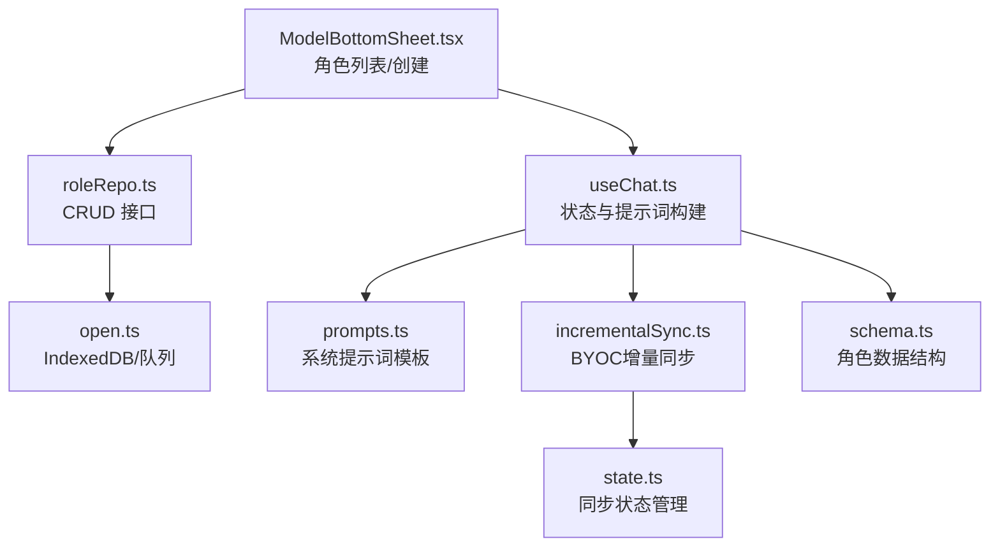
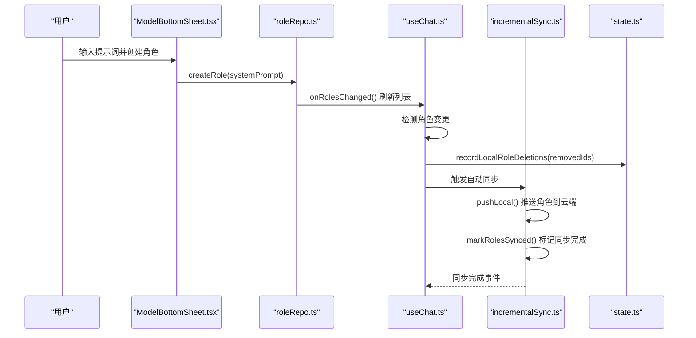
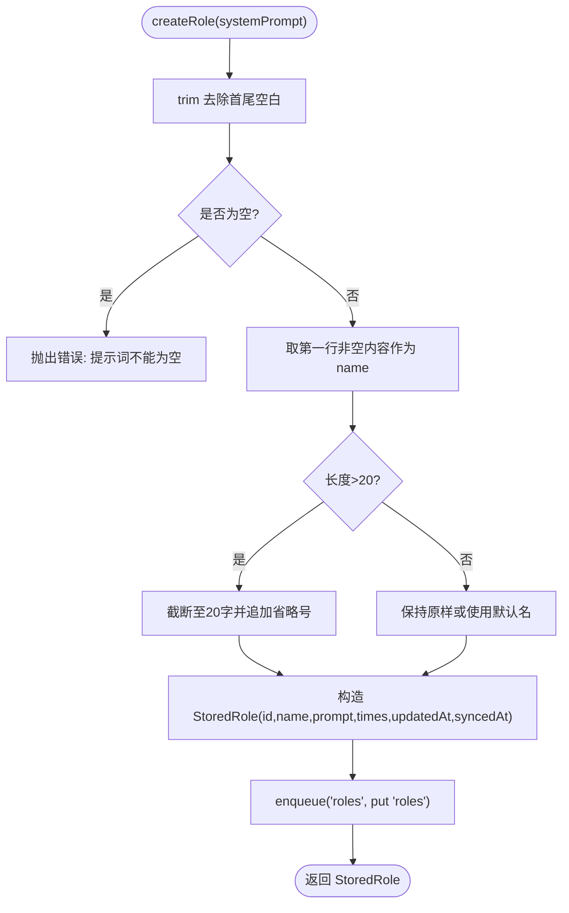
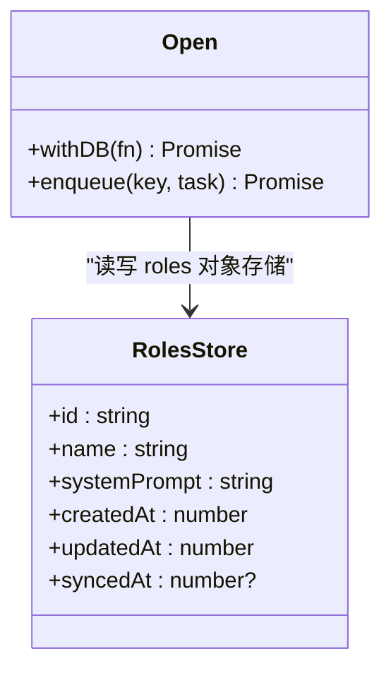
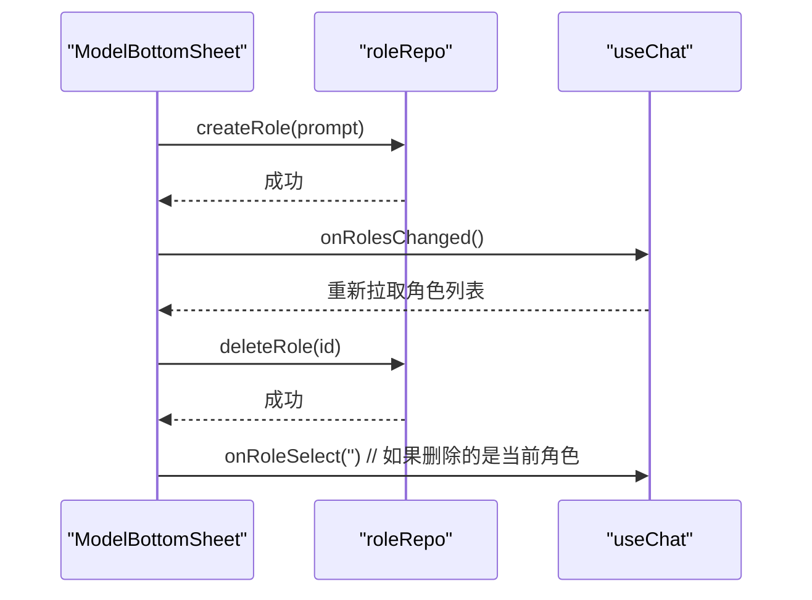
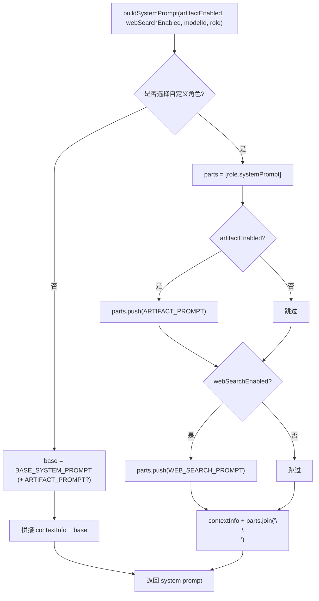
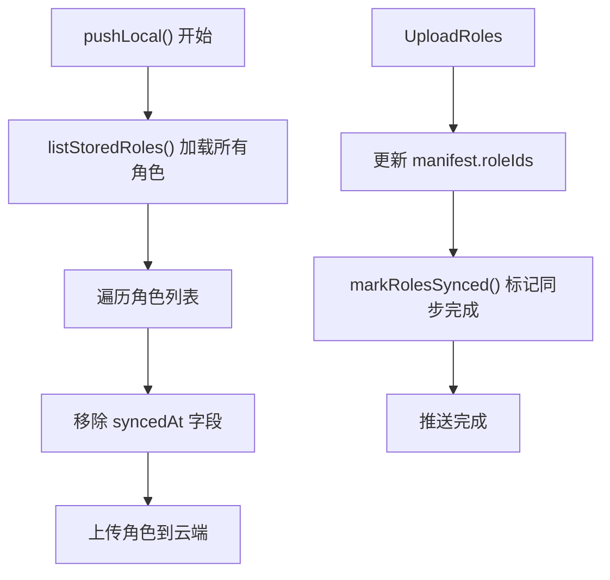
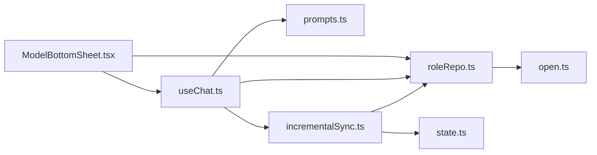

# 角色系统

<cite>
**本文引用的文件**
- [roleRepo.ts](file://src/db/roleRepo.ts)
- [open.ts](file://src/db/open.ts)
- [index.ts](file://src/db/index.ts)
- [schema.ts](file://src/db/schema.ts)
- [ModelBottomSheet.tsx](file://src/components/common/ModelBottomSheet.tsx)
- [useChat.ts](file://src/hooks/useChat.ts)
- [prompts.ts](file://src/config/prompts.ts)
- [incrementalSync.ts](file://src/services/byoc/incrementalSync.ts)
- [byoc_index.ts](file://src/services/byoc/index.ts)
- [state.ts](file://src/services/byoc/state.ts)
</cite>

## 更新摘要
**变更内容**
- 新增角色系统自动云同步功能，包括角色创建/删除的自动检测机制
- 实现元数据清理（移除syncedAt字段）与BYOC增量同步系统的深度集成
- 角色变更现在会触发自动同步流程，确保本地和云端角色数据的一致性
- 新增角色删除的本地墓碑记录机制，支持跨设备删除传播

## 目录
1. [简介](#简介)
2. [项目结构](#项目结构)
3. [核心组件](#核心组件)
4. [架构总览](#架构总览)
5. [详细组件分析](#详细组件分析)
6. [依赖关系分析](#依赖关系分析)
7. [性能考虑](#性能考虑)
8. [故障排查指南](#故障排查指南)
9. [结论](#结论)
10. [附录](#附录)

## 简介
本仓库中的"角色系统"用于将用户自定义的系统提示词保存为可复用、可切换的"角色"。选中某个角色后，发送给模型的 system prompt 完全由该角色决定；同时根据功能开关（如 artifact、联网搜索）动态拼接能力提示词。角色数据持久化在 IndexedDB 中，并支持通过 BYOC（自带云存储）进行增量同步，实现跨设备的角色数据一致性。

**更新** 角色系统现已支持自动云同步，包括角色创建/删除的自动检测、元数据清理（移除syncedAt字段）、与BYOC增量同步系统的深度集成。角色变更现在会触发自动同步流程，确保本地和云端角色数据的一致性。

## 项目结构
围绕角色系统的代码主要分布在以下位置：
- 数据层：IndexedDB 对象存储与索引、写入队列封装
- 领域层：角色的创建、查询、删除等仓储接口
- 表现层：底部抽屉内的角色列表与创建页
- 业务层：聊天流程中构建系统提示词时选择使用默认或自定义角色
- 同步层：BYOC增量同步引擎，处理角色的云端同步
- 配置层：系统提示词模板与上下文信息构建

图表来源
- [ModelBottomSheet.tsx:1-200](file://src/components/common/ModelBottomSheet.tsx#L1-L200)
- [roleRepo.ts:1-72](file://src/db/roleRepo.ts#L1-L72)
- [open.ts:55-139](file://src/db/open.ts#L55-L139)
- [useChat.ts:53-72](file://src/hooks/useChat.ts#L53-L72)
- [incrementalSync.ts:316-339](file://src/services/byoc/incrementalSync.ts#L316-L339)
- [state.ts:86-102](file://src/services/byoc/state.ts#L86-L102)
- [schema.ts:228-234](file://src/db/schema.ts#L228-L234)

章节来源
- [roleRepo.ts:1-72](file://src/db/roleRepo.ts#L1-L72)
- [open.ts:55-139](file://src/db/open.ts#L55-L139)
- [ModelBottomSheet.tsx:1-200](file://src/components/common/ModelBottomSheet.tsx#L1-L200)
- [useChat.ts:53-72](file://src/hooks/useChat.ts#L53-L72)
- [incrementalSync.ts:316-339](file://src/services/byoc/incrementalSync.ts#L316-L339)
- [state.ts:86-102](file://src/services/byoc/state.ts#L86-L102)
- [schema.ts:228-234](file://src/db/schema.ts#L228-L234)

## 核心组件
- 角色仓储 roleRepo：提供角色数据的增删查与 ID 生成，按 createdAt 排序返回。
- 数据库 open：初始化 roles 对象存储与索引，提供 withDB 重试与 enqueue 串行写队列。
- 界面 ModelBottomSheet：展示角色列表、创建新角色、删除角色，并与 useChat 联动。
- 聊天逻辑 useChat：维护角色列表与当前选中角色，并在发送消息前构建 system prompt，同时检测角色变更触发同步。
- 提示词配置 prompts：提供默认系统提示词、联网搜索提示词以及上下文信息构建。
- BYOC同步引擎：处理角色的云端同步，包括推送、拉取、删除传播等功能。
- 类型 schema：定义 StoredRole 等角色相关的数据结构。

章节来源
- [roleRepo.ts:14-71](file://src/db/roleRepo.ts#L14-L71)
- [open.ts:61-64](file://src/db/open.ts#L61-L64)
- [ModelBottomSheet.tsx:18-24](file://src/components/common/ModelBottomSheet.tsx#L18-L24)
- [useChat.ts:180-182](file://src/hooks/useChat.ts#L180-L182)
- [incrementalSync.ts:316-339](file://src/services/byoc/incrementalSync.ts#L316-L339)
- [schema.ts:228-234](file://src/db/schema.ts#L228-L234)

## 架构总览
角色系统的数据流如下：用户在 ModelBottomSheet 中创建/选择/删除角色，调用 roleRepo 进行持久化；useChat 在启动时加载角色列表与当前选中角色；发送消息时根据是否选择了自定义角色来构建 system prompt，再结合 artifact 与联网搜索开关拼接最终提示词。新增的自动同步机制会在检测到角色变更时触发 BYOC 同步流程，确保本地和云端数据的一致性。

图表来源
- [ModelBottomSheet.tsx:232-247](file://src/components/common/ModelBottomSheet.tsx#L232-L247)
- [roleRepo.ts:47-67](file://src/db/roleRepo.ts#L47-L67)
- [useChat.ts:391-411](file://src/hooks/useChat.ts#L391-L411)
- [incrementalSync.ts:316-339](file://src/services/byoc/incrementalSync.ts#L316-L339)
- [byoc_index.ts:89-100](file://src/services/byoc/index.ts#L89-L100)

## 详细组件分析

### 数据层：角色仓储 roleRepo
- 数据结构 RoleData：包含 id、name、systemPrompt、createdAt。
- 从存储记录到业务对象的转换 fromStored。
- ID 生成 newRoleId：优先使用 crypto.randomUUID，回退到时间戳+随机。
- 列表查询 listRoles：按 by_createdAt 索引升序获取。
- 原始记录读取 listStoredRoles：供云同步使用。
- 创建角色 createRole：校验非空、自动提取首行作为名称（最多20字）、写入 roles 表，包含 updatedAt/syncedAt 字段。
- 删除角色 deleteRole：按 id 删除。

图表来源
- [roleRepo.ts:47-67](file://src/db/roleRepo.ts#L47-L67)

章节来源
- [roleRepo.ts:14-71](file://src/db/roleRepo.ts#L14-L71)

### 数据层：IndexedDB 与队列 open
- 对象存储 roles：keyPath 为 id，索引 by_createdAt。
- withDB：统一访问入口，失败时重连重试一次。
- enqueue：按 key 串行化写操作，避免并发冲突；异常吞掉不影响后续任务。

图表来源
- [open.ts:61-64](file://src/db/open.ts#L61-L64)
- [open.ts:100-138](file://src/db/open.ts#L100-L138)

章节来源
- [open.ts:55-139](file://src/db/open.ts#L55-L139)

### 表现层：角色管理界面 ModelBottomSheet
- 角色列表展示：显示角色名与摘要，支持选择与删除。
- 删除确认：首次点击进入确认态，3秒内再次点击才真正删除；若删除的是当前选中角色则清空选择。
- 创建角色：输入提示词后调用 createRole，成功后返回列表并导航返回。
- 与 useChat 集成：通过 onRoleSelect、onRolesChanged 回调更新上层状态。

图表来源
- [ModelBottomSheet.tsx:209-247](file://src/components/common/ModelBottomSheet.tsx#L209-L247)
- [ModelBottomSheet.tsx:530-593](file://src/components/common/ModelBottomSheet.tsx#L530-L593)
- [roleRepo.ts:47-71](file://src/db/roleRepo.ts#L47-L71)

章节来源
- [ModelBottomSheet.tsx:18-24](file://src/components/common/ModelBottomSheet.tsx#L18-L24)
- [ModelBottomSheet.tsx:209-247](file://src/components/common/ModelBottomSheet.tsx#L209-L247)
- [ModelBottomSheet.tsx:530-593](file://src/components/common/ModelBottomSheet.tsx#L530-L593)

### 业务层：提示词构建 useChat
- 状态：维护 roles 与 selectedRoleId，并在启动时加载。
- 构建 system prompt：
  - 未选择角色：使用默认角色（PortAI），按 artifact 开关决定是否附加 artifact 提示词。
  - 选择自定义角色：完全使用该角色的 systemPrompt，并按 artifact 与联网搜索开关动态拼接对应能力提示词。
  - 始终在最前面拼接上下文信息（时间、模型等）。
- **新增** 角色变更检测：启动时对比上次快照，检测角色创建/删除/修改，触发自动同步。

图表来源
- [useChat.ts:53-72](file://src/hooks/useChat.ts#L53-L72)
- [prompts.ts:46-74](file://src/config/prompts.ts#L46-L74)

章节来源
- [useChat.ts:53-72](file://src/hooks/useChat.ts#L53-L72)
- [useChat.ts:180-182](file://src/hooks/useChat.ts#L180-L182)
- [useChat.ts:391-411](file://src/hooks/useChat.ts#L391-L411)
- [prompts.ts:46-74](file://src/config/prompts.ts#L46-L74)

### 同步层：BYOC增量同步引擎
- **新增** 角色同步支持：在 pushLocal 中处理角色的云端同步，包括角色数据的上传、删除传播、索引更新。
- **新增** 元数据清理：推送角色数据时移除 syncedAt 字段，避免本地同步元数据泄露到云端。
- **新增** 角色删除检测：通过本地 tombstone 机制跟踪已删除的角色，确保删除操作能跨设备传播。
- **新增** 同步状态标记：推送成功后批量标记角色的 syncedAt，避免重复同步。

图表来源
- [incrementalSync.ts:316-339](file://src/services/byoc/incrementalSync.ts#L316-L339)
- [incrementalSync.ts:718-729](file://src/services/byoc/incrementalSync.ts#L718-L729)

章节来源
- [incrementalSync.ts:316-339](file://src/services/byoc/incrementalSync.ts#L316-L339)
- [incrementalSync.ts:718-729](file://src/services/byoc/incrementalSync.ts#L718-L729)

### 同步状态管理
- **新增** 角色待同步计数：countPending() 函数现在包含角色待同步数量的统计。
- **新增** 本地墓碑记录：recordLocalRoleDeletions() 函数记录本机删除的角色ID，确保删除操作能跨设备传播。
- **新增** 自动同步调度：scheduleAutoSync() 每60秒检查待同步量，包括角色变更，>0就触发同步。

章节来源
- [state.ts:86-102](file://src/services/byoc/state.ts#L86-L102)
- [byoc_index.ts:89-100](file://src/services/byoc/index.ts#L89-L100)
- [byoc_index.ts:215-238](file://src/services/byoc/index.ts#L215-L238)

### 类型与数据结构
- StoredRole：继承自 SyncMeta，包含 updatedAt/syncedAt 字段，用于同步状态管理。
- MessageRole：'user' | 'assistant' | 'system'，用于消息的角色分类。
- 角色系统与消息角色解耦：角色影响 system prompt 的内容，不改变消息本身的 role 字段。

章节来源
- [schema.ts:228-234](file://src/db/schema.ts#L228-L234)
- [schema.ts:293-299](file://src/db/schema.ts#L293-L299)

## 依赖关系分析
- ModelBottomSheet 依赖 roleRepo 的 createRole/deleteRole，并通过回调与 useChat 通信。
- useChat 依赖 roleRepo 的 listRoles 与本地状态，负责构建 system prompt，并检测角色变更触发同步。
- roleRepo 依赖 open 提供的 withDB 与 enqueue，以及 IndexedDB 的 roles 对象存储。
- prompts 提供基础提示词与上下文信息构建，被 useChat 在构建 system prompt 时引用。
- **新增** incrementalSync 依赖 roleRepo 的 listStoredRoles 和 deleteRole，处理角色的云端同步。
- **新增** state 模块提供角色同步状态管理和待同步数量统计。

图表来源
- [ModelBottomSheet.tsx:1-200](file://src/components/common/ModelBottomSheet.tsx#L1-L200)
- [roleRepo.ts:1-72](file://src/db/roleRepo.ts#L1-L72)
- [useChat.ts:53-72](file://src/hooks/useChat.ts#L53-L72)
- [incrementalSync.ts:316-339](file://src/services/byoc/incrementalSync.ts#L316-L339)
- [state.ts:86-102](file://src/services/byoc/state.ts#L86-L102)

章节来源
- [roleRepo.ts:1-72](file://src/db/roleRepo.ts#L1-L72)
- [open.ts:55-139](file://src/db/open.ts#L55-L139)
- [ModelBottomSheet.tsx:1-200](file://src/components/common/ModelBottomSheet.tsx#L1-L200)
- [useChat.ts:53-72](file://src/hooks/useChat.ts#L53-L72)
- [incrementalSync.ts:316-339](file://src/services/byoc/incrementalSync.ts#L316-L339)
- [state.ts:86-102](file://src/services/byoc/state.ts#L86-L102)

## 性能考虑
- 写入队列：通过 enqueue 对同一 key 的写操作串行化，避免 IndexedDB 并发写入导致的竞争条件。
- 索引优化：roles 表按 createdAt 建立索引，listRoles 查询高效。
- 提示词拼接：仅在必要时拼接 artifact 与联网搜索提示词，减少不必要的字符串处理。
- 启动加载：useChat 启动时仅加载必要元数据，按需恢复会话，降低冷启动开销。
- **新增** 增量同步：通过 updatedAt/syncedAt 字段实现增量同步，只传输变更的数据，减少网络传输量。
- **新增** 批量操作：markRolesSynced() 批量标记角色同步状态，减少数据库操作次数。

## 故障排查指南
- 创建角色失败：检查提示词是否为空；查看控制台日志中的错误信息。
- 删除角色无响应：确认是否在确认态再次点击；检查 onRolesChanged 是否正确触发。
- 角色未生效：确认 useChat 中 selectedRoleId 是否更新；检查 buildSystemPrompt 是否按预期拼接。
- 数据库连接问题：withDB 会自动重连重试；若仍失败，检查 IndexedDB 权限与多标签页占用情况。
- **新增** 同步失败：检查 BYOC 配置是否完整；查看控制台日志中的同步错误信息；确认网络连接正常。
- **新增** 角色不同步：检查 countPending() 返回的角色待同步数量；确认 scheduleAutoSync() 是否正常启动。

章节来源
- [roleRepo.ts:47-67](file://src/db/roleRepo.ts#L47-L67)
- [open.ts:100-112](file://src/db/open.ts#L100-L112)
- [ModelBottomSheet.tsx:209-247](file://src/components/common/ModelBottomSheet.tsx#L209-L247)
- [useChat.ts:53-72](file://src/hooks/useChat.ts#L53-L72)
- [incrementalSync.ts:316-339](file://src/services/byoc/incrementalSync.ts#L316-L339)
- [state.ts:86-102](file://src/services/byoc/state.ts#L86-L102)

## 结论
角色系统将用户自定义的系统提示词持久化并可在聊天中快速切换，结合功能开关实现灵活的提示词组合。整体设计清晰，数据层与表现层职责明确，具备可扩展性与良好的用户体验。**新增的自动云同步功能**进一步增强了角色系统的实用性，实现了跨设备的角色数据一致性，提升了多设备使用场景下的用户体验。

## 附录
- 导出与聚合：db/index.ts 汇总导出角色相关接口与类型，便于上层模块统一引入。
- **新增** BYOC集成：通过 services/byoc/index.ts 提供统一的同步接口，支持自动同步和手动同步两种模式。

章节来源
- [index.ts:103-109](file://src/db/index.ts#L103-L109)
- [byoc_index.ts:1-239](file://src/services/byoc/index.ts#L1-L239)