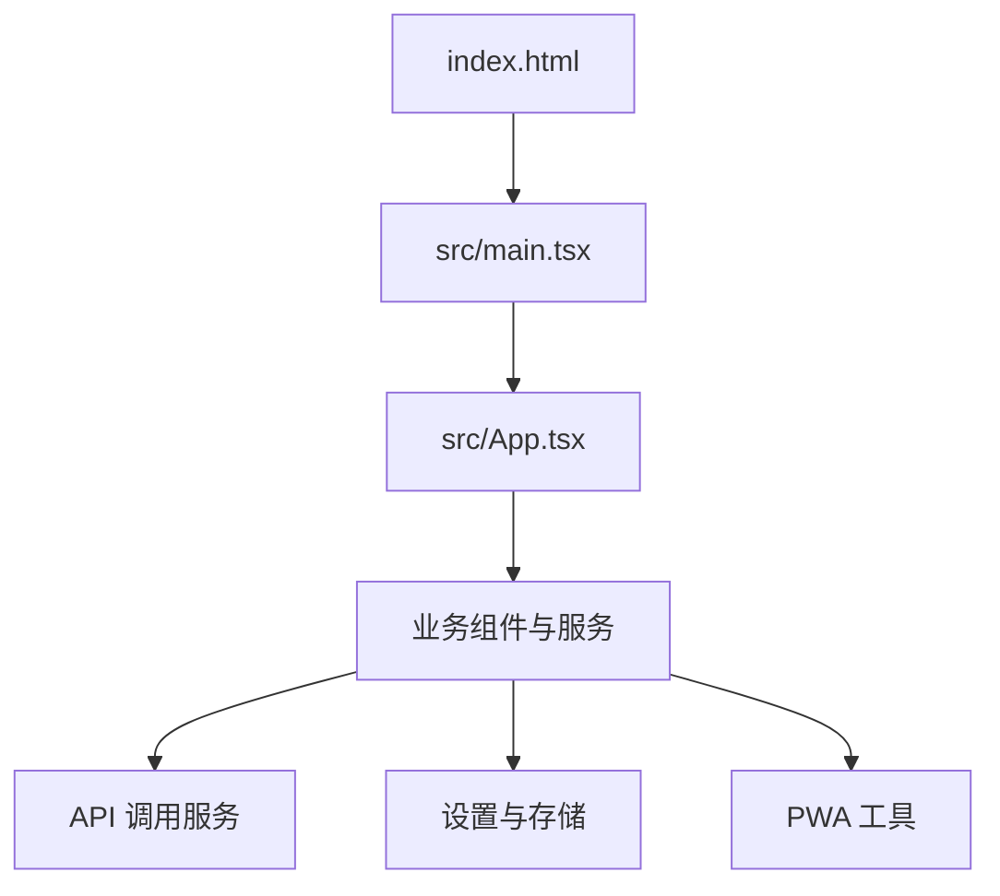
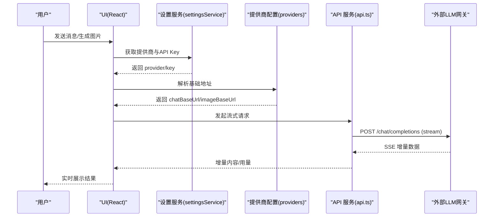
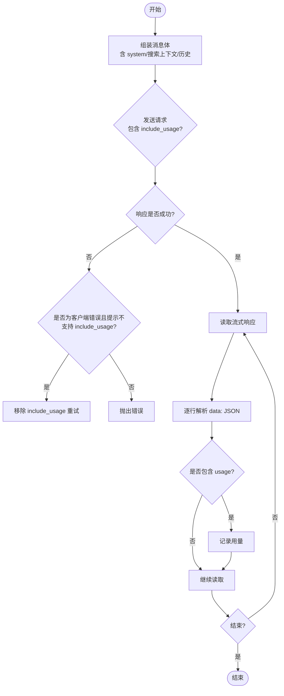
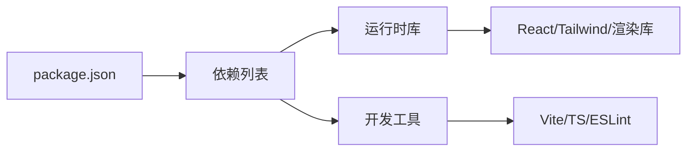

# 部署指南

<cite>
**本文引用的文件**
- [package.json](file://package.json)
- [vite.config.ts](file://vite.config.ts)
- [index.html](file://index.html)
- [manifest.webmanifest](file://public/manifest.webmanifest)
- [src/main.tsx](file://src/main.tsx)
- [src/App.tsx](file://src/App.tsx)
- [src/services/api.ts](file://src/services/api.ts)
- [src/services/settingsService.ts](file://src/services/settingsService.ts)
- [src/config/providers.ts](file://src/config/providers.ts)
- [src/utils/pwa.ts](file://src/utils/pwa.ts)
- [src/config/version.ts](file://src/config/version.ts)
- [.github/workflows/release.yml](file://.github/workflows/release.yml)
</cite>

## 目录
1. [简介](#简介)
2. [项目结构](#项目结构)
3. [核心组件](#核心组件)
4. [架构总览](#架构总览)
5. [详细组件分析](#详细组件分析)
6. [依赖分析](#依赖分析)
7. [性能考虑](#性能考虑)
8. [故障排除指南](#故障排除指南)
9. [结论](#结论)
10. [附录](#附录)

## 简介
本指南面向生产环境，提供 AIShop（基于 React + TypeScript + Vite）的构建与部署方案。内容涵盖：
- 生产构建配置与优化选项（代码压缩、资源优化、缓存策略）
- PWA 功能配置与部署注意事项
- 多平台部署指引（静态网站托管、容器化部署）
- 环境变量与运行时配置管理
- 性能监控与错误收集接入建议
- 部署后验证与测试步骤
- 常见问题排查

## 项目结构
AIShop 为纯前端应用，通过 Vite 进行开发与构建，产物为静态资源，可直接由任意静态站点服务器或 CDN 托管。关键入口与配置如下：
- 应用入口：index.html 引入根节点与 main.tsx
- 应用启动：main.tsx 渲染 App 组件
- 构建工具链：Vite + React 插件 + Tailwind CSS
- PWA：manifest.webmanifest 定义应用元数据与图标
- 版本注入：vite.config.ts 将 package.json 的版本注入到 __APP_VERSION__

**图表来源**
- [index.html:1-23](file://index.html#L1-L23)
- [src/main.tsx:1-8](file://src/main.tsx#L1-L8)
- [src/App.tsx:1-147](file://src/App.tsx#L1-L147)

**章节来源**
- [index.html:1-23](file://index.html#L1-L23)
- [src/main.tsx:1-8](file://src/main.tsx#L1-L8)
- [vite.config.ts:1-18](file://vite.config.ts#L1-L18)
- [package.json:1-47](file://package.json#L1-L47)

## 核心组件
- 构建与脚本：通过 npm scripts 提供 dev/build/preview/lint；构建命令执行类型检查与 Vite 打包
- 插件与样式：启用 @vitejs/plugin-react 与 @tailwindcss/vite
- 版本常量：在 vite.config.ts 中通过 define 注入 __APP_VERSION__，供运行时读取
- PWA 清单：manifest.webmanifest 声明名称、显示模式、主题色与图标集
- 应用初始化：App 组件在启动时申请持久化存储并加载主题

**章节来源**
- [package.json:6-10](file://package.json#L6-L10)
- [vite.config.ts:6-16](file://vite.config.ts#L6-L16)
- [src/config/version.ts:1-16](file://src/config/version.ts#L1-L16)
- [public/manifest.webmanifest:1-21](file://public/manifest.webmanifest#L1-L21)
- [src/App.tsx:16-28](file://src/App.tsx#L16-L28)

## 架构总览
应用采用“前端直连后端 API”的架构。用户操作触发聊天/图像等请求，前端通过流式接口获取响应，并在本地进行状态管理与持久化。PWA 能力增强离线体验与安装体验。

**图表来源**
- [src/services/api.ts:44-173](file://src/services/api.ts#L44-L173)
- [src/services/settingsService.ts:59-84](file://src/services/settingsService.ts#L59-L84)
- [src/config/providers.ts:1-18](file://src/config/providers.ts#L1-L18)

## 详细组件分析

### 构建与生产优化
- 构建命令：使用 tsc -b 进行类型检查，再执行 vite build 产出静态资源
- 插件：启用 React 与 Tailwind CSS 构建支持
- 版本注入：通过 define 将 package.json 的 version 注入为 __APP_VERSION__，便于运行时识别版本
- 目标与模块：TypeScript 目标 es2023，模块解析为 bundler 模式，开启 JSX transform
- 预览与校验：提供 preview 与 lint 脚本用于本地验证与质量检查

优化建议（结合现有配置）：
- 保持默认 Vite 生产构建的压缩与分包策略
- 如需更细粒度控制，可在 vite.config.ts 中扩展 build 选项（例如 chunk 大小、sourcemap 开关）
- 利用 CDN 对静态资源开启长期缓存与 gzip/brotli 压缩

**章节来源**
- [package.json:6-10](file://package.json#L6-L10)
- [vite.config.ts:6-16](file://vite.config.ts#L6-L16)
- [tsconfig.app.json:1-26](file://tsconfig.app.json#L1-L26)

### PWA 配置与部署注意
- 清单文件：manifest.webmanifest 定义了应用名、短名、显示模式 standalone、主题色与多尺寸图标
- HTML 入口：index.html 引用 manifest 与 favicon，设置视口与主题色
- 运行态行为：App 启动时尝试申请持久化存储，降低数据被系统回收的概率；同时检测是否以独立窗口运行（已安装）
- iOS 注意事项：Safari 不支持 navigator.storage.persist()，需引导用户“添加到主屏幕”以获得更稳定的存储隔离

部署要点：
- 确保 HTTPS 环境下部署，以便浏览器允许 PWA 相关能力
- 提供完整的图标资源路径，保证在不同设备上的显示效果
- 若需要 Service Worker，可结合 Vite 生态插件实现缓存策略与离线能力

**章节来源**
- [public/manifest.webmanifest:1-21](file://public/manifest.webmanifest#L1-L21)
- [index.html:1-23](file://index.html#L1-L23)
- [src/App.tsx:16-28](file://src/App.tsx#L16-L28)
- [src/utils/pwa.ts:1-67](file://src/utils/pwa.ts#L1-L67)

### 环境变量与运行时配置
- 构建期变量：通过 vite.config.ts 的 define 注入 __APP_VERSION__，单一来源来自 package.json
- 运行期配置：提供商与 API Key 通过 settingsService 持久化至 localStorage，支持动态切换与保存
- 提供商端点：providers.ts 集中维护各提供商的基础地址，可按需扩展
- 版本信息：version.ts 暴露 APP_VERSION 与构建时间，便于问题定位与发布追踪

最佳实践：
- 敏感信息（如 API Key）不应硬编码，优先通过用户设置或安全的环境注入方式提供
- 不同环境的差异（如域名、端口、特性开关）可通过构建期变量或运行时配置区分

**章节来源**
- [vite.config.ts:14-16](file://vite.config.ts#L14-L16)
- [src/services/settingsService.ts:1-101](file://src/services/settingsService.ts#L1-L101)
- [src/config/providers.ts:1-18](file://src/config/providers.ts#L1-L18)
- [src/config/version.ts:1-16](file://src/config/version.ts#L1-L16)

### API 调用与错误处理
- 流式请求：api.ts 使用 fetch 发起 SSE 流式请求，逐行解析增量内容与 usage
- 兼容处理：当网关不支持 stream_options/include_usage 时自动降级重试，确保对话可用性
- 错误上报：遇到非 2xx 响应会抛出错误，建议在 UI 层捕获并提示用户
- 用量统计：解析 usage 字段，支持缓存命中与写入 token 的统计

**图表来源**
- [src/services/api.ts:44-173](file://src/services/api.ts#L44-L173)

**章节来源**
- [src/services/api.ts:44-173](file://src/services/api.ts#L44-L173)

### 持续集成与发布
- GitHub Actions：release.yml 在打 tag 时触发构建，安装依赖并执行 npm run build，上传 dist 制品
- 建议后续步骤：将 dist 发布至静态托管平台或容器镜像仓库

**章节来源**
- [.github/workflows/release.yml:1-35](file://.github/workflows/release.yml#L1-L35)

## 依赖分析
- 运行时依赖：React、Tailwind、Markdown/KaTeX 渲染、PDF/XLSX 处理、IndexedDB 等
- 开发依赖：Vite、TypeScript、ESLint、React 插件
- 构建产物：静态资源（HTML/CSS/JS），无服务端逻辑

**图表来源**
- [package.json:12-45](file://package.json#L12-L45)

**章节来源**
- [package.json:12-45](file://package.json#L12-L45)

## 性能考虑
- 构建优化：Vite 默认在生产模式下启用代码压缩与按需分包；可结合 CDN 开启 gzip/brotli
- 资源缓存：静态资源文件名带哈希，适合长期缓存；HTML 应短期缓存或强制刷新
- 首屏优化：减少首屏依赖体积，按需加载重型库（如 PDF/XLSX）
- 网络优化：合理设置 HTTP 缓存头（Cache-Control/ETag），启用 CDN 边缘缓存
- 流式交互：使用 SSE 流式输出提升感知性能；避免一次性加载大量历史数据
- 存储优化：合理使用 IndexedDB 与 localStorage，定期清理无用数据

[本节为通用指导，不直接分析具体文件]

## 故障排除指南
- 无法连接 API：检查 settingsService 中的提供商与 API Key 是否正确；确认 providers.ts 中的基础地址有效
- 流式请求失败：查看 api.ts 的错误分支，确认网关是否支持 include_usage；必要时降级重试
- PWA 未生效：确认部署为 HTTPS；检查 manifest.webmanifest 路径与图标资源是否存在；在 Safari 上引导“添加到主屏幕”
- 构建失败：检查 Node 版本与依赖安装；确认 TypeScript 编译无误；使用 npm run lint 定位问题
- 版本不一致：确认 vite.config.ts 注入的 __APP_VERSION__ 与 package.json 一致；通过 version.ts 获取运行时版本

**章节来源**
- [src/services/settingsService.ts:59-84](file://src/services/settingsService.ts#L59-L84)
- [src/config/providers.ts:1-18](file://src/config/providers.ts#L1-L18)
- [src/services/api.ts:102-118](file://src/services/api.ts#L102-L118)
- [public/manifest.webmanifest:1-21](file://public/manifest.webmanifest#L1-L21)
- [vite.config.ts:14-16](file://vite.config.ts#L14-L16)
- [src/config/version.ts:1-16](file://src/config/version.ts#L1-L16)

## 结论
AIShop 作为纯前端应用，具备清晰的构建流程与完善的 PWA 支持。通过合理的构建优化、缓存策略与错误处理，可在多种平台上稳定部署与运行。建议在生产环境中结合 CI/CD、CDN 与监控体系，持续提升用户体验与可维护性。

[本节为总结性内容，不直接分析具体文件]

## 附录

### 生产环境构建与优化清单
- 使用 npm run build 进行生产构建
- 启用 Vite 默认压缩与分包
- 配置 CDN 缓存策略（静态资源长期缓存，HTML 短期缓存）
- 开启 gzip/brotli 压缩
- 校验 TypeScript 与 ESLint 规则

**章节来源**
- [package.json:6-10](file://package.json#L6-L10)
- [vite.config.ts:6-16](file://vite.config.ts#L6-L16)

### PWA 部署注意事项
- 确保 HTTPS 部署
- 提供完整图标资源
- 在 Safari 上引导“添加到主屏幕”
- 如需离线能力，可结合 Service Worker 与缓存策略

**章节来源**
- [public/manifest.webmanifest:1-21](file://public/manifest.webmanifest#L1-L21)
- [index.html:1-23](file://index.html#L1-L23)
- [src/utils/pwa.ts:1-67](file://src/utils/pwa.ts#L1-L67)

### 多平台部署指引
- 静态网站托管：将 dist 目录上传至任意静态托管平台（如 GitHub Pages、Vercel、Netlify、Cloudflare Pages）
- 容器化部署：将 dist 放入 Nginx/Apache 镜像，或通过 Docker 构建镜像并暴露静态资源服务
- CI/CD：使用 .github/workflows/release.yml 在打 tag 时构建并产出 dist

**章节来源**
- [.github/workflows/release.yml:1-35](file://.github/workflows/release.yml#L1-L35)

### 环境变量与配置管理
- 构建期：通过 vite.config.ts 的 define 注入 __APP_VERSION__
- 运行期：通过 settingsService 管理提供商与 API Key，持久化至 localStorage
- 版本信息：通过 version.ts 获取运行时版本与构建时间

**章节来源**
- [vite.config.ts:14-16](file://vite.config.ts#L14-L16)
- [src/services/settingsService.ts:1-101](file://src/services/settingsService.ts#L1-L101)
- [src/config/version.ts:1-16](file://src/config/version.ts#L1-L16)

### 性能监控与错误收集（接入建议）
- 性能指标：可接入 Web Vitals 或自定义埋点，采集首次绘制、可交互时间等指标
- 错误收集：在前端捕获全局异常与未处理的 Promise 拒绝，上报至日志系统
- 用量统计：利用 api.ts 解析的 usage 信息进行成本与性能分析

[本节为通用指导，不直接分析具体文件]

### 部署后验证与测试步骤
- 访问首页：确认页面正常加载与主题正确
- PWA 能力：检查是否能添加到主屏幕，独立窗口运行是否正常
- API 连通性：发送一条消息，确认流式响应与用量统计
- 构建产物：检查 dist 目录结构与资源哈希
- 回归测试：覆盖主要功能路径（聊天、图片、设置）

**章节来源**
- [src/main.tsx:1-8](file://src/main.tsx#L1-L8)
- [src/App.tsx:16-28](file://src/App.tsx#L16-L28)
- [src/services/api.ts:44-173](file://src/services/api.ts#L44-L173)