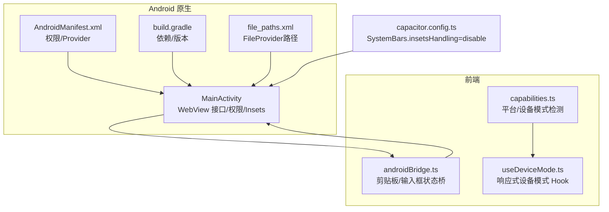
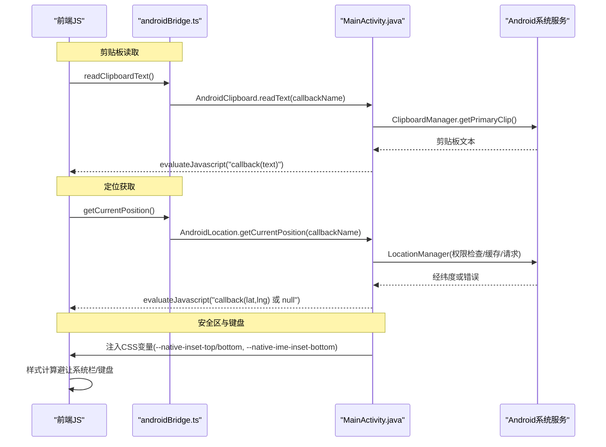
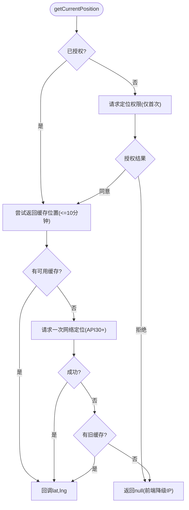
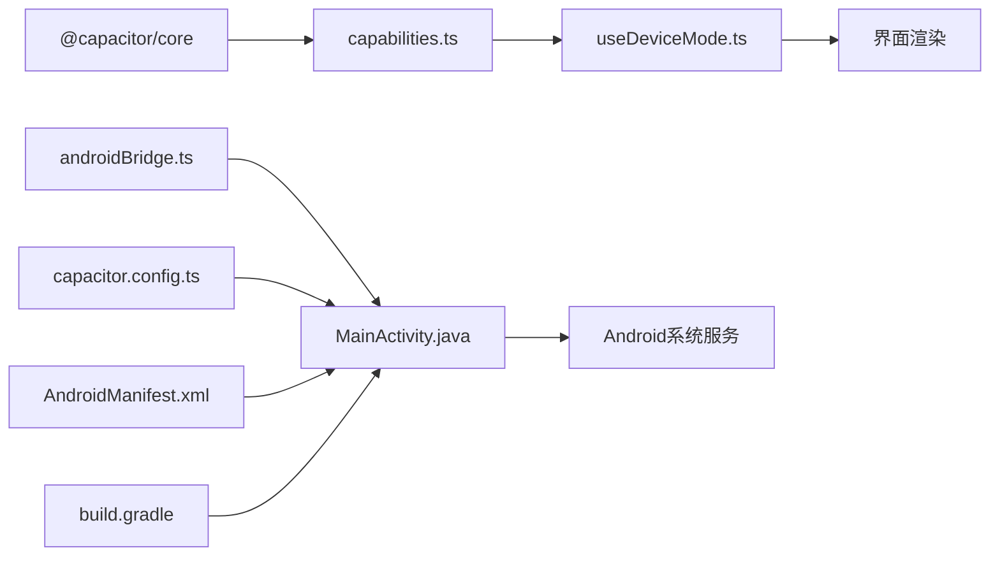

# Android Capacitor 原生平台支持

<cite>
**本文引用的文件**
- [MainActivity.java](file://android/app/src/main/java/com/portai/app/MainActivity.java)
- [AndroidManifest.xml](file://android/app/src/main/AndroidManifest.xml)
- [build.gradle](file://android/app/build.gradle)
- [capacitor.config.ts](file://capacitor.config.ts)
- [androidBridge.ts](file://src/utils/androidBridge.ts)
- [capabilities.ts](file://src/platform/capabilities.ts)
- [useDeviceMode.ts](file://src/platform/useDeviceMode.ts)
- [file_paths.xml](file://android/app/src/main/res/xml/file_paths.xml)
- [package.json](file://package.json)
</cite>

## 目录
1. [简介](#简介)
2. [项目结构](#项目结构)
3. [核心组件](#核心组件)
4. [架构总览](#架构总览)
5. [详细组件分析](#详细组件分析)
6. [依赖关系分析](#依赖关系分析)
7. [性能考量](#性能考量)
8. [故障排查指南](#故障排查指南)
9. [结论](#结论)
10. [附录](#附录)

## 简介
本项目基于 Capacitor 将 Web 应用打包为 Android 原生应用。Android 壳通过自定义 MainActivity 暴露一组轻量桥接接口（触感、剪贴板、输入框状态、定位），并处理系统栏安全区与键盘高度等 UI 适配问题；前端通过 TypeScript 工具函数与能力检测模块调用这些原生能力，实现跨平台一致的体验。

## 项目结构
- Android 原生层
  - 入口 Activity：继承 BridgeActivity，注册 WebView 接口、拦截长按、注入 CSS 变量以适配系统栏与键盘。
  - 权限声明：网络、振动、相机、定位等。
  - 构建配置：Capacitor 插件、版本、资源忽略规则等。
  - FileProvider：用于分享/读取外部存储图片。
- 前端桥接与能力检测
  - androidBridge.ts：封装与原生层的异步/同步调用（剪贴板、输入框状态）。
  - capabilities.ts / useDeviceMode.ts：识别运行环境（是否 Android 原生）、设备形态（移动/桌面）并响应窗口变化。
- Capacitor 配置
  - capacitor.config.ts：关闭 SystemBars 自动 insets 处理，由原生层注入真实安全区值。

图表来源
- [MainActivity.java:15-325](file://android/app/src/main/java/com/portai/app/MainActivity.java#L15-L325)
- [AndroidManifest.xml:1-43](file://android/app/src/main/AndroidManifest.xml#L1-L43)
- [build.gradle:1-55](file://android/app/build.gradle#L1-L55)
- [file_paths.xml:1-5](file://android/app/src/main/res/xml/file_paths.xml#L1-L5)
- [androidBridge.ts:1-52](file://src/utils/androidBridge.ts#L1-L52)
- [capabilities.ts:1-44](file://src/platform/capabilities.ts#L1-L44)
- [useDeviceMode.ts:1-21](file://src/platform/useDeviceMode.ts#L1-L21)
- [capacitor.config.ts:1-18](file://capacitor.config.ts#L1-L18)

章节来源
- [MainActivity.java:15-325](file://android/app/src/main/java/com/portai/app/MainActivity.java#L15-L325)
- [AndroidManifest.xml:1-43](file://android/app/src/main/AndroidManifest.xml#L1-L43)
- [build.gradle:1-55](file://android/app/build.gradle#L1-L55)
- [capacitor.config.ts:1-18](file://capacitor.config.ts#L1-L18)
- [androidBridge.ts:1-52](file://src/utils/androidBridge.ts#L1-L52)
- [capabilities.ts:1-44](file://src/platform/capabilities.ts#L1-L44)
- [useDeviceMode.ts:1-21](file://src/platform/useDeviceMode.ts#L1-L21)
- [file_paths.xml:1-5](file://android/app/src/main/res/xml/file_paths.xml#L1-L5)

## 核心组件
- 原生桥接层（MainActivity）
  - 触感反馈：通过 performHapticFeedback 提供系统级触感，避免与 WebView 默认长按触感叠加。
  - 输入框状态：接收前端同步的当前聚焦输入框 type，辅助密码框长按菜单分流。
  - 剪贴板：使用 ClipboardManager 读取系统剪贴板文本，回调到 JS。
  - 定位：优先缓存位置，必要时请求一次新鲜定位；权限拒绝后不再重复弹窗，前端降级 IP 定位。
  - 安全区与键盘：注入 CSS 变量 --native-inset-top/bottom 与 --native-ime-inset-bottom，统一前端避让逻辑。
- 前端桥接与能力检测
  - androidBridge.ts：封装 readClipboardText() 与 syncFocusedInputType()，在 Android 壳走原生桥，其他平台回退 Web API。
  - capabilities.ts：isNativePlatform()/isNativeAndroid() 判断运行环境；detectDeviceMode() 判定移动/桌面布局。
  - useDeviceMode.ts：基于 resize/orientationchange 事件实时订阅设备模式变化。
- Capacitor 配置
  - 关闭 SystemBars 自动 insets 处理，交由原生注入真实安全区值，解决 Android 15+/16 上视口裁剪与 env(safe-area-inset-*) 恒为 0 的问题。

章节来源
- [MainActivity.java:51-261](file://android/app/src/main/java/com/portai/app/MainActivity.java#L51-L261)
- [MainActivity.java:263-323](file://android/app/src/main/java/com/portai/app/MainActivity.java#L263-L323)
- [androidBridge.ts:1-52](file://src/utils/androidBridge.ts#L1-L52)
- [capabilities.ts:1-44](file://src/platform/capabilities.ts#L1-L44)
- [useDeviceMode.ts:1-21](file://src/platform/useDeviceMode.ts#L1-L21)
- [capacitor.config.ts:1-18](file://capacitor.config.ts#L1-L18)

## 架构总览
下图展示了前端与 Android 原生之间的交互流程，包括剪贴板读取、定位获取、以及系统栏/键盘 Insets 注入。

图表来源
- [androidBridge.ts:23-51](file://src/utils/androidBridge.ts#L23-L51)
- [MainActivity.java:97-210](file://android/app/src/main/java/com/portai/app/MainActivity.java#L97-L210)
- [MainActivity.java:281-323](file://android/app/src/main/java/com/portai/app/MainActivity.java#L281-L323)

## 详细组件分析

### 原生桥接：MainActivity
- 职责
  - 注册 WebView JavaScriptInterface：触感、输入框状态、剪贴板、定位。
  - 拦截 WebView 长按，避免与前端自实现上下文菜单冲突，同时保留输入框长按的系统选择行为。
  - 注入 CSS 变量，使前端统一处理刘海屏、导航栏、键盘高度等边缘区域。
- 关键流程
  - 剪贴板读取：主线程读取系统剪贴板，evaluateJavascript 回调到 JS。
  - 定位流程：优先返回 10 分钟内缓存位置；否则请求一次网络定位；失败则返回错误，前端降级 IP 定位。
  - 安全区与键盘：页面加载后注入顶部/底部安全区；监听 IME 可见性并注入键盘高度。
- 复杂度与性能
  - 定位采用缓存 + 单次请求策略，减少频繁唤醒 GPS，提升响应速度。
  - 剪贴板读取为 O(1) 操作，异常时按空剪贴板处理，保证稳定性。
- 错误处理
  - 定位权限拒绝后不再重复弹窗，直接返回错误供前端降级。
  - WebView 为空或系统服务不可用时，静默跳过或返回错误。

图表来源
- [MainActivity.java:132-210](file://android/app/src/main/java/com/portai/app/MainActivity.java#L132-L210)

章节来源
- [MainActivity.java:51-261](file://android/app/src/main/java/com/portai/app/MainActivity.java#L51-L261)
- [MainActivity.java:263-323](file://android/app/src/main/java/com/portai/app/MainActivity.java#L263-L323)

### 前端桥接：androidBridge.ts
- 职责
  - 在 Android 壳优先使用原生剪贴板读取，避免 Web API 权限不稳定导致的 NotAllowedError。
  - 同步当前聚焦输入框类型给原生层，用于密码框长按菜单分流。
- 设计要点
  - 通过 window 上的全局对象进行桥接，非 Android 环境静默跳过。
  - 剪贴板读取使用临时回调名 + Promise 包装，超时保护 2 秒。

章节来源
- [androidBridge.ts:1-52](file://src/utils/androidBridge.ts#L1-L52)

### 平台与设备模式：capabilities.ts / useDeviceMode.ts
- 职责
  - 识别是否运行在 Capacitor 原生平台（Android/iOS），并进一步区分 Android。
  - 根据指针类型、窗口宽度、是否 Electron 等条件判定移动/桌面模式。
  - 提供 React Hook 实时响应窗口尺寸与方向变化。
- 行为说明
  - 原生 Android 始终返回 mobile，确保大屏平板/折叠屏横屏仍保持移动端布局。
  - 小于 480px 强制 mobile，防止桌面布局被极端窄窗口破坏。

章节来源
- [capabilities.ts:1-44](file://src/platform/capabilities.ts#L1-L44)
- [useDeviceMode.ts:1-21](file://src/platform/useDeviceMode.ts#L1-L21)

### Capacitor 配置：capacitor.config.ts
- 关键点
  - 关闭 SystemBars 自动 insets 处理，避免 Android 15+/16 上视口裁剪与安全区变量失效。
  - 由 MainActivity 注入真实安全区值，前端统一使用 CSS 变量避让。

章节来源
- [capacitor.config.ts:1-18](file://capacitor.config.ts#L1-L18)

### 构建与权限：build.gradle / AndroidManifest.xml / file_paths.xml
- build.gradle
  - 引入 Capacitor Android 插件与 Cordova 插件工程，设置应用 ID、版本、编译目标等。
- AndroidManifest.xml
  - 声明 INTERNET、VIBRATE、CAMERA、ACCESS_COARSE_LOCATION、ACCESS_FINE_LOCATION 等权限。
  - 配置 FileProvider 以支持文件共享。
- file_paths.xml
  - 定义外部存储与缓存目录路径，供 FileProvider 访问。

章节来源
- [build.gradle:1-55](file://android/app/build.gradle#L1-L55)
- [AndroidManifest.xml:1-43](file://android/app/src/main/AndroidManifest.xml#L1-L43)
- [file_paths.xml:1-5](file://android/app/src/main/res/xml/file_paths.xml#L1-L5)

## 依赖关系分析
- 前端依赖
  - @capacitor/core 用于平台检测与能力判断。
  - React Hooks 用于响应式设备模式更新。
- 原生依赖
  - androidx.core、coordinatorlayout、splashscreen 等基础库。
  - Capacitor Android 插件与 Cordova 插件工程。
- 运行时耦合
  - 前端通过 window 全局对象与原生桥通信，解耦良好，非 Android 环境无感知。
  - 原生层对 WebView 生命周期敏感，需在 onPageStarted/onPageLoaded 中确保接口注入与 CSS 变量注入。

图表来源
- [capabilities.ts:1-44](file://src/platform/capabilities.ts#L1-L44)
- [useDeviceMode.ts:1-21](file://src/platform/useDeviceMode.ts#L1-L21)
- [androidBridge.ts:1-52](file://src/utils/androidBridge.ts#L1-L52)
- [MainActivity.java:15-325](file://android/app/src/main/java/com/portai/app/MainActivity.java#L15-L325)
- [capacitor.config.ts:1-18](file://capacitor.config.ts#L1-L18)
- [AndroidManifest.xml:1-43](file://android/app/src/main/AndroidManifest.xml#L1-L43)
- [build.gradle:1-55](file://android/app/build.gradle#L1-L55)

章节来源
- [package.json:12-22](file://package.json#L12-L22)
- [capabilities.ts:1-44](file://src/platform/capabilities.ts#L1-L44)
- [androidBridge.ts:1-52](file://src/utils/androidBridge.ts#L1-L52)
- [MainActivity.java:15-325](file://android/app/src/main/java/com/portai/app/MainActivity.java#L15-L325)
- [capacitor.config.ts:1-18](file://capacitor.config.ts#L1-L18)
- [AndroidManifest.xml:1-43](file://android/app/src/main/AndroidManifest.xml#L1-L43)
- [build.gradle:1-55](file://android/app/build.gradle#L1-L55)

## 性能考量
- 定位优化
  - 优先返回 10 分钟内缓存位置，减少冷启动延迟。
  - 仅在必要时请求一次网络定位，避免频繁唤醒 GPS。
- 剪贴板读取
  - 原生读取稳定且无需额外权限，避免 Web API 在不同 WebView 版本的兼容性问题。
- 安全区与键盘
  - 通过 CSS 变量统一处理，避免多次重排；仅在系统栏/键盘变化时注入。
- 长按触感
  - 禁用 WebView 自身长按触感，避免与前端桥叠加造成密集触感。

[本节为通用指导，不直接分析具体文件]

## 故障排查指南
- 剪贴板读取失败
  - 现象：Web API 报 NotAllowedError 或超时。
  - 排查：确认 Android 壳存在 AndroidClipboard 接口；检查超时逻辑（默认 2 秒）；查看原生是否成功读取剪贴板。
  - 参考路径：[androidBridge.ts:23-51](file://src/utils/androidBridge.ts#L23-L51)、[MainActivity.java:97-125](file://android/app/src/main/java/com/portai/app/MainActivity.java#L97-L125)
- 定位权限拒绝
  - 现象：getCurrentPosition 返回 null，前端应降级 IP 定位。
  - 排查：确认权限已声明；检查是否已弹出过权限框；验证回调是否正确执行。
  - 参考路径：[MainActivity.java:132-210](file://android/app/src/main/java/com/portai/app/MainActivity.java#L132-L210)、[AndroidManifest.xml:39-41](file://android/app/src/main/AndroidManifest.xml#L39-L41)
- 安全区显示异常
  - 现象：内容被刘海/导航栏遮挡或留白过多。
  - 排查：确认 SystemBars.insetsHandling 已禁用；检查 CSS 变量是否注入；验证 onPageLoaded 是否触发。
  - 参考路径：[capacitor.config.ts:7-13](file://capacitor.config.ts#L7-L13)、[MainActivity.java:281-323](file://android/app/src/main/java/com/portai/app/MainActivity.java#L281-L323)
- 长按菜单与触感异常
  - 现象：出现原生上下文菜单或与前端菜单冲突；触感过于密集。
  - 排查：确认 WebView 长按已拦截；确认 setHapticFeedbackEnabled(false) 生效；检查密码框 type 同步。
  - 参考路径：[MainActivity.java:236-261](file://android/app/src/main/java/com/portai/app/MainActivity.java#L236-L261)、[androidBridge.ts:10-16](file://src/utils/androidBridge.ts#L10-L16)

章节来源
- [androidBridge.ts:23-51](file://src/utils/androidBridge.ts#L23-L51)
- [MainActivity.java:97-261](file://android/app/src/main/java/com/portai/app/MainActivity.java#L97-L261)
- [AndroidManifest.xml:39-41](file://android/app/src/main/AndroidManifest.xml#L39-L41)
- [capacitor.config.ts:7-13](file://capacitor.config.ts#L7-L13)

## 结论
本项目通过轻量桥接方式在 Android 原生层实现了触感、剪贴板、输入框状态与定位等能力，并结合 Capacitor 配置与原生 Insets 注入，解决了多版本 Android 的安全区与键盘适配问题。前端通过能力检测与响应式 Hook，实现了跨平台一致的布局与交互体验。整体架构清晰、耦合度低、扩展性强，便于后续新增更多原生能力。

[本节为总结性内容，不直接分析具体文件]

## 附录
- 相关脚本与工具
  - 安装 APK 脚本位于仓库根目录，便于快速部署测试。
- 文档参考
  - docs/desktop-refactor/03-android-capacitor.md 提供了 Android Capacitor 集成的背景与思路说明。

[本节为补充信息，不直接分析具体文件]