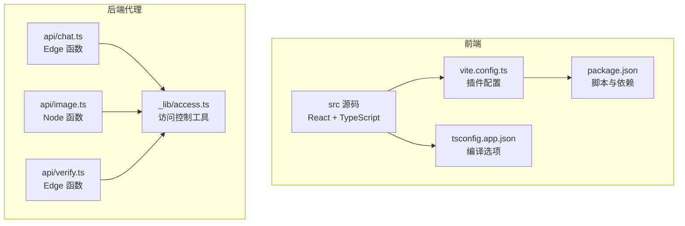
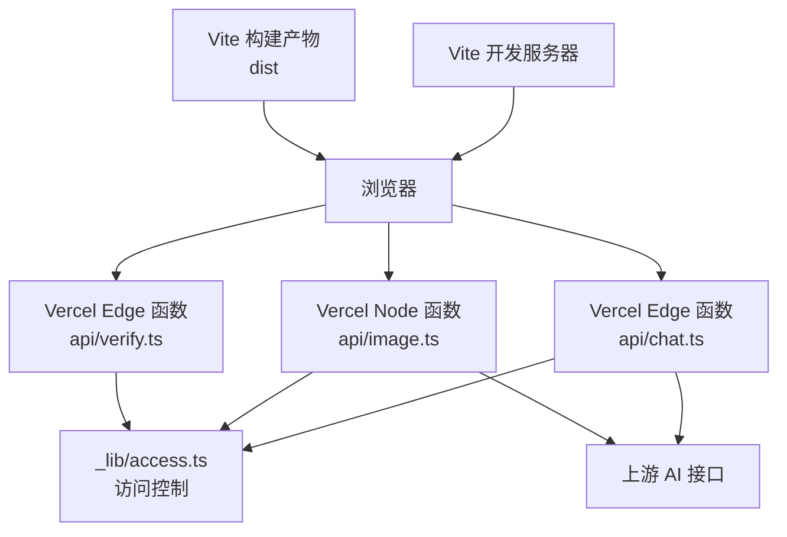
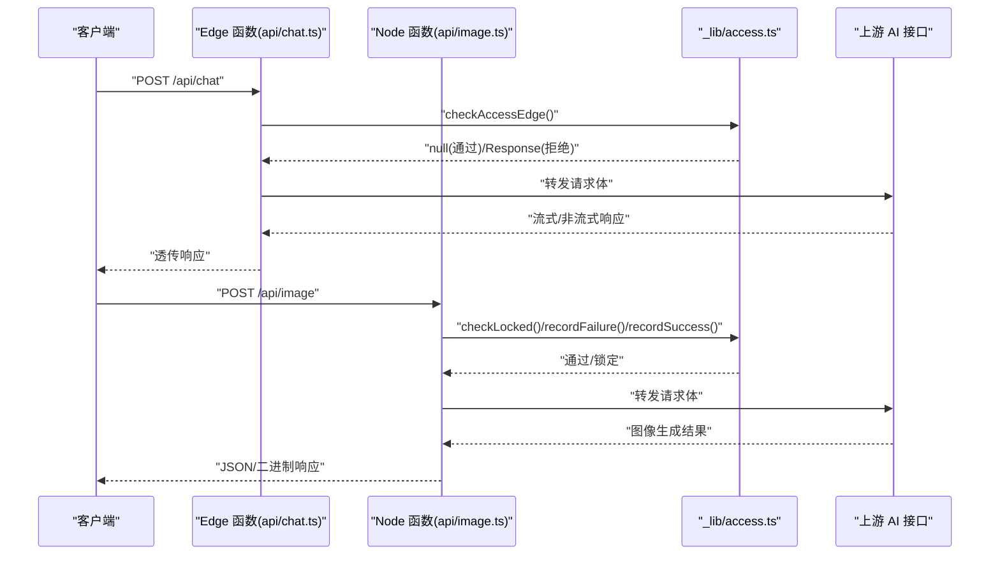
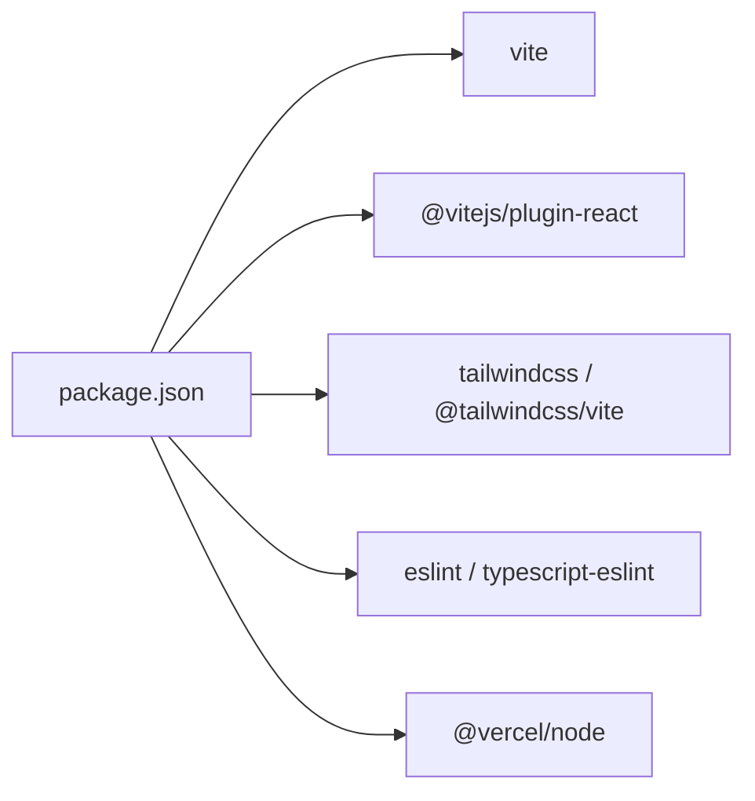

# 部署配置

<cite>
**本文引用的文件**
- [vite.config.ts](file://vite.config.ts)
- [package.json](file://package.json)
- [.gitignore](file://.gitignore)
- [tsconfig.json](file://tsconfig.json)
- [tsconfig.app.json](file://tsconfig.app.json)
- [eslint.config.js](file://eslint.config.js)
- [README.md](file://README.md)
- [api/chat.ts](file://api/chat.ts)
- [api/image.ts](file://api/image.ts)
- [api/verify.ts](file://api/verify.ts)
- [api/_lib/access.ts](file://api/_lib/access.ts)
</cite>

## 目录
1. [简介](#简介)
2. [项目结构](#项目结构)
3. [核心组件](#核心组件)
4. [架构总览](#架构总览)
5. [详细组件分析](#详细组件分析)
6. [依赖分析](#依赖分析)
7. [性能考虑](#性能考虑)
8. [故障排查指南](#故障排查指南)
9. [结论](#结论)
10. [附录](#附录)

## 简介
本文件面向 AIShop 项目的部署与发布，系统性梳理构建配置、环境变量管理、部署自动化、静态资源与 CDN 处理、多平台部署指南、性能监控与日志、安全与 HTTPS 等主题。项目采用 React + TypeScript + Vite 技术栈，并结合 Vercel 边缘与 Node 函数实现后端代理能力。

## 项目结构
- 前端源码位于 src 目录，使用 Vite 构建，TypeScript 类型检查由独立 tsconfig 分离。
- 服务端代理函数位于 api 目录，采用 Vercel Edge/Node 函数模式，通过环境变量读取密钥与访问控制配置。
- 构建与预览命令在 package.json 中定义，.gitignore 控制忽略项，包含 Vercel 特定目录。

**图表来源**
- [vite.config.ts:1-11](file://vite.config.ts#L1-L11)
- [package.json:1-40](file://package.json#L1-L40)
- [tsconfig.app.json:1-26](file://tsconfig.app.json#L1-L26)
- [api/chat.ts:1-49](file://api/chat.ts#L1-L49)
- [api/image.ts:1-149](file://api/image.ts#L1-L149)
- [api/verify.ts:1-32](file://api/verify.ts#L1-L32)
- [api/_lib/access.ts:1-155](file://api/_lib/access.ts#L1-L155)

**章节来源**
- [vite.config.ts:1-11](file://vite.config.ts#L1-L11)
- [package.json:1-40](file://package.json#L1-L40)
- [tsconfig.app.json:1-26](file://tsconfig.app.json#L1-L26)
- [.gitignore:1-32](file://.gitignore#L1-L32)

## 核心组件
- 构建与打包
  - Vite 插件：React 与 TailwindCSS 插件，满足开发热更新与样式构建。
  - TypeScript：通过独立 tsconfig.app.json 配置 bundler 模式与 JSX 编译选项。
  - 构建脚本：先执行 tsc -b，再执行 vite build，确保类型检查与打包顺序。
- 代码质量
  - ESLint：推荐使用类型感知规则集，结合全局忽略 dist。
- 环境变量
  - 服务端密钥：HIGHWAY_API_KEY（后端代理使用）。
  - 访问控制：ACCESS_CODE（可选），用于前端访问码校验与限速。
  - Vercel 特定：.vercel 目录忽略，避免提交到仓库。
- 部署与预览
  - 开发：vite dev
  - 预览：vite preview
  - 构建产物：dist（由 Vite 默认输出）

**章节来源**
- [vite.config.ts:1-11](file://vite.config.ts#L1-L11)
- [tsconfig.app.json:1-26](file://tsconfig.app.json#L1-L26)
- [package.json:6-11](file://package.json#L6-L11)
- [eslint.config.js:1-23](file://eslint.config.js#L1-L23)
- [.gitignore:15-22](file://.gitignore#L15-L22)
- [api/chat.ts:10-26](file://api/chat.ts#L10-L26)
- [api/image.ts:135-139](file://api/image.ts#L135-L139)
- [api/_lib/access.ts:120-155](file://api/_lib/access.ts#L120-L155)

## 架构总览
AIShop 前端通过 Vite 构建，后端代理函数负责对接上游 AI 接口。Edge 函数用于低延迟代理与流式响应，Node 函数用于需要更长时间的图片生成场景。访问控制在服务端统一实现，避免前端泄露密钥。

**图表来源**
- [api/chat.ts:1-49](file://api/chat.ts#L1-L49)
- [api/image.ts:1-149](file://api/image.ts#L1-L149)
- [api/verify.ts:1-32](file://api/verify.ts#L1-L32)
- [api/_lib/access.ts:1-155](file://api/_lib/access.ts#L1-L155)

## 详细组件分析

### Vite 构建配置与打包优化
- 插件体系
  - React 插件：提供 HMR 与 JSX 转换。
  - TailwindCSS 插件：集成样式处理。
- 打包与产物
  - 默认输出目录为 dist（由 Vite 管理）。
  - 构建脚本先进行类型检查，再进行打包，保证质量。
- 优化建议
  - 代码分割：利用 Vite 的动态导入实现按需加载。
  - 静态资源：将体积较大的资源放入 public 并通过相对路径引用，减少打包负担。
  - 压缩策略：生产环境由 Vite 默认启用压缩；如需自定义，可在插件链中加入压缩器。
  - 缓存策略：通过 HTML meta 或服务端响应头设置缓存控制，结合文件指纹化提升缓存命中率。

**章节来源**
- [vite.config.ts:1-11](file://vite.config.ts#L1-L11)
- [package.json:6-11](file://package.json#L6-L11)

### TypeScript 编译配置
- 应用编译
  - 使用 bundler 模式与 esnext 模块解析，适合现代打包器。
  - JSX 使用 react-jsx，类型检查严格。
- 顶层配置
  - tsconfig.json 通过 references 引入 app 与 node 两套配置，便于分层管理。

**章节来源**
- [tsconfig.app.json:1-26](file://tsconfig.app.json#L1-L26)
- [tsconfig.json:1-7](file://tsconfig.json#L1-L7)

### ESLint 配置
- 推荐使用类型感知规则集，结合 React Hooks 与 React Refresh 插件。
- 全局忽略 dist 目录，避免对构建产物进行扫描。

**章节来源**
- [eslint.config.js:1-23](file://eslint.config.js#L1-L23)

### 服务端代理与访问控制
- Edge 函数（聊天）
  - 运行时：edge，支持流式响应。
  - 通过环境变量读取密钥，透传请求体到上游 OpenAI 兼容接口。
  - 设置缓存控制头，避免中间层缓存影响流式数据。
- Node 函数（图片）
  - 运行时：node，超时 60 秒，适配图片生成较长耗时。
  - 提升 body 解析大小限制，避免大尺寸 base64 图像被拒绝。
  - 支持 GPT Image 2 与 Gemini 系列模型映射。
- 访问控制
  - 统一实现恒定时间比较、内存级 IP 限速与失败延迟。
  - 支持 Edge 与 Node 两种运行时的 IP 提取与校验。
  - 支持 ACCESS_CODE 未配置时的“开发友好”放行。

**图表来源**
- [api/chat.ts:11-49](file://api/chat.ts#L11-L49)
- [api/image.ts:113-149](file://api/image.ts#L113-L149)
- [api/_lib/access.ts:120-155](file://api/_lib/access.ts#L120-L155)

**章节来源**
- [api/chat.ts:1-49](file://api/chat.ts#L1-L49)
- [api/image.ts:1-149](file://api/image.ts#L1-L149)
- [api/verify.ts:1-32](file://api/verify.ts#L1-L32)
- [api/_lib/access.ts:1-155](file://api/_lib/access.ts#L1-L155)

### 环境变量配置与管理
- 必需变量
  - HIGHWAY_API_KEY：后端代理使用的密钥。
- 可选变量
  - ACCESS_CODE：开启访问码校验与限速。
- 环境隔离
  - 开发：本地 .env 文件（仓库忽略），避免提交敏感信息。
  - 生产：通过平台（如 Vercel）的环境变量面板配置。
- 安全建议
  - 不在前端暴露密钥，所有敏感信息置于服务端。
  - 使用平台提供的加密存储或密钥管理服务。

**章节来源**
- [api/chat.ts:20-26](file://api/chat.ts#L20-L26)
- [api/image.ts:135-139](file://api/image.ts#L135-L139)
- [.gitignore:15-18](file://.gitignore#L15-L18)

### 部署流程自动化（CI/CD）
- 构建脚本
  - 先执行类型检查，再执行打包，确保质量门禁。
- 发布流程
  - Vercel：通过 Git 推送触发构建与部署，自动应用环境变量。
  - GitHub Pages/Netlify：可复用现有构建产物 dist，配置静态发布。
- 最佳实践
  - 在 CI 中缓存依赖与构建产物，缩短流水线时间。
  - 对构建产物进行完整性校验与最小化检查。

**章节来源**
- [package.json:6-11](file://package.json#L6-L11)

### 静态资源处理与 CDN 配置
- 资源优化
  - 将大文件放入 public，使用相对路径引用，减少打包体积。
  - 利用浏览器缓存与文件指纹化，提升二次加载性能。
- CDN 与缓存
  - 通过平台 CDN 加速静态资源分发。
  - 设置合理的 Cache-Control 与 ETag，平衡新鲜度与带宽。
- 版本管理
  - 采用文件名哈希策略，实现“不可变缓存”。

**章节来源**
- [vite.config.ts:1-11](file://vite.config.ts#L1-L11)

### 多平台部署指南
- Vercel
  - 自动识别框架与构建命令，基于 Git 推送部署。
  - Edge 函数与 Node 函数可混合使用，按路由选择运行时。
  - 环境变量在平台面板配置，.vercel 目录忽略。
- Netlify/GitHub Pages
  - 使用 dist 作为发布目录，配置基础路径（如需要）。
  - 将构建产物与路由重写规则交由平台处理。

**章节来源**
- [.gitignore:20-21](file://.gitignore#L20-L21)

### 性能监控与日志
- 构建时间分析
  - 使用 Vite 插件或第三方分析工具（如 webpack-bundle-analyzer）定位体积瓶颈。
- 运行时性能
  - Edge 函数具备低延迟优势，适合高频请求；图片生成等长耗时任务使用 Node 函数。
  - 关注上游接口延迟与错误率，必要时增加重试与熔断。
- 日志与追踪
  - 平台侧日志聚合（如 Vercel Logs），记录请求与错误。
  - 前端可接入错误上报 SDK，收集运行时异常。

**章节来源**
- [api/chat.ts:5-7](file://api/chat.ts#L5-L7)
- [api/image.ts:17](file://api/image.ts#L17)

### 安全配置与 HTTPS
- 证书与 HTTPS
  - 平台自动提供 HTTPS 与证书管理，无需手动配置。
- 安全头
  - 在平台或边缘规则中设置安全头（如 Content-Security-Policy、Strict-Transport-Security 等）。
- 访问控制
  - 使用 ACCESS_CODE 与限速策略，降低暴力破解风险。
  - 采用恒定时间比较与失败延迟，抵御时序攻击。

**章节来源**
- [api/_lib/access.ts:25-34](file://api/_lib/access.ts#L25-L34)
- [api/_lib/access.ts:120-155](file://api/_lib/access.ts#L120-L155)

## 依赖分析
- 前端依赖
  - React、TailwindCSS、React Markdown 等，满足 UI 与样式需求。
- 开发依赖
  - Vite、@vitejs/plugin-react、TailwindCSS 插件、ESLint 及其 TypeScript 支持。
- Vercel 相关
  - @vercel/node 与相关工具，用于 Node 与 Edge 函数生态。

**图表来源**
- [package.json:12-38](file://package.json#L12-L38)

**章节来源**
- [package.json:12-38](file://package.json#L12-L38)

## 性能考虑
- 构建阶段
  - 合理拆分代码，减少首屏体积；对第三方库进行按需引入。
  - 使用压缩与 Tree Shaking，确保生产环境最小化。
- 运行阶段
  - Edge 函数优先处理高频短请求；长耗时任务使用 Node 函数。
  - 通过缓存与 CDN 提升静态资源加载速度。
- 监控与优化
  - 持续关注构建时间与运行时指标，迭代优化。

## 故障排查指南
- 构建失败
  - 确认类型检查通过后再打包；检查 tsconfig 与插件配置。
- 访问受限
  - 检查 ACCESS_CODE 是否正确配置；确认 IP 是否被锁定。
- 请求超时
  - 图片生成类请求使用 Node 函数并适当提高超时；避免在 Edge 运行时长时间阻塞。
- 环境变量问题
  - 确认平台环境变量已生效；本地使用 .env 文件验证。

**章节来源**
- [api/_lib/access.ts:63-97](file://api/_lib/access.ts#L63-L97)
- [api/image.ts:17](file://api/image.ts#L17)
- [api/chat.ts:20-26](file://api/chat.ts#L20-L26)

## 结论
AIShop 的部署配置以 Vite 为核心，结合 Vercel 的 Edge/Node 函数实现前后端一体化部署。通过严格的访问控制、合理的资源与缓存策略、以及平台化的 HTTPS 与日志监控，能够在保障安全性的同时获得良好的性能与可维护性。建议在 CI/CD 中固化构建与发布流程，并持续优化构建体积与运行时指标。

## 附录
- 构建命令参考
  - 开发：vite
  - 预览：vite preview
  - 构建：tsc -b && vite build
- TypeScript 配置参考
  - 应用编译：tsconfig.app.json
  - 顶层引用：tsconfig.json
- ESLint 配置参考
  - eslint.config.js

**章节来源**
- [package.json:6-11](file://package.json#L6-L11)
- [tsconfig.app.json:1-26](file://tsconfig.app.json#L1-L26)
- [tsconfig.json:1-7](file://tsconfig.json#L1-L7)
- [eslint.config.js:1-23](file://eslint.config.js#L1-L23)
- [README.md:1-74](file://README.md#L1-L74)