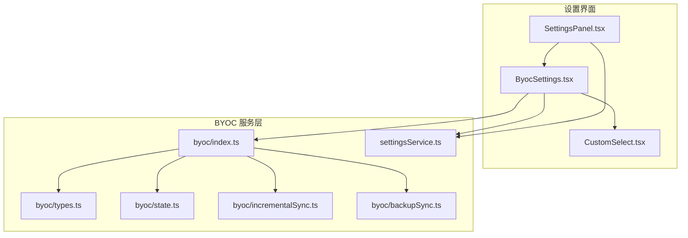
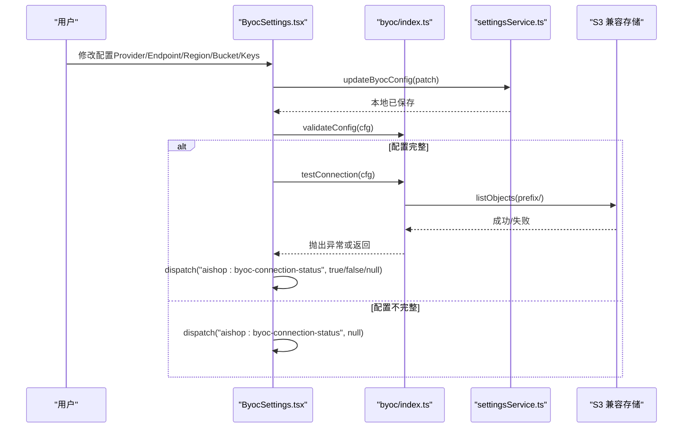
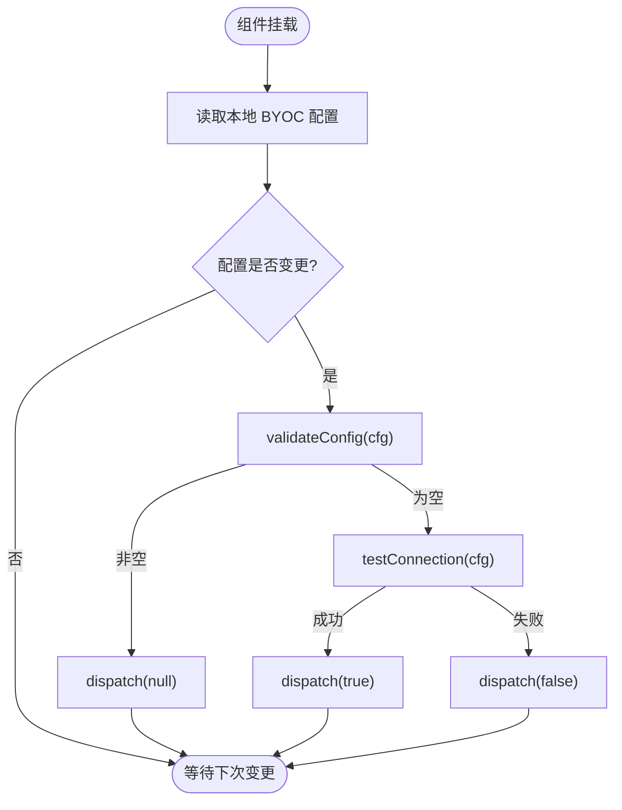
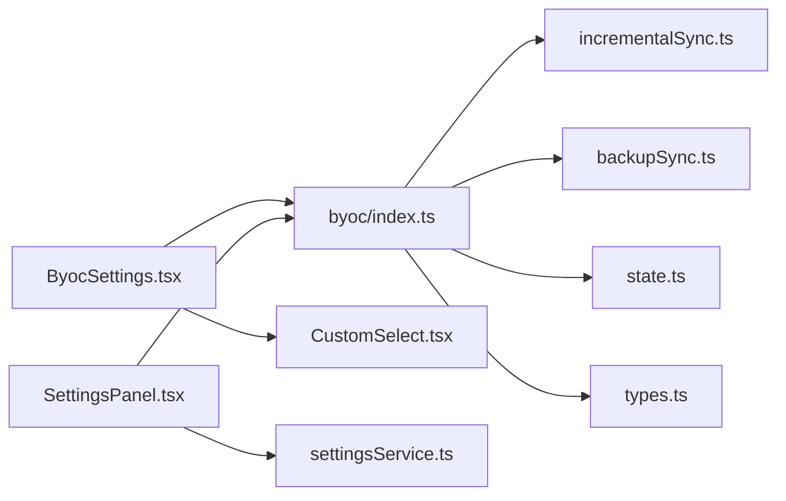

# BYOC设置界面

<cite>
**本文引用的文件**
- [ByocSettings.tsx](file://src/components/settings/ByocSettings.tsx)
- [SettingsPanel.tsx](file://src/components/settings/SettingsPanel.tsx)
- [index.ts](file://src/services/byoc/index.ts)
- [types.ts](file://src/services/byoc/types.ts)
- [state.ts](file://src/services/byoc/state.ts)
- [incrementalSync.ts](file://src/services/byoc/incrementalSync.ts)
- [backupSync.ts](file://src/services/byoc/backupSync.ts)
- [settingsService.ts](file://src/services/settingsService.ts)
- [CustomSelect.tsx](file://src/components/common/CustomSelect.tsx)
</cite>

## 目录
1. [简介](#简介)
2. [项目结构](#项目结构)
3. [核心组件](#核心组件)
4. [架构总览](#架构总览)
5. [详细组件分析](#详细组件分析)
6. [依赖关系分析](#依赖关系分析)
7. [性能与可用性](#性能与可用性)
8. [故障排查指南](#故障排查指南)
9. [结论](#结论)

## 简介
本文件聚焦“BYOC（自带云存储）设置界面”的实现与交互，说明用户如何在应用内配置 S3 兼容对象存储（如腾讯云 COS、阿里云 OSS、Cloudflare R2、MinIO、Backblaze B2 或自定义端点），并实时检测连通性。该界面通过统一服务层调用增量同步与全量备份能力，所有凭证仅保存在本地，请求现场签名，不上传至第三方中转。

## 项目结构
BYOC 设置相关代码分布在 UI 组件与服务层：
- 设置面板入口与标签页切换：SettingsPanel.tsx
- BYOC 设置表单：ByocSettings.tsx
- BYOC 统一出口与自动调度：services/byoc/index.ts
- 类型定义与预设：services/byoc/types.ts
- 同步状态与清单缓存：services/byoc/state.ts
- 增量双向同步引擎：services/byoc/incrementalSync.ts
- 全量备份/恢复：services/byoc/backupSync.ts
- 通用设置持久化：services/settingsService.ts
- 下拉选择器组件：components/common/CustomSelect.tsx

图表来源
- [SettingsPanel.tsx:129-154](file://src/components/settings/SettingsPanel.tsx#L129-L154)
- [ByocSettings.tsx:38-87](file://src/components/settings/ByocSettings.tsx#L38-L87)
- [index.ts:31-54](file://src/services/byoc/index.ts#L31-L54)
- [types.ts:10-53](file://src/services/byoc/types.ts#L10-L53)
- [state.ts:22-97](file://src/services/byoc/state.ts#L22-L97)
- [incrementalSync.ts:139-323](file://src/services/byoc/incrementalSync.ts#L139-L323)
- [backupSync.ts:33-68](file://src/services/byoc/backupSync.ts#L33-L68)
- [settingsService.ts:105-113](file://src/services/settingsService.ts#L105-L113)

章节来源
- [SettingsPanel.tsx:129-154](file://src/components/settings/SettingsPanel.tsx#L129-L154)
- [ByocSettings.tsx:38-87](file://src/components/settings/ByocSettings.tsx#L38-L87)

## 核心组件
- ByocSettings：提供 BYOC 开关、服务商选择、Endpoint/Region/Bucket/Prefix 输入、AccessKey/SecretKey 输入与可见性切换；变更时防抖触发连通性检测并通过自定义事件上报结果。
- SettingsPanel：承载多标签设置页，包含 BYOC 标签及连接状态图标（成功/失败/未检测）。
- byoc/index：统一导出配置读写、校验、连通性测试、增量同步、全量备份/恢复、自动调度等能力。
- settingsService：基于 localStorage 的通用设置存取，包含 BYOC 配置的默认值与合并策略。
- CustomSelect：自绘下拉选择器，用于服务商选择。

章节来源
- [ByocSettings.tsx:38-179](file://src/components/settings/ByocSettings.tsx#L38-L179)
- [SettingsPanel.tsx:138-176](file://src/components/settings/SettingsPanel.tsx#L138-L176)
- [index.ts:31-54](file://src/services/byoc/index.ts#L31-L54)
- [settingsService.ts:105-113](file://src/services/settingsService.ts#L105-L113)
- [CustomSelect.tsx:17-81](file://src/components/common/CustomSelect.tsx#L17-L81)

## 架构总览
BYOC 设置界面采用“UI 组件 + 服务层 + 存储抽象”的分层设计：
- UI 层只负责表单与状态展示，不直接操作存储或网络。
- 服务层封装了配置校验、S3 客户端创建、增量同步与备份逻辑，对外暴露简洁 API。
- 状态与清单缓存使用 IndexedDB 的 kv store，避免与用户配置混用。

图表来源
- [ByocSettings.tsx:42-68](file://src/components/settings/ByocSettings.tsx#L42-L68)
- [index.ts:40-54](file://src/services/byoc/index.ts#L40-L54)
- [settingsService.ts:105-113](file://src/services/settingsService.ts#L105-L113)

## 详细组件分析

### ByocSettings 组件
- 功能要点
  - 自动同步开关：启用后由服务层自动调度，不影响手动按钮。
  - 服务商预设：选择预设时自动填充 region/pathStyle/endpoint 占位提示，用户可覆盖。
  - 参数输入：Endpoint、Region、Bucket、Prefix、AccessKey、SecretKey。
  - 连通性检测：配置变更后防抖 800ms 执行一次，通过 window 自定义事件上报状态。
  - 错误提示：若配置缺失，直接上报 null，表示“未检测”。

- 数据流
  - patch() 将局部更新合并到当前 cfg，调用 updateByocConfig 持久化到 localStorage。
  - useEffect 监听 cfg 变化，先校验，再尝试 testConnection，最后派发连接状态事件。

图表来源
- [ByocSettings.tsx:42-68](file://src/components/settings/ByocSettings.tsx#L42-L68)
- [index.ts:40-54](file://src/services/byoc/index.ts#L40-L54)

章节来源
- [ByocSettings.tsx:20-179](file://src/components/settings/ByocSettings.tsx#L20-L179)

### SettingsPanel 中的 BYOC 状态展示
- 在 BYOC 标签标题右侧显示连接状态图标：
  - 未检测：无图标
  - 可用：绿色对勾
  - 不可用：黄色警告
- 通过监听 aishop:byoc-connection-status 事件更新状态。

章节来源
- [SettingsPanel.tsx:138-176](file://src/components/settings/SettingsPanel.tsx#L138-L176)

### BYOC 服务层（index.ts）
- 配置读写：getByocConfig/updateByocConfig 委托 settingsService。
- 配置校验：validateConfig 检查 endpoint/bucket/accessKey/secretKey。
- 连通性测试：testConnection 创建 S3 客户端并列出 prefix 目录。
- 增量同步：syncNow/safeSync 支持 Web Locks 串行，先拉后推，统计结果聚合。
- 全量备份：backupNow/restoreNow/cloudHasBackup 复用 backupSync。
- 自动调度：scheduleAutoSync 启动延迟拉取、周期轮询待同步项、回到前台拉取。

章节来源
- [index.ts:31-211](file://src/services/byoc/index.ts#L31-L211)

### 类型与预设（types.ts）
- ByocConfig：enabled/provider/endpoint/region/bucket/prefix/pathStyle/accessKey/secretKey/lastSyncAt。
- DEFAULT_BYOC_CONFIG：默认关闭，provider=cos，prefix=aishop。
- BYOC_PROVIDER_PRESETS：内置服务商的 region/pathStyle/endpoint 模板。

章节来源
- [types.ts:10-53](file://src/services/byoc/types.ts#L10-L53)

### 状态与清单（state.ts）
- deviceId：本机唯一标识，持久化到 IndexedDB。
- manifest：云端清单缓存，用于增量同步判断。
- localTombstones：本地删除记录，防止“删了又拉回”。
- lastSyncAt：最近成功同步时间，供 UI 展示。
- countPending：统计待同步会话/消息数量，含 tombstone 计数。

章节来源
- [state.ts:22-97](file://src/services/byoc/state.ts#L22-L97)

### 增量同步引擎（incrementalSync.ts）
- 桶布局：sync/v1/manifest.json、convs、msgs、nodes、blobs、history、favs。
- 推送流程：删除检测→写 tombstone→推送变更会话/消息/blob/节点→历史/收藏索引→重写清单→标记 syncedAt。
- 拉取流程：应用 tombstone→拉会话/消息/blob/节点→拉历史/收藏索引差异→更新本地清单缓存。
- 冲突策略：会话元数据 LWW（updatedAt 大者胜），消息追加式合并，删除走 tombstone。

章节来源
- [incrementalSync.ts:139-323](file://src/services/byoc/incrementalSync.ts#L139-L323)
- [incrementalSync.ts:364-509](file://src/services/byoc/incrementalSync.ts#L364-L509)

### 全量备份（backupSync.ts）
- 备份：构建全量备份 JSON，按时间戳命名上传到 backups/ 目录。
- 恢复：列出最新备份并还原，语义为“以新 id 导入，不覆盖现有数据”。

章节来源
- [backupSync.ts:33-68](file://src/services/byoc/backupSync.ts#L33-L68)

### 设置持久化（settingsService.ts）
- getByocSettings/setByocSettings：合并默认配置与用户配置，落盘 localStorage。
- 其他设置：提供商、API Key、上下文压缩等。

章节来源
- [settingsService.ts:105-113](file://src/services/settingsService.ts#L105-L113)

## 依赖关系分析
- UI 层依赖：
  - ByocSettings → services/byoc（配置、校验、连通性）、CustomSelect（下拉框）
  - SettingsPanel → services/byoc（校验）、services/settingsService（通用设置）
- 服务层依赖：
  - index.ts → incrementalSync.ts、backupSync.ts、state.ts、types.ts、settingsService.ts
  - incrementalSync.ts → state.ts、数据库接口、S3 客户端（由 index.ts 间接引入）
  - backupSync.ts → S3 客户端、备份工具
- 外部集成点：
  - S3 兼容对象存储（COS/OSS/R2/MinIO/B2/自定义）
  - IndexedDB（kv store 与业务表）
  - localStorage（用户设置）

图表来源
- [ByocSettings.tsx:38-87](file://src/components/settings/ByocSettings.tsx#L38-L87)
- [SettingsPanel.tsx:138-154](file://src/components/settings/SettingsPanel.tsx#L138-L154)
- [index.ts:13-24](file://src/services/byoc/index.ts#L13-L24)

章节来源
- [ByocSettings.tsx:38-87](file://src/components/settings/ByocSettings.tsx#L38-L87)
- [SettingsPanel.tsx:138-154](file://src/components/settings/SettingsPanel.tsx#L138-L154)
- [index.ts:13-24](file://src/services/byoc/index.ts#L13-L24)

## 性能与可用性
- 防抖检测：配置变更后 800ms 才执行连通性测试，避免频繁请求。
- 并发控制：增量同步中对列表处理使用 mapLimit 限制并发，避免触发 S3 限流。
- 去重与最小化传输：blob 内容寻址，重复图只传一次；HEAD 探测后再上传。
- 静默降级：自动同步失败仅记录日志，不打断主流程。
- 多标签页串行：使用 navigator.locks 保证同一时刻只有一个同步任务。

[本节为通用指导，不直接分析具体文件]

## 故障排查指南
- 常见错误与定位
  - 配置不完整：validateConfig 返回错误文案，UI 会派发 null 表示“未检测”。请检查 Endpoint、Bucket、AccessKey、SecretKey。
  - CORS 问题：testConnection 列对象失败通常与存储桶 CORS 配置有关，需在云服务控制台开启允许的来源与方法。
  - 权限不足：AccessKey/SecretKey 缺少读/写/列举权限，需检查 IAM 策略。
  - 网络异常：检查代理、防火墙、域名解析。
- 调试建议
  - 打开浏览器开发者工具，查看 Network 面板中 S3 请求的响应码与跨域错误信息。
  - 确认 prefix 目录是否存在，以及是否有权限列举。
  - 若自动同步未生效，检查 enabled 是否为真，且 scheduleAutoSync 是否已注册。

章节来源
- [index.ts:40-54](file://src/services/byoc/index.ts#L40-L54)
- [ByocSettings.tsx:42-68](file://src/components/settings/ByocSettings.tsx#L42-L68)

## 结论
BYOC 设置界面以清晰的表单与即时反馈帮助用户快速接入自有 S3 兼容存储，并通过服务层屏蔽底层同步与备份细节。其设计兼顾易用性与健壮性：配置校验、连通性检测、自动调度与静默降级共同保障用户体验。配合增量同步与全量备份，可在多设备间安全地同步对话数据与媒体资源。