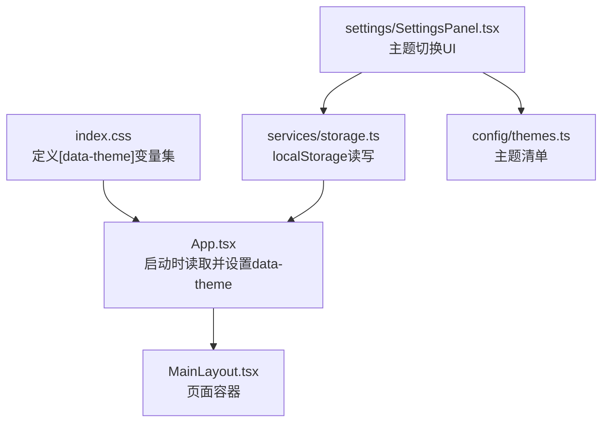
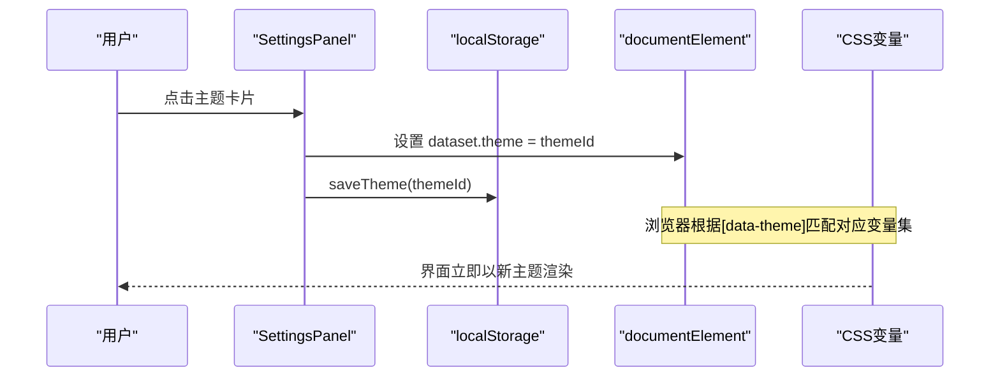
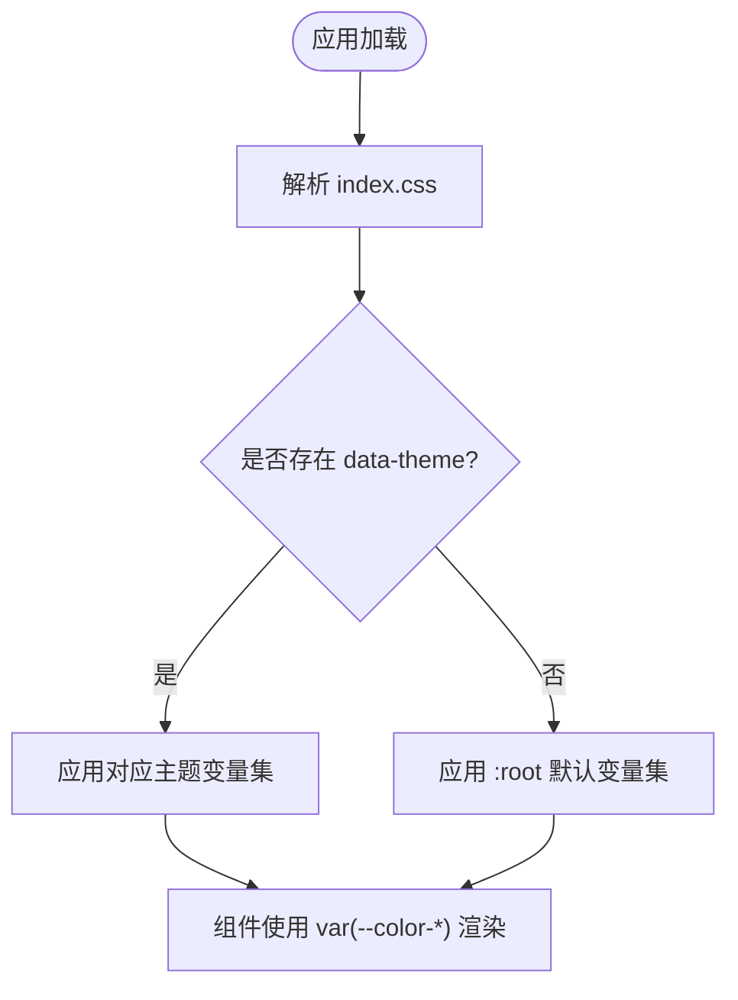
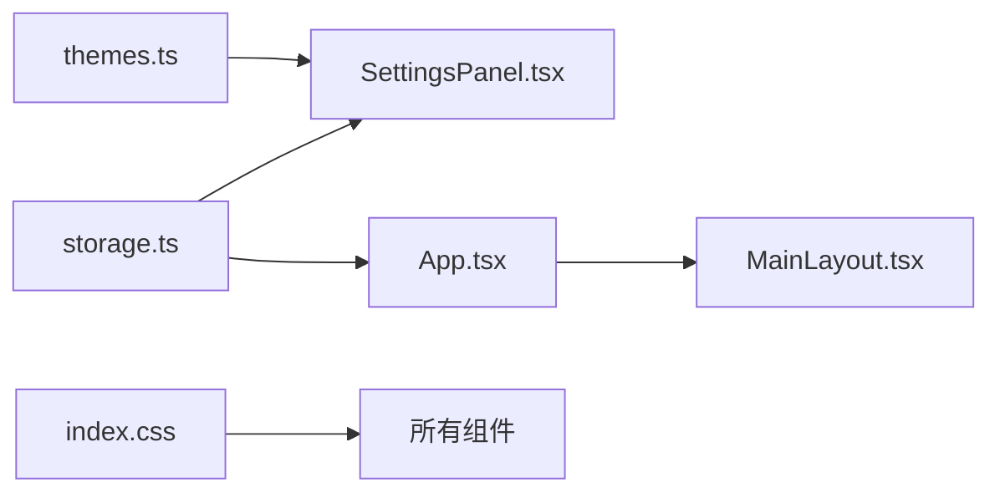
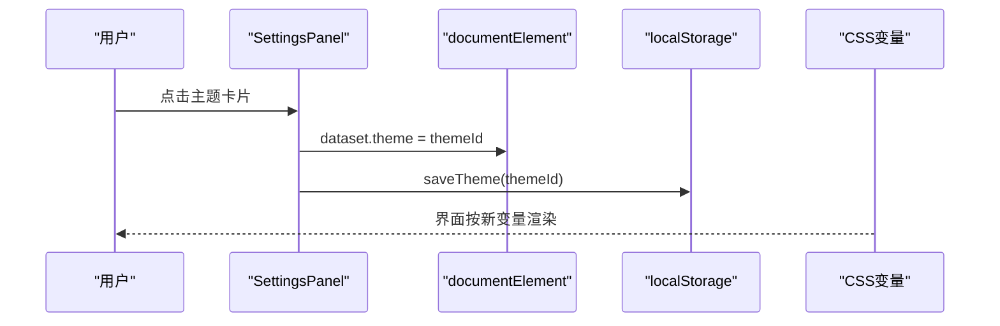

# 主题配置系统

<cite>
**本文引用的文件**
- [App.tsx](file://src/App.tsx)
- [main.tsx](file://src/main.tsx)
- [index.css](file://src/index.css)
- [themes.ts](file://src/config/themes.ts)
- [storage.ts](file://src/services/storage.ts)
- [SettingsPanel.tsx](file://src/components/settings/SettingsPanel.tsx)
- [MainLayout.tsx](file://src/components/layout/MainLayout.tsx)
</cite>

## 目录
1. [简介](#简介)
2. [项目结构](#项目结构)
3. [核心组件](#核心组件)
4. [架构总览](#架构总览)
5. [详细组件分析](#详细组件分析)
6. [依赖关系分析](#依赖关系分析)
7. [性能与兼容性](#性能与兼容性)
8. [故障排查指南](#故障排查指南)
9. [结论](#结论)
10. [附录：主题开发指南](#附录：主题开发指南)

## 简介
本文件系统化梳理 AIShop 的主题配置体系，涵盖深色/浅色（多主题）实现原理、样式变量组织、主题切换机制与用户偏好存储、自定义主题扩展方法、样式覆盖规则，以及主题开发规范、响应式适配、性能优化与兼容性建议。目标是帮助开发者快速理解并安全地扩展主题能力。

## 项目结构
主题相关代码主要分布在以下位置：
- 样式变量与主题选择器：CSS 中通过 data-theme 属性选择不同主题变量集合
- 主题配置清单：集中定义可用主题元数据（id、名称、预览色）
- 应用启动时加载主题：在根组件初始化时从本地存储读取并应用到 DOM
- 设置面板：提供主题切换 UI，实时写入 DOM 和持久化存储
- 布局容器：承载页面内容，不直接参与主题逻辑，但受全局 CSS 影响

图表来源
- [index.css:4-48](file://src/index.css#L4-L48)
- [App.tsx:17-21](file://src/App.tsx#L17-L21)
- [SettingsPanel.tsx:86-91](file://src/components/settings/SettingsPanel.tsx#L86-L91)
- [storage.ts:54-60](file://src/services/storage.ts#L54-L60)
- [themes.ts:1-12](file://src/config/themes.ts#L1-L12)
- [MainLayout.tsx:120-201](file://src/components/layout/MainLayout.tsx#L120-L201)

章节来源
- [App.tsx:17-21](file://src/App.tsx#L17-L21)
- [index.css:4-48](file://src/index.css#L4-L48)
- [themes.ts:1-12](file://src/config/themes.ts#L1-L12)
- [storage.ts:54-60](file://src/services/storage.ts#L54-L60)
- [SettingsPanel.tsx:86-91](file://src/components/settings/SettingsPanel.tsx#L86-L91)
- [MainLayout.tsx:120-201](file://src/components/layout/MainLayout.tsx#L120-L201)

## 核心组件
- 主题变量与选择器：使用 CSS 变量按 data-theme 分组，统一命名空间 --color-*，便于跨组件复用
- 主题清单：集中维护主题 id、显示名、预览色，供设置面板渲染
- 本地存储：以 key 保存当前主题 id，应用启动时恢复
- 设置面板：提供主题卡片点击切换，即时生效并持久化
- 应用入口：在 App 启动阶段读取并设置 data-theme，确保首屏无闪烁

章节来源
- [index.css:4-48](file://src/index.css#L4-L48)
- [themes.ts:1-12](file://src/config/themes.ts#L1-L12)
- [storage.ts:54-60](file://src/services/storage.ts#L54-L60)
- [SettingsPanel.tsx:86-91](file://src/components/settings/SettingsPanel.tsx#L86-L91)
- [App.tsx:17-21](file://src/App.tsx#L17-L21)

## 架构总览
主题系统采用“声明式变量 + 运行时切换”的轻量方案：
- 样式层：通过 [data-theme="..."] 选择器为每个主题定义一组 CSS 变量
- 状态层：localStorage 保存当前主题 id
- 应用层：App 启动时读取并设置 documentElement.dataset.theme；设置面板变更时同步更新 DOM 与存储

图表来源
- [SettingsPanel.tsx:86-91](file://src/components/settings/SettingsPanel.tsx#L86-L91)
- [storage.ts:54-60](file://src/services/storage.ts#L54-L60)
- [index.css:4-48](file://src/index.css#L4-L48)

章节来源
- [SettingsPanel.tsx:86-91](file://src/components/settings/SettingsPanel.tsx#L86-L91)
- [storage.ts:54-60](file://src/services/storage.ts#L54-L60)
- [index.css:4-48](file://src/index.css#L4-L48)

## 详细组件分析

### 主题变量与样式组织（index.css）
- 使用 [data-theme="purple"] 与 :root 作为默认主题，[data-theme="green"] 作为另一主题
- 变量命名遵循 --color-bg-*、--color-accent*、--color-text-*、--color-border*、--color-scrollbar-*、--color-code-bg 等语义化前缀
- 全局滚动条、代码块、动画等样式均通过 var() 引用主题变量，保证主题一致性

图表来源
- [index.css:4-48](file://src/index.css#L4-L48)
- [index.css:76-117](file://src/index.css#L76-L117)

章节来源
- [index.css:4-48](file://src/index.css#L4-L48)
- [index.css:76-117](file://src/index.css#L76-L117)

### 主题配置清单（themes.ts）
- 定义 ThemeConfig 接口：id、name、previewColor
- 导出 THEMES 数组与 DEFAULT_THEME，供设置面板渲染主题卡片

章节来源
- [themes.ts:1-12](file://src/config/themes.ts#L1-L12)

### 本地存储（storage.ts）
- loadTheme/saveTheme：以 aishop_theme 键值存取当前主题 id
- 其他设置项也采用 localStorage，保持小体积、同步读取特性

章节来源
- [storage.ts:54-60](file://src/services/storage.ts#L54-L60)

### 应用启动加载（App.tsx）
- 在 useEffect 中调用 loadTheme()，并将结果写入 document.documentElement.dataset.theme
- 确保首次渲染即使用正确主题，避免闪烁

章节来源
- [App.tsx:17-21](file://src/App.tsx#L17-L21)

### 设置面板主题切换（SettingsPanel.tsx）
- handleThemeChange：更新本地选中态、设置 documentElement.dataset.theme、调用 saveTheme 持久化
- appearance 标签页渲染主题卡片，展示预览色与选中状态

章节来源
- [SettingsPanel.tsx:86-91](file://src/components/settings/SettingsPanel.tsx#L86-L91)
- [SettingsPanel.tsx:307-337](file://src/components/settings/SettingsPanel.tsx#L307-L337)

### 布局容器（MainLayout.tsx）
- 负责整体布局与导航，不直接处理主题逻辑
- 其子树通过 CSS 变量继承主题效果

章节来源
- [MainLayout.tsx:120-201](file://src/components/layout/MainLayout.tsx#L120-L201)

## 依赖关系分析
- SettingsPanel 依赖 themes.ts（主题清单）、storage.ts（持久化）
- App.tsx 在启动时依赖 storage.ts 恢复主题
- index.css 提供主题变量，被所有组件间接消费
- MainLayout 作为容器，受全局样式影响

图表来源
- [themes.ts:1-12](file://src/config/themes.ts#L1-L12)
- [storage.ts:54-60](file://src/services/storage.ts#L54-L60)
- [SettingsPanel.tsx:86-91](file://src/components/settings/SettingsPanel.tsx#L86-L91)
- [App.tsx:17-21](file://src/App.tsx#L17-L21)
- [index.css:4-48](file://src/index.css#L4-L48)

章节来源
- [themes.ts:1-12](file://src/config/themes.ts#L1-L12)
- [storage.ts:54-60](file://src/services/storage.ts#L54-L60)
- [SettingsPanel.tsx:86-91](file://src/components/settings/SettingsPanel.tsx#L86-L91)
- [App.tsx:17-21](file://src/App.tsx#L17-L21)
- [index.css:4-48](file://src/index.css#L4-L48)

## 性能与兼容性
- 性能
  - 使用 CSS 变量切换主题，零 JS 重绘开销，切换即时
  - 将主题读取放在 App 启动阶段，避免二次渲染
  - 避免在高频交互路径中操作 DOM 样式，仅设置一次 dataset.theme
- 兼容性
  - data-theme 选择器在现代浏览器广泛支持
  - 滚动条样式兼容 Firefox 与 WebKit 系列
  - prefers-reduced-motion 媒体查询已用于降低动画强度，提升可访问性

章节来源
- [index.css:76-117](file://src/index.css#L76-L117)
- [index.css:243-249](file://src/index.css#L243-L249)
- [App.tsx:17-21](file://src/App.tsx#L17-L21)

## 故障排查指南
- 主题未生效
  - 检查 documentElement.dataset.theme 是否被正确设置
  - 确认 index.css 中存在对应 [data-theme="..."] 选择器
- 刷新后主题丢失
  - 检查 localStorage 中 aishop_theme 是否写入成功
  - 确认 App 启动时是否正确读取并设置
- 样式错乱
  - 检查组件是否硬编码颜色而非使用 var(--color-*)
  - 检查第三方库（如代码高亮）是否覆盖了背景或颜色

章节来源
- [storage.ts:54-60](file://src/services/storage.ts#L54-L60)
- [App.tsx:17-21](file://src/App.tsx#L17-L21)
- [index.css:4-48](file://src/index.css#L4-L48)

## 结论
AIShop 的主题系统以 CSS 变量为核心，配合 data-theme 选择器实现轻量、高性能的主题切换。通过集中化的主题清单与本地存储，实现了“所见即所得”的设置体验与稳定的持久化。该方案易于扩展新主题，且具备良好的可维护性与兼容性。

## 附录：主题开发指南

### 新增主题步骤
- 在 index.css 中添加新的 [data-theme="your-theme"] 选择器，定义完整的 --color-* 变量集
- 在 themes.ts 的 THEMES 数组中注册新主题（id、name、previewColor）
- 在设置面板中即可看到并切换新主题

章节来源
- [index.css:4-48](file://src/index.css#L4-L48)
- [themes.ts:1-12](file://src/config/themes.ts#L1-L12)

### 颜色规范
- 背景：--color-bg-base、--color-bg-primary、--color-bg-secondary、--color-bg-hover、--color-bg-elevated、--color-bg-button
- 强调：--color-accent、--color-accent-hover、--color-accent-soft、--color-accent-foreground
- 文本：--color-text-primary、--color-text-secondary、--color-text-muted、--color-text-tertiary
- 边框：--color-border、--color-border-subtle
- 滚动条：--color-scrollbar-thumb、--color-scrollbar-hover
- 代码块：--color-code-bg

章节来源
- [index.css:4-48](file://src/index.css#L4-L48)

### 字体配置
- 本项目未内置主题级字体变量，建议在 Tailwind 配置或全局样式中统一管理字体族
- 若需主题化字体，可在 [data-theme] 下定义 --font-* 变量并在组件中使用

### 响应式设计适配
- 利用 prefers-reduced-motion 降低动画强度，提升无障碍体验
- 滚动条与交互元素在不同视口下保持一致的视觉层级

章节来源
- [index.css:243-249](file://src/index.css#L243-L249)

### 样式覆盖规则
- 优先使用 var(--color-*) 引用主题变量，避免硬编码颜色
- 如需覆盖第三方组件样式，尽量基于主题变量进行覆盖，确保主题一致性
- 代码高亮背景已通过 .hljs 覆盖为透明，由主题变量控制

章节来源
- [index.css:277-280](file://src/index.css#L277-L280)

### 主题切换流程（时序图）

图表来源
- [SettingsPanel.tsx:86-91](file://src/components/settings/SettingsPanel.tsx#L86-L91)
- [storage.ts:54-60](file://src/services/storage.ts#L54-L60)
- [index.css:4-48](file://src/index.css#L4-L48)