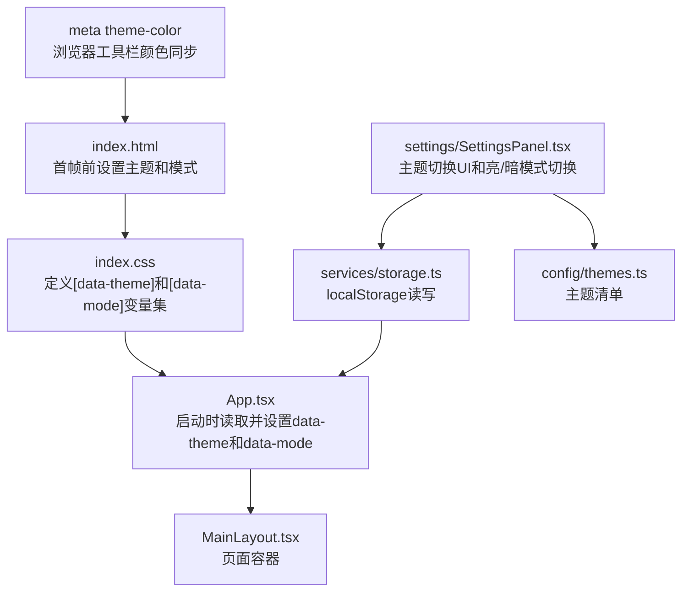
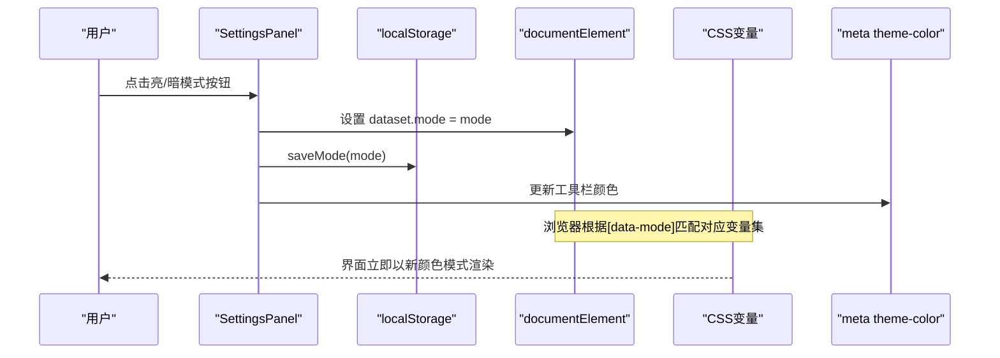
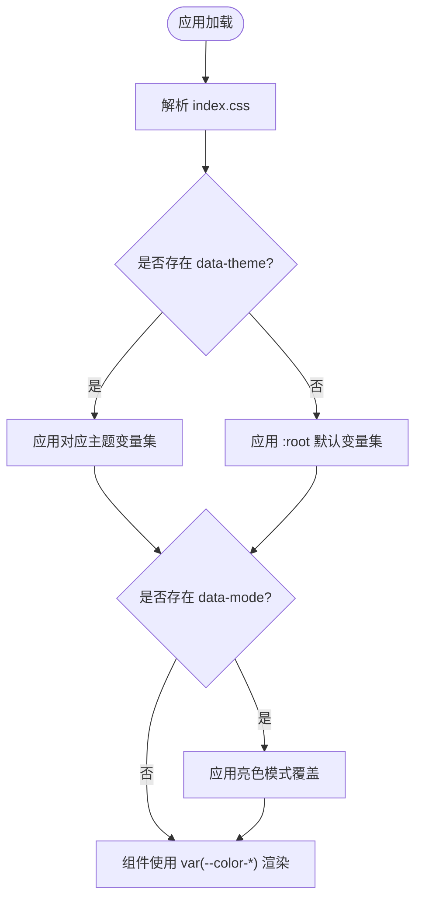
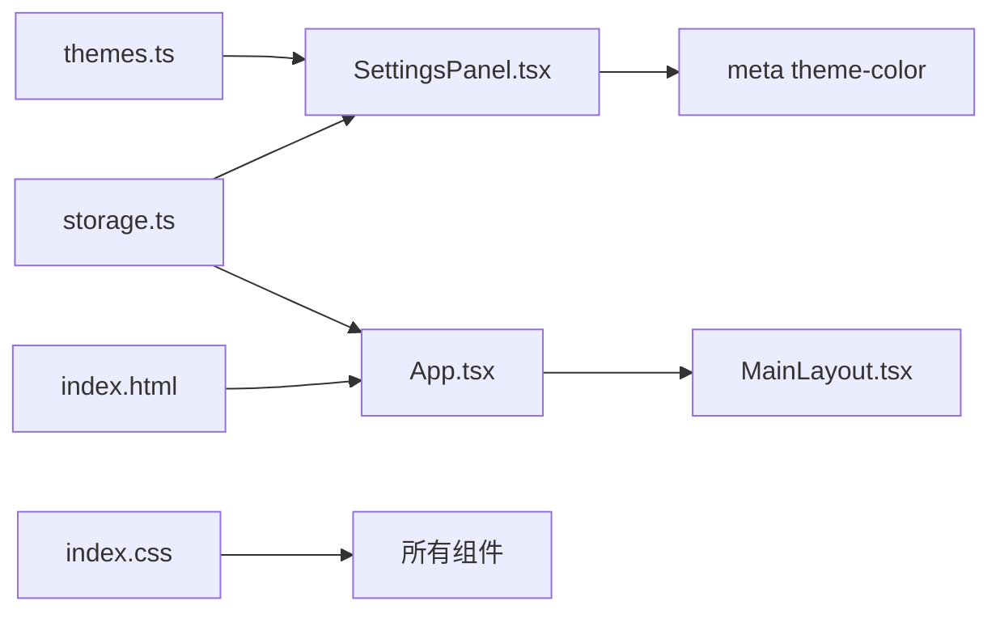
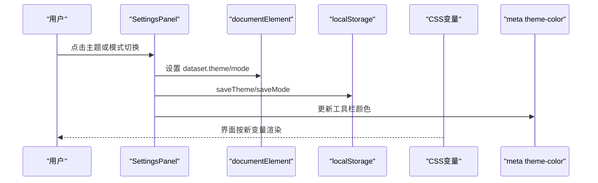

# 主题配置系统

<cite>
**本文引用的文件**
- [App.tsx](file://src/App.tsx)
- [main.tsx](file://src/main.tsx)
- [index.css](file://src/index.css)
- [themes.ts](file://src/config/themes.ts)
- [storage.ts](file://src/services/storage.ts)
- [SettingsPanel.tsx](file://src/components/settings/SettingsPanel.tsx)
- [MainLayout.tsx](file://src/components/layout/MainLayout.tsx)
- [index.html](file://index.html)
</cite>

## 更新摘要
**所做更改**
- 新增完整的深色/浅色模式切换功能
- 增强CSS变量系统以支持独立于主题的颜色模式控制
- 扩展存储层以支持颜色模式持久化
- 在设置面板中添加亮/暗模式切换UI
- 实现浏览器工具栏颜色同步功能
- 优化首屏加载性能以避免闪烁

## 目录
1. [简介](#简介)
2. [项目结构](#项目结构)
3. [核心组件](#核心组件)
4. [架构总览](#架构总览)
5. [详细组件分析](#详细组件分析)
6. [依赖关系分析](#依赖关系分析)
7. [性能与兼容性](#性能与兼容性)
8. [故障排查指南](#故障排查指南)
9. [结论](#结论)
10. [附录：主题开发指南](#附录：主题开发指南)

## 简介
本文件系统化梳理 AIShop 的主题配置体系，涵盖深色/浅色（多主题）实现原理、样式变量组织、主题切换机制与用户偏好存储、自定义主题扩展方法、样式覆盖规则，以及主题开发规范、响应式适配、性能优化与兼容性建议。目标是帮助开发者快速理解并安全地扩展主题能力。

**更新** 本次更新增强了主题系统，新增了完整的深色/浅色模式切换功能，实现了独立的颜色模式控制系统，并与浏览器工具栏颜色同步。

## 项目结构
主题相关代码主要分布在以下位置：
- 样式变量与主题选择器：CSS 中通过 data-theme 和 data-mode 属性选择不同主题变量集合
- 主题配置清单：集中定义可用主题元数据（id、名称、预览色）
- 应用启动时加载主题：在根组件初始化时从本地存储读取并应用到 DOM
- 设置面板：提供主题切换 UI 和亮/暗模式切换，实时写入 DOM 和持久化存储
- 布局容器：承载页面内容，不直接参与主题逻辑，但受全局 CSS 影响
- 浏览器集成：通过 meta theme-color 标签同步浏览器工具栏颜色

**图表来源**
- [index.css:4-74](file://src/index.css#L4-L74)
- [index.css:79-198](file://src/index.css#L79-L198)
- [App.tsx:17-29](file://src/App.tsx#L17-L29)
- [SettingsPanel.tsx:90-113](file://src/components/settings/SettingsPanel.tsx#L90-L113)
- [storage.ts:54-82](file://src/services/storage.ts#L54-L82)
- [themes.ts:7-12](file://src/config/themes.ts#L7-L12)
- [MainLayout.tsx:120-201](file://src/components/layout/MainLayout.tsx#L120-L201)
- [index.html:11,19-38](file://index.html#L11,L19-L38)

**章节来源**
- [App.tsx:17-29](file://src/App.tsx#L17-L29)
- [index.css:4-74](file://src/index.css#L4-L74)
- [index.css:79-198](file://src/index.css#L79-L198)
- [themes.ts:7-12](file://src/config/themes.ts#L7-L12)
- [storage.ts:54-82](file://src/services/storage.ts#L54-L82)
- [SettingsPanel.tsx:90-113](file://src/components/settings/SettingsPanel.tsx#L90-L113)
- [MainLayout.tsx:120-201](file://src/components/layout/MainLayout.tsx#L120-L201)
- [index.html:11,19-38](file://index.html#L11,L19-L38)

## 核心组件
- **主题变量与选择器**：使用 CSS 变量按 data-theme 分组，并通过 data-mode 控制亮/暗模式，统一命名空间 --color-*，便于跨组件复用
- **颜色模式系统**：独立的亮/暗模式控制，通过 [data-mode="light"] 选择器覆盖暗色变量
- **主题清单**：集中维护主题 id、显示名、预览色，供设置面板渲染
- **本地存储**：以 aishop_theme 和 aishop_mode 键值保存当前主题和颜色模式，应用启动时恢复
- **设置面板**：提供主题卡片点击切换和亮/暗模式切换，即时生效并持久化
- **应用入口**：在 App 启动阶段读取并设置 data-theme 和 data-mode，确保首屏无闪烁
- **浏览器集成**：通过 meta theme-color 标签同步浏览器工具栏颜色

**章节来源**
- [index.css:4-74](file://src/index.css#L4-L74)
- [index.css:79-198](file://src/index.css#L79-L198)
- [themes.ts:7-12](file://src/config/themes.ts#L7-L12)
- [storage.ts:54-82](file://src/services/storage.ts#L54-L82)
- [SettingsPanel.tsx:90-113](file://src/components/settings/SettingsPanel.tsx#L90-L113)
- [App.tsx:17-29](file://src/App.tsx#L17-L29)
- [index.html:11,19-38](file://index.html#L11,L19-L38)

## 架构总览
主题系统采用"声明式变量 + 运行时切换"的轻量方案，支持独立的主题色和颜色模式控制：
- **样式层**：通过 [data-theme="..."] 选择器为每个主题定义一组 CSS 变量，通过 [data-mode="light"] 覆盖为亮色模式
- **状态层**：localStorage 保存当前主题 id 和颜色模式
- **应用层**：App 启动时读取并设置 documentElement.dataset.theme 和 dataset.mode；设置面板变更时同步更新 DOM 与存储
- **浏览器层**：通过 meta theme-color 标签同步浏览器工具栏颜色

**图表来源**
- [SettingsPanel.tsx:90-101](file://src/components/settings/SettingsPanel.tsx#L90-L101)
- [storage.ts:70-82](file://src/services/storage.ts#L70-L82)
- [index.css:79-198](file://src/index.css#L79-L198)
- [index.html:11,32-36](file://index.html#L11,L32-L36)

**章节来源**
- [SettingsPanel.tsx:90-101](file://src/components/settings/SettingsPanel.tsx#L90-L101)
- [storage.ts:70-82](file://src/services/storage.ts#L70-L82)
- [index.css:79-198](file://src/index.css#L79-L198)
- [index.html:11,32-36](file://index.html#L11,L32-L36)

## 详细组件分析

### 主题变量与样式组织（index.css）
- 使用 [data-theme="purple"] 与 [data-theme="green"] 作为主题选择器，:root 作为默认值
- 新增 [data-mode="light"] 选择器用于亮色模式覆盖，独立于主题色控制
- 变量命名遵循 --color-bg-*、--color-accent*、--color-text-*、--color-border*、--color-scrollbar-*、--color-code-bg 等语义化前缀
- 亮色模式下自动覆盖硬编码的 Tailwind 类，确保一致性
- 全局滚动条、代码块、动画等样式均通过 var() 引用主题变量，保证主题一致性

**图表来源**
- [index.css:4-74](file://src/index.css#L4-L74)
- [index.css:79-198](file://src/index.css#L79-L198)

**章节来源**
- [index.css:4-74](file://src/index.css#L4-L74)
- [index.css:79-198](file://src/index.css#L79-L198)

### 颜色模式存储（storage.ts）
- loadTheme/saveTheme：以 aishop_theme 键值存取当前主题 id
- **新增** loadMode/saveMode：以 aishop_mode 键值存取颜色模式（'light' | 'dark'）
- 向后兼容：旧版无此 key 时默认返回 'dark' 模式
- 其他设置项也采用 localStorage，保持小体积、同步读取特性

**章节来源**
- [storage.ts:54-82](file://src/services/storage.ts#L54-L82)

### 应用启动加载（App.tsx）
- 在 useEffect 中调用 loadTheme() 和 loadMode()，并将结果写入 document.documentElement.dataset.theme 和 dataset.mode
- 同步浏览器工具栏颜色，根据主题和模式动态设置 meta theme-color
- 确保首次渲染即使用正确主题和颜色模式，避免闪烁

**章节来源**
- [App.tsx:17-29](file://src/App.tsx#L17-L29)

### 设置面板主题切换（SettingsPanel.tsx）
- handleThemeChange：更新本地选中态、设置 documentElement.dataset.theme、调用 saveTheme 持久化
- **新增** handleModeChange：更新颜色模式状态、设置 documentElement.dataset.mode、调用 saveMode 持久化、同步浏览器工具栏颜色
- appearance 标签页渲染主题卡片和亮/暗模式切换按钮，展示预览色与选中状态
- 亮/暗模式切换使用 Sun/Moon 图标，提供直观的视觉反馈

**章节来源**
- [SettingsPanel.tsx:90-113](file://src/components/settings/SettingsPanel.tsx#L90-L113)
- [SettingsPanel.tsx:331-358](file://src/components/settings/SettingsPanel.tsx#L331-L358)
- [SettingsPanel.tsx:360-387](file://src/components/settings/SettingsPanel.tsx#L360-L387)

### 浏览器集成（index.html）
- **新增** 首帧前脚本：在 React 加载前设置 data-theme 和 data-mode，避免首屏闪烁
- 动态设置 meta theme-color 标签，同步浏览器工具栏颜色
- 支持 Safari 顶部/底部工具栏颜色适配

**章节来源**
- [index.html:11,19-38](file://index.html#L11,L19-L38)

### 布局容器（MainLayout.tsx）
- 负责整体布局与导航，不直接处理主题逻辑
- 其子树通过 CSS 变量继承主题效果
- 使用 CSS 变量确保背景色和文字色的一致性

**章节来源**
- [MainLayout.tsx:120-201](file://src/components/layout/MainLayout.tsx#L120-L201)

## 依赖关系分析
- SettingsPanel 依赖 themes.ts（主题清单）、storage.ts（持久化）
- App.tsx 在启动时依赖 storage.ts 恢复主题和颜色模式
- index.css 提供主题变量和颜色模式覆盖，被所有组件间接消费
- MainLayout 作为容器，受全局样式影响
- index.html 提供首帧前的主题和模式设置

**图表来源**
- [themes.ts:7-12](file://src/config/themes.ts#L7-L12)
- [storage.ts:54-82](file://src/services/storage.ts#L54-L82)
- [SettingsPanel.tsx:90-113](file://src/components/settings/SettingsPanel.tsx#L90-L113)
- [App.tsx:17-29](file://src/App.tsx#L17-L29)
- [index.css:4-74](file://src/index.css#L4-L74)
- [index.html:11,19-38](file://index.html#L11,L19-L38)

**章节来源**
- [themes.ts:7-12](file://src/config/themes.ts#L7-L12)
- [storage.ts:54-82](file://src/services/storage.ts#L54-L82)
- [SettingsPanel.tsx:90-113](file://src/components/settings/SettingsPanel.tsx#L90-L113)
- [App.tsx:17-29](file://src/App.tsx#L17-L29)
- [index.css:4-74](file://src/index.css#L4-L74)
- [index.html:11,19-38](file://index.html#L11,L19-L38)

## 性能与兼容性
- **性能**
  - 使用 CSS 变量切换主题和颜色模式，零 JS 重绘开销，切换即时
  - 将主题和模式读取放在 App 启动阶段和 HTML 首帧前，避免二次渲染和闪烁
  - 避免在高频交互路径中操作 DOM 样式，仅设置一次 dataset.theme 和 dataset.mode
  - 首帧前设置主题和模式，确保初始渲染正确性
- **兼容性**
  - data-theme 和 data-mode 选择器在现代浏览器广泛支持
  - 滚动条样式兼容 Firefox 与 WebKit 系列
  - prefers-reduced-motion 媒体查询已用于降低动画强度，提升可访问性
  - meta theme-color 标签支持移动端浏览器工具栏颜色定制

**章节来源**
- [index.css:79-198](file://src/index.css#L79-L198)
- [index.css:394-400](file://src/index.css#L394-L400)
- [App.tsx:17-29](file://src/App.tsx#L17-L29)
- [index.html:19-38](file://index.html#L19-L38)

## 故障排查指南
- **主题未生效**
  - 检查 documentElement.dataset.theme 是否被正确设置
  - 确认 index.css 中存在对应 [data-theme="..."] 选择器
- **颜色模式未生效**
  - 检查 documentElement.dataset.mode 是否被正确设置
  - 确认 index.css 中存在 [data-mode="light"] 选择器
  - 检查是否有硬编码颜色覆盖了 CSS 变量
- **刷新后主题或模式丢失**
  - 检查 localStorage 中 aishop_theme 和 aishop_mode 是否写入成功
  - 确认 App 启动时是否正确读取并设置
  - 检查 index.html 首帧脚本是否正常执行
- **浏览器工具栏颜色不同步**
  - 检查 meta theme-color 标签是否存在且 ID 正确
  - 确认 App 和 SettingsPanel 中是否正确更新 meta 标签内容
- **样式错乱**
  - 检查组件是否硬编码颜色而非使用 var(--color-*)
  - 检查第三方库（如代码高亮）是否覆盖了背景或颜色
  - 确认亮色模式下 Tailwind 类的覆盖是否正确

**章节来源**
- [storage.ts:54-82](file://src/services/storage.ts#L54-L82)
- [App.tsx:17-29](file://src/App.tsx#L17-L29)
- [index.css:4-74](file://src/index.css#L4-L74)
- [index.css:79-198](file://src/index.css#L79-L198)
- [index.html:19-38](file://index.html#L19-L38)

## 结论
AIShop 的主题系统以 CSS 变量为核心，配合 data-theme 和 data-mode 选择器实现轻量、高性能的主题和颜色模式切换。通过集中化的主题清单与本地存储，实现了"所见即所得"的设置体验与稳定的持久化。新增的亮/暗模式功能提供了更灵活的视觉体验，而浏览器工具栏颜色同步则提升了移动端用户体验。该方案易于扩展新主题，且具备良好的可维护性与兼容性。

## 附录：主题开发指南

### 新增主题步骤
- 在 index.css 中添加新的 [data-theme="your-theme"] 选择器，定义完整的 --color-* 变量集
- 在 themes.ts 的 THEMES 数组中注册新主题（id、name、previewColor）
- 在设置面板中即可看到并切换新主题

**章节来源**
- [index.css:30-74](file://src/index.css#L30-L74)
- [themes.ts:7-12](file://src/config/themes.ts#L7-L12)

### 颜色规范
- **背景**：--color-bg-base、--color-bg-primary、--color-bg-secondary、--color-bg-hover、--color-bg-elevated、--color-bg-button
- **强调**：--color-accent、--color-accent-hover、--color-accent-soft、--color-accent-foreground
- **文本**：--color-text-primary、--color-text-secondary、--color-text-muted、--color-text-tertiary
- **边框**：--color-border、--color-border-subtle
- **滚动条**：--color-scrollbar-thumb、--color-scrollbar-hover
- **代码块**：--color-code-bg

**章节来源**
- [index.css:4-74](file://src/index.css#L4-L74)

### 颜色模式开发
- 在 index.css 的 [data-mode="light"] 选择器中添加亮色模式的变量覆盖
- 注意覆盖硬编码的 Tailwind 类，确保亮色模式下的视觉一致性
- 考虑移动端浏览器的工具栏颜色同步需求

**章节来源**
- [index.css:79-198](file://src/index.css#L79-L198)

### 字体配置
- 本项目未内置主题级字体变量，建议在 Tailwind 配置或全局样式中统一管理字体族
- 若需主题化字体，可在 [data-theme] 下定义 --font-* 变量并在组件中使用

### 响应式设计适配
- 利用 prefers-reduced-motion 降低动画强度，提升无障碍体验
- 滚动条与交互元素在不同视口下保持一致的视觉层级
- 考虑移动端浏览器的特殊行为，如 Safari 的工具栏颜色

**章节来源**
- [index.css:394-400](file://src/index.css#L394-L400)

### 样式覆盖规则
- 优先使用 var(--color-*) 引用主题变量，避免硬编码颜色
- 如需覆盖第三方组件样式，尽量基于主题变量进行覆盖，确保主题一致性
- 代码高亮背景已通过 .hljs 覆盖为透明，由主题变量控制
- 亮色模式下需要特别注意 Tailwind 类的覆盖，确保视觉一致性

**章节来源**
- [index.css:428-431](file://src/index.css#L428-L431)
- [index.css:107-198](file://src/index.css#L107-L198)

### 主题切换流程（时序图）

**图表来源**
- [SettingsPanel.tsx:90-113](file://src/components/settings/SettingsPanel.tsx#L90-L113)
- [storage.ts:54-82](file://src/services/storage.ts#L54-L82)
- [index.css:4-74](file://src/index.css#L4-L74)
- [index.css:79-198](file://src/index.css#L79-L198)

### 浏览器集成最佳实践
- 在 index.html 中添加首帧前脚本，避免 React 加载前的闪烁
- 使用 meta theme-color 标签同步移动端浏览器工具栏颜色
- 考虑无痕模式和 localStorage 不可用时的降级处理
- 测试不同浏览器和移动设备的兼容性

**章节来源**
- [index.html:19-38](file://index.html#L19-L38)
- [App.tsx:23-28](file://src/App.tsx#L23-L28)
- [SettingsPanel.tsx:95-100](file://src/components/settings/SettingsPanel.tsx#L95-L100)