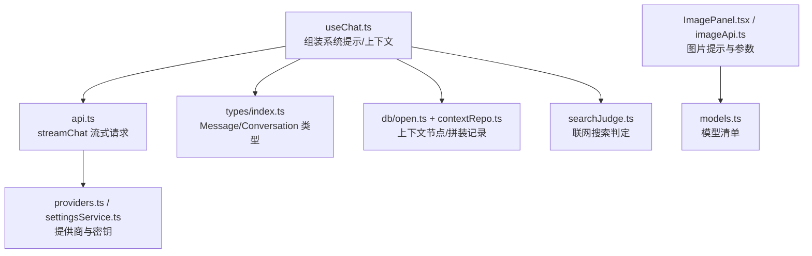
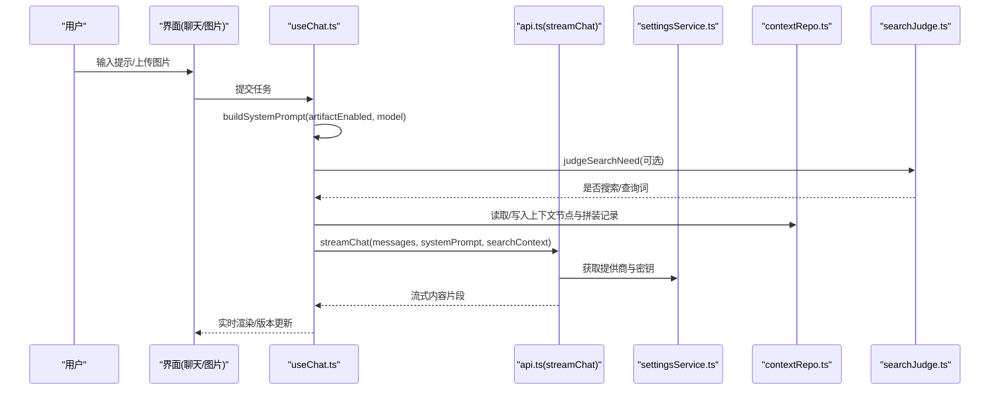
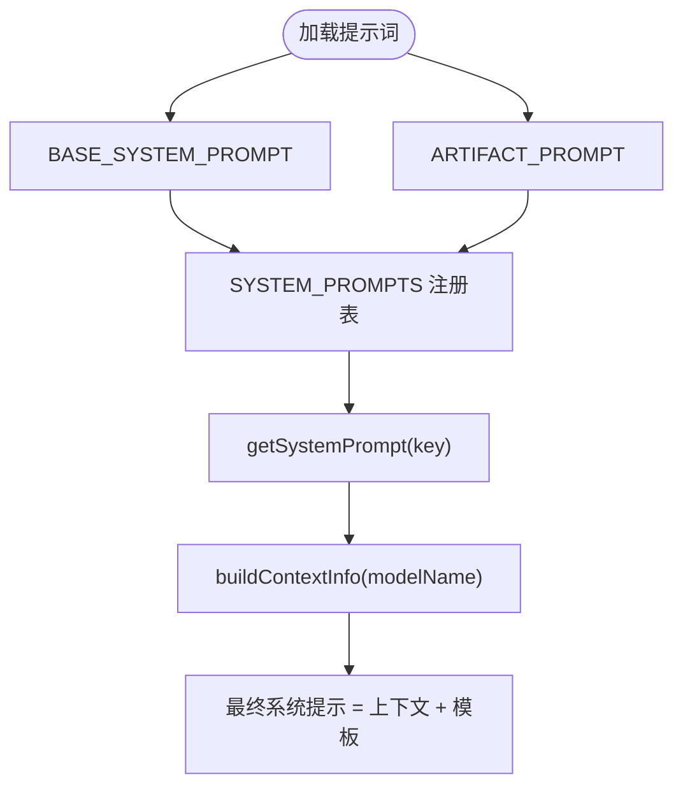
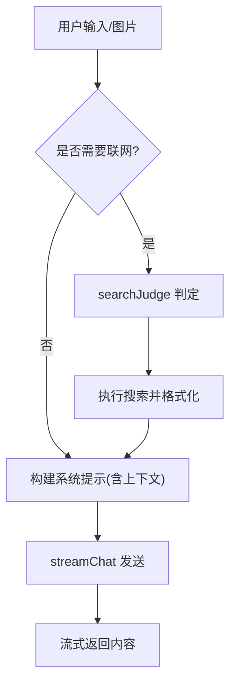
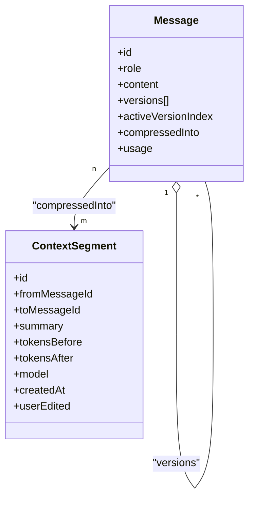
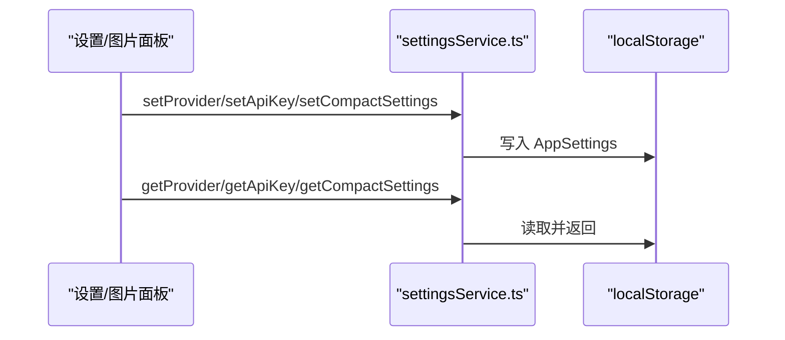
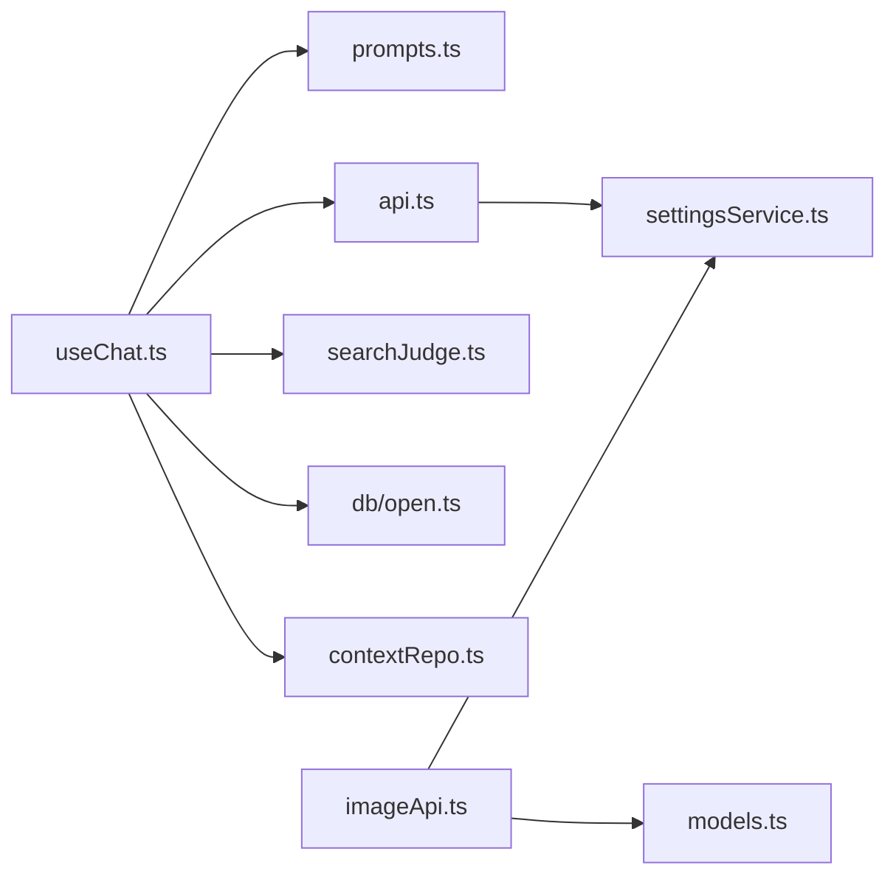

# 提示词模板管理

<cite>
**本文引用的文件**
- [src/config/prompts.ts](file://src/config/prompts.ts)
- [src/services/api.ts](file://src/services/api.ts)
- [src/hooks/useChat.ts](file://src/hooks/useChat.ts)
- [src/types/index.ts](file://src/types/index.ts)
- [src/db/open.ts](file://src/db/open.ts)
- [src/db/contextRepo.ts](file://src/db/contextRepo.ts)
- [src/services/settingsService.ts](file://src/services/settingsService.ts)
- [src/services/searchJudge.ts](file://src/services/searchJudge.ts)
- [src/config/models.ts](file://src/config/models.ts)
- [src/services/imageApi.ts](file://src/services/imageApi.ts)
- [src/components/image/ImagePanel.tsx](file://src/components/image/ImagePanel.tsx)
- [需求文档.md](file://需求文档.md)
</cite>

## 目录
1. [简介](#简介)
2. [项目结构](#项目结构)
3. [核心组件](#核心组件)
4. [架构总览](#架构总览)
5. [详细组件分析](#详细组件分析)
6. [依赖关系分析](#依赖关系分析)
7. [性能考量](#性能考量)
8. [故障排查指南](#故障排查指南)
9. [结论](#结论)
10. [附录](#附录)

## 简介
本文件面向 AIShop 的“提示词模板管理”，系统化说明：
- 提示词模板的组织结构与分类方式（系统提示、能力增强、上下文信息）
- 变量替换机制与动态内容生成逻辑（时间、时区、语言、设备、模型名等）
- 版本管理与更新策略（消息多版本、压缩摘要、拼装记录）
- 用户自定义提示词的保存与管理（本地设置、会话级配置）
- 开发规范（命名约定、变量定义、测试方法）
- 优化最佳实践与效果评估（用量解析、缓存命中、成本与质量权衡）

## 项目结构
AIShop 将提示词相关能力集中在配置层与服务层，并通过 Hook 在对话流程中装配：
- 配置层：集中管理系统提示词、能力增强提示词、上下文信息构建
- 服务层：组装消息、流式调用、用量解析、联网搜索判断
- 数据层：会话、消息、上下文节点与拼装记录的持久化
- 交互层：聊天与图片面板触发发送、参数选择与结果展示

图表来源
- [src/hooks/useChat.ts:48-52](file://src/hooks/useChat.ts#L48-L52)
- [src/services/api.ts:44-100](file://src/services/api.ts#L44-L100)
- [src/services/settingsService.ts:59-100](file://src/services/settingsService.ts#L59-L100)
- [src/types/index.ts:84-107](file://src/types/index.ts#L84-L107)
- [src/db/open.ts:14-32](file://src/db/open.ts#L14-L32)
- [src/db/contextRepo.ts:85-98](file://src/db/contextRepo.ts#L85-L98)
- [src/services/searchJudge.ts:80-124](file://src/services/searchJudge.ts#L80-L124)
- [src/components/image/ImagePanel.tsx:603-640](file://src/components/image/ImagePanel.tsx#L603-L640)
- [src/services/imageApi.ts:75-143](file://src/services/imageApi.ts#L75-L143)
- [src/config/models.ts:237-283](file://src/config/models.ts#L237-L283)

章节来源
- [src/config/prompts.ts:1-93](file://src/config/prompts.ts#L1-L93)
- [src/services/api.ts:1-173](file://src/services/api.ts#L1-L173)
- [src/hooks/useChat.ts:1-800](file://src/hooks/useChat.ts#L1-L800)
- [src/types/index.ts:1-252](file://src/types/index.ts#L1-L252)
- [src/db/open.ts:1-32](file://src/db/open.ts#L1-L32)
- [src/db/contextRepo.ts:64-98](file://src/db/contextRepo.ts#L64-L98)
- [src/services/settingsService.ts:1-101](file://src/services/settingsService.ts#L1-L101)
- [src/services/searchJudge.ts:46-124](file://src/services/searchJudge.ts#L46-L124)
- [src/config/models.ts:232-283](file://src/config/models.ts#L232-L283)
- [src/services/imageApi.ts:75-183](file://src/services/imageApi.ts#L75-L183)
- [src/components/image/ImagePanel.tsx:596-640](file://src/components/image/ImagePanel.tsx#L596-L640)
- [需求文档.md:27-36](file://需求文档.md#L27-L36)

## 核心组件
- 提示词模板中心：统一管理基础系统提示、能力增强提示（如网页生成 Artifact）、以及上下文信息注入
- 对话流装配器：根据功能开关与当前模型，组合最终系统提示并注入到 API 请求
- 上下文与版本管理：压缩摘要、拼装记录、消息多版本对比与回滚
- 联网搜索判定：基于小模型的轻量判断，决定是否追加搜索上下文
- 图片提示与参数：按模型差异构造请求体，支持编辑/文生图场景

章节来源
- [src/config/prompts.ts:1-93](file://src/config/prompts.ts#L1-L93)
- [src/hooks/useChat.ts:48-52](file://src/hooks/useChat.ts#L48-L52)
- [src/db/contextRepo.ts:85-98](file://src/db/contextRepo.ts#L85-L98)
- [src/services/searchJudge.ts:80-124](file://src/services/searchJudge.ts#L80-L124)
- [src/services/imageApi.ts:75-143](file://src/services/imageApi.ts#L75-L143)

## 架构总览
下图展示了从用户输入到模型响应的完整链路，突出提示词模板的装配位置与动态内容注入点。

图表来源
- [src/hooks/useChat.ts:48-52](file://src/hooks/useChat.ts#L48-L52)
- [src/services/api.ts:44-100](file://src/services/api.ts#L44-L100)
- [src/services/settingsService.ts:59-100](file://src/services/settingsService.ts#L59-L100)
- [src/db/contextRepo.ts:85-98](file://src/db/contextRepo.ts#L85-L98)
- [src/services/searchJudge.ts:80-124](file://src/services/searchJudge.ts#L80-L124)

## 详细组件分析

### 提示词模板组织与分类
- 基础系统提示：统一回复格式、数学公式、建议引导等通用约束
- 能力增强提示：例如网页生成 Artifact 的能力边界与输出规范
- 上下文信息块：时间、时区、语言、设备、当前模型名等运行时信息
- 模板注册表：以键值形式提供默认模板，便于扩展新场景

图表来源
- [src/config/prompts.ts:6-53](file://src/config/prompts.ts#L6-L53)
- [src/config/prompts.ts:55-93](file://src/config/prompts.ts#L55-L93)

章节来源
- [src/config/prompts.ts:1-93](file://src/config/prompts.ts#L1-L93)

### 变量替换机制与动态内容生成
- 动态上下文：通过 buildContextInfo 注入当前时间、时区偏移、语言、设备类型与模型名称
- 功能开关：Artifact 能力可开启/关闭，影响最终系统提示拼接
- 搜索上下文：当判定需要联网时，将搜索结果格式化后作为额外 system 消息注入
- 图片提示：不同模型对图像输入格式有差异，imageApi 内部进行适配与转换

图表来源
- [src/hooks/useChat.ts:621-676](file://src/hooks/useChat.ts#L621-L676)
- [src/services/searchJudge.ts:80-124](file://src/services/searchJudge.ts#L80-L124)
- [src/services/api.ts:61-67](file://src/services/api.ts#L61-L67)
- [src/services/imageApi.ts:75-143](file://src/services/imageApi.ts#L75-L143)

章节来源
- [src/config/prompts.ts:55-93](file://src/config/prompts.ts#L55-L93)
- [src/services/searchJudge.ts:46-124](file://src/services/searchJudge.ts#L46-L124)
- [src/services/api.ts:61-67](file://src/services/api.ts#L61-L67)
- [src/services/imageApi.ts:75-143](file://src/services/imageApi.ts#L75-L143)

### 版本管理与更新策略
- 消息多版本：同一消息可保留多个模型生成的版本，支持切换与重新生成
- 压缩摘要：将历史区间压缩为摘要段，减少上下文长度，同时保留原文以便撤销
- 拼装记录：存储最近一次上下文拼装计划，用于下一轮复用前缀，提升缓存命中率
- 落盘与恢复：会话与消息增量持久化，启动时恢复上次会话与状态

图表来源
- [src/types/index.ts:67-107](file://src/types/index.ts#L67-L107)
- [src/types/index.ts:13-27](file://src/types/index.ts#L13-L27)
- [src/db/contextRepo.ts:85-98](file://src/db/contextRepo.ts#L85-L98)

章节来源
- [src/types/index.ts:67-107](file://src/types/index.ts#L67-L107)
- [src/types/index.ts:13-27](file://src/types/index.ts#L13-L27)
- [src/db/contextRepo.ts:85-98](file://src/db/contextRepo.ts#L85-L98)
- [src/hooks/useChat.ts:1036-1182](file://src/hooks/useChat.ts#L1036-L1182)

### 用户自定义提示词的保存与管理
- 全局设置：提供商、API Key、压缩策略等通过 settingsService 读写 localStorage
- 会话级配置：是否启用 Artifact、自动压缩等保存在 localStorage，并在应用内监听变更
- 图片模式：用户输入的 prompt 与参考图由 ImagePanel 收集，经 imageApi 适配后发送到对应模型

图表来源
- [src/services/settingsService.ts:59-100](file://src/services/settingsService.ts#L59-L100)
- [src/components/image/ImagePanel.tsx:603-640](file://src/components/image/ImagePanel.tsx#L603-L640)

章节来源
- [src/services/settingsService.ts:1-101](file://src/services/settingsService.ts#L1-L101)
- [src/components/image/ImagePanel.tsx:596-640](file://src/components/image/ImagePanel.tsx#L596-L640)

### 提示词模板开发规范
- 命名约定
  - 模板常量使用全大写+下划线（如 BASE_SYSTEM_PROMPT、ARTIFACT_PROMPT）
  - 注册表键名使用短小语义化标识（如 default），便于扩展 newKey
- 变量定义
  - 动态上下文统一通过 buildContextInfo 生成，避免散落拼接
  - 搜索上下文通过 formatSearchResultsForContext 标准化
- 测试方法
  - 单元测试：验证 getSystemPrompt(key) 返回预期模板；buildContextInfo 在不同浏览器环境下的字段正确性
  - 集成测试：模拟 streamChat 流式响应，校验 usage 解析、suggestions 提取、artifact 标记处理
  - 回归用例：覆盖 Artifact 开/关、联网搜索开/关、不同模型的图片参数适配

章节来源
- [src/config/prompts.ts:6-53](file://src/config/prompts.ts#L6-L53)
- [src/config/prompts.ts:55-93](file://src/config/prompts.ts#L55-L93)
- [src/services/api.ts:17-42](file://src/services/api.ts#L17-L42)
- [src/hooks/useChat.ts:93-150](file://src/hooks/useChat.ts#L93-L150)
- [src/services/imageApi.ts:75-143](file://src/services/imageApi.ts#L75-L143)

### 提示词优化最佳实践与效果评估
- 最佳实践
  - 控制反引号使用：仅用于代码/技术术语，避免长句被误识别为代码
  - 明确输出格式：使用固定标记（如 <<<SUGGESTIONS>>>）便于前端解析与隐藏中间态
  - 合理压缩阈值：保守阈值避免频繁改写前缀破坏缓存；热窗口保留最近消息
  - 图片提示适配：按模型差异构造请求体，确保 base64/data URI/URL 的正确处理
- 效果评估
  - 用量解析：统一 parseUsage 兼容不同网关字段，统计 prompt/completion/cached/cacheWrite tokens
  - 缓存命中：关注 cachedTokens 与 cacheWriteTokens，评估压缩策略对成本的影响
  - 质量指标：suggestions 数量与相关性、artifact 成功率、联网搜索命中率

章节来源
- [src/hooks/useChat.ts:54-91](file://src/hooks/useChat.ts#L54-L91)
- [src/hooks/useChat.ts:93-150](file://src/hooks/useChat.ts#L93-L150)
- [src/services/api.ts:17-42](file://src/services/api.ts#L17-L42)
- [src/services/settingsService.ts:27-33](file://src/services/settingsService.ts#L27-L33)
- [src/services/imageApi.ts:75-143](file://src/services/imageApi.ts#L75-L143)

## 依赖关系分析
- 模块耦合
  - useChat 强依赖 prompts、api、searchJudge、conversationStore、db 层
  - api 依赖 settingsService 与 providers 配置，负责流式传输与用量解析
  - imageApi 依赖 models 与 settingsService，按模型差异化构造请求
- 外部依赖
  - 各 LLM/图片提供商通过统一接口接入，密钥与基地址由 settingsService 管理
  - IndexedDB 用于会话、消息、上下文节点与拼装记录的持久化

图表来源
- [src/hooks/useChat.ts:1-800](file://src/hooks/useChat.ts#L1-L800)
- [src/services/api.ts:1-173](file://src/services/api.ts#L1-L173)
- [src/services/settingsService.ts:1-101](file://src/services/settingsService.ts#L1-L101)
- [src/services/imageApi.ts:75-183](file://src/services/imageApi.ts#L75-L183)
- [src/config/models.ts:232-283](file://src/config/models.ts#L232-L283)
- [src/db/open.ts:1-32](file://src/db/open.ts#L1-L32)
- [src/db/contextRepo.ts:64-98](file://src/db/contextRepo.ts#L64-L98)

章节来源
- [src/hooks/useChat.ts:1-800](file://src/hooks/useChat.ts#L1-L800)
- [src/services/api.ts:1-173](file://src/services/api.ts#L1-L173)
- [src/services/settingsService.ts:1-101](file://src/services/settingsService.ts#L1-L101)
- [src/services/imageApi.ts:75-183](file://src/services/imageApi.ts#L75-L183)
- [src/config/models.ts:232-283](file://src/config/models.ts#L232-L283)
- [src/db/open.ts:1-32](file://src/db/open.ts#L1-L32)
- [src/db/contextRepo.ts:64-98](file://src/db/contextRepo.ts#L64-L98)

## 性能考量
- 流式渲染与落盘：流式期间按会话串行化写入，避免同消息多次更新穿插导致抖动
- 用量解析容错：兼容不同网关字段，失败时降级重试，保证对话不中断
- 压缩策略：保守阈值与热窗口保护，减少频繁压缩导致的缓存失效与成本上升
- 图片请求超时：为图片生成预留足够超时，避免长时间挂起

章节来源
- [src/db/open.ts:1-32](file://src/db/open.ts#L1-L32)
- [src/services/api.ts:102-118](file://src/services/api.ts#L102-L118)
- [src/services/settingsService.ts:27-33](file://src/services/settingsService.ts#L27-L33)
- [src/services/imageApi.ts:149-183](file://src/services/imageApi.ts#L149-L183)

## 故障排查指南
- 无法获取系统提示：检查 getSystemPrompt 的 key 是否存在于注册表
- 流式无内容或用量缺失：确认 include_usage 支持情况，必要时走降级路径
- 图片请求卡住：核对 base64/data URI/URL 格式是否符合模型要求
- 压缩无效或成本高：调整 threshold 与 hotWindowSize，观察 cachedTokens 变化
- 联网搜索未生效：检查 searchJudge 判定逻辑与上游返回格式

章节来源
- [src/config/prompts.ts:47-53](file://src/config/prompts.ts#L47-L53)
- [src/services/api.ts:102-118](file://src/services/api.ts#L102-L118)
- [src/services/imageApi.ts:75-143](file://src/services/imageApi.ts#L75-L143)
- [src/services/settingsService.ts:27-33](file://src/services/settingsService.ts#L27-L33)
- [src/services/searchJudge.ts:80-124](file://src/services/searchJudge.ts#L80-L124)

## 结论
AIShop 的提示词模板管理采用“集中配置 + 动态注入”的设计：
- 通过 prompts.ts 统一管理基础与能力增强提示，结合 buildContextInfo 实现运行时变量替换
- 在 useChat 中按功能开关与模型特性装配最终系统提示，并注入搜索上下文
- 借助消息多版本、压缩摘要与拼装记录，实现可控的版本管理与缓存友好
- 通过 settingsService 与 localStorage 实现用户自定义配置的持久化
- 配合用量解析与压缩策略，持续评估并优化成本与质量

## 附录
- 系统提示词默认行为：可在 prompts.ts 中扩展新的 SYSTEM_PROMPTS 键值，并在 useChat 中按需引用
- 图片模型清单与参数：参见 models.ts 与 imageApi.ts，按模型差异化构造请求体
- 需求对齐：系统提示词的统一配置文件已在需求文档中强调，应优先维护

章节来源
- [需求文档.md:27-36](file://需求文档.md#L27-L36)
- [src/config/models.ts:232-283](file://src/config/models.ts#L232-L283)
- [src/services/imageApi.ts:75-143](file://src/services/imageApi.ts#L75-L143)
- [src/config/prompts.ts:47-53](file://src/config/prompts.ts#L47-L53)