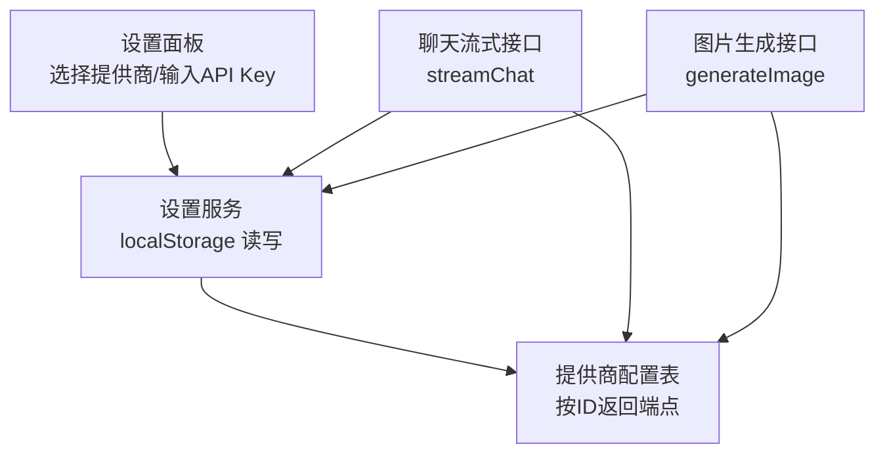
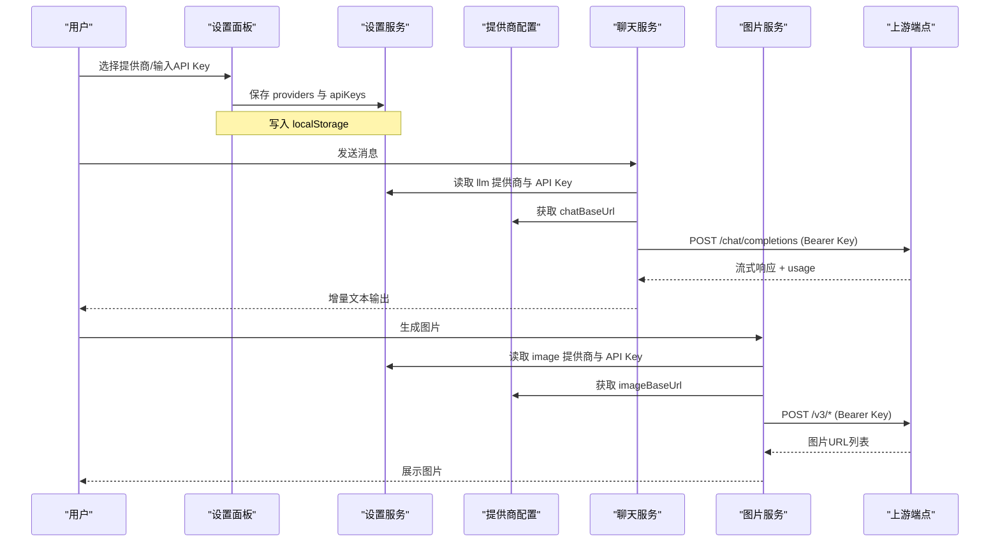
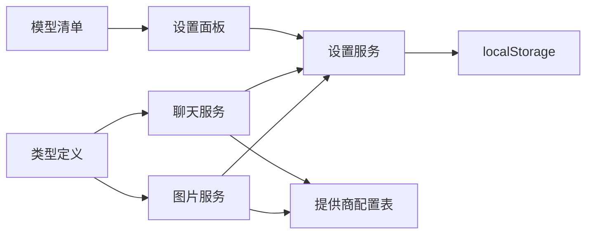

# 服务提供商配置

<cite>
**本文引用的文件**
- [src/config/providers.ts](file://src/config/providers.ts)
- [src/services/settingsService.ts](file://src/services/settingsService.ts)
- [src/components/settings/SettingsPanel.tsx](file://src/components/settings/SettingsPanel.tsx)
- [src/services/api.ts](file://src/services/api.ts)
- [src/services/imageApi.ts](file://src/services/imageApi.ts)
- [src/config/models.ts](file://src/config/models.ts)
- [src/types/index.ts](file://src/types/index.ts)
</cite>

## 目录
1. [简介](#简介)
2. [项目结构](#项目结构)
3. [核心组件](#核心组件)
4. [架构总览](#架构总览)
5. [详细组件分析](#详细组件分析)
6. [依赖关系分析](#依赖关系分析)
7. [性能与可用性考虑](#性能与可用性考虑)
8. [故障排除指南](#故障排除指南)
9. [结论](#结论)
10. [附录：新增提供商集成指南](#附录新增提供商集成指南)

## 简介
本文件面向 AIShop 的“服务提供商配置”能力，系统性说明：
- 提供商配置的数据结构与组织方式
- 不同 AI 服务供应商（LLM、图片、视频、搜索）的接入配置
- 提供商的动态加载机制与配置文件组织结构
- 认证信息（API Key）的配置方式与安全注意事项
- 提供商切换逻辑与错误处理机制
- 新增服务提供商的集成步骤、配置格式、认证流程与测试方法
- 最佳实践与常见问题排查

## 项目结构
AIShop 将“提供商配置”拆分为三层：
- 配置层：集中声明各提供商的基础端点（chatBaseUrl、imageBaseUrl），并提供按 ID 获取配置的函数。
- 设置层：基于浏览器 localStorage 持久化用户选择的提供商类别（llm/image/video/search）与各提供商的 API Key。
- 调用层：在聊天和图片生成等具体业务中，动态读取当前提供商与密钥，拼接请求并发起网络调用。

图表来源
- [src/components/settings/SettingsPanel.tsx:13-28](file://src/components/settings/SettingsPanel.tsx#L13-L28)
- [src/services/settingsService.ts:5-25](file://src/services/settingsService.ts#L5-L25)
- [src/config/providers.ts:1-18](file://src/config/providers.ts#L1-L18)
- [src/services/api.ts:44-118](file://src/services/api.ts#L44-L118)
- [src/services/imageApi.ts:149-242](file://src/services/imageApi.ts#L149-L242)

章节来源
- [src/config/providers.ts:1-18](file://src/config/providers.ts#L1-L18)
- [src/services/settingsService.ts:1-100](file://src/services/settingsService.ts#L1-L100)
- [src/components/settings/SettingsPanel.tsx:1-204](file://src/components/settings/SettingsPanel.tsx#L1-L204)
- [src/services/api.ts:44-173](file://src/services/api.ts#L44-L173)
- [src/services/imageApi.ts:1-257](file://src/services/imageApi.ts#L1-L257)

## 核心组件
- 提供商配置表：以键值对形式维护每个提供商的名称与基础 URL（聊天与图片）。提供按 ID 查询的函数，缺失时回退到默认提供商。
- 设置服务：封装 localStorage 的读写，管理三类数据：
  - 提供商选择：按类别（llm/image/video/search）保存当前使用的提供商 ID
  - API Key：按提供商 ID 保存对应的密钥
  - 压缩相关设置：用于上下文压缩的模型、阈值与热窗口大小
- 设置面板：用户界面，允许选择各类别提供商并输入/更新 API Key，实时保存到本地存储。
- 聊天服务：在发起对话前，读取当前 LLM 提供商与密钥，构造请求并流式返回内容；包含用量解析与兼容重试逻辑。
- 图片服务：根据所选图片提供商与模型，构建请求体并调用对应端点，统一抽取返回的图片 URL。

章节来源
- [src/config/providers.ts:1-18](file://src/config/providers.ts#L1-L18)
- [src/services/settingsService.ts:1-100](file://src/services/settingsService.ts#L1-L100)
- [src/components/settings/SettingsPanel.tsx:13-204](file://src/components/settings/SettingsPanel.tsx#L13-L204)
- [src/services/api.ts:44-173](file://src/services/api.ts#L44-L173)
- [src/services/imageApi.ts:1-257](file://src/services/imageApi.ts#L1-L257)

## 架构总览
下图展示了从用户操作到最终调用的完整链路，包括提供商动态加载、认证注入与错误处理。

图表来源
- [src/components/settings/SettingsPanel.tsx:93-103](file://src/components/settings/SettingsPanel.tsx#L93-L103)
- [src/services/settingsService.ts:59-84](file://src/services/settingsService.ts#L59-L84)
- [src/config/providers.ts:15-18](file://src/config/providers.ts#L15-L18)
- [src/services/api.ts:53-118](file://src/services/api.ts#L53-L118)
- [src/services/imageApi.ts:153-242](file://src/services/imageApi.ts#L153-L242)

## 详细组件分析

### 提供商配置表（config/providers.ts）
- 数据结构：ProviderEndpoints 包含 name、chatBaseUrl、imageBaseUrl。
- 组织方式：PROVIDERS 为 Record<string, ProviderEndpoints>，通过 getProviderConfig(providerId) 获取，若不存在则回退到默认 fastapi。
- 扩展性：新增提供商只需在 PROVIDERS 中添加条目，并在设置面板中暴露选项即可。

章节来源
- [src/config/providers.ts:1-18](file://src/config/providers.ts#L1-L18)

### 设置服务（services/settingsService.ts）
- 数据模型：
  - ProviderConfig：{ llm, image, video, search }
  - AppSettings：providers + apiKeys + compact
- 持久化：使用 localStorage 的 aishop_settings 键，提供 get/set 方法。
- 默认值：未初始化时使用预设的默认提供商与空 apiKeys。
- 关键方法：
  - getProvider(category)：读取当前类别的提供商
  - setProvider(category, provider)：保存选择
  - getApiKey(provider)：读取指定提供商的 API Key
  - setApiKey(provider, key)：保存或清除密钥
  - getCompactSettings()/setCompactSettings()：上下文压缩相关设置

章节来源
- [src/services/settingsService.ts:1-100](file://src/services/settingsService.ts#L1-L100)

### 设置面板（components/settings/SettingsPanel.tsx）
- 分类：LLM、图片、视频、联网搜索四类，每类可独立选择提供商。
- 交互：
  - 选择器：PROVIDER_OPTIONS 定义可选项，支持 default 与 search 两类
  - API Key：明文/密码切换显示，变更时即时保存
- 状态同步：所有更改通过 settingsService 持久化，确保刷新后仍生效。

章节来源
- [src/components/settings/SettingsPanel.tsx:13-204](file://src/components/settings/SettingsPanel.tsx#L13-L204)

### 聊天服务（services/api.ts）
- 动态加载：
  - 读取当前 LLM 提供商与 API Key
  - 通过 getProviderConfig 获取 chatBaseUrl
- 请求构造：
  - 组装 system 提示与历史消息
  - 将图片引用还原为 data URL 后发送
  - 携带 Authorization: Bearer {apiKey}
- 错误处理与兼容性：
  - 首次尝试 include_usage=true，若网关不支持（4xx且含特定关键字）则去掉该参数重试
  - 非 2xx 响应抛出错误，包含状态码与原始错误文本
- 流式处理：
  - 逐行解析 SSE data: JSON，提取 delta.content 增量输出
  - 解析 usage 字段，支持多种命名（prompt_tokens/input_tokens 等）
  - 结束时回调真实用量

章节来源
- [src/services/api.ts:44-173](file://src/services/api.ts#L44-L173)

### 图片服务（services/imageApi.ts）
- 动态加载：
  - 读取当前图片提供商与 API Key
  - 通过 getProviderConfig 获取 imageBaseUrl
- 模型路由：
  - IMAGE_ENDPOINTS 映射模型到 textToImage/edit 路径
  - 根据是否编辑模式选择对应端点
- 请求体构建：
  - GPT Image 2：支持 base64/data URI/URL 三种输入，编辑模式仅单图
  - Gemini 系列：区分 image_urls 与 image_base64s，自动剥离 data URI 前缀
- 错误处理：
  - 超时控制（120s），区分外部取消与内部超时
  - 非 2xx 响应优先解析 detail/error.message，否则返回状态码信息
- 响应解析：
  - 兼容多结构：image_urls、images、data 列表，支持 b64_json 转 data URL

章节来源
- [src/services/imageApi.ts:1-257](file://src/services/imageApi.ts#L1-L257)

### 模型清单（config/models.ts）
- 统一管理聊天与图片模型元数据（id、name、provider、type、能力、价格等）
- 提供按类型筛选的函数，便于前端渲染模型选择器
- 与提供商解耦：model.provider 仅用于展示与统计，实际调用由设置中的提供商决定

章节来源
- [src/config/models.ts:1-284](file://src/config/models.ts#L1-L284)

### 类型定义（types/index.ts）
- 定义了 TokenUsage、Message、Model、ImageGenerationParams 等核心类型
- 支撑聊天与图片服务的类型安全与一致性

章节来源
- [src/types/index.ts:1-252](file://src/types/index.ts#L1-L252)

## 依赖关系分析
- 设置面板依赖设置服务进行持久化
- 聊天/图片服务依赖设置服务获取当前提供商与密钥，再依赖提供商配置表获取端点
- 模型清单与类型定义被多处消费，保证 UI 与服务端行为一致

图表来源
- [src/components/settings/SettingsPanel.tsx:13-204](file://src/components/settings/SettingsPanel.tsx#L13-L204)
- [src/services/settingsService.ts:1-100](file://src/services/settingsService.ts#L1-L100)
- [src/config/providers.ts:1-18](file://src/config/providers.ts#L1-L18)
- [src/services/api.ts:44-173](file://src/services/api.ts#L44-L173)
- [src/services/imageApi.ts:1-257](file://src/services/imageApi.ts#L1-L257)
- [src/config/models.ts:1-284](file://src/config/models.ts#L1-L284)
- [src/types/index.ts:1-252](file://src/types/index.ts#L1-L252)

## 性能与可用性考虑
- 流式输出：聊天服务采用 SSE 流式传输，降低首字延迟，提升用户体验。
- 用量解析：兼容多种网关字段命名，尽可能准确统计 token 用量。
- 重试策略：当网关不支持 include_usage 时自动降级重试，避免失败阻断。
- 超时控制：图片生成设置 120s 超时，防止长时间挂起。
- 本地缓存：设置与密钥存储在 localStorage，减少重复配置成本。

[本节为通用指导，不直接分析具体文件]

## 故障排除指南
- 未配置 API Key：
  - 现象：聊天或图片调用时报错提示需先配置
  - 处理：进入设置面板，为对应类别填写 API Key
- 网关不支持 include_usage：
  - 现象：首次请求失败，随后自动重试成功
  - 处理：无需干预，系统已内置兼容逻辑
- 图片生成超时：
  - 现象：请求超过 120s 被中止
  - 处理：检查网络与上游服务状态，必要时重试
- 响应异常：
  - 现象：非 2xx 响应，抛出错误并附带状态码或上游错误信息
  - 处理：查看错误详情，确认模型、参数与密钥是否正确

章节来源
- [src/services/api.ts:53-118](file://src/services/api.ts#L53-L118)
- [src/services/imageApi.ts:153-242](file://src/services/imageApi.ts#L153-L242)

## 结论
AIShop 的服务提供商配置采用“配置表 + 设置服务 + 调用层”的分层设计，具备以下特点：
- 可扩展：新增提供商仅需添加配置与 UI 选项
- 易维护：设置与端点分离，职责清晰
- 健壮：内置兼容重试、用量解析与超时控制
- 安全：API Key 由用户本地管理，调用时注入 Authorization 头

[本节为总结，不直接分析具体文件]

## 附录：新增提供商集成指南

### 1. 配置格式
- 在提供商配置表中新增条目，包含名称与基础 URL（聊天与图片）
- 如需新增更多字段（如视频端点），可在 ProviderEndpoints 中扩展并同步更新调用方

章节来源
- [src/config/providers.ts:1-18](file://src/config/providers.ts#L1-L18)

### 2. 设置面板暴露选项
- 在 PROVIDER_OPTIONS 中添加新提供商的 value 与 label
- 若为搜索类，添加到 search 分类；其他类别使用 default 或新增分类

章节来源
- [src/components/settings/SettingsPanel.tsx:13-28](file://src/components/settings/SettingsPanel.tsx#L13-L28)

### 3. 认证流程
- 用户在设置面板输入新提供商的 API Key，系统自动保存到 localStorage
- 调用时从设置服务读取密钥并注入 Authorization: Bearer {apiKey}

章节来源
- [src/services/settingsService.ts:59-84](file://src/services/settingsService.ts#L59-L84)
- [src/services/api.ts:84-100](file://src/services/api.ts#L84-L100)
- [src/services/imageApi.ts:192-202](file://src/services/imageApi.ts#L192-L202)

### 4. 调用适配
- 聊天：无需改动，自动使用当前 LLM 提供商与端点
- 图片：若新模型需要新的端点映射，需在 IMAGE_ENDPOINTS 中添加映射；若请求体结构不同，需在 buildImageRequestBody 中适配

章节来源
- [src/services/imageApi.ts:6-19](file://src/services/imageApi.ts#L6-L19)
- [src/services/imageApi.ts:65-143](file://src/services/imageApi.ts#L65-L143)

### 5. 测试方法
- 功能验证：
  - 在设置面板选择新提供商并填写 API Key
  - 发起一次聊天与一次图片生成，确认流式输出与图片返回正常
- 错误场景：
  - 故意输入错误密钥，观察错误提示与日志
  - 模拟网关不支持 include_usage，验证自动重试
  - 触发图片生成超时，验证中断与提示

章节来源
- [src/services/api.ts:102-118](file://src/services/api.ts#L102-L118)
- [src/services/imageApi.ts:183-216](file://src/services/imageApi.ts#L183-L216)

### 6. 最佳实践
- 端点隔离：不同提供商的 chatBaseUrl 与 imageBaseUrl 应严格区分，避免混用
- 密钥管理：仅在本地存储，不在代码或日志中打印
- 模型与提供商解耦：模型清单只描述能力与价格，实际调用由设置决定
- 错误信息：尽量保留上游错误详情，便于定位问题

[本节为通用指导，不直接分析具体文件]