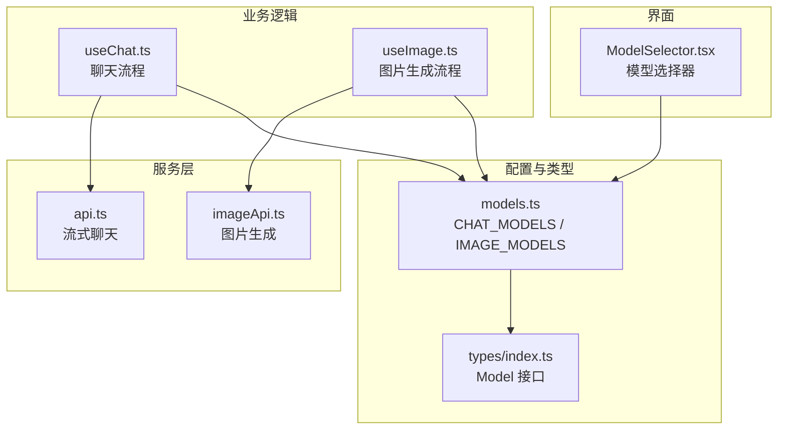
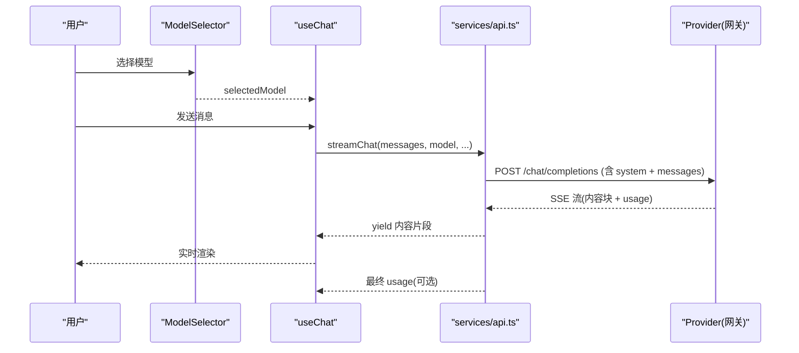
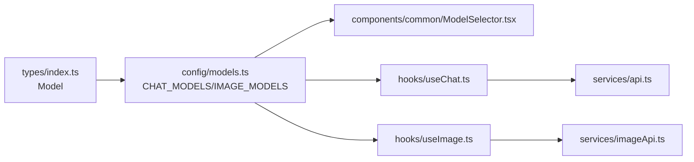

# 模型配置管理

<cite>
**本文引用的文件**
- [src/config/models.ts](file://src/config/models.ts)
- [src/types/index.ts](file://src/types/index.ts)
- [src/components/common/ModelSelector.tsx](file://src/components/common/ModelSelector.tsx)
- [src/hooks/useChat.ts](file://src/hooks/useChat.ts)
- [src/hooks/useImage.ts](file://src/hooks/useImage.ts)
- [src/services/api.ts](file://src/services/api.ts)
- [src/services/imageApi.ts](file://src/services/imageApi.ts)
</cite>

## 目录
1. [简介](#简介)
2. [项目结构](#项目结构)
3. [核心组件](#核心组件)
4. [架构总览](#架构总览)
5. [详细组件分析](#详细组件分析)
6. [依赖关系分析](#依赖关系分析)
7. [性能考虑](#性能考虑)
8. [故障排查指南](#故障排查指南)
9. [结论](#结论)
10. [附录：新增模型配置完整指南](#附录新增模型配置完整指南)

## 简介
本文件面向 AIShop 的“模型配置管理”，聚焦以下目标：
- 说明聊天模型（CHAT_MODELS）与图像模型（IMAGE_MODELS）的配置结构与字段含义。
- 解释模型能力矩阵（输入/输出能力）如何声明与使用。
- 文档化价格配置系统，包括按 token 计费与按张计费两种模式。
- 解析模型筛选函数 getModelsByType 的实现与使用方式。
- 提供添加新模型的完整步骤、字段定义、能力声明与价格设置规范。
- 总结模型配置的验证规则与最佳实践。

## 项目结构
AIShop 将模型配置集中在前端配置层，并通过类型定义约束数据结构；UI 层通过选择器展示并按厂商分组；业务 Hook 与服务层根据模型类型调用对应 API。

图表来源
- [src/config/models.ts:1-284](file://src/config/models.ts#L1-L284)
- [src/types/index.ts:109-123](file://src/types/index.ts#L109-L123)
- [src/components/common/ModelSelector.tsx:1-320](file://src/components/common/ModelSelector.tsx#L1-L320)
- [src/hooks/useChat.ts:1-120](file://src/hooks/useChat.ts#L1-L120)
- [src/hooks/useImage.ts:1-60](file://src/hooks/useImage.ts#L1-L60)
- [src/services/api.ts:1-173](file://src/services/api.ts#L1-L173)
- [src/services/imageApi.ts:1-257](file://src/services/imageApi.ts#L1-L257)

章节来源
- [src/config/models.ts:1-284](file://src/config/models.ts#L1-L284)
- [src/types/index.ts:109-123](file://src/types/index.ts#L109-L123)

## 核心组件
- 模型类型 Model：统一描述模型标识、名称、提供商、类型、上下文长度、最大输出、输入/输出能力与价格。
- 聊天模型数组 CHAT_MODELS：集中维护所有文本对话类模型。
- 图像模型数组 IMAGE_MODELS：集中维护所有图像生成类模型。
- 模型筛选函数 getModelsByType：按 type 返回对应模型列表。
- 模型选择器 ModelSelector：按厂商分组展示模型，支持 compact 模式与底部弹窗。
- 聊天 Hook useChat：读取默认模型、构建系统提示、发送消息、处理流式响应与用量。
- 图片 Hook useImage：维护图片模型选择、参数、并发队列与历史。
- 服务 api.ts：流式聊天请求、用量解析与错误降级。
- 服务 imageApi.ts：图片生成请求、端点映射、参数构建与结果提取。

章节来源
- [src/types/index.ts:109-123](file://src/types/index.ts#L109-L123)
- [src/config/models.ts:3-284](file://src/config/models.ts#L3-L284)
- [src/components/common/ModelSelector.tsx:18-48](file://src/components/common/ModelSelector.tsx#L18-L48)
- [src/hooks/useChat.ts:44-52](file://src/hooks/useChat.ts#L44-L52)
- [src/hooks/useImage.ts:17-63](file://src/hooks/useImage.ts#L17-L63)
- [src/services/api.ts:44-173](file://src/services/api.ts#L44-L173)
- [src/services/imageApi.ts:6-19](file://src/services/imageApi.ts#L6-L19)

## 架构总览
下图展示了从 UI 到服务的模型调用链路，以及配置在其中的作用位置。

图表来源
- [src/components/common/ModelSelector.tsx:69-116](file://src/components/common/ModelSelector.tsx#L69-L116)
- [src/hooks/useChat.ts:494-783](file://src/hooks/useChat.ts#L494-L783)
- [src/services/api.ts:44-173](file://src/services/api.ts#L44-L173)

## 详细组件分析

### 模型类型与配置结构
- Model 接口定义了模型元数据与能力矩阵：
  - id/name/provider/type：唯一标识、显示名、提供商、类型（chat/image/video/music）。
  - maxTokens/contextLength：最大输出与上下文窗口。
  - inputCapabilities/outputCapabilities：输入/输出能力集合，如 text、image、video、audio。
  - price.input/price.output：价格字符串，支持“按百万tokens”或“按张计费”。

章节来源
- [src/types/index.ts:109-123](file://src/types/index.ts#L109-L123)

### 聊天模型 CHAT_MODELS
- 覆盖多家提供商（Anthropic、OpenAI、Google、xAI、DeepSeek、智谱、Moonshot、Alibaba、ByteDance、Xiaomi）。
- 每个模型声明了：
  - 类型：chat
  - 输入能力：多为 text，部分包含 image、video、audio。
  - 输出能力：text。
  - 价格：input/output 以“$/百万tokens”形式表示。

章节来源
- [src/config/models.ts:3-235](file://src/config/models.ts#L3-L235)

### 图像模型 IMAGE_MODELS
- 当前包含 OpenAI GPT Image 2 与 Google Gemini 系列图像模型。
- 每个模型声明了：
  - 类型：image
  - 输入能力：text、image（编辑模式可传入参考图）。
  - 输出能力：image。
  - 价格：input/output 为“按张计费”。

章节来源
- [src/config/models.ts:237-271](file://src/config/models.ts#L237-L271)

### 模型能力矩阵
- 输入能力 inputCapabilities：
  - text：纯文本输入。
  - image：支持图片输入（如多模态理解或编辑）。
  - video：支持视频输入（部分模型具备）。
  - audio：支持音频输入（部分模型具备）。
- 输出能力 outputCapabilities：
  - text：文本回复。
  - image：图像生成。
- 使用方式：
  - 用于 UI 展示与校验（例如图片编辑时限制上传数量、尺寸等）。
  - 用于服务端参数构建（如 imageApi 中根据模型决定 size、aspectRatio、quality 等）。

章节来源
- [src/config/models.ts:3-271](file://src/config/models.ts#L3-L271)
- [src/services/imageApi.ts:66-143](file://src/services/imageApi.ts#L66-L143)

### 价格配置系统
- 按 token 计费：
  - 适用于聊天模型，格式如“$X/百万tokens”。
  - 由上层统计真实 usage（promptTokens、completionTokens、totalTokens），结合价格进行成本估算。
- 按张计费：
  - 适用于图像模型，格式为“按张计费”。
  - 通常不依赖 token 计数，而是按生成次数计费。
- 注意：
  - 价格字段为字符串，便于展示；实际计费逻辑需在上层解析或对接账单系统。
  - 不同提供商可能返回不同的 usage 字段，服务层已做兼容解析。

章节来源
- [src/config/models.ts:3-271](file://src/config/models.ts#L3-L271)
- [src/services/api.ts:12-42](file://src/services/api.ts#L12-L42)

### 模型筛选函数 getModelsByType
- 实现：
  - 接收 type（chat/image/video/music），返回对应模型数组。
  - 未匹配类型时返回空数组。
- 使用场景：
  - 动态加载某类模型列表，供选择器或业务逻辑过滤。
  - 扩展新类型时，只需在 switch 分支中添加映射。

章节来源
- [src/config/models.ts:275-283](file://src/config/models.ts#L275-L283)

### 模型选择器 ModelSelector
- 功能：
  - 按厂商分组展示模型，支持图标映射与深色背景适配。
  - compact 模式下使用底部弹窗，非 compact 使用固定定位下拉菜单。
  - 支持键盘 ESC 关闭与外部点击关闭。
- 与配置的关系：
  - 接收 models 列表（可由 getModelsByType 获取）。
  - 通过 PROVIDER_GROUP_MAP 将提供商映射为组名并排序。

章节来源
- [src/components/common/ModelSelector.tsx:18-48](file://src/components/common/ModelSelector.tsx#L18-L48)
- [src/components/common/ModelSelector.tsx:69-178](file://src/components/common/ModelSelector.tsx#L69-L178)
- [src/components/common/ModelSelector.tsx:184-316](file://src/components/common/ModelSelector.tsx#L184-L316)

### 聊天流程 useChat
- 默认模型：
  - 启动时优先读取上次使用的模型，否则回退到 CHAT_MODELS[0]。
- 系统提示：
  - 根据是否启用 artifact 与所选模型名称构建系统提示。
- 发送消息：
  - 自动压缩上下文（可选）、联网搜索（可选）、流式渲染、用量记录。
- 与模型配置的关系：
  - 通过 selectedModel 驱动具体模型调用。
  - 使用 CHAT_MODELS 中的 name 构建上下文信息。

章节来源
- [src/hooks/useChat.ts:44-52](file://src/hooks/useChat.ts#L44-L52)
- [src/hooks/useChat.ts:494-783](file://src/hooks/useChat.ts#L494-L783)

### 图片流程 useImage
- 模型选择：
  - 持久化选择的图片模型，切换时重置参数并裁剪超量上传。
- 参数派生：
  - 根据模型类型决定 size、aspectRatio、quality 等选项。
- 并发队列：
  - 任务状态管理、取消与重试、超时控制。
- 与模型配置的关系：
  - 使用 IMAGE_MODELS 作为可用模型列表。
  - 根据模型 ID 判断是否为 GPT 或 Google 系列，从而差异化处理参数。

章节来源
- [src/hooks/useImage.ts:17-63](file://src/hooks/useImage.ts#L17-L63)
- [src/hooks/useImage.ts:204-267](file://src/hooks/useImage.ts#L204-L267)
- [src/hooks/useImage.ts:274-469](file://src/hooks/useImage.ts#L274-L469)

### 服务层：聊天与图片
- 聊天服务 api.ts：
  - 流式请求、SSE 解析、usage 提取、错误降级（不支持 include_usage 时重试）。
- 图片服务 imageApi.ts：
  - 模型到端点的映射、请求体构建（区分编辑/文生图）、结果 URL 提取、超时与错误处理。

章节来源
- [src/services/api.ts:44-173](file://src/services/api.ts#L44-L173)
- [src/services/imageApi.ts:6-19](file://src/services/imageApi.ts#L6-L19)
- [src/services/imageApi.ts:66-143](file://src/services/imageApi.ts#L66-L143)
- [src/services/imageApi.ts:149-243](file://src/services/imageApi.ts#L149-L243)

## 依赖关系分析
- 配置层：
  - models.ts 导出 CHAT_MODELS、IMAGE_MODELS 与 getModelsByType。
  - types/index.ts 定义 Model 接口，约束配置结构。
- 界面层：
  - ModelSelector 依赖 models.ts 提供的模型列表，按厂商分组展示。
- 业务层：
  - useChat 依赖 CHAT_MODELS 获取默认模型与名称。
  - useImage 依赖 IMAGE_MODELS 管理图片模型与参数。
- 服务层：
  - api.ts 负责聊天流式请求与用量解析。
  - imageApi.ts 负责图片生成请求与结果提取。

图表来源
- [src/types/index.ts:109-123](file://src/types/index.ts#L109-L123)
- [src/config/models.ts:3-284](file://src/config/models.ts#L3-L284)
- [src/components/common/ModelSelector.tsx:1-320](file://src/components/common/ModelSelector.tsx#L1-L320)
- [src/hooks/useChat.ts:1-120](file://src/hooks/useChat.ts#L1-L120)
- [src/hooks/useImage.ts:1-60](file://src/hooks/useImage.ts#L1-L60)
- [src/services/api.ts:1-173](file://src/services/api.ts#L1-L173)
- [src/services/imageApi.ts:1-257](file://src/services/imageApi.ts#L1-L257)

章节来源
- [src/config/models.ts:3-284](file://src/config/models.ts#L3-L284)
- [src/types/index.ts:109-123](file://src/types/index.ts#L109-L123)

## 性能考虑
- 流式响应：
  - 聊天服务使用 SSE 流式传输，逐段渲染，提升首屏体验。
  - 用量解析仅在最后或特定 chunk 触发，避免频繁计算。
- 上下文压缩：
  - 聊天流程支持自动压缩历史，减少上下文大小，降低 token 消耗与延迟。
- 图片并发：
  - 图片生成使用并发队列，支持取消与重试，避免阻塞主线程。
- 资源优化：
  - 图片上传前压缩，减少网络传输与内存占用。
  - 历史数据落库后释放内存引用，避免大图常驻内存。

章节来源
- [src/services/api.ts:120-173](file://src/services/api.ts#L120-L173)
- [src/hooks/useChat.ts:402-450](file://src/hooks/useChat.ts#L402-L450)
- [src/hooks/useImage.ts:84-120](file://src/hooks/useImage.ts#L84-L120)
- [src/hooks/useImage.ts:274-356](file://src/hooks/useImage.ts#L274-L356)

## 故障排查指南
- 聊天请求失败：
  - 检查 API Key 是否配置。
  - 若网关不支持 include_usage，服务层会自动降级重试。
  - 错误信息会透传到 UI，便于用户反馈。
- 图片生成失败：
  - 检查模型是否在 IMAGE_ENDPOINTS 中注册。
  - 超时时间设置为 120s，若仍失败，检查上游服务状态。
  - 错误消息优先取上游 detail/error 字段，便于定位问题。
- 模型选择异常：
  - 确认 selectedModel 存在于对应模型数组中。
  - 检查 ModelSelector 的分组映射是否正确。

章节来源
- [src/services/api.ts:53-118](file://src/services/api.ts#L53-L118)
- [src/services/imageApi.ts:149-243](file://src/services/imageApi.ts#L149-L243)
- [src/components/common/ModelSelector.tsx:184-316](file://src/components/common/ModelSelector.tsx#L184-L316)

## 结论
AIShop 的模型配置管理采用集中式配置与类型约束的方式，清晰分离了模型元数据、能力矩阵与价格策略。通过 getModelsByType 实现类型化筛选，配合 ModelSelector 的分组展示，提升了用户体验。聊天与图片流程在服务层实现了健壮的错误处理与性能优化。新增模型时，只需遵循 Model 接口规范，完善能力与价格配置，并在相关服务中补充端点映射即可。

## 附录：新增模型配置完整指南

### 步骤概览
1. 在 src/config/models.ts 中添加新模型对象。
2. 确保 Model 接口字段完整且符合规范。
3. 若为新类型（如 video/music），在 getModelsByType 中添加分支。
4. 若为新图像模型，在 imageApi.ts 中注册端点映射。
5. 更新 ModelSelector 的厂商分组与图标映射（如需）。
6. 在业务 Hook 中验证默认值与参数派生逻辑（如需）。

### 字段定义与示例路径
- id：唯一标识，建议遵循提供商命名规范。
- name：显示名称。
- provider：提供商名称，需与 ModelSelector 的 PROVIDER_GROUP_MAP 一致（如需分组）。
- type：chat/image/video/music。
- maxTokens：最大输出 tokens，图像模型通常为 0。
- contextLength：上下文长度，图像模型通常为 0。
- inputCapabilities：输入能力数组，如 ["text", "image"]。
- outputCapabilities：输出能力数组，如 ["text"] 或 ["image"]。
- price：{ input: string; output: string }，支持“$/百万tokens”或“按张计费”。

章节来源
- [src/types/index.ts:109-123](file://src/types/index.ts#L109-L123)
- [src/config/models.ts:3-284](file://src/config/models.ts#L3-L284)

### 能力声明与价格设置
- 聊天模型：
  - 输入能力通常为 text，部分支持 image/video/audio。
  - 输出能力为 text。
  - 价格按 token 计费，格式如“$X/百万tokens”。
- 图像模型：
  - 输入能力为 text 和/或 image（编辑模式）。
  - 输出能力为 image。
  - 价格为“按张计费”。

章节来源
- [src/config/models.ts:3-271](file://src/config/models.ts#L3-L271)

### 模型筛选函数使用
- 调用 getModelsByType(type) 获取对应模型列表。
- 将结果传递给 ModelSelector 或其他需要模型列表的组件。

章节来源
- [src/config/models.ts:275-283](file://src/config/models.ts#L275-L283)

### 验证规则与最佳实践
- 验证规则：
  - id 必须唯一。
  - type 必须在允许范围内。
  - inputCapabilities/outputCapabilities 应为已知能力集合的子集。
  - price 字段应为字符串，语义清晰。
- 最佳实践：
  - 保持提供商名称与分组映射一致。
  - 为新模型提供合理的默认参数（如 size、aspectRatio）。
  - 在服务层注册端点映射，确保请求路由正确。
  - 测试流式响应与错误降级逻辑。

章节来源
- [src/components/common/ModelSelector.tsx:18-48](file://src/components/common/ModelSelector.tsx#L18-L48)
- [src/services/imageApi.ts:6-19](file://src/services/imageApi.ts#L6-L19)