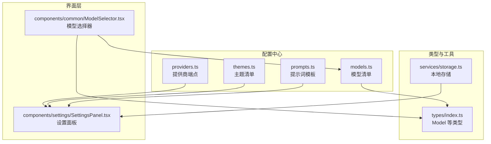
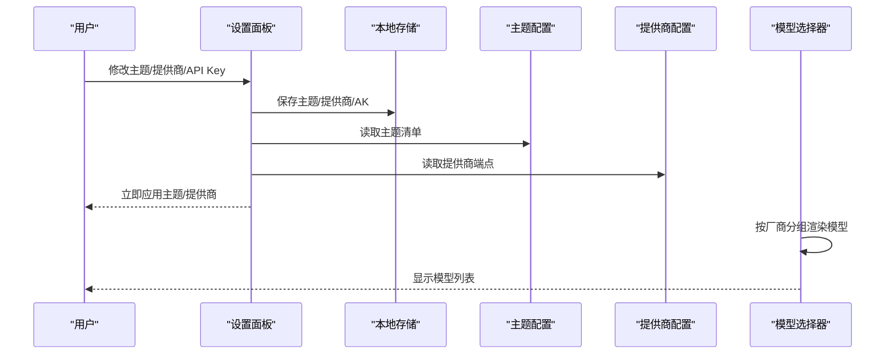
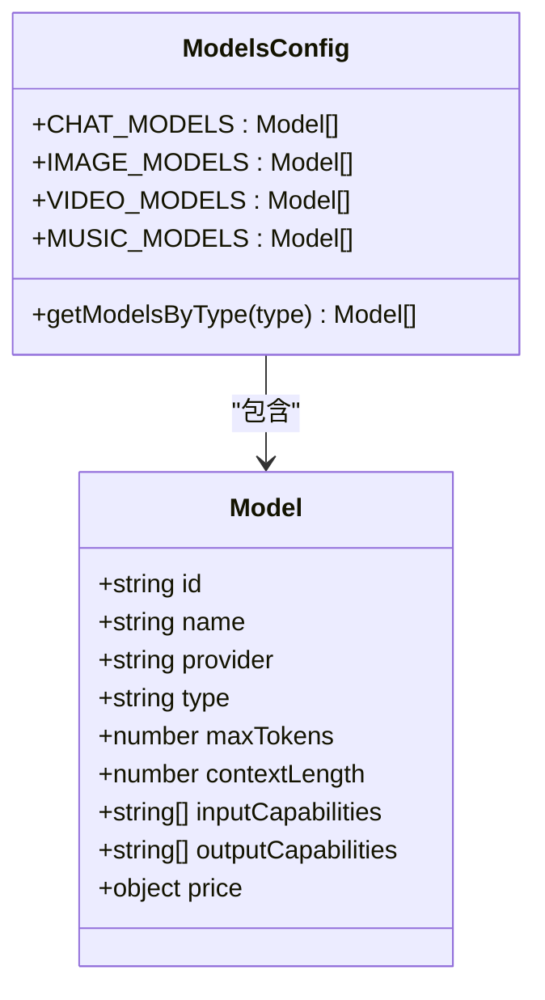
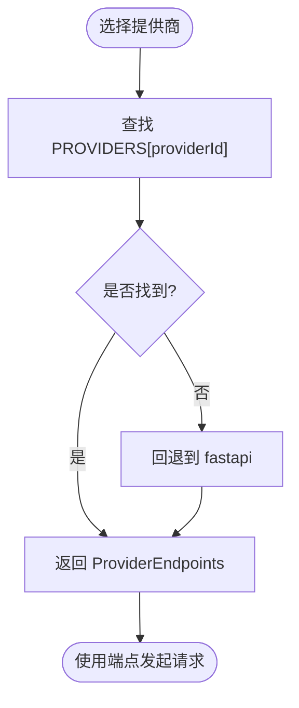
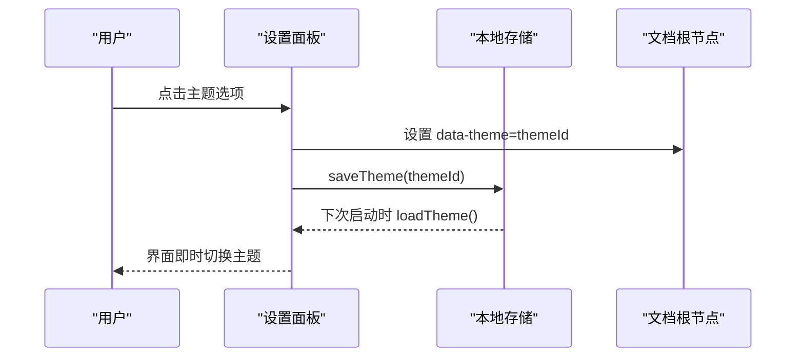
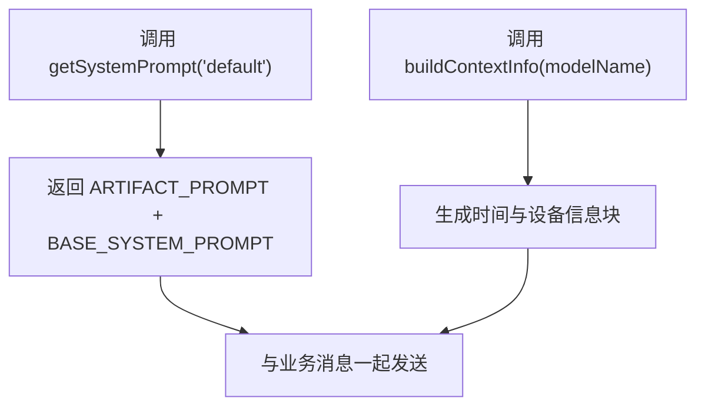
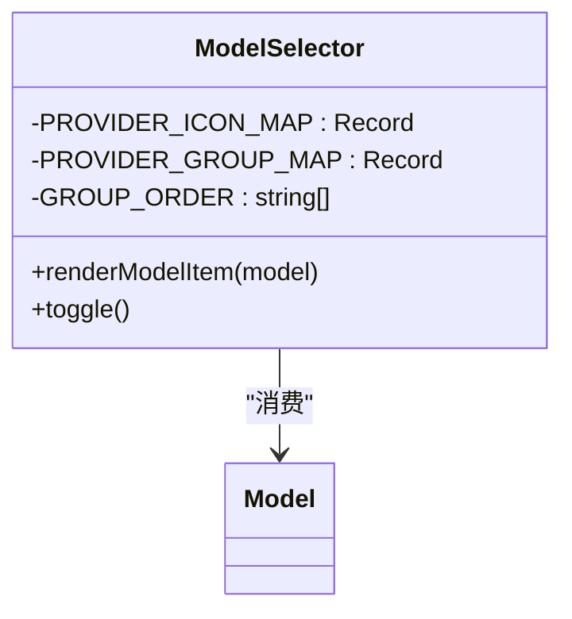
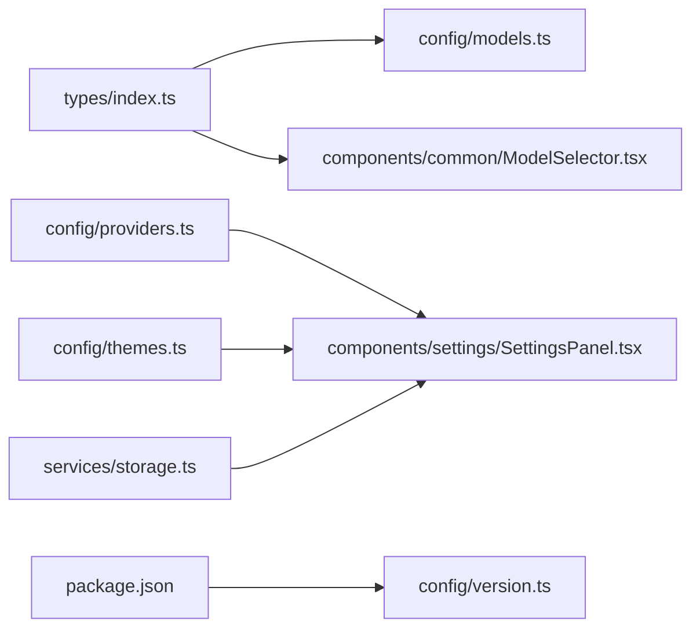

# 配置管理

<cite>
**本文引用的文件**
- [src/config/models.ts](file://src/config/models.ts)
- [src/types/index.ts](file://src/types/index.ts)
- [src/config/providers.ts](file://src/config/providers.ts)
- [src/config/prompts.ts](file://src/config/prompts.ts)
- [src/config/themes.ts](file://src/config/themes.ts)
- [src/services/storage.ts](file://src/services/storage.ts)
- [src/components/common/ModelSelector.tsx](file://src/components/common/ModelSelector.tsx)
- [src/components/settings/SettingsPanel.tsx](file://src/components/settings/SettingsPanel.tsx)
- [package.json](file://package.json)
</cite>

## 目录
1. [简介](#简介)
2. [项目结构](#项目结构)
3. [核心组件](#核心组件)
4. [架构总览](#架构总览)
5. [详细组件分析](#详细组件分析)
6. [依赖关系分析](#依赖关系分析)
7. [性能考量](#性能考量)
8. [故障排查指南](#故障排查指南)
9. [结论](#结论)
10. [附录：配置文件与字段说明](#附录：配置文件与字段说明)

## 简介
本文件面向 AIShop 的配置管理系统，聚焦以下目标：
- 模型配置管理：AI 模型定义、能力矩阵（输入/输出能力）、价格配置等。
- 服务提供商配置结构与动态加载机制。
- 主题系统实现：深色/浅色模式切换与自定义主题支持。
- 提示词模板管理与动态替换。
- 配置文件结构与字段说明。
- 配置的验证机制与默认值处理。
- 配置扩展的开发指南与最佳实践。

## 项目结构
AIShop 将“可配置项”集中在 src/config 下，类型定义在 src/types，UI 选择器与设置面板分别位于 components 层，运行时持久化通过 services/storage.ts 完成。

图表来源
- [src/config/models.ts:1-284](file://src/config/models.ts#L1-L284)
- [src/config/providers.ts:1-19](file://src/config/providers.ts#L1-L19)
- [src/config/themes.ts:1-12](file://src/config/themes.ts#L1-L12)
- [src/config/prompts.ts:1-93](file://src/config/prompts.ts#L1-L93)
- [src/types/index.ts:109-123](file://src/types/index.ts#L109-L123)
- [src/services/storage.ts:54-60](file://src/services/storage.ts#L54-L60)
- [src/components/common/ModelSelector.tsx:18-55](file://src/components/common/ModelSelector.tsx#L18-L55)
- [src/components/settings/SettingsPanel.tsx:30-110](file://src/components/settings/SettingsPanel.tsx#L30-L110)

章节来源
- [src/config/models.ts:1-284](file://src/config/models.ts#L1-L284)
- [src/config/providers.ts:1-19](file://src/config/providers.ts#L1-L19)
- [src/config/themes.ts:1-12](file://src/config/themes.ts#L1-L12)
- [src/config/prompts.ts:1-93](file://src/config/prompts.ts#L1-L93)
- [src/types/index.ts:109-123](file://src/types/index.ts#L109-L123)
- [src/services/storage.ts:54-60](file://src/services/storage.ts#L54-L60)
- [src/components/common/ModelSelector.tsx:18-55](file://src/components/common/ModelSelector.tsx#L18-L55)
- [src/components/settings/SettingsPanel.tsx:30-110](file://src/components/settings/SettingsPanel.tsx#L30-L110)

## 核心组件
- 模型配置中心：集中维护聊天、图像、视频、音乐四类模型清单，并提供按类型查询的函数。
- 提供商配置：以键值对形式声明各提供商的基础 URL，提供默认回退策略。
- 主题配置：声明可用主题及其预览色，并暴露默认主题。
- 提示词模板：集中管理系统提示词与上下文信息构建逻辑。
- 设置面板：负责用户交互、持久化与实时生效的主题切换、提供商选择、API Key 管理等。
- 模型选择器：按厂商分组展示模型，支持图标映射与分组排序。

章节来源
- [src/config/models.ts:1-284](file://src/config/models.ts#L1-L284)
- [src/config/providers.ts:1-19](file://src/config/providers.ts#L1-L19)
- [src/config/themes.ts:1-12](file://src/config/themes.ts#L1-L12)
- [src/config/prompts.ts:1-93](file://src/config/prompts.ts#L1-L93)
- [src/components/settings/SettingsPanel.tsx:30-110](file://src/components/settings/SettingsPanel.tsx#L30-L110)
- [src/components/common/ModelSelector.tsx:18-55](file://src/components/common/ModelSelector.tsx#L18-L55)

## 架构总览
配置数据流从“静态配置 + 用户设置”汇聚到 UI 与业务逻辑：
- 静态配置：models.ts、providers.ts、themes.ts、prompts.ts
- 用户设置：settingsService（由 SettingsPanel 读写）+ storage.ts（本地持久化）
- 消费方：ModelSelector（模型列表渲染）、SettingsPanel（设置与主题切换）、提示词组装（buildContextInfo）

图表来源
- [src/components/settings/SettingsPanel.tsx:86-103](file://src/components/settings/SettingsPanel.tsx#L86-L103)
- [src/services/storage.ts:54-60](file://src/services/storage.ts#L54-L60)
- [src/config/themes.ts:1-12](file://src/config/themes.ts#L1-L12)
- [src/config/providers.ts:1-19](file://src/config/providers.ts#L1-L19)
- [src/components/common/ModelSelector.tsx:184-195](file://src/components/common/ModelSelector.tsx#L184-L195)

## 详细组件分析

### 模型配置与管理
- 模型清单：CHAT_MODELS、IMAGE_MODELS、VIDEO_MODELS、MUSIC_MODELS，统一遵循 Model 类型。
- 能力矩阵：每个模型包含 inputCapabilities 与 outputCapabilities，用于前端能力校验与展示。
- 价格配置：price.input / price.output 为字符串描述，便于展示；如需精确计费，可在上层解析或扩展数值字段。
- 查询接口：getModelsByType(type) 返回对应类型的模型数组。

图表来源
- [src/types/index.ts:109-123](file://src/types/index.ts#L109-L123)
- [src/config/models.ts:1-284](file://src/config/models.ts#L1-L284)

章节来源
- [src/config/models.ts:1-284](file://src/config/models.ts#L1-L284)
- [src/types/index.ts:109-123](file://src/types/index.ts#L109-L123)

### 服务提供商配置与动态加载
- 配置结构：ProviderEndpoints 包含 name、chatBaseUrl、imageBaseUrl。
- 动态加载：getProviderConfig(providerId) 根据传入 ID 返回对应端点，若不存在则回退到 fastapi。
- 设置面板：允许用户在 LLM、图片、视频、搜索等类别中选择不同提供商，并保存 API Key。

图表来源
- [src/config/providers.ts:1-19](file://src/config/providers.ts#L1-L19)
- [src/components/settings/SettingsPanel.tsx:93-103](file://src/components/settings/SettingsPanel.tsx#L93-L103)

章节来源
- [src/config/providers.ts:1-19](file://src/config/providers.ts#L1-L19)
- [src/components/settings/SettingsPanel.tsx:93-103](file://src/components/settings/SettingsPanel.tsx#L93-L103)

### 主题系统与深色/浅色模式切换
- 主题清单：THEMES 定义可用主题 id、名称与预览色；DEFAULT_THEME 指定默认主题。
- 主题切换：SettingsPanel 监听主题变更，写入 document.documentElement.dataset.theme，并通过 storage.ts 持久化。
- 资源映射：public/providers 下的 SVG 图标按 provider 名称映射，配合主题呈现一致体验。

图表来源
- [src/config/themes.ts:1-12](file://src/config/themes.ts#L1-L12)
- [src/components/settings/SettingsPanel.tsx:86-91](file://src/components/settings/SettingsPanel.tsx#L86-L91)
- [src/services/storage.ts:54-60](file://src/services/storage.ts#L54-L60)

章节来源
- [src/config/themes.ts:1-12](file://src/config/themes.ts#L1-L12)
- [src/components/settings/SettingsPanel.tsx:86-91](file://src/components/settings/SettingsPanel.tsx#L86-L91)
- [src/services/storage.ts:54-60](file://src/services/storage.ts#L54-L60)

### 提示词模板管理与动态替换
- 模板组织：BASE_SYSTEM_PROMPT、ARTIFACT_PROMPT 组合成 SYSTEM_PROMPTS.default。
- 动态获取：getSystemPrompt(key) 返回对应模板；buildContextInfo(modelName?) 生成基础上下文信息块（时间、时区、语言、设备、当前模型）。
- 使用方式：上层在构造消息时将系统提示词与上下文信息拼接后发送给模型。

图表来源
- [src/config/prompts.ts:6-53](file://src/config/prompts.ts#L6-L53)
- [src/config/prompts.ts:55-93](file://src/config/prompts.ts#L55-L93)

章节来源
- [src/config/prompts.ts:6-53](file://src/config/prompts.ts#L6-L53)
- [src/config/prompts.ts:55-93](file://src/config/prompts.ts#L55-L93)

### 模型选择器与厂商分组
- 图标映射：PROVIDER_ICON_MAP 将 provider 映射到 public/providers 下的 SVG 文件名。
- 分组与排序：PROVIDER_GROUP_MAP 与 GROUP_ORDER 控制分组名与顺序。
- 渲染逻辑：按分组渲染模型列表，选中态高亮，compact 模式下使用底部弹窗。

图表来源
- [src/components/common/ModelSelector.tsx:18-55](file://src/components/common/ModelSelector.tsx#L18-L55)
- [src/components/common/ModelSelector.tsx:184-195](file://src/components/common/ModelSelector.tsx#L184-L195)

章节来源
- [src/components/common/ModelSelector.tsx:18-55](file://src/components/common/ModelSelector.tsx#L18-L55)
- [src/components/common/ModelSelector.tsx:184-195](file://src/components/common/ModelSelector.tsx#L184-L195)

## 依赖关系分析
- 类型依赖：所有模型配置均基于 types/index.ts 中的 Model 类型，确保前后端数据结构一致。
- 配置依赖：SettingsPanel 依赖 providers.ts、themes.ts、storage.ts；ModelSelector 依赖 models.ts 与 types。
- 构建期注入：package.json 版本信息通过 Vite define 注入至 version.ts，便于调试与追踪。

图表来源
- [src/types/index.ts:109-123](file://src/types/index.ts#L109-L123)
- [src/config/models.ts:1-284](file://src/config/models.ts#L1-L284)
- [src/config/providers.ts:1-19](file://src/config/providers.ts#L1-L19)
- [src/config/themes.ts:1-12](file://src/config/themes.ts#L1-L12)
- [src/services/storage.ts:54-60](file://src/services/storage.ts#L54-L60)
- [package.json:1-47](file://package.json#L1-L47)

章节来源
- [src/types/index.ts:109-123](file://src/types/index.ts#L109-L123)
- [src/config/models.ts:1-284](file://src/config/models.ts#L1-L284)
- [src/config/providers.ts:1-19](file://src/config/providers.ts#L1-L19)
- [src/config/themes.ts:1-12](file://src/config/themes.ts#L1-L12)
- [src/services/storage.ts:54-60](file://src/services/storage.ts#L54-L60)
- [package.json:1-47](file://package.json#L1-L47)

## 性能考量
- 模型列表渲染：按厂商分组与排序，避免重复计算；仅在打开菜单时计算定位与动画状态。
- 主题切换：直接操作 CSS 变量与 data 属性，避免重绘开销；本地存储仅写一次。
- 提示词构建：buildContextInfo 仅在新会话或模型变化时执行，减少不必要的字符串拼接。
- 提供商回退：getProviderConfig 的默认回退保证无配置时仍可运行，降低异常路径成本。

## 故障排查指南
- 主题不生效
  - 检查 SettingsPanel 是否正确设置 document.documentElement.dataset.theme。
  - 确认 storage.ts 中 loadTheme/saveTheme 的 key 一致。
  - 参考：[src/components/settings/SettingsPanel.tsx:86-91](file://src/components/settings/SettingsPanel.tsx#L86-L91)、[src/services/storage.ts:54-60](file://src/services/storage.ts#L54-L60)
- 模型未显示或分组错误
  - 核对 PROVIDER_GROUP_MAP 与 GROUP_ORDER 是否覆盖新增 provider。
  - 检查 models.ts 中 model.provider 是否与映射一致。
  - 参考：[src/components/common/ModelSelector.tsx:18-55](file://src/components/common/ModelSelector.tsx#L18-L55)、[src/components/common/ModelSelector.tsx:184-195](file://src/components/common/ModelSelector.tsx#L184-L195)
- 提供商端点无效
  - 确认 PROVIDERS 中存在对应 providerId，否则会回退到 fastapi。
  - 检查 SettingsPanel 中选择的 provider 是否已保存到 settingsService。
  - 参考：[src/config/providers.ts:1-19](file://src/config/providers.ts#L1-L19)、[src/components/settings/SettingsPanel.tsx:93-103](file://src/components/settings/SettingsPanel.tsx#L93-L103)
- 提示词未生效
  - 确认 getSystemPrompt 的 key 与 SYSTEM_PROMPTS 的键一致。
  - 检查 buildContextInfo 是否在消息前正确拼接。
  - 参考：[src/config/prompts.ts:6-53](file://src/config/prompts.ts#L6-L53)、[src/config/prompts.ts:55-93](file://src/config/prompts.ts#L55-L93)

章节来源
- [src/components/settings/SettingsPanel.tsx:86-91](file://src/components/settings/SettingsPanel.tsx#L86-L91)
- [src/services/storage.ts:54-60](file://src/services/storage.ts#L54-L60)
- [src/components/common/ModelSelector.tsx:18-55](file://src/components/common/ModelSelector.tsx#L18-L55)
- [src/components/common/ModelSelector.tsx:184-195](file://src/components/common/ModelSelector.tsx#L184-L195)
- [src/config/providers.ts:1-19](file://src/config/providers.ts#L1-L19)
- [src/components/settings/SettingsPanel.tsx:93-103](file://src/components/settings/SettingsPanel.tsx#L93-L103)
- [src/config/prompts.ts:6-53](file://src/config/prompts.ts#L6-L53)
- [src/config/prompts.ts:55-93](file://src/config/prompts.ts#L55-L93)

## 结论
AIShop 的配置管理采用“静态配置 + 用户设置 + 本地持久化”的分层设计：
- 模型、提供商、主题、提示词等关键配置集中在 src/config，类型约束在 src/types，保证可扩展性与一致性。
- 设置面板提供直观的用户交互，实时生效并持久化。
- 通过分组、回退、默认值等机制提升鲁棒性。
- 建议后续引入更严格的配置校验（如 schema 校验）与单元测试，进一步提升稳定性与可维护性。

## 附录：配置文件与字段说明

### 模型配置（src/config/models.ts）
- CHAT_MODELS / IMAGE_MODELS / VIDEO_MODELS / MUSIC_MODELS：按类型组织的模型数组。
- Model 字段（见 types/index.ts）：
  - id：模型唯一标识
  - name：显示名称
  - provider：厂商名称
  - type：chat | image | video | music
  - maxTokens：最大输出 token
  - contextLength：上下文长度
  - inputCapabilities：支持的输入能力（text/image/video/audio 等）
  - outputCapabilities：支持的输出能力（text/image 等）
  - price：{ input, output } 字符串描述
- 查询函数：getModelsByType(type) 返回对应模型数组

章节来源
- [src/config/models.ts:1-284](file://src/config/models.ts#L1-L284)
- [src/types/index.ts:109-123](file://src/types/index.ts#L109-L123)

### 提供商配置（src/config/providers.ts）
- ProviderEndpoints：name、chatBaseUrl、imageBaseUrl
- PROVIDERS：键值对，key 为 providerId
- getProviderConfig(providerId)：获取配置，不存在时回退到 fastapi

章节来源
- [src/config/providers.ts:1-19](file://src/config/providers.ts#L1-L19)

### 主题配置（src/config/themes.ts）
- ThemeConfig：id、name、previewColor
- THEMES：可用主题列表
- DEFAULT_THEME：默认主题

章节来源
- [src/config/themes.ts:1-12](file://src/config/themes.ts#L1-L12)

### 提示词模板（src/config/prompts.ts）
- BASE_SYSTEM_PROMPT：基础系统提示词
- ARTIFACT_PROMPT：网页生成能力提示词
- SYSTEM_PROMPTS：模板集合（目前含 default）
- getSystemPrompt(key)：按 key 获取模板
- buildContextInfo(modelName?)：生成基础上下文信息块

章节来源
- [src/config/prompts.ts:6-53](file://src/config/prompts.ts#L6-L53)
- [src/config/prompts.ts:55-93](file://src/config/prompts.ts#L55-L93)

### 本地存储（src/services/storage.ts）
- loadTheme/saveTheme：主题持久化
- loadLastModel/saveLastModel：记住上次使用的模型
- loadWebSearchEnabled/saveWebSearchEnabled：联网搜索开关
- loadLastActiveConversationId/saveLastActiveConversationId：最近会话恢复

章节来源
- [src/services/storage.ts:1-62](file://src/services/storage.ts#L1-L62)

### 设置面板（src/components/settings/SettingsPanel.tsx）
- 提供商选择与 API Key 管理
- 主题切换与自动保存
- 上下文压缩设置与功能开关

章节来源
- [src/components/settings/SettingsPanel.tsx:30-110](file://src/components/settings/SettingsPanel.tsx#L30-L110)
- [src/components/settings/SettingsPanel.tsx:318-342](file://src/components/settings/SettingsPanel.tsx#L318-L342)

### 模型选择器（src/components/common/ModelSelector.tsx）
- 厂商图标映射与分组排序
- compact 模式底部弹窗
- 选中态与交互

章节来源
- [src/components/common/ModelSelector.tsx:18-55](file://src/components/common/ModelSelector.tsx#L18-L55)
- [src/components/common/ModelSelector.tsx:184-195](file://src/components/common/ModelSelector.tsx#L184-L195)

### 版本信息（package.json 与 config/version.ts）
- package.json 版本号由 Vite 注入到 __APP_VERSION__
- getVersionInfo() 返回版本与构建时间

章节来源
- [package.json:1-47](file://package.json#L1-L47)
- [src/config/version.ts:1-17](file://src/config/version.ts#L1-L17)