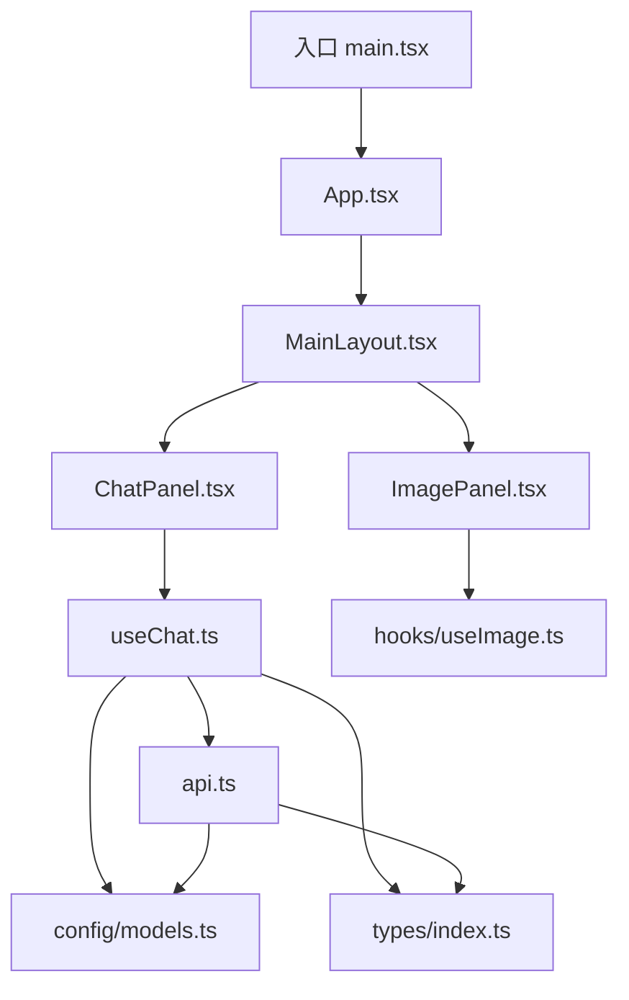
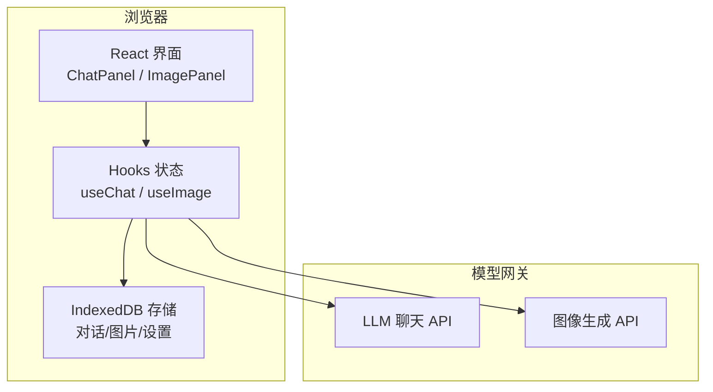
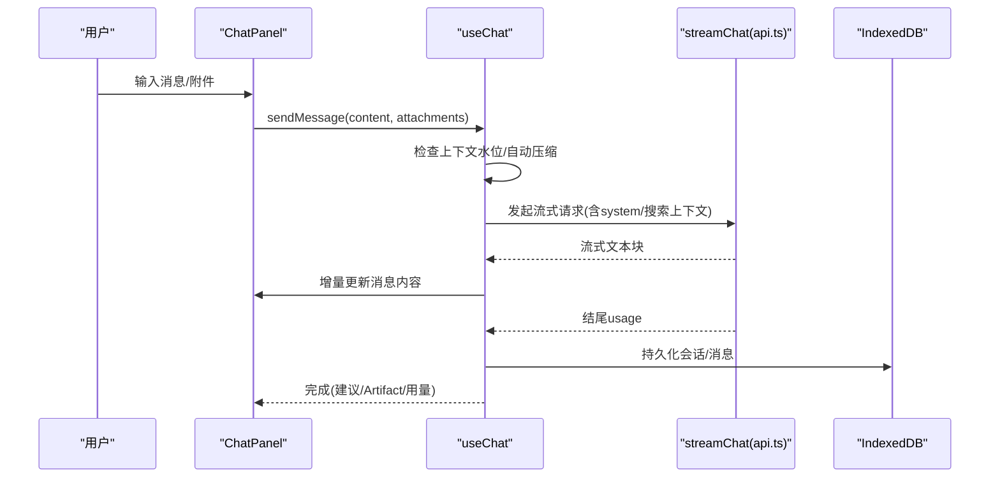
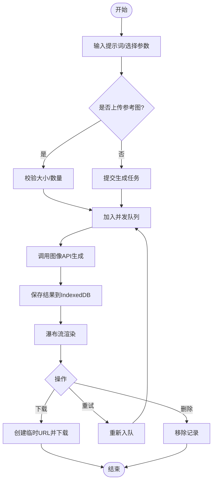
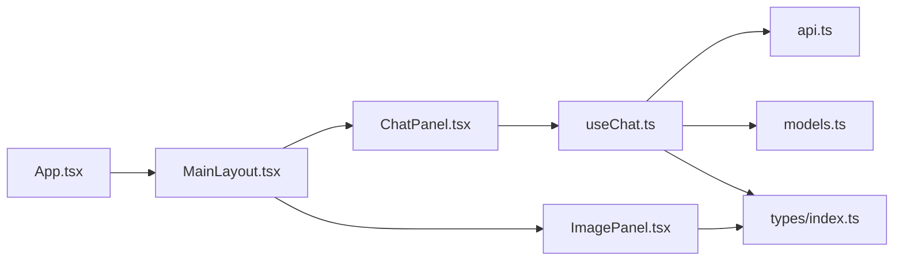

# 项目概述

<cite>
**本文引用的文件**
- [package.json](file://package.json)
- [README.md](file://README.md)
- [vite.config.ts](file://vite.config.ts)
- [src/main.tsx](file://src/main.tsx)
- [src/App.tsx](file://src/App.tsx)
- [src/components/layout/MainLayout.tsx](file://src/components/layout/MainLayout.tsx)
- [src/components/chat/ChatPanel.tsx](file://src/components/chat/ChatPanel.tsx)
- [src/components/image/ImagePanel.tsx](file://src/components/image/ImagePanel.tsx)
- [src/hooks/useChat.ts](file://src/hooks/useChat.ts)
- [src/services/api.ts](file://src/services/api.ts)
- [src/config/models.ts](file://src/config/models.ts)
- [src/types/index.ts](file://src/types/index.ts)
- [需求文档.md](file://需求文档.md)
</cite>

## 目录
1. [简介](#简介)
2. [项目结构](#项目结构)
3. [核心组件](#核心组件)
4. [架构总览](#架构总览)
5. [详细组件分析](#详细组件分析)
6. [依赖关系分析](#依赖关系分析)
7. [性能考量](#性能考量)
8. [故障排查指南](#故障排查指南)
9. [结论](#结论)
10. [附录](#附录)

## 简介
AIShop AI 综合创作平台是一个面向多模态创作的 Web 应用，提供智能聊天、图像生成与编辑、视频处理、音乐创作等能力。项目采用“前端直连模型网关”的无服务器思路：通过浏览器直接调用各厂商的 Chat/图像 API，结合本地持久化（IndexedDB）与状态管理，实现快速迭代与低运维成本。界面遵循响应式设计与移动端优先，支持侧滑抽屉、手势折叠、瀑布流展示等交互。

技术选型理由：
- React 19 + TypeScript：类型安全、生态成熟、组件化开发效率高。
- Vite：极速构建与热更新，插件生态完善（React、Tailwind）。
- TailwindCSS：原子化样式，快速构建一致且可维护的 UI。
- IndexedDB：离线可用、容量大，适合存储对话历史、图片等资源。
- 多模型接入：统一抽象 Model 配置，便于扩展更多厂商与能力。

**章节来源**
- [需求文档.md:1-33](file://需求文档.md#L1-L33)
- [package.json:1-47](file://package.json#L1-L47)
- [README.md:1-74](file://README.md#L1-L74)

## 项目结构
仓库采用按功能域组织的前端工程结构：
- src/components：UI 组件（布局、聊天、图像、视频、音乐、通用控件）
- src/hooks：业务逻辑 Hook（聊天流程、图像生成等）
- src/services：网络请求、存储、搜索、设置等服务
- src/config：模型列表、提示词等配置
- src/types：全局类型定义
- public/providers：静态资源（如 Provider 相关）
- api：后端接口参考与示例（当前以纯前端为主）
- ImageGenAPI：图像生成参考文档

**图表来源**
- [src/main.tsx:1-8](file://src/main.tsx#L1-L8)
- [src/App.tsx:1-147](file://src/App.tsx#L1-L147)
- [src/components/layout/MainLayout.tsx:1-205](file://src/components/layout/MainLayout.tsx#L1-L205)
- [src/components/chat/ChatPanel.tsx:1-623](file://src/components/chat/ChatPanel.tsx#L1-L623)
- [src/components/image/ImagePanel.tsx:1-800](file://src/components/image/ImagePanel.tsx#L1-L800)
- [src/hooks/useChat.ts:1-800](file://src/hooks/useChat.ts#L1-L800)
- [src/services/api.ts:1-173](file://src/services/api.ts#L1-L173)
- [src/config/models.ts:1-284](file://src/config/models.ts#L1-L284)
- [src/types/index.ts:1-252](file://src/types/index.ts#L1-L252)

**章节来源**
- [src/main.tsx:1-8](file://src/main.tsx#L1-L8)
- [src/App.tsx:1-147](file://src/App.tsx#L1-L147)
- [src/components/layout/MainLayout.tsx:1-205](file://src/components/layout/MainLayout.tsx#L1-L205)
- [src/components/chat/ChatPanel.tsx:1-623](file://src/components/chat/ChatPanel.tsx#L1-L623)
- [src/components/image/ImagePanel.tsx:1-800](file://src/components/image/ImagePanel.tsx#L1-L800)
- [src/hooks/useChat.ts:1-800](file://src/hooks/useChat.ts#L1-L800)
- [src/services/api.ts:1-173](file://src/services/api.ts#L1-L173)
- [src/config/models.ts:1-284](file://src/config/models.ts#L1-L284)
- [src/types/index.ts:1-252](file://src/types/index.ts#L1-L252)

## 核心组件
- 应用壳与路由切换：App 负责主题初始化、持久化存储申请、Tab 切换与子面板挂载；MainLayout 提供侧边栏、顶部导航、底部导航与内容区布局。
- 聊天模块：ChatPanel 承载消息渲染、折叠浏览、对话内搜索、Artifact 预览、上下文压缩标记与摘要查看；useChat 封装会话生命周期、消息发送、流式接收、自动压缩、联网搜索、用量统计等。
- 图像模块：ImagePanel 提供提示词输入、多图上传/拖拽、比例/尺寸/质量选择、瀑布流展示、下载与重试；配合 useImage 管理任务队列与历史记录。
- 服务层：api.ts 封装流式对话请求、SSE 解析、用量提取与失败重试；models.ts 集中声明多厂商模型能力与价格；types/index.ts 统一定义消息、会话、用量、任务等数据结构。

**章节来源**
- [src/App.tsx:1-147](file://src/App.tsx#L1-L147)
- [src/components/layout/MainLayout.tsx:1-205](file://src/components/layout/MainLayout.tsx#L1-L205)
- [src/components/chat/ChatPanel.tsx:1-623](file://src/components/chat/ChatPanel.tsx#L1-L623)
- [src/hooks/useChat.ts:1-800](file://src/hooks/useChat.ts#L1-L800)
- [src/components/image/ImagePanel.tsx:1-800](file://src/components/image/ImagePanel.tsx#L1-L800)
- [src/services/api.ts:1-173](file://src/services/api.ts#L1-L173)
- [src/config/models.ts:1-284](file://src/config/models.ts#L1-L284)
- [src/types/index.ts:1-252](file://src/types/index.ts#L1-L252)

## 架构总览
系统采用“前端直连模型网关”的无服务器架构：浏览器通过 Fetch SSE 与模型提供商通信，使用 IndexedDB 做本地持久化，React Hooks 管理状态，Vite 构建产物由浏览器运行。

**图表来源**
- [src/components/chat/ChatPanel.tsx:1-623](file://src/components/chat/ChatPanel.tsx#L1-L623)
- [src/components/image/ImagePanel.tsx:1-800](file://src/components/image/ImagePanel.tsx#L1-L800)
- [src/hooks/useChat.ts:1-800](file://src/hooks/useChat.ts#L1-L800)
- [src/services/api.ts:1-173](file://src/services/api.ts#L1-L173)

## 详细组件分析

### 聊天模块（ChatPanel + useChat）
- 数据流：用户输入 → useChat.sendMessage → 构建消息体（含附件/搜索上下文/压缩区间）→ streamChat 流式返回 → 增量渲染 → 结束写入完整内容与建议项 → 持久化。
- 关键特性：
  - 自动上下文压缩：根据阈值与热窗口规划压缩区间，生成摘要并插入 segment，减少后续请求上下文占用。
  - 联网搜索：可选开关，小模型判断是否需要搜索，将结果注入 system 上下文。
  - Artifact 流式预览：检测 artifact 标记，实时推送代码片段到全屏预览。
  - 折叠浏览：手势触发折叠，保持滚动锚点，提升长对话体验。
  - 用量统计：从 SSE 末尾 usage chunk 提取真实 token 用量。

**图表来源**
- [src/components/chat/ChatPanel.tsx:1-623](file://src/components/chat/ChatPanel.tsx#L1-L623)
- [src/hooks/useChat.ts:1-800](file://src/hooks/useChat.ts#L1-L800)
- [src/services/api.ts:1-173](file://src/services/api.ts#L1-L173)

**章节来源**
- [src/components/chat/ChatPanel.tsx:1-623](file://src/components/chat/ChatPanel.tsx#L1-L623)
- [src/hooks/useChat.ts:1-800](file://src/hooks/useChat.ts#L1-L800)
- [src/services/api.ts:1-173](file://src/services/api.ts#L1-L173)

### 图像模块（ImagePanel）
- 数据流：提示词/参考图 → 参数校验 → 提交任务 → 队列并发控制 → 生成结果落库 → 瀑布流展示 → 下载/重试/删除。
- 关键特性：
  - 多源参考图：支持外部拖入、data URI、blob URL、远程 URL（CORS 回退）。
  - 参数选择：宽高比九宫格、尺寸、质量等级下拉。
  - 任务卡片：loading/error 状态与重试/取消/忽略。
  - 下载：将 IndexedDB 中的 blob 转为临时 object URL 后触发下载。

**图表来源**
- [src/components/image/ImagePanel.tsx:1-800](file://src/components/image/ImagePanel.tsx#L1-L800)

**章节来源**
- [src/components/image/ImagePanel.tsx:1-800](file://src/components/image/ImagePanel.tsx#L1-L800)

### 布局与导航（MainLayout）
- 提供侧边栏抽屉（支持横滑手势）、顶部导航（模型选择、新建对话、上下文用量环、压缩按钮）、底部导航（Tab 切换），以及输入聚焦时隐藏底部导航等细节。
- 与 App 协作传递会话、模型、搜索开关、Artifact 开关等状态。

**章节来源**
- [src/components/layout/MainLayout.tsx:1-205](file://src/components/layout/MainLayout.tsx#L1-L205)
- [src/App.tsx:1-147](file://src/App.tsx#L1-L147)

## 依赖关系分析
- 运行时依赖：React 19、TypeScript、Vite、TailwindCSS、IndexedDB（idb）、Markdown/KaTeX 渲染、PDF/XLSX 解析等。
- 构建与工具：@vitejs/plugin-react、@tailwindcss/vite、ESLint、TS 编译。
- 模块耦合：
  - App → MainLayout → ChatPanel/ImagePanel
  - ChatPanel → useChat → api.ts → models.ts
  - ImagePanel → hooks/useImage → 存储/队列
  - 全局 types 被多处引用，保证数据结构一致性

**图表来源**
- [src/App.tsx:1-147](file://src/App.tsx#L1-L147)
- [src/components/layout/MainLayout.tsx:1-205](file://src/components/layout/MainLayout.tsx#L1-L205)
- [src/components/chat/ChatPanel.tsx:1-623](file://src/components/chat/ChatPanel.tsx#L1-L623)
- [src/components/image/ImagePanel.tsx:1-800](file://src/components/image/ImagePanel.tsx#L1-L800)
- [src/hooks/useChat.ts:1-800](file://src/hooks/useChat.ts#L1-L800)
- [src/services/api.ts:1-173](file://src/services/api.ts#L1-L173)
- [src/config/models.ts:1-284](file://src/config/models.ts#L1-L284)
- [src/types/index.ts:1-252](file://src/types/index.ts#L1-L252)

**章节来源**
- [package.json:1-47](file://package.json#L1-L47)
- [vite.config.ts:1-18](file://vite.config.ts#L1-L18)
- [src/config/models.ts:1-284](file://src/config/models.ts#L1-L284)
- [src/types/index.ts:1-252](file://src/types/index.ts#L1-L252)

## 性能考量
- 流式渲染：SSE 分片增量更新，避免整段等待，降低首屏与交互延迟。
- 上下文压缩：在接近上限时自动压缩冷区间，减少 prompt 长度与成本，提高命中率。
- 本地持久化：IndexedDB 异步写入，启动恢复上次会话，减少重复加载。
- 图片优化：瀑布流懒加载、占位高度计算、下载前才读取 blob，避免内存峰值。
- 构建优化：Vite 按需编译与 HMR，Tailwind 原子类减少 CSS 体积。

[本节为通用指导，不直接分析具体文件]

## 故障排查指南
- 无法连接模型：检查设置中是否已配置 API Key；若网关不支持 include_usage，会自动降级重试。
- 流式中断：AbortError 表示用户主动停止，会保留已有内容并标记停止状态。
- 图片下载失败：确认 IndexedDB 中存在对应 blob；临时 object URL 会在下载后延迟释放。
- 搜索失败：联网搜索可能因网络或结果为空而失败，界面会显示失败状态但不阻塞主流程。
- 压缩无效：当热窗口过大或模型切换导致上下文不可压缩时，会跳过压缩以保证可用性。

**章节来源**
- [src/services/api.ts:1-173](file://src/services/api.ts#L1-L173)
- [src/hooks/useChat.ts:1-800](file://src/hooks/useChat.ts#L1-L800)
- [src/components/image/ImagePanel.tsx:1-800](file://src/components/image/ImagePanel.tsx#L1-L800)

## 结论
AIShop 以“前端直连模型网关 + 本地持久化”的无服务器模式，实现了多模态创作的一体化体验。通过统一的模型配置、清晰的组件分层与丰富的交互细节，既满足即时创作需求，又具备良好的可扩展性。未来可在视频与音乐模块复用现有架构，快速接入更多能力。

[本节为总结，不直接分析具体文件]

## 附录
- 技术栈速览：React 19、TypeScript、Vite、TailwindCSS、IndexedDB、Markdown/KaTeX 渲染、PDF/XLSX 解析。
- 构建脚本：dev/build/lint/preview。
- 入口与配置：main.tsx 挂载根组件；vite.config.ts 启用 React 与 Tailwind 插件，并注入版本号常量。

**章节来源**
- [package.json:1-47](file://package.json#L1-L47)
- [vite.config.ts:1-18](file://vite.config.ts#L1-L18)
- [src/main.tsx:1-8](file://src/main.tsx#L1-L8)