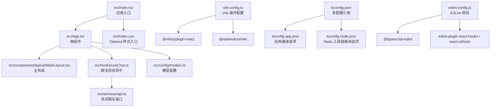
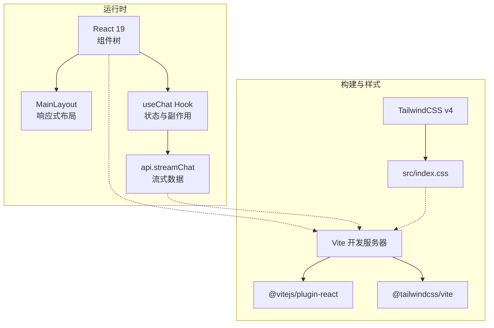
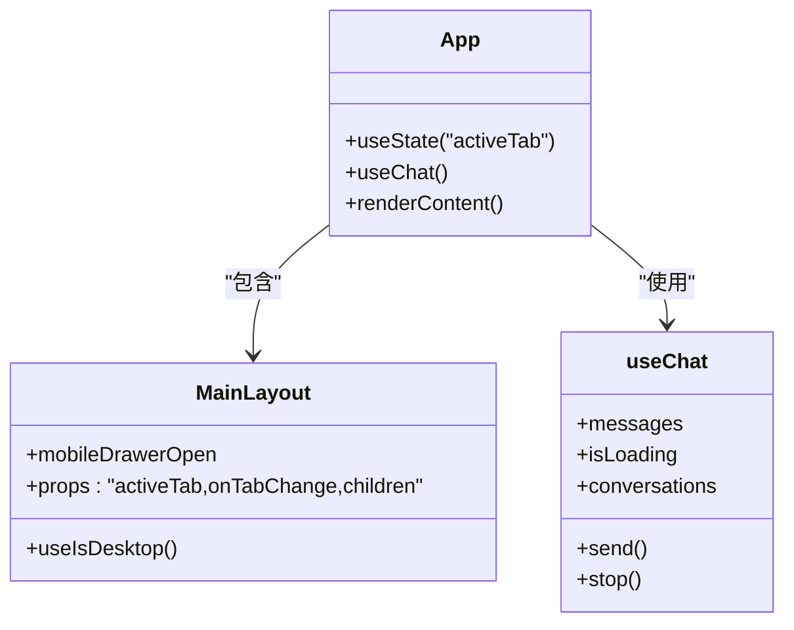
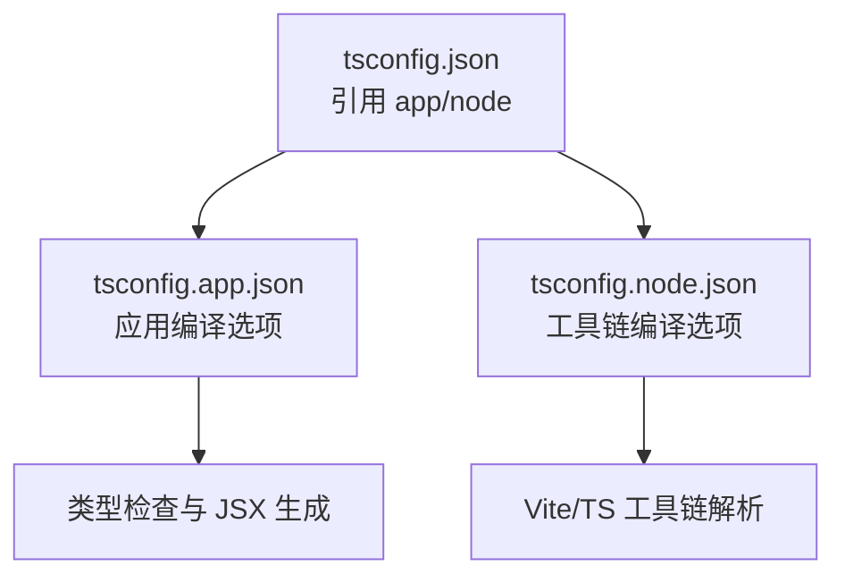
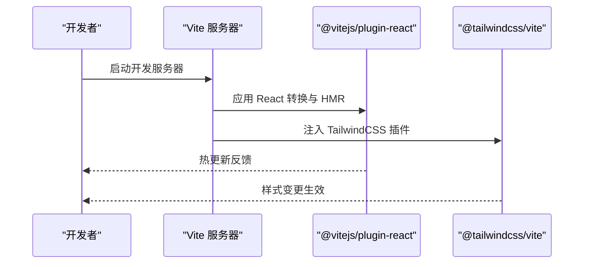
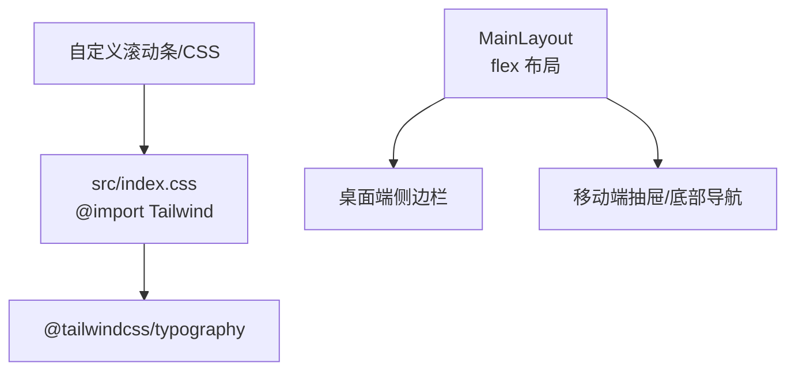
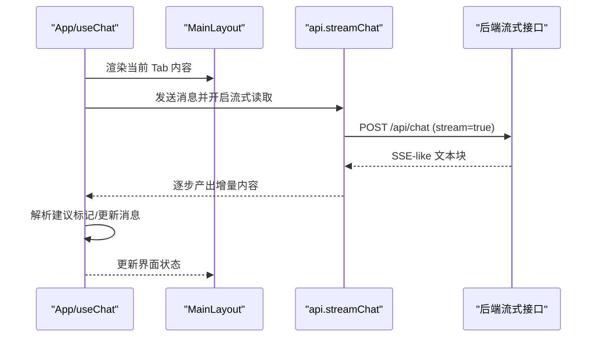
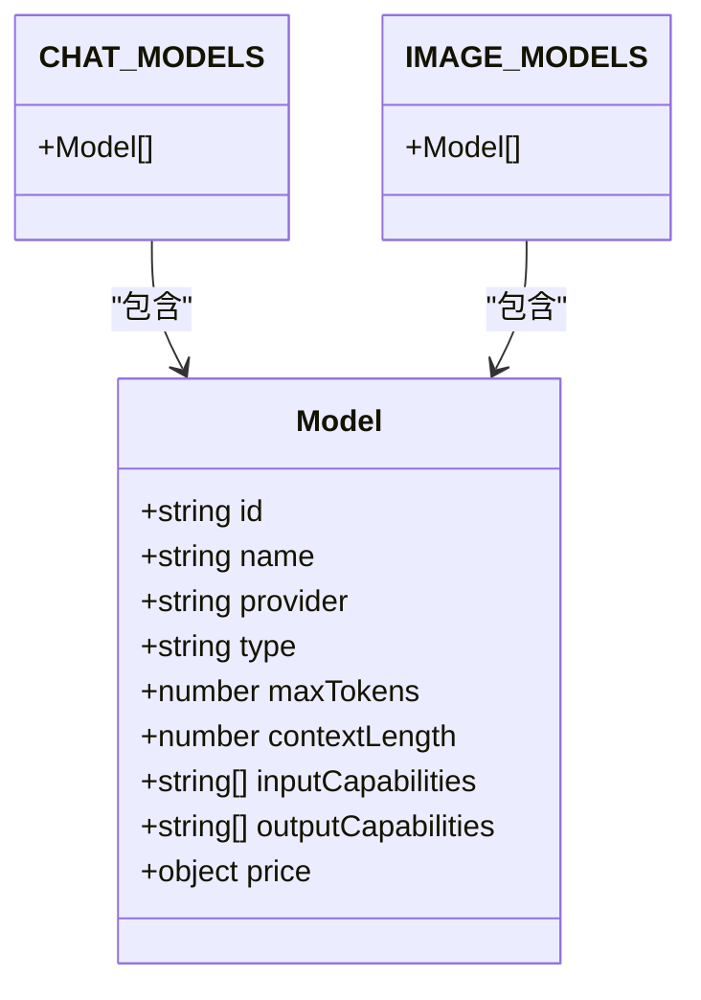
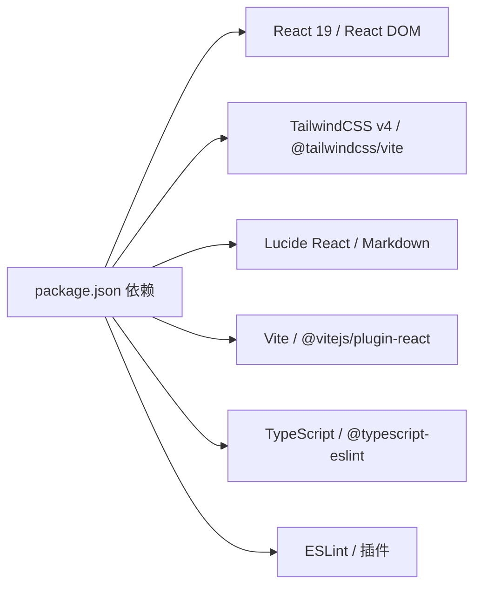

# 技术栈

<cite>
**本文引用的文件**
- [package.json](file://package.json)
- [vite.config.ts](file://vite.config.ts)
- [tsconfig.json](file://tsconfig.json)
- [tsconfig.app.json](file://tsconfig.app.json)
- [tsconfig.node.json](file://tsconfig.node.json)
- [eslint.config.js](file://eslint.config.js)
- [src/main.tsx](file://src/main.tsx)
- [src/App.tsx](file://src/App.tsx)
- [src/index.css](file://src/index.css)
- [src/components/layout/MainLayout.tsx](file://src/components/layout/MainLayout.tsx)
- [src/config/models.ts](file://src/config/models.ts)
- [src/hooks/useChat.ts](file://src/hooks/useChat.ts)
- [src/services/api.ts](file://src/services/api.ts)
- [README.md](file://README.md)
</cite>

## 目录
1. [引言](#引言)
2. [项目结构](#项目结构)
3. [核心组件](#核心组件)
4. [架构总览](#架构总览)
5. [详细组件分析](#详细组件分析)
6. [依赖分析](#依赖分析)
7. [性能考虑](#性能考虑)
8. [故障排查指南](#故障排查指南)
9. [结论](#结论)
10. [附录](#附录)

## 引言
本技术栈文档面向 AIShop 项目的前端技术选型与实现，系统阐述 React 19、TypeScript、Vite、TailwindCSS 等核心技术在项目中的定位、作用与协同方式。我们将从架构视角说明这些技术如何共同支撑现代 Web 开发的高性能、高可维护性与良好开发体验，并给出学习路径建议与最佳实践。

## 项目结构
AIShop 采用以功能域为中心的目录组织方式，前端入口位于 src 目录，核心由应用入口、布局组件、业务模块（聊天、图片、视频、音乐）、类型定义、配置与服务层组成。构建与开发工具通过 Vite、TypeScript、ESLint 等统一管理。

图表来源
- [src/main.tsx:1-11](file://src/main.tsx#L1-L11)
- [src/App.tsx:1-67](file://src/App.tsx#L1-L67)
- [src/components/layout/MainLayout.tsx:1-227](file://src/components/layout/MainLayout.tsx#L1-L227)
- [src/hooks/useChat.ts:1-370](file://src/hooks/useChat.ts#L1-L370)
- [src/config/models.ts:1-228](file://src/config/models.ts#L1-L228)
- [src/services/api.ts:1-83](file://src/services/api.ts#L1-L83)
- [src/index.css:1-57](file://src/index.css#L1-L57)
- [vite.config.ts:1-11](file://vite.config.ts#L1-L11)
- [tsconfig.json:1-8](file://tsconfig.json#L1-L8)
- [tsconfig.app.json:1-26](file://tsconfig.app.json#L1-L26)
- [tsconfig.node.json:1-25](file://tsconfig.node.json#L1-L25)
- [eslint.config.js:1-23](file://eslint.config.js#L1-L23)

章节来源
- [src/main.tsx:1-11](file://src/main.tsx#L1-L11)
- [src/App.tsx:1-67](file://src/App.tsx#L1-L67)
- [vite.config.ts:1-11](file://vite.config.ts#L1-L11)
- [tsconfig.json:1-8](file://tsconfig.json#L1-L8)

## 核心组件
- React 19：作为 UI 构建框架，提供函数组件、并发特性与 Hooks 生态，支撑 AIShop 的交互与状态管理。
- TypeScript：提供强类型保障，贯穿应用编译、类型检查与 IDE 支持，降低运行期风险。
- Vite：提供快速开发服务器与高效打包能力，集成 React 与 TailwindCSS 插件，优化 DX 与性能。
- TailwindCSS v4：原子化样式框架，结合 @tailwindcss/vite 插件，实现可维护的样式体系与主题一致性。

章节来源
- [package.json:12-38](file://package.json#L12-L38)
- [vite.config.ts:1-11](file://vite.config.ts#L1-11)
- [tsconfig.app.json:1-26](file://tsconfig.app.json#L1-L26)
- [src/index.css:1-57](file://src/index.css#L1-L57)

## 架构总览
AIShop 前端采用“入口渲染 -> 根组件调度 -> 布局与业务模块 -> 服务层”的分层架构。React 19 提供组件化与并发能力，TypeScript 提供类型安全，Vite 负责构建与热更新，TailwindCSS 实现一致的视觉语言。

图表来源
- [src/App.tsx:11-67](file://src/App.tsx#L11-L67)
- [src/components/layout/MainLayout.tsx:45-227](file://src/components/layout/MainLayout.tsx#L45-L227)
- [src/hooks/useChat.ts:69-370](file://src/hooks/useChat.ts#L69-L370)
- [src/services/api.ts:13-83](file://src/services/api.ts#L13-L83)
- [vite.config.ts:5-10](file://vite.config.ts#L5-L10)
- [src/index.css:1-2](file://src/index.css#L1-L2)

## 详细组件分析

### React 19：并发与组件化
- 并发特性：项目使用 React 19 的严格模式与函数组件，配合 Hooks 管理状态与副作用，适合流式渲染与异步交互。
- 组件职责：App 作为根组件负责路由式内容切换（聊天/图片/视频/音乐），MainLayout 负责桌面与移动端布局、侧边抽屉与底部导航。
- 状态管理：useChat Hook 将消息、加载状态、会话持久化、联网搜索等功能集中管理，提升可测试性与可维护性。

图表来源
- [src/App.tsx:11-67](file://src/App.tsx#L11-L67)
- [src/components/layout/MainLayout.tsx:45-227](file://src/components/layout/MainLayout.tsx#L45-L227)
- [src/hooks/useChat.ts:69-370](file://src/hooks/useChat.ts#L69-L370)

章节来源
- [src/App.tsx:11-67](file://src/App.tsx#L11-L67)
- [src/components/layout/MainLayout.tsx:31-43](file://src/components/layout/MainLayout.tsx#L31-L43)
- [src/hooks/useChat.ts:69-110](file://src/hooks/useChat.ts#L69-L110)

### TypeScript：类型安全与工程化
- 多 tsconfig 分层：通过 tsconfig.json 引用 tsconfig.app.json 与 tsconfig.node.json，分别约束应用与工具链编译行为，确保 bundler 模式与 JSX 语法正确。
- 类型覆盖：types/index.ts 定义消息、会话、模型等核心类型，贯穿服务层与组件层，保证数据结构一致性。
- 编译选项：启用 bundler 模式、react-jsx、严格未使用检测等，提升代码质量与可维护性。

图表来源
- [tsconfig.json:1-8](file://tsconfig.json#L1-L8)
- [tsconfig.app.json:1-26](file://tsconfig.app.json#L1-L26)
- [tsconfig.node.json:1-25](file://tsconfig.node.json#L1-L25)

章节来源
- [tsconfig.app.json:2-22](file://tsconfig.app.json#L2-L22)
- [tsconfig.node.json:2-21](file://tsconfig.node.json#L2-L21)
- [src/types/index.ts:1-103](file://src/types/index.ts#L1-L103)

### Vite：快速开发与构建
- 插件生态：集成 @vitejs/plugin-react 与 @tailwindcss/vite，提供 React HMR 与 TailwindCSS 自动扫描。
- 开发脚本：dev/build/preview/lint 等脚本覆盖日常开发流程，结合 ESLint 与 TypeScript 提升质量。
- 配置策略：vite.config.ts 以最小必要配置启用插件，兼顾性能与扩展性。

图表来源
- [vite.config.ts:5-10](file://vite.config.ts#L5-L10)
- [package.json:6-11](file://package.json#L6-L11)

章节来源
- [vite.config.ts:1-11](file://vite.config.ts#L1-L11)
- [package.json:6-11](file://package.json#L6-L11)

### TailwindCSS v4：原子化样式与主题一致性
- 样式入口：src/index.css 通过 @import 引入 TailwindCSS 与 @tailwindcss/typography 插件，统一全局样式与排版。
- 响应式设计：MainLayout 使用媒体查询与 flex 布局，适配桌面端与移动端，抽屉与底部导航增强移动端体验。
- 自定义滚动条与代码高亮：通过 CSS 变量与原子类实现一致的视觉风格。

图表来源
- [src/index.css:1-57](file://src/index.css#L1-L57)
- [src/components/layout/MainLayout.tsx:84-165](file://src/components/layout/MainLayout.tsx#L84-L165)

章节来源
- [src/index.css:1-57](file://src/index.css#L1-L57)
- [src/components/layout/MainLayout.tsx:84-165](file://src/components/layout/MainLayout.tsx#L84-L165)

### 流式聊天工作流：从 UI 到服务端
- 数据流：App 通过 useChat 提供的消息数组与发送函数，驱动 MainLayout 的内容渲染；api.streamChat 通过 fetch + ReadableStream 实现增量数据输出。
- 错误处理：使用 AbortController 中断请求，捕获异常并回写 UI；最终清理状态，保证用户体验。
- 搜索增强：可选的联网搜索上下文注入，丰富回答内容并记录来源。

图表来源
- [src/App.tsx:21-44](file://src/App.tsx#L21-L44)
- [src/hooks/useChat.ts:135-250](file://src/hooks/useChat.ts#L135-L250)
- [src/services/api.ts:13-83](file://src/services/api.ts#L13-L83)

章节来源
- [src/App.tsx:21-44](file://src/App.tsx#L21-L44)
- [src/hooks/useChat.ts:135-250](file://src/hooks/useChat.ts#L135-L250)
- [src/services/api.ts:13-83](file://src/services/api.ts#L13-L83)

### 模型与能力：类型驱动的配置
- 类型定义：types/index.ts 明确定义 Message、Conversation、Model 等核心类型，确保跨模块一致性。
- 配置中心：config/models.ts 提供多厂商、多模态模型清单与按类型筛选函数，便于 UI 选择与服务端路由。

图表来源
- [src/types/index.ts:25-38](file://src/types/index.ts#L25-L38)
- [src/config/models.ts:3-179](file://src/config/models.ts#L3-L179)

章节来源
- [src/types/index.ts:1-103](file://src/types/index.ts#L1-L103)
- [src/config/models.ts:1-228](file://src/config/models.ts#L1-L228)

## 依赖分析
- 运行时依赖：React 19、React DOM、TailwindCSS v4、@tailwindcss/vite、lucide-react、react-markdown、remark-gfm 等，构成 UI 与样式基础。
- 开发依赖：Vite、@vitejs/plugin-react、TypeScript、@typescript-eslint、ESLint 插件、@types/* 等，保障开发体验与质量。
- 构建与脚本：dev/build/preview/lint 脚本与多 tsconfig 配置协同，确保开发与生产环境一致性。

图表来源
- [package.json:12-38](file://package.json#L12-L38)

章节来源
- [package.json:12-38](file://package.json#L12-L38)

## 性能考虑
- 构建与打包：Vite 基于原生 ESM，冷启动快、热更新快；配合 React 19 的并发渲染，减少主线程阻塞。
- 样式体积：TailwindCSS v4 通过插件与按需扫描控制样式体积，结合原子类减少重复样式。
- 状态与副作用：useChat 对消息增量更新、AbortController 中断、本地存储持久化，降低无效渲染与网络压力。
- 类型检查：严格的 tsconfig 与 ESLint 配置，提前发现潜在性能问题与逻辑缺陷。

## 故障排查指南
- 开发服务器无法启动
  - 检查 Vite 插件与配置是否正确加载，确认端口占用与网络权限。
  - 参考：[vite.config.ts:5-10](file://vite.config.ts#L5-L10)
- 样式不生效或 Tailwind 未扫描
  - 确认 src/index.css 正确引入 @tailwindcss/typography，检查 @tailwind 指令与文件路径。
  - 参考：[src/index.css:1-2](file://src/index.css#L1-L2)
- TypeScript 编译报错
  - 核对 tsconfig.app.json 与 tsconfig.node.json 的 bundler 模式与 jsx 设置，确保类型检查通过。
  - 参考：[tsconfig.app.json:10-16](file://tsconfig.app.json#L10-L16)
- ESLint 规则冲突
  - 检查 eslint.config.js 扩展链与 globals 设置，必要时调整为推荐的类型感知规则集。
  - 参考：[eslint.config.js:8-22](file://eslint.config.js#L8-L22)
- 流式接口异常
  - 检查 api.streamChat 的响应体读取与 JSON 解析，确保服务端返回符合预期的数据帧。
  - 参考：[src/services/api.ts:53-82](file://src/services/api.ts#L53-L82)

章节来源
- [vite.config.ts:5-10](file://vite.config.ts#L5-L10)
- [src/index.css:1-2](file://src/index.css#L1-L2)
- [tsconfig.app.json:10-16](file://tsconfig.app.json#L10-L16)
- [eslint.config.js:8-22](file://eslint.config.js#L8-L22)
- [src/services/api.ts:53-82](file://src/services/api.ts#L53-L82)

## 结论
AIShop 的前端技术栈围绕 React 19、TypeScript、Vite、TailwindCSS v4 形成高内聚、低耦合的现代化前端体系。通过严格的类型约束、高效的构建工具与一致的样式框架，项目在开发效率、运行性能与可维护性之间取得平衡。建议后续持续完善类型感知 ESLint 规则与组件测试策略，进一步提升工程质量。

## 附录
- 学习路径建议
  - React 19：从函数组件、Hooks、并发渲染入手，结合项目现有组件加深理解。
  - TypeScript：掌握 tsconfig 分层、类型推导与严格模式，参考项目类型定义与配置。
  - Vite：了解插件机制与开发服务器原理，结合本项目配置实践。
  - TailwindCSS v4：学习原子类与响应式设计，结合 MainLayout 的布局实践。
- 参考文档
  - [README.md:10-12](file://README.md#L10-L12)
  - [README.md:14-44](file://README.md#L14-L44)