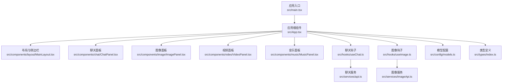
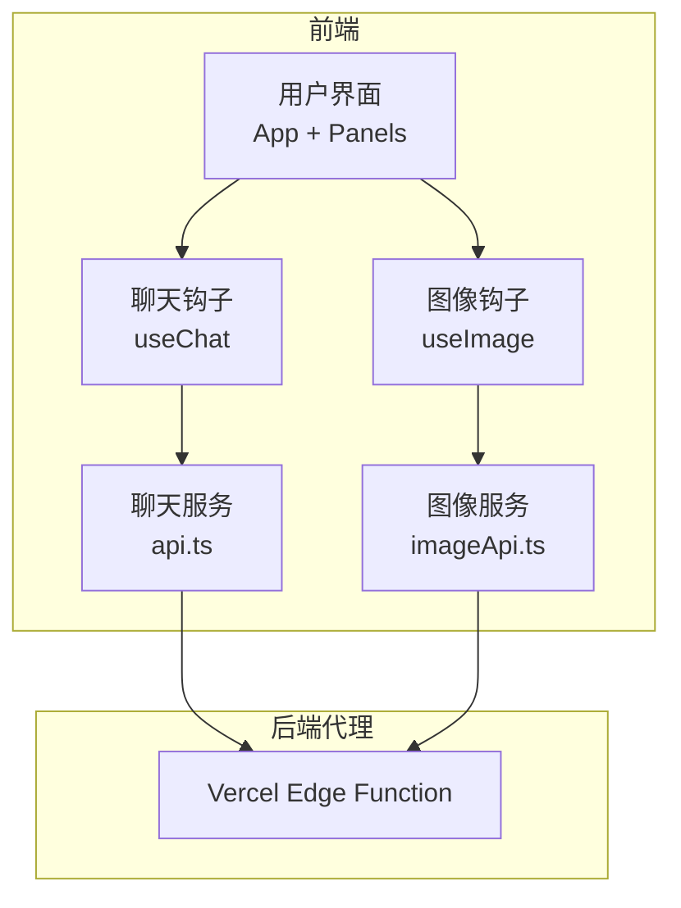
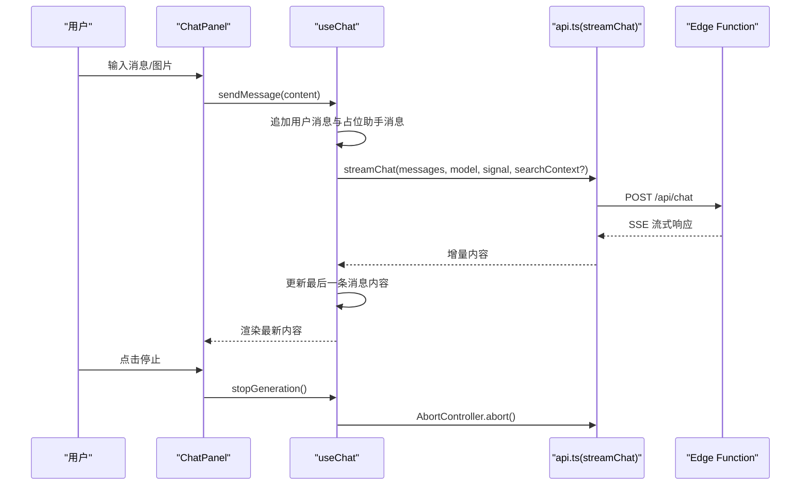
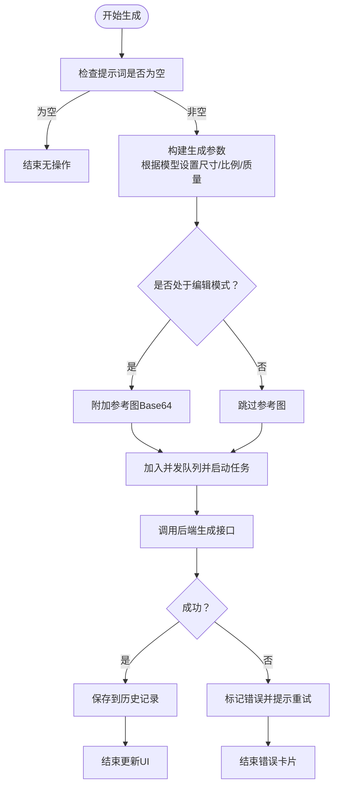
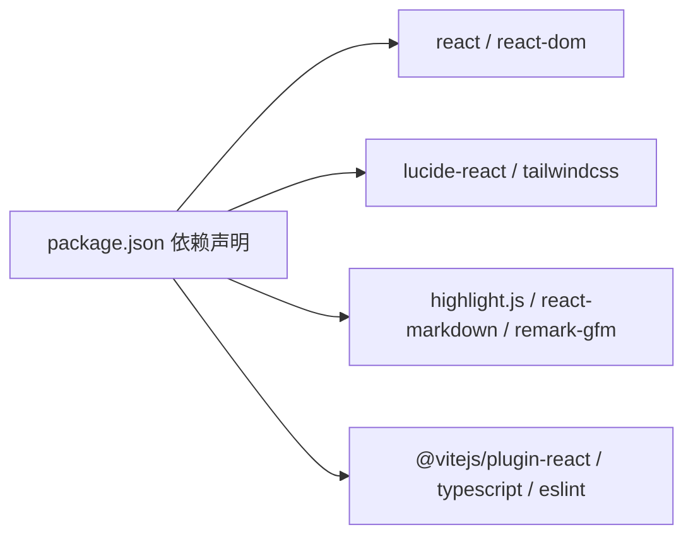

# 项目介绍

<cite>
**本文档引用的文件**
- [README.md](file://README.md)
- [package.json](file://package.json)
- [需求文档.md](file://需求文档.md)
- [src\App.tsx](file://src/App.tsx)
- [src\main.tsx](file://src\main.tsx)
- [src\config\models.ts](file://src\config\models.ts)
- [src\types\index.ts](file://src\types\index.ts)
- [src\components\chat\ChatPanel.tsx](file://src\components\chat\ChatPanel.tsx)
- [src\components\image\ImagePanel.tsx](file://src\components\image\ImagePanel.tsx)
- [src\components\video\VideoPanel.tsx](file://src\components\video\VideoPanel.tsx)
- [src\components\music\MusicPanel.tsx](file://src\components\music\MusicPanel.tsx)
- [src\hooks\useChat.ts](file://src\hooks\useChat.ts)
- [src\hooks\useImage.ts](file://src\hooks\useImage.ts)
- [src\services\api.ts](file://src\services\api.ts)
- [src\services\imageApi.ts](file://src\services\imageApi.ts)
</cite>

## 目录
1. [引言](#引言)
2. [项目结构](#项目结构)
3. [核心组件](#核心组件)
4. [架构总览](#架构总览)
5. [详细组件分析](#详细组件分析)
6. [依赖关系分析](#依赖关系分析)
7. [性能考虑](#性能考虑)
8. [故障排查指南](#故障排查指南)
9. [结论](#结论)
10. [附录](#附录)

## 引言
AIShop 是一个面向未来的 AI 综合创作平台，旨在为用户提供一站式的人工智能创作体验。平台通过整合多种 AI 模型能力，覆盖智能聊天、图像生成与编辑、视频生成以及音乐创作等核心功能，帮助创意工作者、内容创作者与开发者高效完成从灵感采集到成品产出的全流程创作。

本项目的设计理念是“模块化能力聚合 + 流畅交互体验”，通过统一的 Hub 架构，让用户在一个界面内自由切换不同创作模式，同时保留强大的模型选择、参数调节与历史管理能力。平台强调易用性与扩展性，既适合初学者快速上手，也为进阶用户提供深度定制空间。

## 项目结构
项目采用前端单页应用架构，基于 React + TypeScript + Vite 技术栈构建，UI 使用 TailwindCSS 进行样式组织，整体结构清晰、层次分明：

- 应用入口与路由控制：App 组件负责主布局与标签页切换；main.tsx 负责渲染根节点。
- 功能模块划分：聊天、图像、视频、音乐四大功能面板，每个面板独立封装，职责单一。
- 配置与类型：models.ts 提供模型清单与能力映射；types/index.ts 定义跨模块数据结构。
- 数据与业务逻辑：hooks 目录封装 useChat、useImage 等业务逻辑钩子；services 目录封装 API 调用与存储。
- 资源与公共组件：components/common 提供通用选择器等组件；public 存放静态资源。

图表来源
- [src\main.tsx:1-11](file://src\main.tsx#L1-L11)
- [src\App.tsx:1-67](file://src\App.tsx#L1-L67)
- [src\components\chat\ChatPanel.tsx:1-354](file://src\components\chat\ChatPanel.tsx#L1-L354)
- [src\components\image\ImagePanel.tsx:1-434](file://src\components\image\ImagePanel.tsx#L1-L434)
- [src\components\video\VideoPanel.tsx:1-77](file://src\components\video\VideoPanel.tsx#L1-L77)
- [src\components\music\MusicPanel.tsx:1-79](file://src\components\music\MusicPanel.tsx#L1-L79)
- [src\hooks\useChat.ts:1-370](file://src\hooks\useChat.ts#L1-L370)
- [src\hooks\useImage.ts:1-393](file://src\hooks\useImage.ts#L1-L393)
- [src\services\api.ts:1-83](file://src\services\api.ts#L1-L83)
- [src\services\imageApi.ts:1-41](file://src\services\imageApi.ts#L1-L41)
- [src\config\models.ts:1-228](file://src\config\models.ts#L1-L228)
- [src\types\index.ts:1-103](file://src\types\index.ts#L1-L103)

章节来源
- [src\App.tsx:1-67](file://src\App.tsx#L1-L67)
- [src\main.tsx:1-11](file://src\main.tsx#L1-L11)
- [需求文档.md:1-55](file://需求文档.md#L1-L55)

## 核心组件
- 应用根组件 App：负责标签页切换、会话管理、权限门禁与主布局装配。
- 四大功能面板：
  - 聊天面板：支持多模态消息、联网搜索增强、流式输出、会话导出与导入。
  - 图像面板：支持多模型、多尺寸/比例、参考图编辑、并发任务队列与历史管理。
  - 视频面板：预留界面与交互，标注“即将上线”。
  - 音乐面板：预留界面与交互，标注“即将上线”。

章节来源
- [src\App.tsx:1-67](file://src\App.tsx#L1-L67)
- [src\components\chat\ChatPanel.tsx:1-354](file://src\components\chat\ChatPanel.tsx#L1-L354)
- [src\components\image\ImagePanel.tsx:1-434](file://src\components\image\ImagePanel.tsx#L1-L434)
- [src\components\video\VideoPanel.tsx:1-77](file://src\components\video\VideoPanel.tsx#L1-L77)
- [src\components\music\MusicPanel.tsx:1-79](file://src\components\music\MusicPanel.tsx#L1-L79)

## 架构总览
AIShop 采用“前端 Hub + 后端代理”的轻量级架构。前端通过 Edge Function 代理调用第三方模型服务，避免在客户端暴露敏感密钥，同时提升安全性与可维护性。聊天与图像两大核心能力均支持流式响应与并发任务管理，确保流畅的用户体验。

图表来源
- [src\services\api.ts:1-83](file://src\services\api.ts#L1-L83)
- [src\services\imageApi.ts:1-41](file://src\services\imageApi.ts#L1-L41)

章节来源
- [src\services\api.ts:1-83](file://src\services\api.ts#L1-L83)
- [src\services\imageApi.ts:1-41](file://src\services\imageApi.ts#L1-L41)

## 详细组件分析

### 聊天系统（useChat + ChatPanel）
- 会话管理：支持新建、切换、删除、重命名与标题自动生成；持久化至本地存储。
- 流式输出：基于服务器推送事件（SSE）实现增量内容渲染，支持中止生成。
- 联网搜索：可选开启，将搜索结果注入系统提示上下文，增强回答准确性。
- 多模态输入：支持文本与图片混合消息，便于复杂场景创作。
- 会话导出：支持导出为 Markdown 与 JSON，便于归档与迁移。

图表来源
- [src\components\chat\ChatPanel.tsx:1-354](file://src\components\chat\ChatPanel.tsx#L1-L354)
- [src\hooks\useChat.ts:1-370](file://src\hooks\useChat.ts#L1-L370)
- [src\services\api.ts:1-83](file://src\services\api.ts#L1-L83)

章节来源
- [src\hooks\useChat.ts:1-370](file://src\hooks\useChat.ts#L1-L370)
- [src\components\chat\ChatPanel.tsx:1-354](file://src\components\chat\ChatPanel.tsx#L1-L354)
- [需求文档.md:13](file://需求文档.md#L13)

### 图像生成系统（useImage + ImagePanel）
- 模型适配：内置多模型参数集，自动根据所选模型调整可用比例、尺寸与质量选项。
- 参考图编辑：支持上传多张参考图，结合模型能力进行图像编辑与风格迁移。
- 并发队列：异步执行生成任务，支持重试、取消与错误提示，避免阻塞 UI。
- 历史管理：本地持久化生成历史，支持批量清空与单项删除。
- 下载与预览：照片墙网格展示，悬浮层提供下载与删除操作。

图表来源
- [src\hooks\useImage.ts:1-393](file://src\hooks\useImage.ts#L1-L393)
- [src\services\imageApi.ts:1-41](file://src\services\imageApi.ts#L1-L41)
- [src\components\image\ImagePanel.tsx:1-434](file://src\components\image\ImagePanel.tsx#L1-L434)

章节来源
- [src\hooks\useImage.ts:1-393](file://src\hooks\useImage.ts#L1-L393)
- [src\components\image\ImagePanel.tsx:1-434](file://src\components\image\ImagePanel.tsx#L1-L434)
- [src\config\models.ts:181-215](file://src\config\models.ts#L181-L215)

### 视频与音乐模块（预留）
- 视频面板与音乐面板目前处于“即将上线”状态，界面预留了输入区与参数选择区域，未来将接入相应模型与后端接口。
- 设计上延续统一的卡片墙与参数控制风格，保证与现有功能的一致性。

章节来源
- [src\components\video\VideoPanel.tsx:1-77](file://src\components\video\VideoPanel.tsx#L1-L77)
- [src\components\music\MusicPanel.tsx:1-79](file://src\components\music\MusicPanel.tsx#L1-L79)

### 类型与配置体系
- 类型定义：统一的消息、会话、媒体项与生成参数类型，确保跨模块数据一致性。
- 模型配置：集中管理各模型的能力、上下文长度、价格与输入输出能力，便于扩展与维护。

章节来源
- [src\types\index.ts:1-103](file://src\types\index.ts#L1-L103)
- [src\config\models.ts:1-228](file://src\config\models.ts#L1-L228)

## 依赖关系分析
- 组件耦合：App 作为中枢，依赖布局、面板与钩子；面板内部通过钩子与服务进行数据交互。
- 外部依赖：TailwindCSS 提供样式基础；Lucide React 提供图标；Highlight.js、React Markdown 等用于内容渲染。
- 运行时依赖：Vite 提供开发与构建工具链；TypeScript 提供类型安全保障。

图表来源
- [package.json:12-38](file://package.json#L12-L38)

章节来源
- [package.json:12-38](file://package.json#L12-L38)
- [README.md:1-74](file://README.md#L1-L74)

## 性能考虑
- 流式渲染：聊天采用流式输出，减少首屏等待时间，提升交互流畅度。
- 并发队列：图像生成采用并发队列与超时控制，避免阻塞与资源浪费。
- 本地持久化：会话与图像历史存储于本地，降低重复请求与网络开销。
- 图像压缩：上传前对参考图进行压缩，降低带宽与内存占用。
- 模型参数联动：根据所选模型动态调整可用参数，避免无效请求。

## 故障排查指南
- 聊天无法接收响应
  - 检查网络连接与后端代理状态。
  - 查看控制台错误信息，确认 SSE 连接是否正常。
  - 若需中断生成，使用停止按钮触发中止信号。
- 图像生成失败或超时
  - 确认提示词与参数组合是否符合模型要求。
  - 查看错误卡片中的详细信息，必要时重试或更换模型。
  - 检查上传文件大小与格式限制（参考图不超过 4MB）。
- 会话导入失败
  - 确保导入文件为 .aishop.json 格式且包含合法字段。
  - 检查浏览器控制台是否有解析错误提示。

章节来源
- [src\hooks\useChat.ts:231-250](file://src\hooks\useChat.ts#L231-L250)
- [src\hooks\useImage.ts:265-286](file://src\hooks\useImage.ts#L265-L286)
- [src\components\chat\ChatPanel.tsx:156-206](file://src\components\chat\ChatPanel.tsx#L156-L206)

## 结论
AIShop 以“统一 Hub + 多模态能力”为核心，通过清晰的模块划分与稳健的前后端协作，为用户提供从聊天到图像再到视频与音乐的全链路创作体验。其模块化设计便于持续扩展，既能满足初学者的快速上手需求，也能为专业用户提供灵活的参数与工作流定制空间。随着视频与音乐模块的逐步上线，AIShop 将成为真正意义上的“AI 综合创作平台”。

## 附录
- 目标用户与使用场景
  - 创意工作者：借助多模态聊天与图像编辑，快速实现创意草图与方案迭代。
  - 内容创作者：利用图像与聊天能力进行文案、脚本与视觉素材的协同创作。
  - 开发者：通过统一的 Hub 架构与可扩展的模型配置，快速集成与测试新的 AI 能力。
- 技术创新点与竞争优势
  - 统一 Hub 架构：一次学习，多场景复用，降低使用成本。
  - 流式与并发：提升交互效率与资源利用率。
  - 本地持久化：保护隐私、提升可用性。
  - 易扩展的模型配置：集中管理与动态适配，便于快速引入新模型。