# 项目概述

<cite>
**本文档引用的文件**
- [README.md](file://README.md)
- [package.json](file://package.json)
- [vite.config.ts](file://vite.config.ts)
- [需求文档.md](file://需求文档.md)
- [src/App.tsx](file://src/App.tsx)
- [src/main.tsx](file://src/main.tsx)
- [src/types/index.ts](file://src/types/index.ts)
- [src/config/models.ts](file://src/config/models.ts)
- [src/hooks/useChat.ts](file://src/hooks/useChat.ts)
- [src/services/api.ts](file://src/services/api.ts)
- [src/services/storage.ts](file://src/services/storage.ts)
- [src/services/accessCode.ts](file://src/services/accessCode.ts)
- [src/components/layout/MainLayout.tsx](file://src/components/layout/MainLayout.tsx)
- [src/components/chat/ChatPanel.tsx](file://src/components/chat/ChatPanel.tsx)
- [src/components/image/ImagePanel.tsx](file://src/components/image/ImagePanel.tsx)
</cite>

## 目录
1. [简介](#简介)
2. [项目结构](#项目结构)
3. [核心组件](#核心组件)
4. [架构概览](#架构概览)
5. [详细组件分析](#详细组件分析)
6. [依赖关系分析](#依赖关系分析)
7. [性能考虑](#性能考虑)
8. [故障排除指南](#故障排除指南)
9. [结论](#结论)
10. [附录](#附录)

## 简介

AIShop AI 综合创作平台是一个集成了多种 AI 模型能力的综合性创作工具，采用 React 19 + TypeScript + Vite 技术栈构建。该项目旨在为用户提供一站式的 AI 创作体验，涵盖智能聊天、图像生成、视频处理和音乐创作等多个领域。

### 核心目标
- **多模态 AI 能力集成**：整合聊天、图像、视频、音乐等多种 AI 模型
- **现代化开发体验**：基于 React 19 的最新特性，提供流畅的开发和运行体验
- **跨平台兼容性**：支持桌面和移动端的无缝使用体验
- **可扩展架构**：为未来功能扩展预留良好的架构基础

### 主要功能特性
- **智能聊天系统**：支持多模型选择、联网搜索增强、会话历史管理
- **图像生成与编辑**：支持多模型图像生成、参考图编辑、批量管理
- **视频处理能力**：模块化设计，支持未来视频生成功能
- **音乐创作功能**：模块化设计，支持未来音乐生成功能
- **访问控制机制**：基于访问码的安全验证系统

### 技术架构
- **前端框架**：React 19 + TypeScript 提供类型安全和现代开发体验
- **构建工具**：Vite 提供极速的开发服务器和优化的生产构建
- **UI 框架**：TailwindCSS 实现响应式和可定制的用户界面
- **状态管理**：React Hooks + 自定义 Hook 实现高效的状态管理
- **API 通信**：基于 Fetch API 的异步数据流处理

## 项目结构

项目采用模块化的组织方式，按照功能域进行文件分层：

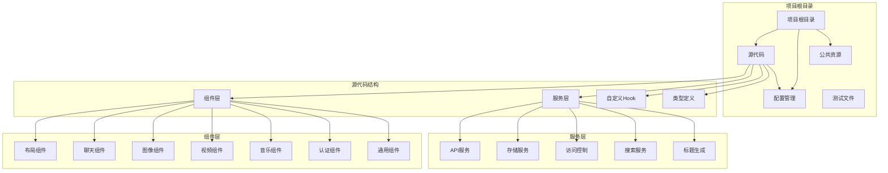

**图表来源**
- [src/App.tsx:1-74](file://src/App.tsx#L1-L74)
- [src/main.tsx:1-11](file://src/main.tsx#L1-L11)
- [src/components/layout/MainLayout.tsx:1-227](file://src/components/layout/MainLayout.tsx#L1-L227)

### 核心目录说明
- **src/**: 源代码主目录，包含所有前端代码
- **public/**: 静态资源目录，包含公共资源文件
- **api/**: 后端 API 接口定义（服务端代码）
- **ImageGenAPI/**: 图像生成相关的 API 文档
- **LLMICON/**: LLM 图标资源

**章节来源**
- [需求文档.md:1-55](file://需求文档.md#L1-L55)
- [package.json:1-40](file://package.json#L1-L40)

## 核心组件

### 应用入口与路由
应用采用单页应用架构，通过 MainLayout 组件实现多标签页导航：

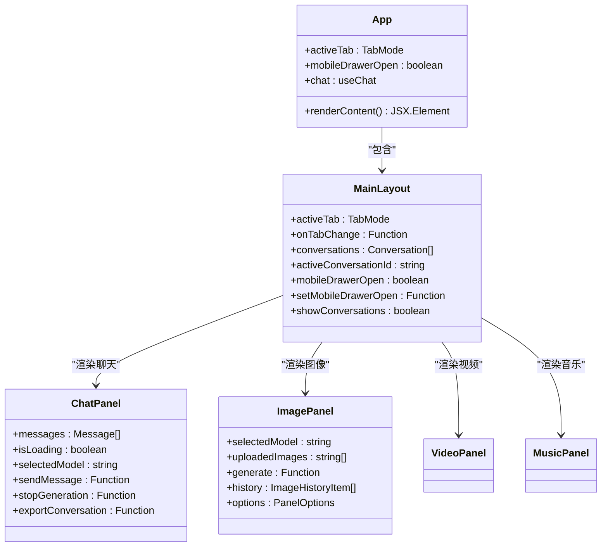

**图表来源**
- [src/App.tsx:11-71](file://src/App.tsx#L11-L71)
- [src/components/layout/MainLayout.tsx:45-226](file://src/components/layout/MainLayout.tsx#L45-L226)

### 数据模型体系
项目建立了完整的类型定义系统，确保类型安全：

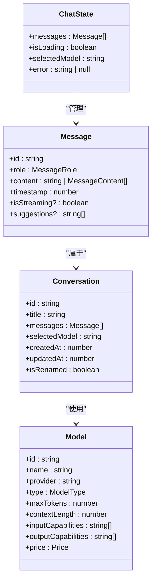

**图表来源**
- [src/types/index.ts:9-66](file://src/types/index.ts#L9-L66)
- [src/config/models.ts:25-38](file://src/config/models.ts#L25-L38)

**章节来源**
- [src/App.tsx:1-74](file://src/App.tsx#L1-L74)
- [src/types/index.ts:1-103](file://src/types/index.ts#L1-L103)
- [src/config/models.ts:1-228](file://src/config/models.ts#L1-L228)

## 架构概览

### 整体架构设计
AIShop 采用前后端分离的微服务架构，前端通过 Vercel Edge Functions 进行 API 代理：

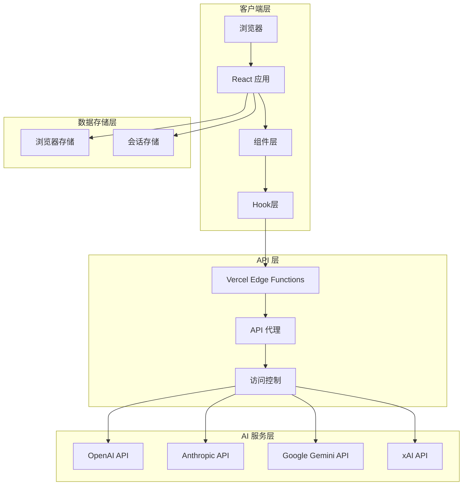

**图表来源**
- [src/services/api.ts:13-82](file://src/services/api.ts#L13-L82)
- [src/services/accessCode.ts:37-57](file://src/services/accessCode.ts#L37-L57)
- [src/services/storage.ts:1-66](file://src/services/storage.ts#L1-L66)

### 数据流处理
应用实现了完整的异步数据流处理机制：

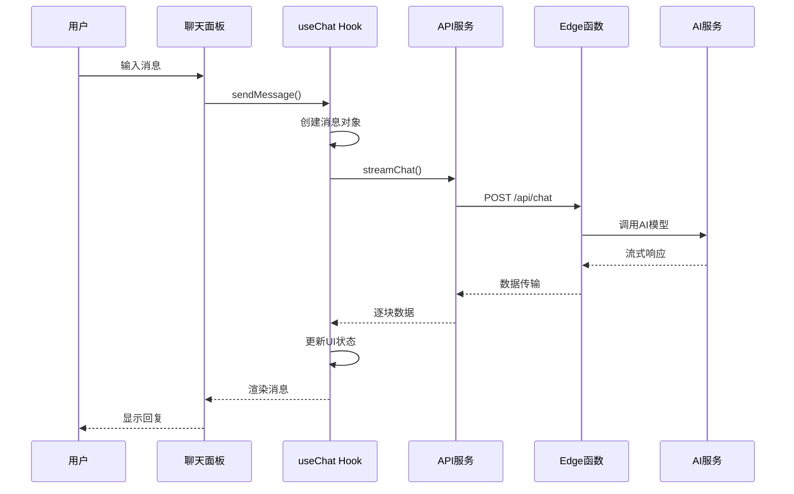

**图表来源**
- [src/components/chat/ChatPanel.tsx:135-149](file://src/components/chat/ChatPanel.tsx#L135-L149)
- [src/hooks/useChat.ts:135-250](file://src/hooks/useChat.ts#L135-L250)
- [src/services/api.ts:13-82](file://src/services/api.ts#L13-L82)

**章节来源**
- [src/services/api.ts:1-83](file://src/services/api.ts#L1-L83)
- [src/hooks/useChat.ts:1-370](file://src/hooks/useChat.ts#L1-L370)

## 详细组件分析

### 聊天系统组件

#### ChatPanel 组件架构
聊天面板是应用的核心交互组件，实现了完整的对话管理功能：

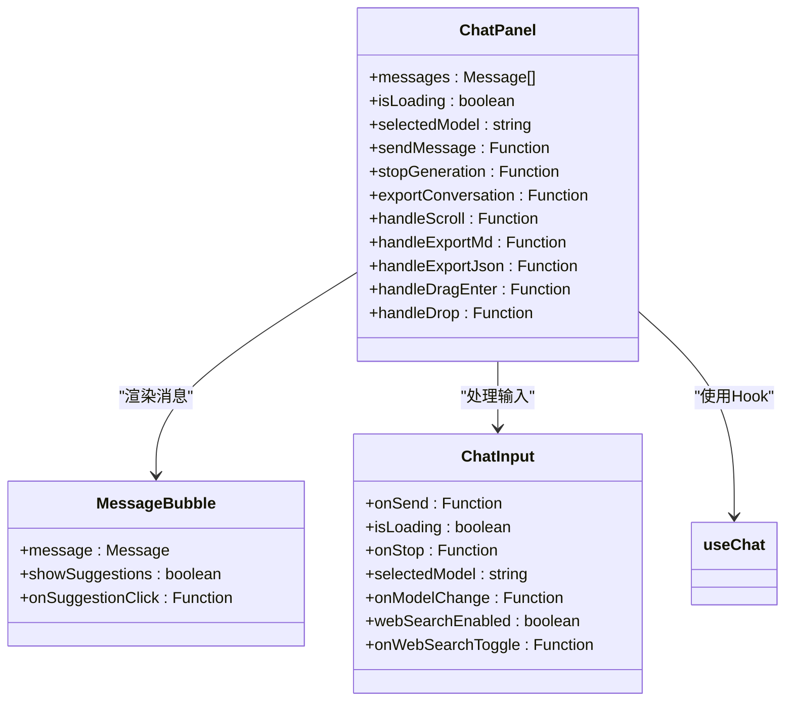

**图表来源**
- [src/components/chat/ChatPanel.tsx:34-368](file://src/components/chat/ChatPanel.tsx#L34-L368)

#### 消息流处理机制
聊天系统实现了高效的流式消息处理：

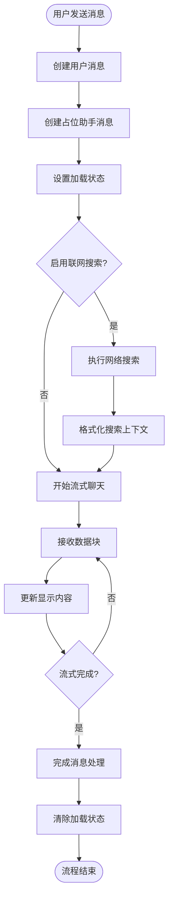

**图表来源**
- [src/hooks/useChat.ts:135-250](file://src/hooks/useChat.ts#L135-L250)

**章节来源**
- [src/components/chat/ChatPanel.tsx:1-369](file://src/components/chat/ChatPanel.tsx#L1-L369)
- [src/hooks/useChat.ts:1-370](file://src/hooks/useChat.ts#L1-L370)

### 图像生成组件

#### ImagePanel 组件设计
图像生成面板提供了完整的图像创作工作流：

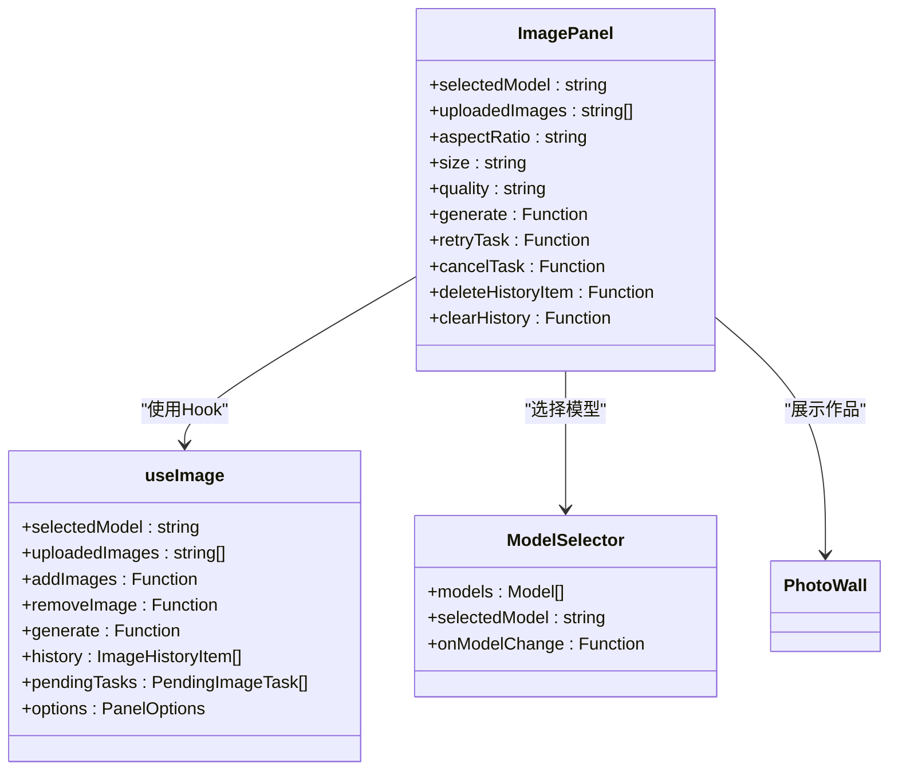

**图表来源**
- [src/components/image/ImagePanel.tsx:63-433](file://src/components/image/ImagePanel.tsx#L63-L433)

#### 图像处理工作流
图像生成系统支持多种处理模式：

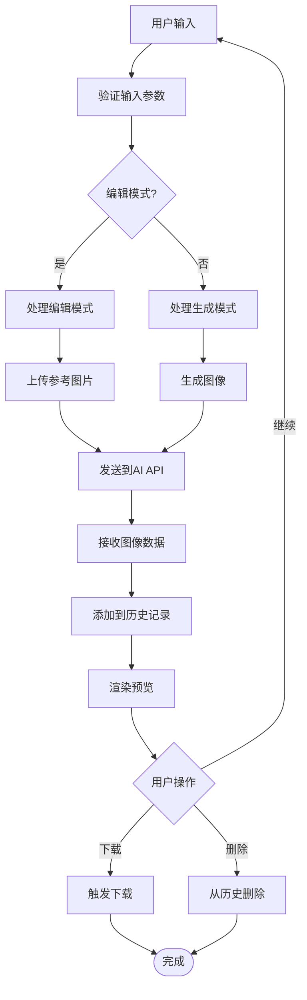

**图表来源**
- [src/components/image/ImagePanel.tsx:134-162](file://src/components/image/ImagePanel.tsx#L134-L162)

**章节来源**
- [src/components/image/ImagePanel.tsx:1-434](file://src/components/image/ImagePanel.tsx#L1-L434)

### 访问控制与安全

#### 访问码管理系统
应用实现了基于访问码的安全验证机制：

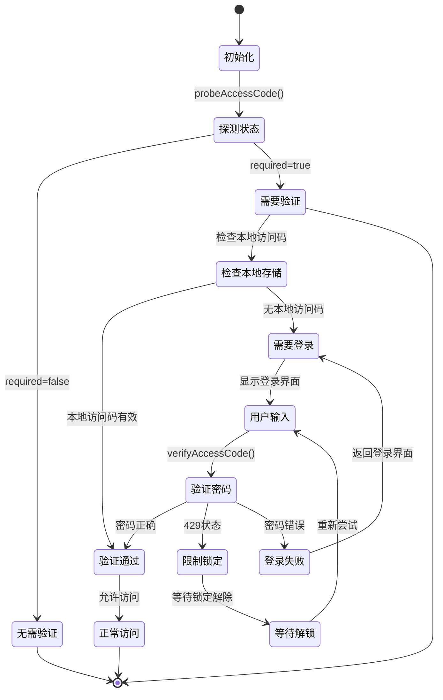

**图表来源**
- [src/services/accessCode.ts:66-110](file://src/services/accessCode.ts#L66-L110)

**章节来源**
- [src/services/accessCode.ts:1-113](file://src/services/accessCode.ts#L1-L113)

## 依赖关系分析

### 核心依赖关系
项目建立了清晰的依赖层次结构：

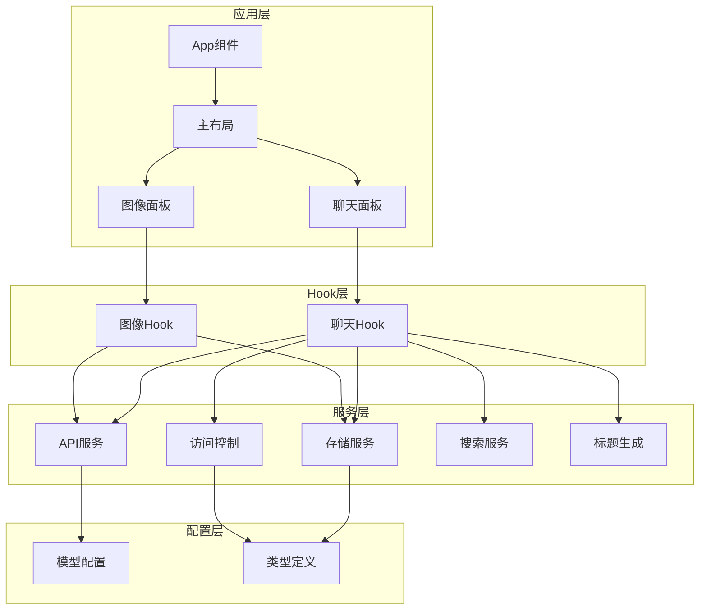

**图表来源**
- [src/App.tsx:1-74](file://src/App.tsx#L1-L74)
- [src/hooks/useChat.ts:1-16](file://src/hooks/useChat.ts#L1-L16)
- [src/hooks/useImage.ts:1-20](file://src/hooks/useImage.ts#L1-L20)

### 开发工具链
项目使用现代化的开发工具链：

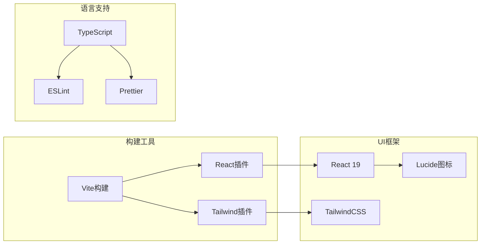

**图表来源**
- [vite.config.ts:1-11](file://vite.config.ts#L1-L11)
- [package.json:6-38](file://package.json#L6-L38)

**章节来源**
- [package.json:1-40](file://package.json#L1-L40)
- [vite.config.ts:1-11](file://vite.config.ts#L1-L11)

## 性能考虑

### 前端性能优化
项目采用了多项性能优化策略：

1. **懒加载与代码分割**
   - 使用 React.lazy 和 Suspense 实现组件懒加载
   - 按需加载非关键功能模块

2. **状态管理优化**
   - 使用 React.memo 优化组件重渲染
   - useCallback 和 useMemo 避免不必要的计算

3. **内存管理**
   - 及时清理事件监听器和定时器
   - 合理使用 useRef 避免状态更新

4. **网络请求优化**
   - AbortController 取消未完成的请求
   - 流式数据处理减少内存占用

### 构建性能优化
- **Vite 快速开发服务器**：提供毫秒级热更新
- **Tree Shaking**：自动移除未使用的代码
- **压缩优化**：生产环境自动压缩资源

## 故障排除指南

### 常见问题诊断

#### 访问码相关问题
1. **401 未授权错误**
   - 检查本地存储中的访问码
   - 验证服务端配置的 ACCESS_CODE
   - 确认网络连接正常

2. **访问码验证失败**
   - 检查密码是否正确
   - 注意可能的限速锁定
   - 查看服务端返回的错误信息

#### API 调用问题
1. **流式响应中断**
   - 检查网络连接稳定性
   - 确认 AI 服务端可用性
   - 验证模型配置正确性

2. **数据格式错误**
   - 检查消息格式是否符合要求
   - 验证多媒体内容编码
   - 确认请求参数完整性

#### 性能问题
1. **页面加载缓慢**
   - 检查网络带宽
   - 清理浏览器缓存
   - 减少同时进行的请求

2. **内存泄漏**
   - 检查事件监听器是否正确清理
   - 验证定时器是否及时清除
   - 确认组件卸载时的清理逻辑

**章节来源**
- [src/services/accessCode.ts:37-110](file://src/services/accessCode.ts#L37-L110)
- [src/services/api.ts:13-82](file://src/services/api.ts#L13-L82)

## 结论

AIShop AI 综合创作平台是一个设计精良、架构清晰的现代化 AI 创作工具。项目成功地将多种 AI 模型能力整合到一个统一的用户界面中，为用户提供了丰富而便捷的创作体验。

### 核心优势
- **技术先进性**：采用 React 19 + TypeScript + Vite 的最新技术栈
- **架构合理性**：模块化设计便于维护和扩展
- **用户体验**：响应式设计支持多设备使用
- **安全性**：完善的访问控制和数据保护机制

### 发展前景
项目为未来的功能扩展预留了充足的空间，可以轻松集成新的 AI 模型和功能模块。随着 AI 技术的不断发展，AIShop 将能够持续为用户提供更强大的创作工具。

## 附录

### 快速上手指南

#### 环境要求
- Node.js 16.x 或更高版本
- npm 8.x 或 yarn 1.x
- 稳定的网络连接

#### 安装步骤
1. 克隆项目仓库
2. 安装依赖：`npm install`
3. 启动开发服务器：`npm run dev`
4. 访问 `http://localhost:5173`

#### 基本使用方法
1. **聊天功能**：在输入框中输入消息，选择合适的 AI 模型
2. **图像生成**：输入提示词，选择图像模型，查看生成结果
3. **会话管理**：使用侧边栏管理多个对话历史
4. **访问控制**：在设置中配置访问码进行安全验证

#### 开发指南
1. **新增功能**：在相应目录下创建新组件和 Hook
2. **样式定制**：通过 TailwindCSS 类名进行样式调整
3. **API 集成**：在 services 目录下添加新的 API 服务
4. **类型定义**：在 types 目录下更新接口定义

**章节来源**
- [需求文档.md:1-55](file://需求文档.md#L1-L55)
- [README.md:1-74](file://README.md#L1-L74)